# Brain — Solution, Technical & Delivery Architecture

**Product:** Brain — the AI-native commerce operating system for DTC brands in India, UAE & GCC.
**Document type:** The complete production-grade architecture and phase-wise delivery plan — solution, technical, data, AI, security, multi-tenant, deployment, service, domain, integration, event-driven, identity-graph, and analytics architecture, plus the implementation roadmap.
**Status:** Final v1. **Date:** 2026-06-14.
**Derived from (source of truth — this document must not contradict them):**
- `01_Brain_Business_Requirements_Document.md` (BRD)
- `02_Brain_Product_Functional_Specification.md` (FS)
- `03_Brain_Technology_Stack_and_Technical_Decisions.md` (Tech Stack)

**How to read this document.** Section 1 documents the mandatory Architecture Review Board (ARB) challenge that preceded the design. Sections 2–17 are the architecture, detailed enough that engineering teams can begin implementation planning. Section 18 is the phase-wise delivery roadmap — **the most important section** — which deliberately does *not* force everything into Phase 1. The guiding rule throughout is the **anti-overengineering principle**: prefer the simpler solution that delivers 80–90% of the value and move advanced capability to a later phase. Brain is designed for **evolution, not maximum day-one complexity**, and for what a **startup team can realistically build and operate.**

---

## Table of Contents
1. Architecture Review Board — findings & resolutions
2. Executive architecture summary (Solution Architecture)
3. Architectural principles & the one boundary
4. Domain architecture (bounded contexts)
5. Service architecture (deployables, modules, APIs, events, ownership, scaling)
6. Event-driven architecture
7. Data architecture (medallion + grained tables)
8. Identity graph architecture
9. Attribution architecture
10. Analytics architecture
11. AI architecture
12. Security & multi-tenant architecture
13. Integration architecture
14. Infrastructure & deployment architecture
15. Observability architecture
16. CI/CD architecture
17. Local development architecture
18. Phase-wise delivery roadmap (Phase 1a/1b/1c → 2 → 3 → 4 → 5)
19. Evolution seams & technical-debt register
20. Anti-overengineering decision register

---

## 1. Architecture Review Board — findings & resolutions

Before any architecture was drawn, a four-cluster expert panel challenged the BRD, Functional Spec, and Tech Stack: **Product/Business + Competitive** (CPO, VP Product ex-Triple Whale, Founder/Operator, competitive experts on Triple Whale/Northbeam/Black Crow/Segment/RudderStack/PostHog); **Core Technical** (CTO, Principal Solution Architect, Principal Platform Engineer); **Data/Identity/Attribution** (Principal Data Architect); and **AI/Security** (Principal AI Architect + security architect). Multiple refinement passes were run until no *critical* architectural gap remained. The findings below are the consolidated, deduplicated result; every one is resolved in the architecture that follows.

### 1.1 The unanimous verdict
The frozen stack and invariants are sound and internally consistent. **The dominant risk is not the technology — it is scope and operational surface.** Three failure modes were flagged by every cluster:
1. **Over-splitting into ~8 microservices** on day one → 8 deploy pipelines, 8 on-call surfaces, distributed-transaction pain, multiplied isolation-test surface.
2. **Self-operating every heavyweight platform** (Redpanda, StarRocks, Authentik, LGTM) → a part-time SRE's full-time job before the first customer; contradicts the "bootstrapped-lean" principle.
3. **Treating "Phase 1" as one milestone** → a 12–18-month megaproject before a single brand pays.

The architecture's primary job is therefore **restraint with correct seams**: honor the full architectural boundary (it is cheap to respect and protects the future), but build behind it the smallest possible system, sequenced so a working billing loop ships before the heavy data-engine breadth.

### 1.2 Contradictions found & resolved
| # | Contradiction | Resolution (binding on this architecture) |
|---|---|---|
| C1 | "Bootstrapped-lean" (Tech §1) vs a Phase-1 that bundles the entire platform (BRD §22). | Phase 1 is split into **1a / 1b / 1c** vertical slices (§18); only 1a's boundaries are load-bearing, 1b/1c are additive modules behind the same Analytics API. |
| C2 | "Same number everywhere" (hard launch req) vs a hot pre-dedup serving copy that legitimately lags. | The guarantee is **"same *finalized* number everywhere."** Hot/provisional/un-deduped rows are **structurally barred** from billing/decision/attribution endpoints (§7.6, §10.4), not by convention. |
| C3 | "finalized" is stable (billing reads finalized only, closed periods immutable) vs late chargebacks landing against finalized orders. | The **dual-date rule**: every ledger row carries `economic_effective_at` (drives attribution/CM2 as-of math) and `billing_posted_period` (the open period an adjustment lands in). Both invariants hold (§7.4, §9.3). |
| C4 | Centralized identifier hashing "on mTLS" (Tech §11) implies a synchronous RPC on the 99.95% path — which accept-before-validate exists to avoid. | Hashing is a **shared library executed in-stream by the consumer**; the identity-graph write is an **async idempotent writer off Bronze**, never a synchronous edge gate (§8.4). |
| C5 | MCP "read-only deterministic tools" vs FS §8.11 listing LiteLLM as an MCP dependency. | **MCP tools never invoke a Brain-side model.** The brand's own LLM is the caller; Brain returns governed numbers. The LiteLLM dependency is removed from the MCP read path (§11.6). |

### 1.3 Top consolidated findings → architectural resolution
1. **Collapse to 3 deployables** (Collector, stream-worker, core modular monolith) + scheduled jobs — not 8 services. Bounded contexts are *enforced internal modules* with extraction seams. → §4, §5.
2. **Resolve the two open collector decisions toward lean-ops:** managed **Redpanda Cloud** + a **producer-independent durable spool** so the 99.95% accept+ack guarantee lives in the spool, not the Kafka client; producer swappable to librdkafka/Go later. → §6.2, §14.
3. **Buy managed for heavy-but-undifferentiated infra** (Redpanda Cloud, Grafana Cloud, a managed IdP at launch); **self-operate only the differentiated/isolation-critical** (the Iceberg lakehouse, StarRocks serving, the metric engine). Engineer-hours, not dollars, is the binding constraint. → §14.
4. **Dual-store containment as first-class components:** one **in-process metric-engine library** (never a service, never duplicated in SQL); the parity oracle split into a **CI golden-fixture test** + a **scheduled runtime convergence monitor**; hot-vs-finalized enforced **at the Analytics-API boundary in types/code**. → §10.
5. **Grain the ledgers now** (the single biggest data-correctness risk): the append-only **`realized_revenue_ledger`** (event grain) separate from the mutable **`order_state`** PK table; the append-only **`attribution_credit_ledger`** (order×touch×model_version×pass) that persists per-touch weights and mirrors reversals; the **dual-date rule** (C3). → §7, §9.
6. **One read path only:** the **Analytics API is the sole DB-touching component**; dashboards, NLQ, MCP, export, and the Morning Brief are all thin clients. This collapses the isolation-fuzz surface to one. → §5, §10, §12.
7. **Separate backfill and live ingestion lanes** (distinct topics + consumer groups, same processing code) so a backfill storm can never induce lag on the billable live path. → §6.4.
8. **Tenant context on the *seams*, not just the stores:** mandatory `brand_id` on every event header (asserted before processing), cache key, and span; a non-null tenant context asserted before any query. **Partition keys are brand-prefixed composites per ordering unit (§6.6) — isolation is the envelope + RLS + per-brand storage/KMS, never the partition key.** RLS/S3/KMS protect stores; the real isolation work is the stream/cache/gateway/identity seams. → §12.
9. **Security mechanisms named, not asserted:** a **hash-chained, WORM-anchored audit ledger**; a **revocation backbone** (short-lived tokens + denylist checked on every action) to make "immediate revocation" true against JWTs; the **identity service as a hardened, separately-audited trust zone**; **crypto-shredding** to reconcile DPDP/PDPL erasure with immutable Bronze. → §8, §12.
10. **AI safety as structure:** a single mandatory **untrusted-text envelope**; **eligibility/confidence/metric fields structurally unwritable by the model**; the **NLQ resolution eval gate** with *false-bind-rate → 0* as the headline metric; a **single outbound send/consent chokepoint** (incl. CAPI). → §11, §12.
11. **Time-to-value:** a **"Day-0 honest-but-immediate"** surface (placed revenue + blended MER on connect, clearly labeled) so Brain doesn't lose a trial to a faster, less-honest competitor while realized truth matures; and **strip the CM2 cap + Trusted-cost gate out of the path to invoice #1** (bill `max(tier%×realizedGMV, minFee)` in 1a, book the cap as a later true-up). → §9, §18.
12. **Cut Phase-1a deep connectors from 12–14 to 4** (Shopify, Meta, Google Ads, Razorpay-with-settlement — settlement is non-negotiable because there is no finalized realized revenue without it). The 100+ catalogue ships as pure marketing stubs. → §13, §18.
13. **Defer the human identity review-queue UI to 1b** (in 1a, conflicting pairs stay apart — the safe default); name a **target match rate** as an activation gate. → §8, §18.
14. **Close the two MMM-seam leaks now** so Phase 3 is a writer-swap with zero schema/prompt change: reserve **`Calibrated`** as a present-but-gated confidence enum value, and reserve nullable **`lift_range_low/high_minor` + `holdout_evidence_id`** columns on `channel_contribution`. → §7, §9.

### 1.4 What the ARB explicitly endorsed as already-correct (protect in build)
Realized-time two-pass attribution + proportional clawback; the append-only recognition-reversal ledger; the `brain_id_alias` read-time re-pointing + reversible unmerge; deterministic-narrate AI bound to `metric_id`; the single metric engine + parity oracle; per-brand-salt cross-brand isolation; cost-routing tiers; accept-before-validate collection. These are the moat — the build must not dilute them under deadline pressure.

---

## 2. Executive architecture summary (Solution Architecture)

### 2.1 What Brain is, architecturally
Brain is **four foundational platforms** delivered as one product, on one open data plane:
1. **First-Party Data Collection Platform** — a durable, consent-aware, server-augmented event-collection pipeline (the Collector + Brain Pixel) that accepts-before-validates and never loses a collected event.
2. **Customer Identity Platform** — a deterministic, reversible identity graph (Brain ID, brand-scoped, never global) that resolves scattered events into one customer.
3. **Measurement & Attribution Platform** — the lakehouse + metric engine that computes honest, realized-revenue truth (true CM2, position-based attribution, RTO clawback, channel contribution, confidence).
4. **AI Decision Intelligence Platform** — the LiteLLM gateway, NLQ, Morning Brief, recommendation engine, Decision Log, and read-only MCP, where **numbers are deterministic and the model only narrates**.

Dashboards, reports, attribution views, AI insights, and the Morning Brief are **outputs** of these platforms — rendered exclusively through the Analytics API.

### 2.2 The shape of the system
A small set of deployables on AWS ap-south-1 EKS, organized around one data flow:

```
Brain Pixel + connectors
        │
        ▼
 [COLLECTOR]  accept → durable spool → ack → produce
        │  (managed Redpanda; live & backfill lanes separate)
        ▼
 [STREAM-WORKER]  hot: validate · dedup(brand_id,event_id) · →Bronze   |   downstream(off Bronze): enrich · resolve identity (async) · sessionize · quality
        │                                   │
        ▼                                   ▼
 Bronze (Iceberg/S3, raw, 24-mo)      Identity graph (Postgres: brain_id_alias)
        │  (Redpanda → Iceberg topic-materialization)
        ▼
 dbt-on-StarRocks → Silver (PK canonical domains) → Gold (ledgers + marts)
        │
        ▼
 [CORE MONOLITH]  Analytics API (sole DB read path) + metric engine (lib) +
                  control-plane + billing + identity (module) + MCP + NLQ orchestrator
        │
        ▼
 Dashboards · Morning Brief · MCP · Exports   ── all via LiteLLM for model-touched paths
```

Beside this: **scheduled jobs** (Argo Workflows) run dbt builds, Bronze→StarRocks loads, the runtime parity-convergence monitor, connector backfill orchestration, and lakehouse maintenance.

### 2.3 How Brain differs from competitors (architecture that protects the wedge)
- **vs Triple Whale:** Brain credits **realized** revenue with **proportional clawback** (TW credits at conversion, no clawback) — enforced by the append-only `attribution_credit_ledger` + dual-date rule. CAPI passback is a named output-only feature, never an attribution input.
- **vs Northbeam:** Brain's **honest-when-degraded** confidence (the 70 line, `min(cost, attribution)`, the always-rendered unattributed bucket) is structural, and the **holdout/exposure evidence is captured from Phase 2** so the `Calibrated` band is meaningful from day one of Phase 3.
- **vs Segment/RudderStack:** Brain is **not a generic CDP** — no reverse-ETL to arbitrary destinations. It matches the CDP table-stakes it claims (durable collection, identity resolution, consent governance, a tracking-plan/event-governance surface) and substitutes **read-only MCP + full-brand export** for activation.
- **vs Black Crow:** predictions stay **internal to recommendations** in v1; the brand-owned lakehouse is the prediction substrate, not an audience product.
- **vs PostHog:** **no session replay** (consent-first conflict); autocapture is a Phase-2 install-hardening fallback.

### 2.4 The fundamental tradeoff this architecture makes
Honor the full boundary (`events → Iceberg → dbt → StarRocks → Analytics API → consumers`, with the identity graph beside it) from day one — it is correct and cheap to respect — but build the **smallest viable system behind it**, buy managed for the heavy-but-undifferentiated infra, and slice Phase 1 so a brand pays in months, not quarters. **The boundary protects the vision; the minimal build protects the runway.**

---

## 2.5 The Brand-Owned Data Foundation & Brain's value chain

Brain's primary asset is **not** dashboards, attribution views, or AI — it is the **Brand-Owned Data Foundation**: **first-party data collection (the Pixel) + third-party integrations (Connectors) + identity resolution + the lakehouse.** Everything else is built on top; these four are **foundational platforms, not features** (§2.1), and the build sequence (doc 05) treats them as the first and largest investment.

**The value chain — traceable end-to-end across docs 01–09:**
```
Pixel + Integrations + Identity  →  Lakehouse  →  Customer 360 · Journey · Attribution · Measurement  →  Decision Engine  →  Recommendations  →  Outcomes  →  Learning
```
- **Capture & integrate** (collector + connectors, doc 05 §3.3/§4) → **Bronze** (doc 08 §10).
- **Identity** resolves *who* (doc 08 §6); **Journey** reconstructs *how* — the ordered touchpoint timeline per Brain ID, a **first-class derived layer owned by the `attribution` module** (`silver.touchpoint`, doc 08 §35); **Attribution** explains *why* (the single credit ledger, doc 08 §7); **Measurement** quantifies (the one metric engine).
- **Decision Engine** (doc 09) is the **product output** — consuming attribution, journey-quality, coverage, confidence, customer, and financial (realized-CM2) signals → recommendations → outcomes (finalized ledger) → learning.

**Positioning guardrail (frozen):** attribution, journey, AI, and analytics are **enabling capabilities of the foundation, never the product.** Journey is a **derived** layer — **not** a service, deployable, or store (no SoR of its own; rebuilt from Bronze).

## 3. Architectural principles & the one boundary

1. **Bootstrapped-lean.** Managed/single-binary over fleets. Spend reliability effort only where the business needs it (the Collector, the dual-store, isolation).
2. **One language (TypeScript)** end to end, with two deliberate exceptions: the Collector hot-path producer may become librdkafka/Go (Phase 2 if load demands), and the Phase-3 ML service is Python.
3. **Open formats, no lock-in.** Iceberg-on-S3 is the brand-owned system of record.
4. **Honest-when-degraded & isolation-first.** Structural isolation at every layer; label/contain failure, never hide it.
5. **Cost-routing discipline.** Deterministic ≫ statistical ≫ small model ≫ frontier.
6. **Anti-overengineering.** Simpler-80% beats complex-future-proof; defer advanced capability; build seams for evolution.
7. **One read path.** The Analytics API is the only component that touches StarRocks/Iceberg.
8. **Finalized-only for money & decisions.** Hot/provisional reads never feed billing, attribution, or decisions — enforced in types, not convention.

**The one boundary that governs everything:**
`First-party + connected events → Iceberg (SoR) → dbt → StarRocks (serving) → Analytics API → Brain AI / Dashboards / Morning Brief / MCP`, with **Brain ID + the Identity Graph as a first-class platform service.** Keep this clean and the system supports the first few hundred brands without a redesign.

---

## 4. Domain architecture (bounded contexts)

Brain has **nine bounded contexts.** Each owns its data and its invariants; cross-context communication is by events (async) or the Analytics API (read). In Phase 1 most are *modules inside the core monolith* (DDD module per context, enforced by import-lint), with clean contracts so they can be extracted later without a rewrite.

| Bounded context | Owns | Key invariants | Phase-1 home |
|---|---|---|---|
| **Workspace & Access** | Organizations, brands, users, roles, permissions, sessions, invites, audit log | Exactly one Owner; absolute brand isolation; immediate revocation; append-only audit | Core monolith module |
| **Collection** | Pixel, Collector, raw event envelopes, consent-at-capture, sessionization, bot filtering, event-quality monitoring, CAPI passback | A collected event is never lost; accept-before-validate; consent rides the event | **Collector (separate)** + stream-worker |
| **Integration (Connectors)** | Connector lifecycle, OAuth/credentials, sync cursors, backfill, health states, freshness, settlement reconciliation, tracking-plan surface | Honest status; idempotent sync; same code path live & backfill; settlement before realization | Core module + stream-worker + jobs |
| **Identity** | Brain ID, `brain_id_alias`, merge/unmerge, phone guard, review queue, profile confidence, PII vault | Brand-scoped never global; false-merge-worse-than-missed; reversible; history never rewritten | Core module (extract Phase 2) + async writer |
| **Measurement (Metrics)** | The metric registry, the deterministic metric engine, the revenue ladder, CM waterfall, True CM2, FX, cost-confidence | One definition everywhere; all non-additive math in the engine; finalized-only for money | Core module (engine = in-process lib); **DQ grade + gating table are implemented as a separate `data-quality` module — §C M13** |
| **Attribution** | Journey attribution, the credit ledger, two-pass + clawback, confidence, channel contribution, unattributed bucket | Realized-only; clawback mirrors credit; closed-sum; never sum journey+contribution | Core module + jobs |
| **Analytics & Surfaces** | The Analytics API, dashboards, reporting rhythm, Decision Log, notifications, Brand Readiness, recommendation contract | Sole read path; same-finalized-number; recommendation eligibility deterministic | Core module |
| **AI** | LiteLLM gateway, NLQ orchestrator, prompt registry, eval/injection gates, MCP server, AI provenance | Numbers deterministic; model narrates only; untrusted-text delimited; eligibility unwritable | Core modules + LiteLLM (separate) |
| **Billing & Metering** | The realized-GMV meter, the CM2 cap, true-ups, the inspectable bill, invoicing, dunning, plan lifecycle, value proof | Billing reads finalized rows only; closed periods immutable; no per-seat | Core module |

**Ownership rule:** a context's tables are written only by that context. Cross-context reads go through the Analytics API or a published event — never a direct table read into another context's store.

---

## 5. Service architecture

### 5.1 Phase-1 deployables (3 + jobs — deliberately not 8)
| # | Deployable | Why separate | Responsibilities | Scaling |
|---|---|---|---|---|
| 1 | **Collector** (Fastify + durable spool → Redpanda) | Distinct 99.95% SLA; spiky sale-day load; producer is a swap candidate | Accept event → durable spool (disk WAL/embedded queue) → **ack** → produce to Redpanda (live or backfill lane). No validation at the edge. | HPA on req-rate behind CloudFront+WAF; stateless + local disk WAL; spool absorbs Redpanda degradation |
| 2 | **Stream-worker** (TS/KafkaJS consumers) | Long-running consumer lifecycle, different from request/response | Validate (Apicurio), dedup on `(brand_id, event_id)`, enrich, **async identity resolution**, sessionize, bot-filter, quality-score; write Silver; feed identity writer | Scale by partition count; **separate live vs backfill consumer groups** |
| 3 | **Core monolith** (Fastify, DDD modules) | One team, one language, one Postgres | Control-plane API + **Analytics API (sole DB read path)** + metric engine (in-process lib) + identity (module) + attribution (module) + billing (module) + MCP server (module) + NLQ orchestrator (module) | HPA on req-rate; read replicas for Postgres later |
| 4 | **Scheduled jobs** (Argo Workflows) | Batch/cron lifecycle, off-peak | dbt builds, Bronze→StarRocks loads, runtime parity-convergence monitor, backfill orchestration, lakehouse maintenance, retention/erasure jobs | Off-peak scheduling + StarRocks resource groups |

**Backing services (managed where possible):** Redpanda **Cloud**, RDS Postgres (Multi-AZ, PITR), ElastiCache Redis, S3+Iceberg+Glue, **StarRocks** (self-operated), Apicurio, IdP (managed at launch / Authentik later), **LiteLLM** (self-operated, stateless HA), Grafana **Cloud**.

### 5.2 Per-module contract (representative)
For each module: **Purpose · Responsibilities · APIs · Events produced · Events consumed · Data ownership · Scaling.**

**Collector (Collection context).**
- *Purpose:* never lose a collected first-party event.
- *Responsibilities:* accept, durably spool, ack, route to live/backfill lane, attach `brand_id` + consent snapshot to the envelope.
- *APIs:* `POST /collect` (pixel), `POST /webhook/{connector}` (order/settlement webhooks).
- *Events produced:* `raw.event.received` (to Redpanda).
- *Events consumed:* none.
- *Data ownership:* the durable spool only (transient).
- *Scaling:* horizontal, stateless + disk WAL; the durability guarantee is in the spool.

**Stream-worker (Collection + Identity).**
- *Purpose:* turn the durable-but-unvalidated raw stream into clean, resolved, sessionized data.
- *Responsibilities:* schema-validate (→ quarantine on fail), dedup on `(brand_id, event_id)`, enrich, call identity resolution (async), sessionize, bot-filter, quality-score.
- *APIs:* none (consumer).
- *Events produced:* `bronze.event.persisted`, `identity.resolution.requested`, `dq.signal.raised`.
- *Events consumed:* `raw.event.received`.
- *Data ownership:* writes Bronze (via materialization) + Silver canonical tables.
- *Scaling:* by partition; separate backfill consumer group with capped concurrency.

**Analytics API (Analytics context) — the keystone.**
- *Purpose:* the single component that reads StarRocks/Iceberg and computes numbers via the metric engine.
- *Responsibilities:* resolve a metric request → metric engine → StarRocks; enforce RLS/tenant context; enforce **finalized-only** on decision/billing/attribution endpoints; enforce **no hot/un-deduped rows** on those endpoints; serve dashboards, NLQ, MCP, export, brief identically.
- *APIs:* `GET /metric/{metric_id}`, `POST /query` (registry-bound), `GET /customer/{brain_id}` (PII-minimized), `GET /decision-log`, MCP tools.
- *Events produced:* `audit.query.logged`.
- *Events consumed:* none (read path).
- *Data ownership:* none (reads Gold/StarRocks; the metric engine library is the only place numbers are computed).
- *Scaling:* HPA; Redis cache (tenant-scoped keys) in front.

**Billing (Billing context).**
- *Purpose:* compute a fair, inspectable fee on finalized realized GMV.
- *Responsibilities:* meter realized GMV (finalized rows only), apply tier%/cap/min-fee, seal immutable period snapshots, generate the inspectable bill + region-compliant invoice, dunning → read-only degradation, true-ups post forward.
- *APIs:* `GET /billing/preview`, `GET /billing/invoice/{id}`.
- *Events produced:* `billing.period.sealed`, `billing.degraded.readonly`.
- *Events consumed:* `ledger.finalized` (to know what's billable).
- *Data ownership:* `gmv_meter_snapshot` (write-once), invoices, true-ups.
- *Scaling:* low volume; correctness over throughput.

(Identity, Attribution, Metrics modules are detailed in §8–§10.)

### 5.3 Phase-2/3 extraction plan
- **Phase 2:** extract **Identity** to its own gRPC service (behind the same contract, Redis alias cache) when resolution load or team size demands; extract **Billing** if compliance/scale demands.
- **Phase 3:** add the **Python ML service** (Feast/predictions/MMM); add **Flink** only if heavy stateful stream processing is genuinely needed.
- The monolith never becomes a distributed system by accident — extraction is a deliberate, triggered decision, and each module already has a clean contract.

---

## 6. Event-driven architecture

### 6.1 Event categories
| Category | Examples | Producer | Primary consumers |
|---|---|---|---|
| **Pixel/behavioral** | `page_view`, `add_to_cart`, `checkout`, `purchase`, `search`, `auth` | Collector | Stream-worker → Bronze/Silver, Identity, Attribution |
| **Connector** | `order.upserted`, `ad_spend.synced`, `settlement.received`, `shipment.updated` | Collector (webhooks) / jobs (polling) | Stream-worker, Measurement, Billing |
| **Identity** | `identity.resolution.requested`, `brain_id.minted`, `alias.repointed`, `merge.proposed`, `merge.committed`, `unmerge.committed` | Stream-worker / Identity | Identity graph, Attribution, Customer 360 |
| **Attribution** | `credit.provisional.assigned`, `credit.finalized`, `credit.clawed_back` | Attribution jobs | Gold ledger, Analytics |
| **AI** | `nlq.query.resolved`, `recommendation.generated`, `ai.provenance.recorded` | AI modules | Decision Log, audit |
| **Audit** | `audit.action.logged` (every sensitive action) | All | Hash-chained audit ledger |
| **Lifecycle (Phase 3+)** | `send.requested`, `send.delivered`, `consent.withdrawn` | Send/consent chokepoint | Lifecycle, consent suppression |

### 6.2 Topic strategy & the durable-spool decision
- **Backbone:** managed **Redpanda Cloud** in ap-south-1 (resolves the open self-host decision toward lean-ops — do not self-operate the strictest-SLA dependency).
- **The 99.95% guarantee lives in the Collector's durable spool, not the Kafka client.** Accept → spool (disk WAL) → **ack** → async produce. This decouples the durability contract from KafkaJS, so the producer can later swap to librdkafka/Go with zero contract change.
- **Topic naming:** `{env}.{domain}.{event}.v{n}` (e.g. `prod.collection.purchase.v2`). Avro on the wire.
- **Tenant context on the envelope (isolation ≠ partitioning).** `brand_id` is a first-class envelope header that **every consumer asserts before processing** — that is the isolation control (with RLS + per-brand Bronze prefix + per-brand KMS). **Partition keys are brand-prefixed composites per the topic's ordering unit (§6.6)**, never the isolation mechanism.

### 6.3 Event contracts & versioning
- **Universal envelope:** `event_id, brand_id (envelope tenant key — asserted by consumers, NOT the partition key), occurred_at, ingested_at, schema_name + version, schema_id, producer, source, partition_key, correlation_id, causation_id, payload`; `consent_flags` is an optional **customer-domain** extension and `click_ids` lives in the pixel payload (not the universal envelope). **No raw PII in any field — hashed identifiers + vault references only (§6.6).**
- **Schema registry:** Apicurio, **FULL_TRANSITIVE** compatibility for all Bronze-materialized streams (additive-optional changes only; a breaking change → a new `.v{n+1}`). Old events stay **replayable** forever — the replay/backfill guarantee depends on it (§6.6 H2).
- **Governance:** the customer-facing **tracking-plan surface** (FS §3.8) sits on top of Apicurio — brands define expected events and see violations; the schema registry is the enforcement substrate.
- **Idempotency:** dedup on **`(brand_id, event_id)`** in the stream-worker *before* Bronze materialization (client+server purchase collapse to one — never double-counted); at-least-once delivery + idempotent processing = effectively-once (§6.6 M2).

### 6.4 Event flows (the two lanes)
- **Live lane:** Collector → `prod.collection.*` topics → live consumer group → Silver in near-real-time → StarRocks routine-load (<5s hot, labeled).
- **Backfill lane:** connector jobs → **separate** `prod.backfill.*` topics → **separate** consumer group with capped concurrency + provider-rate-limit-aware scheduling. **Same processing code, different lane** — so a 24-month backfill storm across 5 onboarding brands can be throttled/paused without ever inducing lag on the billable live path. This preserves the "same code path → parity" guarantee while isolating load.

### 6.5 The Bronze writer (spike-gated)
Bronze is written by **Redpanda → Iceberg topic-materialization** (no hand-rolled TS Iceberg writers). **Phase-1a spike (must pass before commit):** prove topic-materialization can write **per-brand S3 prefixes + per-brand KMS** with schema-registry-driven evolution and the idempotency the "never double-counted" rule needs. **Contingency** (if it can't): a single-purpose TS consumer that writes per-brand-partitioned Iceberg — accept the narrow tooling risk rather than pulling Spark forward from Phase 3.

### 6.6 Event governance — partition, ordering, idempotency, PII & ownership (ARB corrections, 2026-06-14)
Authoritative for the event layer (anchors `07_Brain_Event_Contracts.md`); **supersedes any earlier "partition key = tenant key" wording.** No deployment, module-boundary, or repo change.

**C1 — Partition keys are decoupled from tenant isolation.** Isolation is enforced by the `brand_id` on the event envelope (asserted by every consumer before processing) + Postgres RLS + per-brand Bronze S3 prefixes + per-brand KMS — **never by the partition key.** Partition keys are **brand-prefixed composites chosen per the topic's ordering unit**:

| Event class | Partition key |
|---|---|
| order / ledger events | `hash(brand_id, order_id)` |
| customer / identity events | `hash(brand_id, brain_id)` |
| pixel / behavioral events | `hash(brand_id, visitor_id)` (or `session_id`) |
| control / audit / low-volume | `brand_id` |

*Rationale/benefit:* removes the single-partition hot-spot on a whale brand or a Diwali/BFCM spike (the 99.95% ingest path), gives per-entity ordering, and keeps `brand_id` as the key *prefix* for cheap per-brand consumption + co-location. *Trade-off:* no total per-brand order (only per-entity) — fine, because correctness is event-time + idempotency (H1), not partition order. *Scaling:* size partitions per-topic by volume; a whale brand parallelizes across its own entities instead of one hot partition.

**H1 — Event-time is the source of correctness, not broker ordering.** Brain does **not** rely on Redpanda/partition ordering for correctness (the live/backfill two-lane split means one entity's events can span topics with no cross-topic order). Correctness = `occurred_at` (event-time) + a per-source monotonic `sequence` + **idempotent last-writer-wins** on state tables (`silver.order`, …) + the **append-only ledger's as-of math** (order-tolerant by construction). Partition ordering is only an optimization. Applies to ingestion, replay, attribution credit/clawback, and the ledger.

**C2 — No raw PII in events (P0 platform invariant).** **No raw PII may exist in any event payload, Redpanda topic, Bronze table, log stream, or replay source.** Events carry **hashed identifiers, vault references, and internal IDs only** — never email, phone, address, customer name, or other raw personal identifiers. Raw PII flows only to the per-brand-KMS vault via the send service. *Enforcement:* (1) a CI schema-lint rejects PII-typed fields in any event schema; (2) the Collector edge scans/redacts before spool; (3) no-PII-in-logs extends to payloads. *Why load-bearing:* Bronze is immutable for 24 months and erasure is satisfied by **crypto-shredding** (destroying per-brand keys) — which only works if the sole re-identification path is the vault/keys; one raw-PII leak into Bronze would be un-erasable. This is what makes the DPDP/PDPL/GDPR erasure story sound.

**H4 — Single-producer ownership.** Every event type has **exactly one authoritative producer**; none may be emitted by two components. `order.upserted` → **connector** (post-normalization); `ledger.finalized` → the **realized-revenue-ledger writer** (measurement/attribution job); `dq.signal.raised` → **stream-worker / data-quality**; `merge.committed`/`unmerge.committed` → **identity**. Consumers are many; producers are one (each event names its producer in the doc-07 registry).

**M1 — Facts vs commands.** **Facts** = immutable past-tense events (`order.upserted`, `ledger.finalized`, `merge.committed`) — the bus default. **Commands** (intent — `backfill.requested`, `send.requested`) are internal/REST calls where possible (the job-orchestration trigger already is); a bus command, if unavoidable, is namespaced `cmd.*`. Fact topics never carry commands.

**M2 — Idempotency key = `(brand_id, event_id)`** at every layer (Bronze, Silver, consumers). Client-set `event_id` is untrusted for *global* uniqueness, so dedup is always brand-scoped; derived events use deterministic IDs (`ledger_event_id`, `credit_id`). At-least-once delivery + idempotent processing = **effectively-once** (no Kafka EOS transactions).

**M4 — Key consumer relationships (named).** `merge.committed`/`unmerge.committed` → **attribution** (merge-reactive re-credit, §9/§14.5) + **Customer-360 re-projection**; `consent.withdrawn` → **send/consent chokepoint** (suppression) + **CAPI-deletion** producer (<15-min propagation); `erasure.requested` → **identity crypto-shred job** + **mart re-projection** + **CAPI-deletion**.

**M5 — DLQ & quarantine.** Per-domain DLQ topics (`{env}.dlq.{domain}.v1`); schema-invalid → `bronze_quarantine` (sibling); a **materialization-failure** path for Redpanda→Iceberg; a `tools/`-based reprocess/replay runbook. The edge never drops (accept-before-validate) — failures are quarantined, never lost.

**M6 — Audit ownership.** The **hash-chained, WORM-anchored Postgres audit ledger is the system of record** (§F.1.2). The `audit.action.logged` *event* is fan-out/observability only — never the integrity source.

**M7 — Event observability.** Alerts on: consumer lag per group (live lane hardest), **DLQ depth**, **quarantine rate**, **materialization lag** (`occurred_at → queryable`), **schema-rejection rate**, per-event-type **volume anomaly / tracking-dark**. OTel spans carry `brand_id` + `correlation_id`.

**M8 — Iceberg compaction.** Redpanda→Iceberg materialization batches writes; a scheduled **Argo compaction + snapshot-expiry job** runs from Phase 1 to mitigate small-file write-amplification (also the erasure-aware-compaction hook). 24-mo Bronze TTL via partition expiry.

**H3 — Hot path vs downstream.** Ingestion guarantees (99.95%) apply to the **hot path only — accept → validate → dedup `(brand_id,event_id)` → Bronze materialization.** Identity resolution, enrichment, sessionization, attribution inputs, data-quality, and recommendations run as **downstream consumers off Bronze** (their own consumer groups) so a slow stage never blocks ingestion. This is a clarification of the existing model — **no new deployable, no service split.**

**Replay source of truth.** **Bronze (24-mo, immutable) is the replay SoR**; Redpanda retention (7 d + tiered storage) serves live consumption + short rewinds only.

---

## 7. Data architecture (medallion + grained tables)

### 7.1 The medallion layers
| Layer | Store | Contents | Engine note |
|---|---|---|---|
| **Bronze** | Iceberg on S3 + Glue | Raw envelopes exactly as received (incl. quarantine), 24-mo retention | **Append-only, no MERGE** (raw truth); partitioned `(brand_id, event_date)`; per-brand prefix + per-brand data key |
| **Silver** | StarRocks-native **PK tables** (dbt-on-StarRocks over Bronze-Iceberg) | Normalized canonical domains | PK upsert handles the mutable lifecycle; dedup on `(brand_id, event_id)`, server-wins precedence |
| **Gold** | StarRocks marts (+ append-only ledgers) | Metric-ready marts + the ledgers | Ledgers are append-only event tables; marts are derived |

**Bronze partitioning:** `(brand_id, event_date)` — brand-first for isolation + per-brand retention/erasure expiry; date for replay windows + 24-mo TTL. **Quarantine** is a sibling table `bronze_quarantine(raw_envelope, brand_id, received_at, failure_reason, schema_version)` with its own dead-letter replay path. All dedup/normalization is Silver-ward.

### 7.2 Silver canonical domains (PK tables)
`customer`, `identity` (graph projection), `behavior_event` (deduped on `(brand_id, event_id)`), **`order_state`** (mutable lifecycle: placed→paid→shipped→delivered), `product`, `payment`, `marketing_spend`, `shipment`, `inventory`, `support`. Normalization is non-destructive (raw retained; unmapped fields flagged, never dropped).

### 7.3 Gold tables (named + grained — the data-correctness core)
| Table | Grain | Key columns | Why |
|---|---|---|---|
| **`realized_revenue_ledger`** (append-only) | one recognition/reversal **event** | `ledger_event_id (PK), brand_id, order_id, event_type {provisional_recognition\|finalization\|rto_reversal\|refund\|chargeback\|fee_adjustment\|marketplace_adjustment\|payment_adjustment}, amount_minor, currency_code, fx_rate_id, economic_effective_at, billing_posted_period, recognition_label {provisional\|settling\|finalized}, supersedes_event_id` | The spine of billing AND attribution; the sale row is never mutated; the **dual-date rule** (C3) lives here |
| **`attribution_credit_ledger`** (append-only) | one row per **(order_id, touch_id, channel, model_version, credit_pass)** | `credit_id (PK), brand_id, order_id, brain_id_at_credit_time, touch_id, channel, campaign_id, model_version, identity_snapshot_id, window_policy_id, weight_fraction, credited_revenue_minor, credit_pass {provisional\|finalized}, economic_effective_at, reversed_of_credit_id, fx_rate_id` | Persists per-touch weights so **clawback mirrors credit exactly**; pinned to an identity snapshot so a merge doesn't silently re-weight history |
| **`order_margin_fact`** | order (current) | revenue net per-SKU tax − COGS − variable = CM1; − marketing = CM2; − fixed = CM3; True CM2 (incremental-RTO penalty); `cost_confidence`; money in minor units + `currency_code` | The CM waterfall; True CM2 never double-counts RTO |
| **`channel_contribution`** | **(brand_id, channel, period, currency_code)** | `contribution_minor, method {rule_based\|direct\|mmm\|holdout\|hybrid}, confidence, spend_minor`, **reserved-nullable** `lift_range_low_minor, lift_range_high_minor, holdout_evidence_id` | The closed-sum strategic view; the **MMM-seam columns are reserved now** (C-finding 14) so Phase 3 is a writer swap |
| **`attribution_confidence_mart`** | (brand_id, channel, period) | `effective_confidence = min(cost, attribution)`, band enum **including reserved-inactive `Calibrated`**, the 9 signals | Confidence rendering + gating |
| **`gmv_meter_snapshot`** (write-once) | (brand_id, billing_period) | sealed GMV + FX + **pinned DQ grade + cost-confidence** + metric_version | Billing dispute resolves against this immutable snapshot |

### 7.4 The dual-date rule (resolves C3)
Every ledger row carries **`economic_effective_at`** (when the economic event truly happened — drives attribution as-of math, the CM2 curve, and clawback) and **`billing_posted_period`** (the *open* period a late adjustment lands in). Billing's "finalized rows only" reads by `billing_posted_period`; attribution's as-of curve reads by `economic_effective_at`. A chargeback in month N against an order finalized in month N−2 thus restates the campaign's true CM2 (economic) while posting as a forward adjustment in N's bill (closed periods immutable). **This is a frozen invariant.**

### 7.5 The as-of rule (uniform across the data plane)
- Realized revenue on date D = Σ `realized_revenue_ledger` rows with `economic_effective_at ≤ D`.
- Attribution credit on D = Σ `attribution_credit_ledger` rows with `economic_effective_at ≤ D`.
- New-customer cohort "acquired in P, as-of D" = first-finalized-realized-order cohort against the ledger + identity snapshot at D. **CAC/cohorts are restating facts and must carry the as-of date on every surface** (so a correct restatement doesn't read as a parity bug).

### 7.6 Parity, late data & restatement
- **Parity oracle (3 layers):** (1) **CI golden-fixture test** — the TS metric engine vs an independent reference on frozen fixtures, blocking on drift; (2) **runtime convergence monitor** — an Argo job reconciling StarRocks serving vs the Iceberg/Bronze recompute per brand (hourly in Phase 1, not continuous — continuous is premature <100 brands); (3) **decision-path purity** — asserts no `dedup_state=hot` / `recognition_label≠finalized` row ever reached a billing/decision/attribution endpoint.
- **Closed-sum assertions** (grain = brand×period×currency, exact to the minor unit): `Σ channel_contribution + unattributed_residual = Σ finalized realized revenue`; `Σ marketing_spend = cm2_attributed_spend + cm2_unattributed_spend`. **The residual is a computed balancing plug, never an input** — so the closed sum holds by construction even with Phase-1 hand-built rules.
- **Bounded restatement window** (resolves the open clawback-age decision as data architecture): each fact class has a `restatement_window` (attribution credit restates for clawback up to the realization horizon + grace; older reversals route to the unattributed bucket; billing periods immutable). This makes the oracle *terminate* and "backfill equals live" replay only the still-open windows.

### 7.7 Governance, retention & isolation
- **Retention:** Bronze 24 months; Silver/Gold + audit + Decision Log for workspace life; consent/erasure records as law requires.
- **Erasure (DPDP/PDPL) via crypto-shredding** (reconciles immutable Bronze with the right to be forgotten): (1) hard-delete/crypto-shred the PII-vault entry; (2) tombstone the identity-graph node to an opaque, non-reversible surrogate Brain ID (all identifier hashes removed, `erased_at` set); (3) leave ledger/Decision-Log rows intact on the now-pure-surrogate Brain ID. Bronze stays immutable but becomes non-identifying because the keys to re-identify are destroyed. *(Resolves BRD §23.3 open item — aggregate reproducibility suffices; individual-PII recompute is intentionally not bit-reproducible.)*
- **Isolation at the data layer:** per-brand S3 prefix + per-brand data key (envelope encryption under a smaller set of KMS CMKs for scale) + StarRocks row policies + Bronze partitioned brand-first.

---

## 8. Identity graph architecture

### 8.1 The model
A dedicated **Identity** context over Postgres (a module in Phase 1, extractable to a gRPC service in Phase 2). Brain ID is **brand-scoped, never global** (per-brand salt → cross-brand hashes are uncorrelatable).

### 8.2 The alias table (grained)
**`brain_id_alias(observed_id, canonical_brain_id, valid_from, valid_to, merge_rule_version, confidence, merge_event_id, superseded_by)`** — bitemporal (system-time + logical merge-version), union-find with a cycle guard. **Read-time re-pointing:** a merged profile's events resolve to the canonical Brain ID at query time via the alias — **history is never rewritten.** A historical number pins the alias state via `identity_snapshot_id`, so it remains reproducible.

### 8.3 Resolution flow (async off Bronze — resolves C4)
1. Stream-worker normalizes + hashes identifiers via a **shared library** (CI conformance vectors guarantee "the same email is the same email"); per-brand salt applied.
2. The worker writes the event to Silver with a provisional identity and emits `identity.resolution.requested`.
3. An **async idempotent identity writer** resolves against the graph and updates the alias — **never a synchronous RPC on the 99.95% path.** Identity is eventually-consistent against accept-before-validate.

### 8.4 Deterministic matching, the phone guard & the review queue
- **Deterministic only (Phase 1):** hashed email, storefront customer ID, auth user ID, phone, first-party cookie once linked. Device/behavioral = Phase 2, never alone; IP/UA/name/pincode = weak, never auto-merge.
- **Cart-attribute stitch (the attribution spec's #1 durability mechanism):** the client pixel writes `brain_anon_id` + first-touch click IDs + UTMs into `cart.attributes` (Shopify) / checkout-meta (Woo); the **order webhook recovers them server-side**, tying the anonymous journey to the order **even before identification**. Parsed by the connector → identity resolution (doc 08 §35). Complements identifier-based backward merge; together they close the anon→known→order loop.
- **India phone guard:** auto-merge only with no conflicting strong evidence; conflicts → review.
- **Review-queue candidate generation (grained):** grain = `(brand_id, conflicting_identifier_hash, profile_pair)` with a **dedup key** (a pair is never enqueued twice) and a **shared-utility-identifier suppression list** (a phone on >N profiles — a courier/kiosk number — is structurally flagged "shared-utility," never a candidate, auto-keep-apart). **Phase-1a: no human queue UI** — conflicts simply stay apart (the safe default); the worked queue + SLA + volume alarm arrive in **1b**.

### 8.5 Merge / unmerge / split
- **Merge** = alias write + re-resolution event under a versioned rule (records rule, identifiers, confidence). **Unmerge/split** = set `valid_to` + append a reversal event; constituent identities restored with full histories; the alias is **closed, not deleted.** A cycle-creating merge is aborted to review. Every merge/unmerge writes audit + Decision Log.

### 8.6 PII vault & confidence
- The graph holds **hashed identifiers only**; plaintext email/phone live in a **per-brand-KMS-encrypted vault readable only by the send service.**
- **Profile identity-confidence + completeness** (from link tier/count/recency) is exposed on Customer 360 and consumed by attribution and the AI.

### 8.7 The hardened trust zone (security)
The identity service sees transient cross-brand plaintext (for hashing) + holds per-brand salts — the highest-value internal target. It is a **minimized, separately-audited trust zone**: plaintext exists only in memory for the hash op (never logged/persisted — enforced by a no-PII-in-logs test on this service); per-brand salts are encrypted under **per-brand KMS** (the service cannot decrypt Brand B's salt without Brand B's key context); cross-brand identifier comparison is structurally refused (a negative test feeds the same email under two brand contexts and asserts uncorrelatable hashes).

### 8.8 Customer 360
A derived read model (lakehouse + graph remain authoritative; rebuildable from source), served via the Analytics API, PII-minimized for view-only roles.

---

## 9. Attribution architecture

### 9.1 Journey attribution
Position-based (default; first/last weighted, middle spread), with first/last/linear selectable (model-switch UI is **Phase 2**). Touch-eligibility windows are per-channel configurable, **frozen at conversion per order** (a single default window in 1a; configuration in Phase 2). Attributed numbers are always in **CM2, not ROAS**; platform claims are display-only.

### 9.2 The two-pass + clawback flow
1. **Provisional (at placement):** an expected-realized estimate discounted by RTO likelihood (a category-benchmark P80 default in 1a; Fingerprint-derived later). Credit rows written to `attribution_credit_ledger` with `credit_pass=provisional`, pinned to `identity_snapshot_id` and `window_policy_id`. **Never feeds billing or high-stakes recommendations.**
2. **Finalized (at the realization horizon):** credit restated to net realized; `credit_pass=finalized`.
3. **Clawback (on RTO/refund/chargeback):** an **append-only reversal row** mirrors the original split exactly (negative `credited_revenue_minor`, same `weight_fraction`, `reversed_of_credit_id` → original). A full RTO drives attributed CM2 to zero weeks later — the intended, differentiated behavior.

**Merge-between-passes correctness:** the touch set + weights are frozen at provisional time against the pinned identity snapshot; a later merge appends a *re-credit* event referencing the new snapshot — it never silently re-weights old rows.

### 9.3 Confidence, baseline & view-through
- **Confidence:** Low/Medium/High (Phase 1); **`Calibrated` reserved as a present-but-gated enum value** (Phase 3 unlock). 9 deterministic signals; **trust line at 70**; **`effective_confidence = min(cost, attribution)`** naming the weaker leg.
- **Baseline:** branded-search/direct/organic flagged `harvested_demand` with a configurable haircut + confidence penalty (Phase 2 refinement; a simple flag in 1c); an `organic_baseline` contribution row.
- **View-through: credited none in Phase 1** (frozen) — lives in the unattributed bucket with a "view-through blind spot" disclosure on paid-social cards.
- **Cross-device:** a `cross_device_unlinked_rate` signal lowers journey confidence where loss is high (Phase 2).

### 9.4 Channel contribution & the closed sum
The single methodology-agnostic strategic view (range + method + confidence). Phase 1 fills `method=rule_based|direct` (capped at High); **Phase 3 swaps in MMM/holdout with zero schema/API/dashboard/prompt change** (the reserved columns make this real). **Never sum journey credit + channel contribution.** The closed-sum parity assertion (§7.6) holds it together with the residual as a computed plug.

### 9.5 MMM & incrementality readiness
- **Phase 1:** reserve the contract (the `channel_contribution` columns + the `Calibrated` enum).
- **Phase 2:** **capture evidence** — `holdout_assignment` + `exposure_log` (deterministic geo/pincode-level), experiment + test metadata. Capture only, **no engine.**
- **Phase 3:** the MMM/incrementality/calibration engines (Python ML service) analyze the Phase-2 evidence → unlock `Calibrated` and lift-based contribution.

### 9.6 Marketplace attribution
No journey (no pixel). Settlement-report-driven, **realized-only, net of fees captured before realization**; recorded as **channel contribution, never journey credit**; a refund posts a ledger reversal, never a per-touch clawback. Prepaid-gateway settlement reconciles the same way.

### 9.7 Spend homing
Journey-bearing spend → `cm2_attributed` (residual to `cm2_unattributed`); **non-journey spend → `cm2_unattributed` (journey side) AND `spend_minor` on the contribution row (strategic side), never forced onto a touch**; message cost split utility (CM1) vs marketing (CM2).

---

## 10. Analytics architecture

### 10.1 The single read path
The **Analytics API is the only component that touches StarRocks/Iceberg.** Dashboards, NLQ, MCP, exports, and the Morning Brief are thin clients of it. This is the structural basis for both "same finalized number everywhere" and "one isolation surface to fuzz."

### 10.2 The metric engine (in-process library, never a service)
One **TypeScript deterministic metric engine** owns all non-additive math (per-SKU tax, realization-date FX, banker's rounding, largest-remainder allocation, all ratios). dbt/SQL does **additive input marts only** — enforced by a CI check that flags non-additive functions in dbt models. The engine binds to the **metric registry** (versioned definitions in Postgres). This is what makes dual-store parity hold: SQL dialects can't disagree on math they never do.

### 10.3 Serving & caching
StarRocks serves sub-second reads; Redis (tenant-scoped keys) caches hot metrics. **dbt builds run scheduled off-peak** (Argo) with StarRocks resource groups isolating transform from interactive serving (the most likely "StarRocks load" failure mode). No Spark/Athena in Phase 1 — the relief valve is scheduling + resource groups; the Phase-3 Iceberg-SoR migration is the structural fix.

### 10.4 The hot-vs-finalized boundary (structural, resolves C2)
Every served row is tagged `recognition_label`, `dedup_state {hot|deduped}`, `identity_state {anonymous|resolved}`. The Analytics API **refuses** to serve hot/un-deduped/non-finalized rows on any endpoint flagged decision/billing/attribution-bearing — a typed, column-level policy, not a query convention. The parity oracle's third layer asserts this never leaked.

### 10.5 Surfaces (outputs)
Home/Command Center (the Top-3 actions render the **recommendation contract**, fed by **deterministic threshold detectors** over registry metrics — *not* ML in Phase 1: CM2 falling, RTO spike, tracking-dark, connector failing); per-category drill-to-source; the reporting rhythm; the Decision Log; notifications; the Brand Readiness Score; self-serve/DSAR export. The **Day-0 honest-but-immediate** surface shows placed revenue + blended MER on connect (labeled) so value is felt before realized truth matures.

---

## 11. AI architecture

### 11.1 The gateway (LiteLLM)
Stateless, **≥2 replicas, HA.** All state externalized: per-brand budgets + rate-limits in **tenant-scoped Redis**; prompt templates versioned by **content hash** (git/Postgres, promoted only through CI gates); provider keys in Secrets Manager. Every request carries an authenticated **`brand_id` on every span** (never inferred from the prompt). **No service calls a model directly.** Gateway-down fallback: AI surfaces return the **deterministic number with "narration unavailable"** — the number never blocks on the narrator.

### 11.2 Model routing & cost tiers
**Effort-tier is an explicit declared attribute on every model-calling path** (not inferred): deterministic ≫ statistical ≫ small model ≫ frontier. Each tier binds to its own eval gate; the router selects only from the pool that has passed *that task's* eval. A failover model serves only after passing the resolution + narration evals for its tier.

### 11.3 NLQ — question → metric_id (never text-to-SQL)
The NLQ orchestrator resolves a plain-language question to a registered **`metric_id` + filters + grain + time-range**, the metric engine computes the number, and the model **narrates** it. The model never writes a query or does arithmetic.

### 11.4 Evaluation & safety (CI ship gates)
1. **NLQ resolution golden-set:** correct-binding accuracy + **false-bind rate → 0 (the headline safety metric)** + correct-decline/clarify rate + a confidence floor (below it → clarify, never answer) + adversarial near-miss pairs ("placed" vs "realized", "delivered" vs "settled").
2. **Injection golden-set:** payloads embedded in campaign-name/UTM/ticket-body fields, asserting numbers + eligibility unchanged and no attacker-directed output.
3. **Narration-faithfulness eval:** every number in the narration traces to a value in the structured input, zero numeric drift.
4. **Eligibility-unwritable contract test:** the model's output schema is **disjoint** from the eligibility/confidence/metric schema (the model receives them as read-only input).

### 11.5 The untrusted-text envelope
A single mandatory function at the gateway/serving boundary wraps **all** lakehouse-derived free text (campaign names, UTM fields, ticket bodies, custom-event fields) into a fenced data block, neutralizes delimiter-collision payloads, and instructs the model to treat it as data only. It is the **only** path untrusted text reaches a model (enforced by lint + contract test). This is the primary non-architectural injection defense (the architectural one is deterministic numbers).

### 11.6 MCP architecture
Read-only, **deterministic governed tools that do not invoke a Brain-side model** (resolves C5 — the brand's own LLM is the caller). Path: `MCP → Analytics API → semantic layer → lakehouse` (never physical tables). A key is scoped to **`brand_id` × intersection(issuer authority, requested scopes)** — never broader than the issuer, never PII beyond the issuer's role minimization; it is a **first-class revocable principal** (immediate revocation via the §12 backbone). Limit hits → typed machine-readable errors. MCP is in the CI isolation negative-test suite.

### 11.7 AI provenance & explainability
Each AI response records model id+version, prompt-template hash, the resolved metric-binding, data snapshot/version pins, confidence inputs, cost/latency — **PII-redacted/pseudonymized** (no raw PII-bearing prompt text stored). Written to the Decision Log under the same immutability. Makes "why did Brain recommend this?" reproducible months later.

### 11.8 Recommendation engine (Phase 1 = deterministic)
Phase-1 recommendations come from **deterministic threshold detectors** over registry metrics (not ML), rendered through the recommendation contract. Eligibility (grade/confidence/reversibility) is computed deterministically; the model only explains. Predictions (Phase 3) and autonomy (Phase 4) layer on later.

### 11.9 Sub-processor governance
Each model provider is a declared sub-processor with a pinned region; PII-bearing prompts never cross a border the brand's DPA forbids (the untrusted-text envelope is also the redaction point). Residency is a RegionAdapter property of the gateway.

---

## 12. Security & multi-tenant architecture

### 12.1 The four isolation layers + the seams
**Stores:** Postgres RLS (+ per-request tenant context + a non-owner DB role) · per-brand S3 prefix · per-brand KMS (data keys; also for connector tokens + the PII vault) · StarRocks row policies. **The hard part is the seams**, where real leaks happen:
- **Streaming:** `brand_id` is a first-class envelope header **the consumer asserts before processing** (the isolation control). **Partition keys are brand-prefixed composites per ordering unit (§6.6) — isolation does not depend on the partition key.**
- **Cache:** every Redis key is built via a single helper that prefixes `brand_id`; raw key construction is **lint-banned**; cross-brand prompt-cache hits are forbidden (prompt-cache keys include `brand_id`).
- **Postgres:** the session tenant context is set by middleware and **asserted non-null before any query** (missing context = hard error, never default-to-all).
- **Logs/traces:** every span and log line carries `brand_id`, PII-redacted.
- **Owner rollup:** the one legitimate cross-brand reader = **N isolated reads stitched at the presentation layer**, never a cross-brand query.
- The **CI isolation fuzzer exercises the seams**, not just the stores (inject a wrong-tenant-key consumer → assert fail-closed).

### 12.2 RBAC & authentication
Four roles (Owner/Brand Admin/Manager/Analyst) as **permission templates**; permission (not label) gates every action, enforced in JWT claims + RLS + MCP scopes, **never in app code**. Owner-only: brand/Brand-Admin creation, billing, auto-execute. MFA day one via the IdP (managed at launch; Authentik later) over OIDC/SAML.

### 12.3 The revocation backbone (makes "immediate" true)
Short-lived access tokens + a **denylist checked on every protected action** (Redis-backed), with a fan-out on revocation events to invalidate sessions, **MCP keys**, and integration tokens. Access-adding changes apply on next protected action; access-removing changes are a synchronous denylist write that every gateway checks.

### 12.4 The audit ledger (tamper-evident, named mechanism)
A **hash-chained append-only ledger** (each entry stores `hash(prev_hash ‖ entry)`), checkpoint hashes anchored to **S3 Object Lock (WORM)**. The app DB role has **no UPDATE/DELETE** on the table (DB-privilege level, not app code); a chain break is itself an alert. Records every sensitive action (logins, role/permission/team changes, integration connect/disconnect, AI & MCP queries, exports, deletions, auto-execute toggles, refunds, merges/unmerges). Staff access routes through time-boxed, customer-consented grants — same backbone, hash-chained, brand-visible, never silent impersonation.

### 12.5 Encryption & secrets
TLS in transit; at-rest encryption everywhere; **per-brand KMS data keys** for S3, connector OAuth tokens, and the PII vault (a single key compromise can't expose every brand; per-brand revocation is a clean offboarding/breach lever). Secrets in Secrets Manager, never in logs.

### 12.6 Compliance as architecture
- **Consent:** at-capture (four categories, fail-closed, snapshot rides the event); a **single outbound send/consent chokepoint** (incl. CAPI passback) atomically enforces channel consent, `ai_processing`, withdrawal tombstone, DND/NCPR, DLT templates, and the 9am–9pm window — "outreach to a non-consented customer is impossible" is only true with exactly one door. Withdrawal propagates <15 min via tombstone/overlay (Bronze never edited).
- **Erasure (DPDP/PDPL):** crypto-shredding (§7.7).
- **Residency:** in-region by default; cross-border paths (incl. model providers) on the sub-processor registry under the DPA.
- **Breach workflow:** detect → contain → assess scope → notify per regime → record; a cross-brand leak is always P0.

### 12.7 Isolation hardness ranking (where to spend security effort)
1. The **identity service** (cross-brand plaintext + salts — §8.7); 2. **stream consumers** (mis-keyed partition); 3. the **AI gateway/cache** (outside RLS, cross-cutting state); 4. the **Owner rollup**. RLS/S3/KMS handle the stores; these four are the real work.

---

## 13. Integration architecture

### 13.1 Connector platform
Connectors ingest via OAuth (preferred), credential entry, webhooks, or settlement files. **Canonical pattern:** OAuth/token handling (KMS+Secrets-Manager storage, refresh) → idempotent UPSERT → canonical events → raw archive in Bronze → cursors/watermarks → late-data re-pull. **Same code path live + backfill** (different lanes — §6.4).

### 13.2 Health, freshness & the seven states
Each connector carries one of seven states (Healthy/Delayed/Failed/Disconnected/Rate Limited/Token Expired/Disabled), declares blocked/degraded/safe for recommendations, and shows honest freshness. Provider rate limits trigger automatic backoff.

### 13.3 Settlement reconciliation (the wedge dependency)
Marketplace + prepaid-gateway revenue is **settlement-file-driven, realized-only, net of fees captured before realization.** This is why **Razorpay-with-settlement is a Phase-1a must-have** — there is no finalized realized revenue (and no honest bill) without it.

### 13.4 The phased connector set
- **Phase 1a (4 deep):** Shopify (order spine), Meta + Google Ads (spend → real CM2), Razorpay (with settlement).
- **Phase 1b/1c:** WooCommerce, Shiprocket/Delhivery (RTO/NDR diagnosis), WhatsApp Cloud API (via BSP — scheduled delivery), Klaviyo, GA4, HubSpot.
- **The 100+ catalogue ships as pure marketing/Coming-Soon stubs only** (no half-built connectors).
- **GCC set** (Salla, Zid, Noon, Tabby/Tamara, regional couriers) activates on first GCC signing.

### 13.5 The tracking-plan / event-governance surface
A customer-facing surface on Apicurio where brands define expected events and see schema-violation/missing-event reports — the CDP table-stake that makes "first-party data platform" credible (Phase 1c).

---

## 14. Infrastructure & deployment architecture

### 14.1 Cloud, region, compute
AWS **ap-south-1**, single region (residency satisfied; multi-region is a Phase-5 trigger). **One EKS cluster**, namespaced by zone (collector / consumers / core / jobs) — do not split clusters per service. Karpenter or managed node groups; ArgoCD + Argo Workflows on the same cluster.

### 14.2 Managed-vs-self-hosted (the key cost-of-operation lever)
| Buy managed (undifferentiated, heavy) | Self-operate (differentiated / isolation-critical) |
|---|---|
| Redpanda **Cloud**, RDS, ElastiCache, Glue, **Grafana Cloud**, ECR, Secrets Manager/KMS, **managed IdP at launch** | The **Iceberg lakehouse** (the brand-owned wedge), **StarRocks** (serving spine), the **metric engine**, **LiteLLM**, Apicurio |

Rationale: engineer-hours, not dollars, are the binding constraint at startup scale. Spend ops budget on the Collector and the dual-store, not on operating Mimir/Loki/Tempo.

### 14.3 Deployment topology & environments
- **2 AWS accounts at launch** (staging + prod), hard blast-radius separation; dev = ephemeral namespaces / local compose. Add a 3rd dedicated dev account when team size justifies.
- Each deployable: four K8s health probes, a root handler, real-network smoke, env validation.

### 14.4 Scaling model
- **Collector:** HPA on req-rate; spool absorbs Redpanda degradation; spiky sale-day scaling.
- **Stream-worker:** scale by partition; separate live/backfill consumer pools.
- **Core monolith:** HPA on req-rate; Postgres read replicas (later); Redis cache.
- **StarRocks:** sized with headroom + resource groups; Iceberg-SoR migration relieves it at Phase 3.

### 14.5 Reliability targets (engineer to these)
Collector **accept+ack 99.95%** (made achievable by the spool); product surfaces **99.9%**; RPO ≤15 min (RDS PITR + Iceberg/Bronze replay); RTO ≤4h → ≤1h with maturity. **No committed brand data ever permanently lost** (accept-before-validate + 24-mo immutable Bronze). Maintenance avoids peak commerce windows; a public status surface reads measured collector availability.

---

## 15. Observability architecture
- **OTel everywhere** (incl. `gen_ai.*` spans on the LiteLLM path), shipped to **Grafana Cloud** (metrics/logs/traces) — moving to self-hosted LGTM later is a backend swap, not an app change.
- **What's monitored:** API latency, Redpanda lag (live lane watched hardest), connector health + freshness, **data-quality signals** (volume anomaly, schema-violation rate, client-vs-server match rate, tracking-dark), the **parity convergence monitor**, LLM cost/latency/eval-pass-rate.
- **Correlation:** `brand_id` + correlation IDs on every span/log; PII redaction enforced.
- **Alerting** feeds the product's three notification tiers and the public status surface.

---

## 16. CI/CD architecture
- **Git/branching:** trunk-based with short-lived feature branches; PR-gated; ArgoCD = Git is the source of truth for what runs.
- **Pipeline:** GitHub Actions → ECR → Helm → ArgoCD → EKS; auto-rollback on K8s health-probe failure.
- **Gates (phased so velocity survives):**
  - **Phase-1a blocking (non-negotiable):** lint, unit, **tenant-isolation negative-tests at every layer incl. StarRocks + MCP** (a forgotten WHERE returns nothing), the **parity CI golden-fixture test**, the **finalized-only/decision-path-purity assertion**, container build + smoke.
  - **Phase-1c (arrive with the surfaces they guard):** NLQ resolution eval + injection golden-set + narration-faithfulness + eligibility-unwritable contract test; a11y (WCAG 2.2 AA, status-never-colour-only).
  - **Later:** supply-chain SBOM + signing.
- **Release & rollback:** ArgoCD + Helm gives declarative rollback for free. **Progressive delivery / canary / 60s kill switch is a Phase-4 (autonomy) concern** — don't build canary/percentage-rollout infra before there's autonomy to gate. *(A **lightweight tenant-aware feature-flag package** — per-brand operational kill-switches + beta gating — ships in Phase 1; doc 05 §1A #8. The Phase-4 deferral is the LaunchDarkly-style targeting/canary infra, not simple flags.)*

---

## 17. Local development architecture
The whole stack runs on a laptop via **Docker Compose** (k3d/kind for local K8s later):
- **Real containers** (fidelity matters): PostgreSQL, Redis, the IdP, Redpanda, Apicurio, **MinIO** (S3), a local **Iceberg REST catalog** (lakekeeper/Nessie, the Glue stand-in), StarRocks, LiteLLM, Grafana/Loki.
- **LocalStack** emulates the thin AWS-API surface (S3/Secrets Manager/KMS/EventBridge).
- **Profile-based startup:** named compose profiles per zone (collector-path / serving-path / control-plane); the **default `up`** brings the control-plane + serving profile (where most feature work happens), not the strict-SLA path. Not every dev needs Redpanda+StarRocks locally for most tickets; a shared remote staging StarRocks serves read-only dev needs.
- **Developer workflow:** branch → code against the relevant profile → run the CI gates locally (isolation + parity tests are runnable locally) → PR → CI → ArgoCD to staging → promote to prod.

---

## 18. Phase-wise delivery roadmap (the most important section)

**Governing rule:** minimize complexity/risk/cost/time-to-market while maximizing customer value/learning/revenue. **Build the structural seams + invariants early** (cheap now, brutal to retrofit: isolation, the ledgers, the metric engine, accept-before-validate, the audit chain); **defer every capability** to the phase that needs it. Phase 1 is sliced into **1a/1b/1c** so a brand pays before the full breadth ships.

### 18.1 Phase 1a — "First realized number, correct and traceable" (the spine)
**Goal:** one brand's realized revenue is correct, isolated, and traceable end-to-end. Internal/design-partner milestone (not yet billing).
**Capabilities:** Collector (accept-before-validate, spool, managed Redpanda, live+backfill lanes) → stream-worker → Bronze/Iceberg; control-plane (managed IdP, org/brand, **RLS isolation from day one**, four roles, audit hash-chain); **2 connectors (Shopify + Meta)**; deterministic identity core (alias model, async resolution, phone-guard default keep-apart, **no review-queue UI**); the metric registry + the **`realized_revenue_ledger`** + the Analytics API + the in-process metric engine; the **parity CI gate** scoped to the spine metrics.
**Dependencies:** the Bronze-writer spike (§6.5) must pass.
**Risks:** Bronze materialization per-brand-KMS; identity match rate on COD.
**Team:** 1 platform/infra, 2 backend (collector+stream / control-plane+metrics), 1 data.
**Complexity:** High (it's the foundation) — but narrow in surface.

### 18.2 Phase 1b — "Bill one brand correctly, and let them inspect it" (trust + money)
**Goal:** issue a correct, inspectable first invoice.
**Capabilities:** **+2 connectors (Google Ads + Razorpay-with-settlement)**; cost setup (lightweight, CM2 as Estimated — **not** gated to Trusted for billing); CM waterfall + CM2 + True CM2; DQ grades + the gating table + cost-confidence + FX (single currency INR); the **billing meter (`max(tier%×realizedGMV, minFee)`)**, sealed `gmv_meter_snapshot`, the inspectable bill, GST invoicing; connector health states + freshness; Customer 360; the **identity review-queue UI + SLA + volume alarm**; the **Day-0 honest-but-immediate** surface; the runtime parity-convergence monitor.
**Deferred out of the path to invoice #1:** the **CM2 cap + Trusted-cost gate + true-up** (book the cap as a later true-up).
**Risks:** settlement-reconciliation correctness; the realization-horizon wait (first COD invoice is structurally ~25–40 days out — set GTM expectations; minFee is the common first invoice).
**Team:** +1 backend (billing).
**Complexity:** High (billing correctness + the dual-date rule).

### 18.3 Phase 1c — "The daily loop" (surfaces)
**Goal:** the operator's daily decision loop.
**Capabilities:** rule-based attribution + two-pass + **proportional clawback** + the unattributed bucket + channel-contribution contract (rule-based; **reserved MMM-seam columns + `Calibrated` enum**); deterministic-detector recommendations + the recommendation contract + Home/Command Center; the Decision Log; NLQ (descriptive/diagnostic) + the **resolution eval + injection gates + untrusted-text envelope**; read-only **MCP** (headline metrics); the Morning Brief (email primary, WhatsApp scheduled delivery); the tracking-plan surface; remaining connectors (WooCommerce, Shiprocket/Delhivery, Klaviyo, GA4, HubSpot); the CM2 cap + Trusted-cost gate + true-up.
**Risks:** NLQ misresolution (mitigated by the eval gate); connector breadth maintenance.
**Team:** +1 frontend, +0.5 AI.
**Complexity:** Medium (mostly additive modules behind the Analytics API).

### 18.4 Phase 2 — Honest profit & attribution intelligence (expansion)
Full CM waterfall + complete cost setup; the acquisition module (MER/aMER/CAC/payback/LTV:CAC); executive lenses; RTO/COD/pincode intelligence; RFM; **probabilistic identity** (never alone); **autocapture fallback**; creative analytics; attribution extras (model-switch UI, per-channel windows, harvested-demand haircuts, cross-device signal); **holdout/exposure evidence capture** (capture only, no engine); the full Decision Log experience (Weekly Review, Month-End Compound Report). **Extract the Identity service** if load/team demands.
**Dependencies:** Phase 1 spine. **Risk:** probabilistic identity precision. **Complexity:** Medium-High.

### 18.5 Phase 3 — Predictions, lifecycle/support engines & data-driven attribution (advanced)
MTA + **MMM + incrementality/holdouts analyzing the Phase-2 evidence** → unlock `Calibrated` + lift-based contribution; the first prediction layer (forecast, churn, predicted LTV, stockout, cash timing); the Shared Audience Builder; WhatsApp lifecycle (the single send/consent chokepoint goes live); AI ticket management (expanded injection surface — re-run the gates). **Infra adds:** migrate Silver/Gold to Iceberg-SoR; add Athena/Trino + Spark + Lake Formation + the **Python ML service** (Feast); StarRocks flips to reading Iceberg via external catalog (zero consumer change).
**Dependencies:** Phase-2 evidence capture; the reserved MMM-seam. **Risk:** the lakehouse-migration + ML-ops step-up. **Complexity:** High.

### 18.6 Phase 4 — Agentic execution
Owner-configured auto-execute; the initial low-risk classes; conjunctive guardrails; **the 60-second kill switch + auto-revert** (progressive-delivery/canary infra arrives here, not before); the outcome-accuracy dashboard. **Recommend-only remains the default forever.**
**Dependencies:** the Decision Log + recommendation contract + confidence (all Phase 1). **Risk:** safety of autonomy. **Complexity:** Medium (the data foundation already exists).

### 18.7 Phase 5 — Scale, enterprise & retail
Portfolio/multi-brand rollups; enterprise data controls + residency options; the custom-integration framework; privacy-thresholded cross-brand benchmarking; **GCC coverage + Arabic/RTL UI** (build only the RegionAdapter seam earlier); retail-aware extensions (POS, store-level margin, online/offline identity); multi-region.

### 18.8 Dependency & sequencing summary
```
1a spine (collector→Bronze, isolation, ledger, metric engine, Analytics API)
   └─ 1b money (settlement connector, billing, DQ grades, Customer 360, review queue)
        └─ 1c loop (attribution+clawback, NLQ+MCP, recommendations, brief, breadth)
             └─ P2 (acquisition, probabilistic identity, evidence CAPTURE, exec lenses)
                  └─ P3 (MMM/incrementality ANALYZE, predictions, lifecycle, Iceberg-SoR, Python ML)
                       └─ P4 (autonomy) ──> P5 (scale/enterprise/GCC/retail)
```
**Fixed sacrifice order under scope pressure:** defer NLQ first, narrow dashboards second; **never trade the lakehouse, the collection platform, the semantic layer, or isolation. Nothing in a later phase becomes a dependency of an earlier one — explicitly including MMM.**

### 18.9 Estimated team & timing (realistic for a startup)
- **Phase 1a–1c:** ~5–7 engineers (2–3 backend, 1 data, 1 platform, 1 frontend, 0.5 AI) over a sequenced **~6–10 months to first paid invoice** (1a then 1b reaches a payable bill; 1c follows). The honest message: the COD realization horizon means the first %-GMV invoice is structurally weeks after first orders — minFee carries the first period.
- **Phase 2:** +2–3 engineers, ~4–6 months.
- **Phase 3:** +ML/data engineers (Python), the lakehouse-migration step-up.

---

## 19. Evolution seams & technical-debt register
Built now so later phases are additive, not rewrites:
1. **Identity as a module behind a narrow versioned contract** → Phase-2 gRPC extraction with a Redis alias cache, no hot-path regression.
2. **The swappable Collector producer** (durability in the spool) → librdkafka/Go swap with zero contract change.
3. **StarRocks reading Iceberg via external catalog** → the Phase-3 Iceberg-SoR migration is a backend flip, not a consumer change.
4. **Reserved MMM-seam columns + `Calibrated` enum** → Phase-3 MMM is a writer swap.
5. **RegionAdapter + locale/FX data seam** → GCC/Arabic is additive, not a retrofit.
6. **OTel instrumentation independent of backend** → Grafana Cloud → self-hosted LGTM is a swap.
**Accepted debt (deliberate):** managed-IdP-then-Authentik; dbt-on-StarRocks (relieved by the Phase-3 migration); single-region; hourly (not continuous) parity monitor at low brand counts.

## 20. Anti-overengineering decision register
| Tempting (complex) | Chosen (simpler, 80–90% value) | Deferred to |
|---|---|---|
| 8 microservices | 3 deployables + jobs (modular monolith with enforced module boundaries) | Extraction per trigger (P2/P3) |
| Self-host Redpanda/LGTM/IdP | Managed Redpanda Cloud, Grafana Cloud, managed IdP | Self-host when scale/cost triggers |
| Spark/Flink/Athena in Phase 1 | dbt-on-StarRocks + scheduled jobs + resource groups | P3 (Iceberg-SoR migration) |
| Full parity oracle over all metrics | Parity scoped to billing-critical + headline metrics; hourly runtime monitor | Expand with coverage |
| 12–14 deep connectors at launch | 4 deep (Shopify, Meta, Google Ads, Razorpay-settlement) | 1b/1c + GCC on first signing |
| CM2 cap + Trusted-cost gate in path to invoice #1 | `max(tier%×realizedGMV, minFee)`; cap as a later true-up | 1c |
| Human identity review queue in 1a | Conflicts stay apart (safe default) | 1b |
| Full attribution (model-switch, per-channel windows, haircuts, cross-device) | Position-based + realized-only + clawback + unattributed bucket | P2 |
| MMM engine | Reserve the contract; capture evidence P2; engine P3 | P3 |
| Canary / percentage-rollout / kill-switch infra | ArgoCD declarative rollback (+ a lightweight Phase-1 feature-flag package for ops kill-switches) | P4 (with autonomy) |
| Native mobile apps | Responsive web + PWA push | (out of scope) |

**Bottom line:** the frozen stack and invariants are right; the architecture's contribution is **restraint with correct seams** — three deployables, managed heavy-infra, one read path, separated ingest lanes, dual-store containment as real components, grained ledgers, structural isolation/safety, and a Phase 1 sliced so a working billing loop ships before the heavy data-engine breadth. Build the seams so evolution is additive; defer everything the phasing already defers.

---

*End of the Solution / Delivery Architecture (Sections 1–20). The implementation-grade engineering blueprint (Sections A–O) follows below.*

---
---

# PART F — IMPLEMENTATION-GRADE ENGINEERING BLUEPRINT

> **Status:** appended expansion (Sections 1–20 above are unchanged and remain authoritative). This part turns the solution architecture into a build-ready blueprint: diagrams, ADRs, a service catalog, API/event/database contracts, sequence flows, and the full security/observability/cloud/K8s/CI-CD/DR/AI/roadmap specifications. Authored after a second mandatory Architecture Review Board (19-role panel) focused on *implementation readiness*. Nothing here contradicts Sections 1–20 or the three source documents; it adds the missing altitude.

## F.0 Architecture Review Board — implementation-readiness findings (documented)

A five-cluster panel (Engineering core: CTO/Principal Solution/Software/Backend/Frontend Architects · Data: Principal Data Architect/Staff Data Engineer/Analytics Platform Architect · AI: Principal AI Architect/Staff LLM Engineer/AI Infra Architect · Cloud/Sec/SRE: Principal DevOps/Principal Security/AWS Principal/K8s Architect/SRE · Product: CPO/VP Product/Founder) reviewed Sections 1–20 against the question: *"Could an engineer start building with no further architecture session?"* The implementation gaps they found — now closed in Sections A–O — were:

**Missing runtime surfaces (closed in §C):**
1. **No frontend-api (Backend-for-Frontend) tier was named.** A browser must not hold a token that reaches the metric engine or the revocation denylist. → **frontend-api module (ADR-011, §C M11)** owning httpOnly-cookie↔short-token exchange, CSRF, and view-model fan-out.
2. **No Notification service / send-consent chokepoint as a runtime.** "Exactly one door" was a principle with no module. → **Notification + Send/Consent chokepoint (ADR-012, §C M10)**.
3. **No scheduler/job-orchestration contract.** "Argo Workflows" named the engine, not the cron catalog, overlap-locking, or backfill orchestration. → **§C M12**.
4. **The core monolith's modules had no internal component decomposition.** → component diagrams for every module (§A3).

**Missing contracts:** no OpenAPI-grade API specs (→ §D), no event schemas with payloads/idempotency/versioning (→ §E), no DDL-level database design or ER diagrams (→ §F), no sequence flows (→ §G).

**Missing operational depth:** no DDL for the audit hash-chain mechanism, no revocation-backbone mechanics, no per-brand KMS hierarchy, no K8s manifests/NetworkPolicies, no SLI/SLO/error-budget table, no DR runbooks/RPO-RTO-per-component, no AI routing/eval/prompt-registry specs. → §H–§O.

**Cross-doc reconciliations the board flagged (resolved here):**
- **Observability backend:** doc 03 §16 names self-hosted LGTM; doc 04 §14.2/§15 resolves to **Grafana Cloud at launch** (LGTM later as a backend swap). **§I builds against Grafana Cloud** (doc 04 is the architecture of record); doc 03 §16 should be read through this resolution.
- **Eligibility-unwritable contract test** is pulled to **Phase 1a** (cheap schema-disjointness test, no surfaces to guard yet) rather than 1c.
- **`starrocks-rebuild` Argo workflow + quarterly rebuild drill** is a **Phase-1a deliverable**, not a Phase-3 afterthought (StarRocks is the only self-operated stateful store without managed failover; its DR rests entirely on rebuild-from-Iceberg).
- **NLQ confidence floor** is a parameter (`confidence_floor`) the board must set numerically before 1c; kept declarative here.
- **`silver.order_cost_component`** child table is included *alongside* wide cost columns on `silver.order` (fast query + clean multi-source CM2 lineage); needs Metric-Registry + Metering sign-off before freeze.

No critical gap remained after this pass. The blueprint follows.

---

# Section A — Architecture Diagrams

## A1. System Context Diagram

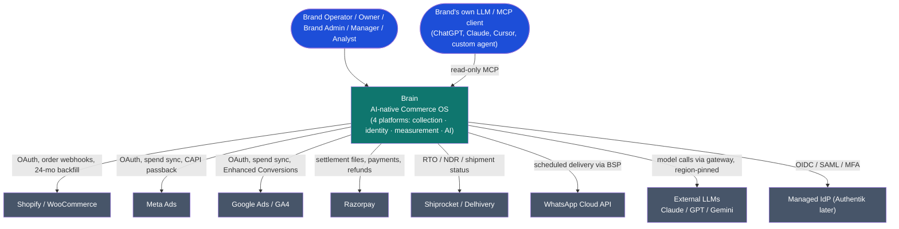

## A2. Container Diagram

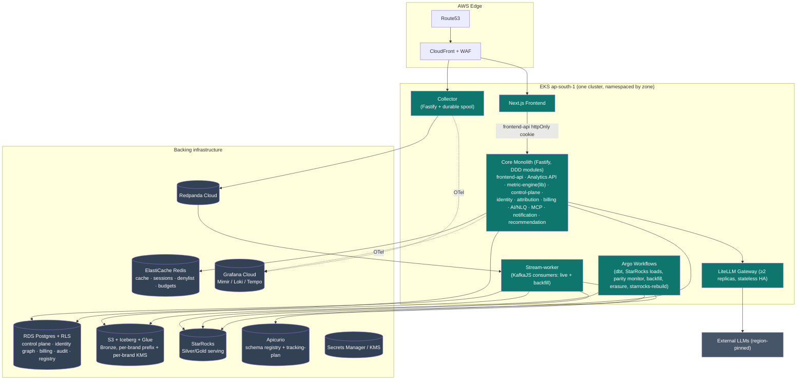

## A3. Component Diagrams (per service / module)

### A3.1 Collector

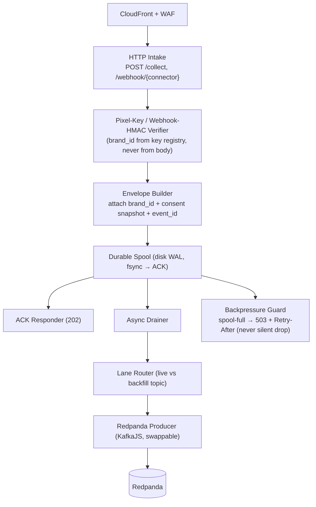

### A3.2 Stream-worker

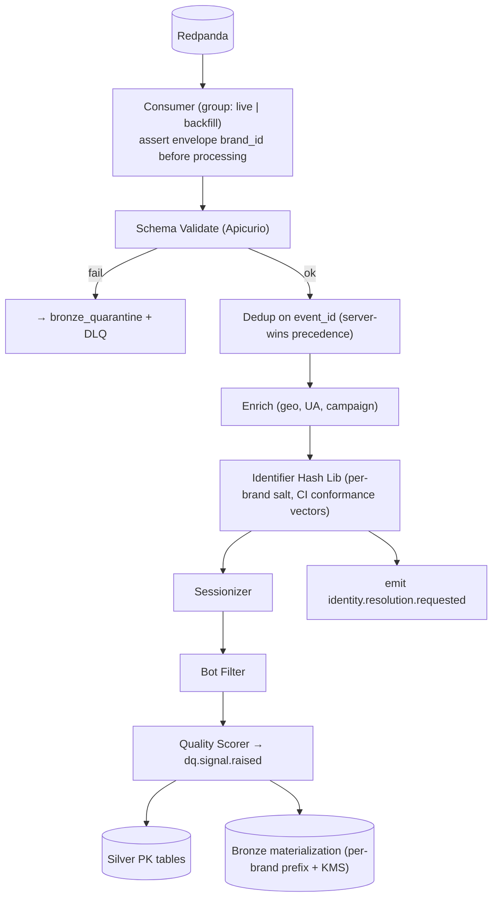

### A3.3 Analytics API (the keystone)

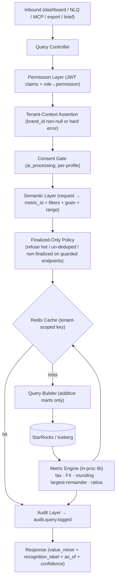

### A3.4 Metric Engine (in-process library)

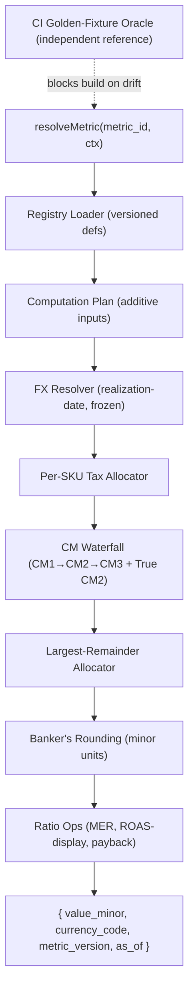

### A3.5 Identity module

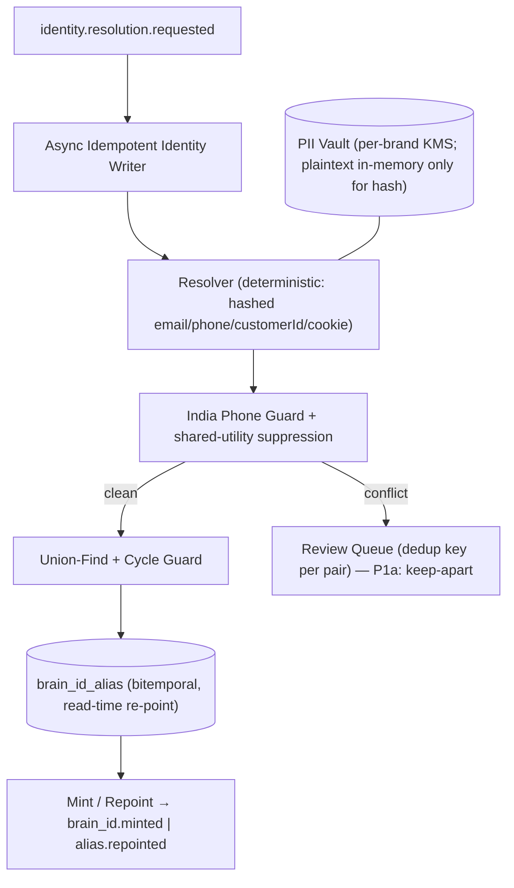

### A3.6 Billing module

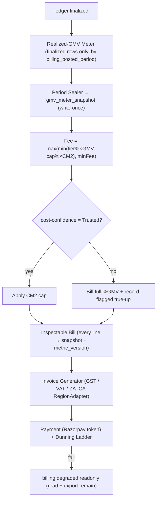

### A3.7 AI module (NLQ + MCP) — see also §N

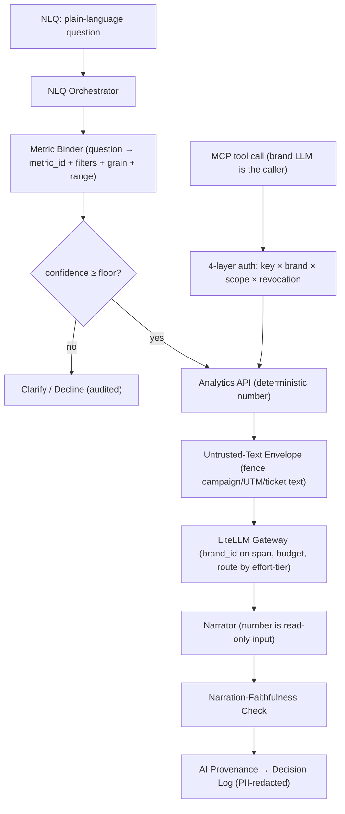

### A3.8 Notification & Send/Consent chokepoint (M10)

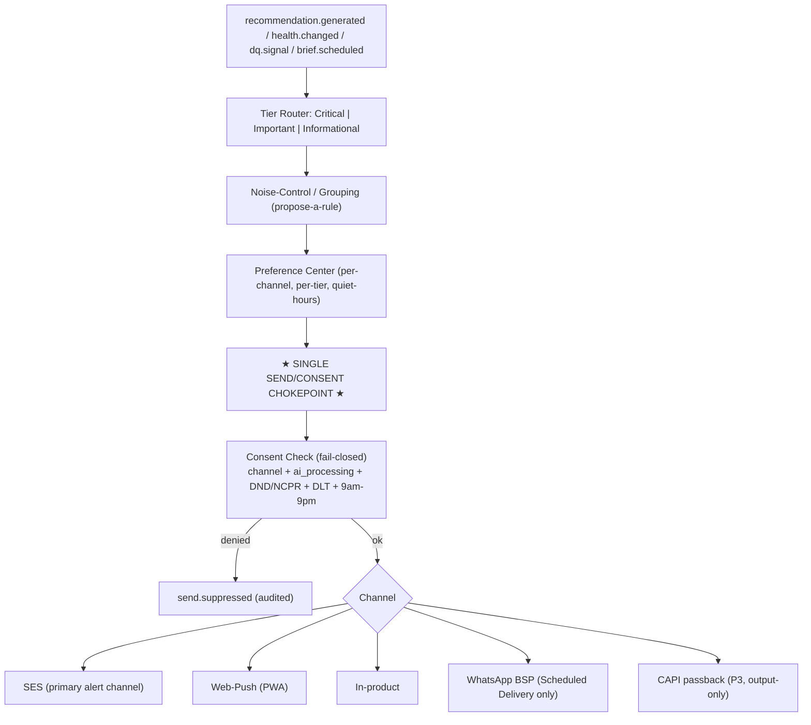

### A3.9 frontend-api — Backend-for-Frontend (M11)

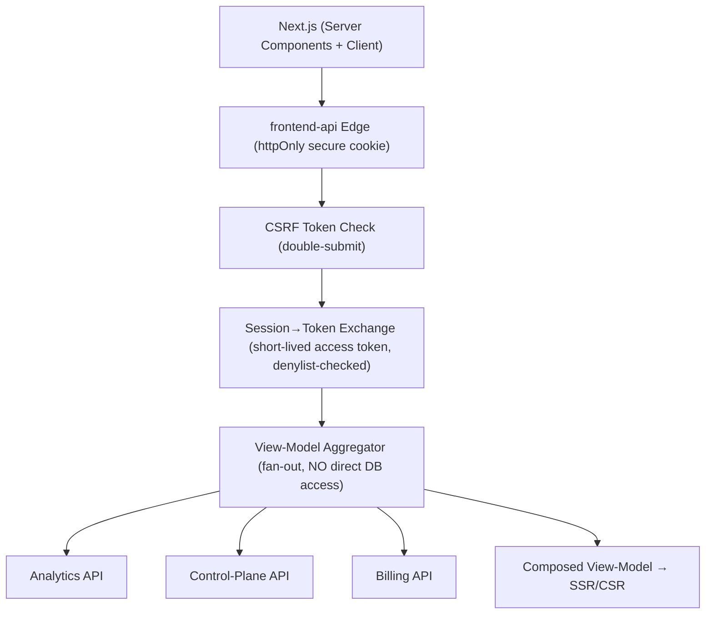

# Section B — Architecture Decision Records

Each ADR: **Context · Decision · Consequences · When to revisit.**

**ADR-001 — Modular monolith over microservices, with deliberate extraction triggers.** *Context:* small bootstrapped team; an 8-service split was the dominant operational risk flagged by every ARB cluster. *Decision:* 3 deployables (Collector, stream-worker, core monolith) + Argo jobs; bounded contexts are import-lint-enforced internal modules with clean contracts. *Consequences:* (+) one pipeline, one on-call, no distributed transactions; (−) one process can be a noisy neighbor — mitigated by per-module circuit breakers + HPA. *Revisit when:* Identity resolution load **or** team > 2 squads → extract Identity (Phase 2); Billing compliance/scale → extract Billing (Phase 2); Python ML → new service (Phase 3).

**ADR-002 — One read path (the Analytics API is the sole DB-touching component).** *Context:* "same finalized number everywhere" + collapse the isolation-fuzz surface. *Decision:* only the Analytics API reads StarRocks/Iceberg; dashboards/NLQ/MCP/export/brief are thin clients. *Consequences:* (+) single isolation surface, single enforcement point for finalized-only/consent; (−) Analytics API is a hotspot — mitigated by Redis cache + HPA + read replicas (P2). *Revisit when:* read QPS exceeds a single fronting tier's cache-hit economics.

**ADR-003 — Durable-spool Collector; the 99.95% guarantee lives in the spool, not the Kafka client.** *Context:* "a lost event is lost forever." *Decision:* accept → disk WAL → fsync → ack → async produce; producer swappable. *Consequences:* (+) survives Redpanda outage; producer can become librdkafka/Go with zero contract change; (−) local disk is state on a "stateless" service — needs EBS/NVMe PVC + drain-on-terminate. *Revisit when:* sale-day spikes saturate KafkaJS (P2 producer swap).

**ADR-004 — In-process TypeScript metric engine (never a service, never SQL math).** *Context:* dual-store parity is the top technical risk. *Decision:* all non-additive math in one TS library bound to a versioned registry; dbt does additive marts only (CI-enforced lint). *Consequences:* (+) SQL dialects can't disagree on math they never do; (−) the engine must be embedded wherever a number is emitted (only the Analytics API does). *Revisit when:* a non-TS runtime must emit a number (not foreseen).

**ADR-005 — Dual-date ledger (`economic_effective_at` + `billing_posted_period`).** *Context:* late chargebacks vs immutable closed periods. *Decision:* every ledger row carries both dates; billing reads by posted-period, attribution by economic date. *Consequences:* (+) both invariants hold; restatements don't read as parity bugs (as-of date on every surface); (−) every query declares its date axis. *Revisit when:* never — frozen invariant.

**ADR-006 — Buy managed for undifferentiated heavy infra; self-operate the differentiated.** *Context:* engineer-hours are the binding constraint. *Decision:* Redpanda Cloud, RDS, ElastiCache, Glue, Grafana Cloud, managed IdP; self-operate Iceberg lakehouse, StarRocks, metric engine, LiteLLM, Apicurio. *Consequences:* (+) no part-time SRE drowning; (−) vendor cost + some control loss. *Revisit when:* managed cost crosses self-host break-even, or a buyer mandates self-host.

**ADR-007 — TypeScript everywhere, two named exceptions.** *Decision:* TS for all; exceptions = (1) Collector hot-path producer → librdkafka/Go (P2 if load demands), (2) P3 ML service → Python. *Consequences:* (+) shared types/skills; (−) heavy ML deliberately uncovered until P3. *Revisit when:* the two triggers fire.

**ADR-008 — Async identity resolution off Bronze (no synchronous RPC on the hot path).** *Context:* centralized hashing must not become a synchronous gate. *Decision:* identifier hashing is a shared in-stream library (CI conformance vectors); the graph write is an async idempotent writer. *Consequences:* (+) the hot path never blocks on identity; (−) identity is eventually-consistent — acceptable since money/decisions read finalized only. *Revisit when:* real-time edge identity is required (not foreseen v1).

**ADR-009 — Append-only attribution credit ledger with mirrored clawback.** *Decision:* one row per (order×touch×channel×model_version×pass); reversals mirror the exact split via `reversed_of_credit_id`, pinned to an identity snapshot. *Consequences:* (+) clawback exact; merges don't silently re-weight history; (−) ledger grows — bounded by the restatement window. *Revisit when:* never — frozen moat.

**ADR-010 — Bronze via Redpanda→Iceberg topic-materialization, with a TS-consumer contingency.** *Decision:* topic-materialization, gated by a Phase-1a spike (per-brand prefix + per-brand KMS + schema-driven evolution + insert-if-absent idempotency); contingency = a single-purpose TS Iceberg-writing consumer. *Consequences:* (+) no hand-rolled writers; (−) spike risk, explicitly gated. *Revisit when:* spike fails → contingency; P3 Spark replaces both.

**ADR-011 — frontend-api tier (Backend-for-Frontend) inside the monolith (board addition).** *Context:* the browser must not hold a token reaching the metric engine or denylist write path. *Decision:* a frontend-api module owns httpOnly-cookie↔short-token exchange, CSRF, and view-model fan-out; no DB access. *Consequences:* (+) browser blast radius minimized; one CSRF/session posture; (−) an aggregation hop. *Revisit when:* frontend-api needs independent scaling → extract as a 4th deployable.

**ADR-012 — Single outbound send/consent chokepoint as a named module (board addition).** *Context:* "outreach to a non-consented customer is impossible" is only true with exactly one door. *Decision:* the Notification module owns the chokepoint; ALL outbound (email/push/in-product now; WhatsApp + CAPI in P3) passes consent + DND + DLT + quiet-hours fail-closed before any channel adapter. *Consequences:* (+) provable compliance; (−) every new channel wires through it (lint-enforced). *Revisit when:* never — compliance invariant.

**ADR-013 — Per-brand isolation via envelope DEKs under a small CMK set (not one CMK per brand).** *Context:* literal CMK-per-brand hits AWS quota/cost walls. *Decision:* each brand gets a unique data key (DEK) wrapped by a small set of regional CMKs; the wrapped DEK row in RDS is the crypto-shred target. *Consequences:* (+) cryptographic per-brand isolation + clean per-brand deletion at scale; (−) DEK keyring integrity becomes a gating DR control. *Revisit when:* a buyer mandates a dedicated CMK (enterprise overlay).

# Section C — Service Catalog

Two layers: the **3 deployables + jobs** (each with the operational fields the solution architecture omitted) and the **core-monolith internal modules** (each with a clean contract for later extraction).

## C.1 Deployables

| Deployable | Purpose | Data ownership | Scaling | Failure handling | SLA | Security controls |
|---|---|---|---|---|---|---|
| **Collector** | Accept-before-validate ingest; never lose an event | Durable disk spool (transient WAL) | HPA on req-rate; stateless + local NVMe WAL; spool absorbs Redpanda outage | spool-then-ack; Redpanda down → spool keeps acking, producer drains async; spool full → 503 + Retry-After (never silent drop) | accept+ack **99.95%** | CloudFront+WAF; HMAC-signed pixel payloads; `brand_id` from key registry, never body; no secrets on host |
| **Stream-worker** | validate→dedup→enrich→resolve→sessionize→quality; write Bronze+Silver | Bronze (via materialization), Silver PK tables | by partition count; **separate live vs backfill consumer groups** | schema-fail → quarantine + DLQ; poison-pill → DLQ after N backoff retries; identity-writer async + idempotent | live-lane lag p95 < 5s | `brand_id` envelope-asserted before processing (partition = brand-prefixed composite, §6.6); per-brand KMS on Bronze write; **no-PII-in-events**/logs test |
| **Core monolith** | control-plane + Analytics API + metric engine + identity/attribution/billing/MCP/NLQ/notification/recommendation/frontend-api modules | Postgres (control plane) | HPA on req-rate; Postgres read replicas (P2) | per-module circuit breakers; LiteLLM-down → deterministic number + "narration unavailable"; StarRocks-down → cached/last-good + staleness label | surfaces **99.9%** | RLS + tenant-context assert; revocation denylist on every action; import-lint module boundaries |
| **Scheduled jobs (Argo)** | dbt builds, Bronze→StarRocks loads, parity monitor, backfill orchestration, lakehouse maintenance, retention/erasure, `starrocks-rebuild` | none (operate on owned stores via job IAM) | off-peak; StarRocks resource groups | overlap-lock per (job,brand); retry-with-backoff; alert on missed-window; idempotent partition overwrite | freshness SLOs per job | per-task IAM role; no cross-brand fan-in except the Owner-rollup job |

## C.2 Core-monolith modules

For each: **Purpose · Depends on · APIs exposed · Events produced · Events consumed · Data ownership · Failure strategy.** (Scaling = inherits the monolith; SLA = surfaces 99.9%; security = RLS + tenant-context + revocation denylist + permission gating throughout.)

**Naming aligned with doc 05 §3 (the canonical repository folder names):** M11 = `frontend-api`, M12 = `job-orchestration` (renamed from Web/BFF and Scheduler), **M13 = `data-quality` (added)** in the doc-05 §1A refinement; M1 "Workspace & Access" = folder `workspace-access`; M6 "Analytics API" (the component) = folder `analytics`. **13 modules total.**

| # | Module | Purpose | APIs | Events produced | Events consumed | Data ownership | Failure strategy |
|---|---|---|---|---|---|---|---|
| M1 | **Workspace & Access** | orgs, brands, users, roles, sessions, invites, audit | Auth, User, Workspace, Brand, Admin | `audit.action.logged`, `workspace.member.changed`, `permission.revoked` | `billing.degraded.readonly` | org, brand, user, role, invite, session, audit_log | fail-closed on missing tenant ctx |
| M2 | **Connector** | connector lifecycle, OAuth, cursors, backfill, settlement, tracking-plan | Connector, Pixel | `connector.connected`, `order.upserted`, `settlement.received`, `backfill.requested` | `connector.health.changed` | connector_instance, oauth_token(KMS), sync_cursor, tracking_plan | honest health states; backoff on rate-limit |
| M3 | **Identity** | Brain ID, alias graph, merge/unmerge, phone guard, review queue, PII vault | Identity, Customer | `brain_id.minted`, `alias.repointed`, `merge.committed`, `unmerge.committed` | `identity.resolution.requested` | brain_id_alias, identity_link, contact_pii(KMS), merge_review_queue | conflict → keep-apart (safe default); writer idempotent |
| M4 | **Measurement (Metrics)** | registry + in-process metric engine + ladder/CM/FX | (library; no HTTP) | — | — | metric_definition, fx_rate | deterministic; CI golden-fixture gate |
| M5 | **Attribution** | journey attribution, credit ledger, two-pass + clawback, channel contribution | (internal) | `credit.provisional.assigned`, `credit.finalized`, `credit.clawed_back` | `ledger.finalized`, `order.upserted` | attribution_credit_ledger, channel_contribution | realized-only; closed-sum residual = plug |
| M6 | **Analytics API** | sole DB read path; resolve→engine→StarRocks; enforce finalized-only/tenant/consent | Analytics, Dashboard, Customer (read) + semantic layer | `audit.query.logged` | — | none (reads Gold) | cache + last-good; refuse hot/non-finalized on guarded endpoints |
| M7 | **Billing & Metering** | meter realized GMV, tier/cap/min-fee, seal periods, invoice, dunning | Billing | `billing.period.sealed`, `billing.degraded.readonly`, `trueup.posted` | `ledger.finalized` | gmv_meter_snapshot(write-once), invoice, billing_adjustment, payment | correctness > throughput; immutable closed periods |
| M8 | **AI (NLQ + MCP + gateway-client)** | NLQ orchestration, MCP server, prompt registry, eval/injection gates, provenance | AI, MCP | `nlq.query.resolved`, `ai.provenance.recorded` | — | prompt_registry, ai_provenance | gateway-down → number + "narration unavailable" |
| M9 | **Recommendation** | deterministic threshold detectors → recommendation contract; eligibility | (internal → Home/brief) | `recommendation.generated` | `ledger.finalized`, `dq.signal.raised` | recommendation, recommendation_outcome | eligibility deterministic; degrade → suppress, never fabricate |
| M10 | **Notification + Send/Consent chokepoint** | route 3 tiers; the single outbound door | Notification | `notification.sent`, `send.requested`, `send.suppressed` | `recommendation.generated`, `connector.health.changed`, `dq.signal.raised`, `consent.withdrawn` | notification, notification_pref, send_log, suppression_list | consent fail-closed; quiet-hours; noise-grouping |
| M11 | **frontend-api** | browser-facing aggregation (Backend-for-Frontend); cookie↔token; CSRF; view-model fan-out | frontend-api endpoints | — | — | session cache (Redis) | no DB access; fails to cached view-model |
| M12 | **job-orchestration** | declarative cron catalog + overlap-lock + backfill orchestration consumed by Argo | Admin/internal trigger | `job.started`, `job.completed`, `job.failed` | `backfill.requested` | job_run, job_lock | overlap-lock per (job,brand); idempotent |
| M13 | **data-quality** | the DQ grade + the gating table + quality-signal consumption — gates billing-cap, recommendation eligibility, and metric rendering | (internal) | `dq.grade.updated` | `dq.signal.raised`, `connector.health.changed` | dq_grade, gating_table | below-C → estimated + block high-risk; the single owner of the gate |

# Section D — API Architecture

**Global conventions (apply to every endpoint).** Base `/api/v1`. Auth: `Authorization: Bearer <jwt>` (services) or the frontend-api httpOnly cookie (browser). Tenant: `X-Brand-Id: <uuid>` — asserted non-null for brand-scoped endpoints; org-scoped (Owner-rollup) endpoints may omit. Every mutating endpoint requires `Idempotency-Key: <uuid>` (result cached 24h, replayed on repeat). Cookie-auth requires `X-CSRF-Token`. Standard error envelope: `{ "error": { "code", "message", "trace_id", "details" } }`. Rate limits are token-bucket, tenant-scoped, surfaced via `X-RateLimit-Remaining` / `Retry-After`. Authorization is by **permission**, not role label. Every request is audit-logged; AI/MCP additionally write provenance.

### D.1 Auth API
```jsonc
// POST /auth/register   authz: public   rate: 5/min/IP   idempotent
{ "email":"ops@brand.com","password":"••••","name":"Ops","method":"password" }
// 201 { "user_id":"usr_…","org_id":"org_…","email_verification_required":true }
// errors: 409 EMAIL_EXISTS · 422 WEAK_PASSWORD · 429 RATE_LIMITED

// POST /auth/login   authz: public   rate: 10/min/IP
{ "email":"ops@brand.com","password":"••••" }   // or { "method":"google","id_token":"…" }
// 200 { "access_token":"jwt","expires_in":900,"refresh_token":"opaque","mfa_required":false }
// 401 INVALID_CREDENTIALS · 423 MFA_REQUIRED → POST /auth/mfa/verify

// POST /auth/revoke   authz: self|owner   → synchronous denylist write (immediate)
{ "target":"session|all_sessions|mcp_key|integration_token","id":"…" }
// 200 { "revoked_at":"…","fanout":["session","mcp"] }
```
Authz/rate/idempotency: register & login are public + IP-rate-limited; revoke requires `auth.revoke` (self) or Owner. Refresh tokens rotate; reuse of a rotated refresh revokes the whole token family.

### D.2 Workspace / Brand / User API
```jsonc
// POST /brands   authz: Owner ONLY (brand.create)   idempotent
{ "name":"Acme DTC","region":"IN","base_currency":"INR","timezone":"Asia/Kolkata" }
// 201 { "brand_id":"brd_…","readiness_score":0,"state":"onboarding" }   // 403 NOT_OWNER

// POST /brands/{brand_id}/members   authz: Owner|BrandAdmin (user.invite)
{ "email":"analyst@brand.com","role":"Analyst" }
// 201 { "invite_id":"inv_…","status":"pending" }   // 403 if assigning a brand the inviter can't manage

// GET /brands/{brand_id}/readiness   authz: any role/brand   → sub-scored checklist
// 200 { "score":62,"subscores":{"pixel":80,"cost_data":40,"identity_match":55,"connectors":75,"consent":100} }
```

### D.3 Connector + Pixel API
```jsonc
// POST /connectors   authz: Owner|BrandAdmin (integration.connect)   idempotent
{ "type":"shopify","auth_method":"oauth","config":{"shop":"acme.myshopify.com"} }
// 201 { "connector_id":"con_…","oauth_url":"https://…","state":"disconnected" }

// POST /connectors/{id}/backfill   authz: Owner|BrandAdmin
{ "from":"2024-06-01","to":"2026-06-14","lane":"backfill" }
// 202 { "job_id":"job_…","estimated_events":1840000 }

// GET /connectors/{id}/health   authz: any role
// 200 { "state":"Healthy|Delayed|Failed|Disconnected|RateLimited|TokenExpired|Disabled",
//        "freshness":{"last_event_at":"…","lag_seconds":42},"recommendation_safety":"safe|degraded|blocked" }

// POST /collect   (Collector deployable, NOT /api/v1)   authz: pixel HMAC key
{ "event_id":"evt_uuid","brand_id":"brd_…","occurred_at":"…","schema":"purchase.v2",
  "consent":{"analytics":true,"marketing":false,"ai_processing":true,"personalization":true},
  "payload":{"order_id":"…","value_minor":249900,"currency_code":"INR","click_ids":{"fbclid":"…"}} }
// 202 { "accepted":true }            // accept-before-validate — NEVER 4xx on schema here
// 503 { "error":{"code":"SPOOL_FULL"} } + Retry-After
```

### D.4 Identity / Customer API
```jsonc
// GET /customers/{brain_id}   authz: customer.read (PII-minimized for Analyst)
// 200 { "brain_id":"bid_…","identity_confidence":"High","completeness":0.82,
//        "identifiers":[{"type":"email_hash","linked_at":"…"}], "as_of":"2026-06-14",
//        "lifetime_realized_cm2_minor":1820000 }

// POST /identity/merge   authz: BrandAdmin|Owner (merge.execute)   idempotent
{ "profile_a":"bid_…","profile_b":"bid_…","reason":"manual_review","rule_version":"v3" }
// 200 { "merge_event_id":"mev_…","canonical_brain_id":"bid_…" }   // 409 CYCLE_DETECTED → review

// POST /identity/unmerge   authz: BrandAdmin|Owner
{ "merge_event_id":"mev_…" }   // sets valid_to; appends reversal; alias closed not deleted
```

### D.5 Analytics / Attribution / Dashboard API (the keystone)
```jsonc
// GET /metric/{metric_id}?grain=day&from=…&to=…&channel=meta   authz: permission-gated   rate: 120/min/brand
// 200 { "metric_id":"realized_cm2","value_minor":4521000,"currency_code":"INR","metric_version":"2026.06",
//        "as_of":"2026-06-14","recognition_label":"finalized","dedup_state":"deduped",
//        "confidence":{"band":"Medium","effective":"min(cost,attribution)"} }
// 409 NON_FINALIZED_ON_GUARDED_ENDPOINT   // structural refusal of hot/provisional rows

// POST /query   authz: permission-gated   (registry-bound; NEVER raw SQL)
{ "metric_id":"channel_contribution","filters":{"period":"2026-05"},"grain":["channel"],"currency_code":"INR" }
// 200 { "rows":[{"channel":"meta","contribution_minor":…,"method":"rule_based","confidence":"High"}],
//        "closed_sum_check":"balanced","unattributed_residual_minor":… }

// GET /attribution/journey/{order_id}   authz: Manager+
// 200 { "order_id":"…","credit_pass":"finalized",
//        "touches":[{"touch_id":"…","channel":"google","weight_fraction":0.34,
//                    "credited_revenue_minor":…,"economic_effective_at":"…"}] }
```

### D.6 Billing API
```jsonc
// GET /billing/preview?period=2026-05   authz: Owner (act) / BrandAdmin (view)
// 200 { "period":"2026-05","snapshot_id":"snp_…","realized_gmv_minor":5000000,"currency_code":"INR",
//        "fx_basis":"realization-date","tier":"Growth","tier_pct":0.0075,
//        "cap":{"applied":false,"reason":"cost_confidence=Estimated","trueup_recorded_minor":1000000},
//        "min_fee_minor":1500000,"fee_minor":3750000,"tax":{"cgst":…,"sgst":…},"total_minor":… ,
//        "lines":[{"label":"realized_gmv","links_to":"realized_revenue_ledger","metric_version":"2026.06"}] }

// POST /billing/period/{period}/seal   authz: system(Argo) | Owner-confirm
// 200 { "snapshot_id":"snp_…","sealed_at":"…","immutable":true }   // 409 ALREADY_SEALED
```

### D.7 Notification API
```jsonc
// GET /notifications?tier=Critical   authz: role/brand-scoped
// 200 { "items":[{"id":"ntf_…","tier":"Critical","theme":"connector_failed","ack_required":true}] }

// PUT /notifications/preferences   authz: self
{ "channels":{"email":true,"push":true,"in_product":true},"tier_overrides":{"Informational":"digest"},
  "quiet_hours":{"start":"21:00","end":"09:00","critical_overrides":true} }
// 200 — preferences never weaken critical-safety routing or compliance
```

### D.8 AI / MCP API
```jsonc
// POST /ai/nlq   authz: permission + ai_processing consent (per-profile)
{ "question":"What was realized CM2 from Meta last month?" }
// 200 { "metric_binding":{"metric_id":"realized_cm2","filters":{"channel":"meta","period":"2026-05"}},
//        "value_minor":4521000,"currency_code":"INR","narration":"Realized CM2 from Meta in May was ₹45,210…",
//        "provenance":{"model":"claude-haiku","prompt_hash":"…","snapshot":"…","confidence":"Medium"} }
// 200 (low confidence) { "action":"clarify","question":"Did you mean placed or realized?" }
// 403 AI_CONSENT_MISSING

// MCP tool: get_metric   authz: MCP key × brand × scope × revocation
{ "tool":"get_metric","args":{"metric_id":"realized_cm2","period":"2026-05"} }
// result: identical number to the dashboard; NEVER model-touched server-side
// 429 { "error":{"code":"LIMIT_ROWS|LIMIT_RATE|LIMIT_TIMEOUT|LIMIT_BUDGET"} }   // never silent partial
```

### D.9 Admin API
```jsonc
// POST /admin/staff-access-grant   authz: staff + customer-consent
{ "brand_id":"brd_…","scope":["read_billing"],"ttl_minutes":60,"reason":"support#1234" }
// 200 { "grant_id":"…","expires_at":"…","brand_visible":true }   // hash-chained audit; never silent impersonation
```

**API groups summary (16):** Auth, User, Workspace, Brand (D.1–D.2); Connector, Pixel (D.3); Identity, Customer (D.4); Attribution, Analytics, Dashboard (D.5); Billing (D.6); Notification (D.7); AI, MCP (D.8); Admin (D.9). All follow the global conventions; full OpenAPI specs are generated from Zod schemas (the stack's typed-contract discipline) and published per the API-discipline contract-testing gate.

# Section E — Event Architecture

**Universal envelope (every event):** `event_id (uuid), brand_id (uuid — envelope tenant key, asserted by consumers; NOT the partition key), occurred_at, ingested_at, schema_name + schema_version, schema_id, producer, source, partition_key, correlation_id, causation_id, payload`; **`consent_flags` is an optional customer-domain extension** (not on every event); **`click_ids` lives in the pixel payload, not the universal envelope.** **No raw PII in any field — hashed identifiers + vault refs only (§6.6 C2).** **Format** Avro; **registry** Apicurio, **FULL_TRANSITIVE** for all Bronze-materialized streams (additive-optional only; breaking → new `.v{n+1}`) — old events stay replayable forever. **Topic naming** `{env}.{domain}.{event}.v{n}`. **Partition key** brand-prefixed composite per ordering unit (§6.6). **Idempotency** dedup on **`(brand_id, event_id)`** before Bronze materialization (effectively-once via at-least-once + idempotent processing). **Retention** Bronze 24 months (the replay source of truth); Redpanda 7 days + tiered storage for live/short-rewind only.

| Event | Producer | Consumers | Idempotency | Example payload (abridged) |
|---|---|---|---|---|
| **`collection.purchase.v2`** (pixel/behavioral) | Collector | stream-worker → Bronze/Silver, Identity, Attribution | `event_id` (client+server collapse) | `{order_id,value_minor:249900,currency_code:"INR",click_ids:{fbclid},source:"server"}` |
| **`connector.order.upserted`** | Connector (webhook) | stream-worker, Measurement, Billing, Attribution | order natural key + `updated_at` watermark | `{order_id,status:"delivered",net_total_minor,delivered_at}` |
| **`connector.settlement.received`** | Connector | Billing, Attribution (finalization) | settlement_id | `{settlement_id,provider:"razorpay",net_settled_minor,fees_minor,payment_ids:[…]}` |
| **`identity.resolution.requested`** | stream-worker | Identity async writer | `event_id` (idempotent writer) | `{observed_brain_id,identifier_hashes:[…],brand_id}` |
| **`identity.alias.repointed`** / `merge.committed` / `unmerge.committed` | Identity | Attribution, Customer 360, Audit | merge_event_id | `{observed,canonical,rule_version,merge_event_id}` |
| **`attribution.credit.provisional.assigned`** | Attribution | Gold credit ledger | `credit_id` (deterministic) | `{order_id,touch_id,channel,weight_fraction:0.34,credit_pass:"provisional"}` |
| **`attribution.credit.finalized`** / `clawed_back` | Attribution | Gold credit ledger, Analytics | `credit_id` | `{order_id,reversed_of_credit_id,credited_revenue_minor:-12500}` |
| **`revenue.ledger.finalized`** | Measurement/Attribution job | Billing, Attribution | `ledger_event_id` (deterministic) | `{order_id,event_type:"finalization",amount_minor,economic_effective_at,recognition_label:"finalized"}` |
| **`billing.period.sealed`** / `degraded.readonly` / `trueup.posted` | Billing | Workspace (entitlement), Notification | snapshot_id | `{snapshot_id,period,realized_gmv_minor}` |
| **`ai.nlq.query.resolved`** / `ai.provenance.recorded` | AI | Decision Log, Audit | query_id | `{metric_binding,model,prompt_hash,confidence}` (PII-redacted) |
| **`recommendation.generated`** | Recommendation | Notification, Home, Decision Log | recommendation_id | `{detector:"cm2_falling",eligibility:{eligible:true},confidence:"High"}` |
| **`dq.signal.raised`** | stream-worker / connectors | Recommendation, Notification, DQ grade | dedup by (brand,signal,window) | `{kind:"tracking_dark",brand_id,severity}` |
| **`consent.withdrawn`** | Collection / Workspace | Notification chokepoint, suppression | (brand,brain_id,category) | `{brain_id,category:"marketing",effective_at}` |
| **`audit.action.logged`** | All modules | Audit ledger (hash-chained) | audit_id | `{actor,action,resource,prev_hash,entry_hash}` |
| **`job.started/completed/failed`** | job-orchestration/Argo | Observability | job_run_id | `{job:"dbt_build",brand_id,status}` |

**Two lanes (load isolation):** live events on `prod.collection.*` / `prod.connector.*` (live consumer group); backfill on **separate** `prod.backfill.*` topics + a **separate, concurrency-capped** consumer group — so a backfill storm can't induce lag on the billable live path. Same processing code, different lane.

# Section F — Database Architecture

**Conventions.** Money = `*_minor BIGINT` + `currency_code CHAR(3)`, always paired, never floats. IDs = app-generated **UUID v7** (time-ordered). PKs **tenant-leading** (`brand_id` first) where tenant-scoped. RLS on every brand-scoped Postgres table: `USING (brand_id = current_setting('app.current_brand_id')::uuid)`; app connects as a **non-owner role** (no `BYPASSRLS`); the session GUC is set by middleware and asserted non-null pre-query. Time = `timestamptz` UTC; ledgers carry the two economic clocks.

## F.1 PostgreSQL — control plane, identity, billing

### F.1.1 Workspace & Access (DDL)
```sql
CREATE TABLE organization (
  org_id uuid PRIMARY KEY DEFAULT uuidv7(),
  legal_name text NOT NULL, billing_country char(2) NOT NULL,
  region text NOT NULL DEFAULT 'IN' CHECK (region IN ('IN','GCC')),
  status text NOT NULL DEFAULT 'active' CHECK (status IN ('active','suspended','closed')),
  created_at timestamptz NOT NULL DEFAULT now(), updated_at timestamptz NOT NULL DEFAULT now());
-- No RLS: org is the tenant root; Owner-rollup reads N brands stitched at presentation.

CREATE TABLE brand (
  brand_id uuid PRIMARY KEY DEFAULT uuidv7(),
  org_id uuid NOT NULL REFERENCES organization(org_id),
  display_name text NOT NULL, slug text NOT NULL,
  base_currency char(3) NOT NULL, timezone text NOT NULL,
  region text NOT NULL DEFAULT 'IN' CHECK (region IN ('IN','GCC')),
  kms_key_arn text NOT NULL,                       -- per-brand CMK (S3 data keys, vault, tokens, salt)
  identity_salt_ciphertext bytea NOT NULL,         -- per-brand salt, encrypted under the brand CMK
  status text NOT NULL DEFAULT 'onboarding'
     CHECK (status IN ('onboarding','active','read_only','suspended','closed')),
  created_at timestamptz NOT NULL DEFAULT now(), updated_at timestamptz NOT NULL DEFAULT now(),
  UNIQUE (org_id, slug));
-- RLS: USING (brand_id = current_setting('app.current_brand_id')::uuid
--             OR org_id = current_setting('app.current_org_id')::uuid)   -- owner-rollup path

CREATE TABLE app_user (
  user_id uuid PRIMARY KEY DEFAULT uuidv7(),
  org_id uuid NOT NULL REFERENCES organization(org_id),
  email citext NOT NULL, idp_subject text NOT NULL, display_name text,
  status text NOT NULL DEFAULT 'active' CHECK (status IN ('invited','active','disabled')),
  mfa_enrolled boolean NOT NULL DEFAULT false, created_at timestamptz NOT NULL DEFAULT now(),
  UNIQUE (org_id, email), UNIQUE (idp_subject));

CREATE TABLE role (
  role_id uuid PRIMARY KEY DEFAULT uuidv7(),
  role_code text NOT NULL UNIQUE CHECK (role_code IN ('owner','brand_admin','manager','analyst')),
  level smallint NOT NULL, display_name text NOT NULL);
CREATE TABLE permission (permission_id text PRIMARY KEY, description text NOT NULL);
CREATE TABLE role_permission (
  role_id uuid REFERENCES role(role_id), permission_id text REFERENCES permission(permission_id),
  PRIMARY KEY (role_id, permission_id));

CREATE TABLE membership (
  membership_id uuid PRIMARY KEY DEFAULT uuidv7(),
  org_id uuid NOT NULL REFERENCES organization(org_id),
  brand_id uuid REFERENCES brand(brand_id),        -- NULL ⇒ org-scoped (owner)
  user_id uuid NOT NULL REFERENCES app_user(user_id),
  role_id uuid NOT NULL REFERENCES role(role_id),
  status text NOT NULL DEFAULT 'active' CHECK (status IN ('active','revoked')),
  granted_by uuid REFERENCES app_user(user_id),
  created_at timestamptz NOT NULL DEFAULT now(), revoked_at timestamptz,
  UNIQUE (user_id, brand_id) WHERE status='active');
-- Invariant: exactly one active owner per org → partial unique index on (org_id) WHERE role=owner.

CREATE TABLE invite (
  invite_id uuid PRIMARY KEY DEFAULT uuidv7(), org_id uuid NOT NULL REFERENCES organization(org_id),
  brand_id uuid REFERENCES brand(brand_id), email citext NOT NULL, role_id uuid NOT NULL REFERENCES role(role_id),
  token_hash text NOT NULL UNIQUE,                 -- SHA-256 of invite token; raw never stored
  status text NOT NULL DEFAULT 'pending' CHECK (status IN ('pending','accepted','revoked','expired')),
  invited_by uuid NOT NULL REFERENCES app_user(user_id),
  expires_at timestamptz NOT NULL, created_at timestamptz NOT NULL DEFAULT now());

CREATE TABLE session (
  session_id uuid PRIMARY KEY DEFAULT uuidv7(), user_id uuid NOT NULL REFERENCES app_user(user_id),
  refresh_token_hash text NOT NULL UNIQUE, device_label text, ip inet, user_agent text,
  issued_at timestamptz NOT NULL DEFAULT now(), expires_at timestamptz NOT NULL, revoked_at timestamptz);
-- Access tokens are short-lived JWTs (not stored). Revocation = Redis denylist(jti) checked every action.
```

### F.1.2 The hash-chained audit ledger (resolves §12.4)
```sql
CREATE TABLE audit_log (
  audit_id uuid DEFAULT uuidv7(), brand_id uuid,         -- NULL for org/platform actions
  seq bigint NOT NULL,                                   -- per-brand monotonic (gap = tamper signal)
  actor_user_id uuid, actor_principal text,              -- user | mcp_key:<id> | system | staff_grant:<id>
  action text NOT NULL, resource_type text, resource_id text,
  payload jsonb NOT NULL,                                -- PII-redacted; references brain_id, never plaintext
  prev_hash bytea NOT NULL, entry_hash bytea NOT NULL,   -- entry_hash = sha256(prev_hash || canonical(row))
  occurred_at timestamptz NOT NULL DEFAULT now(),
  PRIMARY KEY (brand_id, seq));
-- App role granted INSERT+SELECT only; NO UPDATE/DELETE (revoked at GRANT level).
-- Hourly job writes checkpoint hashes to S3 Object Lock (WORM). Chain-break ⇒ P1 alert.
```

### F.1.3 Identity graph (frozen DDL — key shapes)
- **`customer`** PK `(brand_id, brain_id)`; `anonymous_id, merged_into, lifecycle_state ∈ {anonymous,active,merged,split,erased}, ai_processing_consent, resolution_consent`.
- **`identity_link`** PK `(brand_id, link_id)`; `brain_id, identifier_type, identifier_value (SHA-256 + per-brand salt — hash only), tier ∈ {strong,strong_on_link,medium,weak}, is_active`. **Unique partial** `(brand_id, identifier_type, identifier_value) WHERE is_active AND tier IN ('strong','strong_on_link')` — blocks two profiles holding the same strong id. Append-only; unmerge soft-deactivates.
- **`merge_rule`** PK `(rule_id, version)`; versioned, never edited in place; `identifier_combo text[], action ∈ {merge,review,never}, guard, precedence, effective_from/to`.
- **`brain_id_alias`** PK `(brand_id, alias_id)`; `observed_brain_id, canonical_brain_id, valid_from, valid_to, rule_version, merge_id, CHECK(observed<>canonical)`. **Unique partial** `(brand_id, observed_brain_id) WHERE valid_to IS NULL` (the union-find one-live-pointer invariant).
- **`merge_review_queue`** PK `(brand_id, review_id)`; `brain_id_a/b, trigger_reason, evidence jsonb (hashed), status ∈ {pending,merged,rejected,expired}`.
- **`contact_pii`** (vault) PK `(brand_id, brain_id, pii_type)`; `pii_ciphertext bytea, kms_key_id, identifier_hash`. RLS additionally requires `current_setting('app.role')='send_service'` — only the send-service role can SELECT.
- **Net-new (this blueprint):** `shared_utility_identifier(brand_id,identifier_type,identifier_value,profile_count,...)` (courier/kiosk phones → never a merge candidate); `merge_candidate(brand_id,conflicting_id_hash,profile_pair_key,status)` (dedup grain — a pair is never enqueued twice); `pii_erasure_log(erasure_id,brand_id,brain_id,surrogate_brain_id,requested_at,erased_at,vault_shredded)`.

### F.1.4 Consent, connector, registry, cost, goal, FX, MCP, notification (key shapes)
- **`consent_record`** PK `(brand_id,brain_id,category,effective_at)` append-only history; **`consent_tombstone`** PK `(brand_id,brain_id,category)` the fast <15-min suppression overlay.
- **`connector_instance`** (`health_state` ∈ the seven states, `rec_eligibility ∈ {blocked,degraded,safe}`, `oauth_token_ciphertext` KMS, `settlement_capable`); **`sync_cursor`** PK `(connector_id,stream,lane)` with `late_repull_until` (trailing window 35d orders / 30d settlement).
- **`metric_definition`** PK `(metric_id,version)`; `formula_spec jsonb` (declarative AST — engine interprets, SQL never does the math), `maturity_required, attribution_confidence_required, cost_confidence_floor`. Global, no RLS; pinned into every snapshot.
- **`cost_input`** (scope ∈ global|sku|category|channel|order_type, `cost_confidence ∈ {Trusted,Estimated,Insufficient}`, versioned by effective range); **`goal`** (metric_id, target, RAG thresholds, period); **`fx_rate`** PK `(currency_from,currency_to,rate_date,source)` + surrogate `fx_rate_id` for clean ledger FK.
- **`mcp_key`** (`key_hash` unique, `scopes text[]` = intersection(issuer authority, requested), `pii_minimization_level`, revocable principal); **`notification`** + **`notification_pref`** (tier, channel, state).

### F.1.5 Billing (frozen DDL — key shapes)
- **`gmv_meter_snapshot` (write-once)** PK `snapshot_id`; `(brand_id, period_start/end), realized_gmv_minor, currency, metric_definition_version (pinned), fx_basis jsonb, cm2_minor, cm2_confidence, ledger_high_watermark, snapshot_state ∈ {open,late_open,sealed,superseded}`. EXCLUDE constraint = one live snapshot per period; a `forbid_sealed_mutation()` trigger blocks any UPDATE/DELETE of a sealed snapshot.
- **`invoice`** gapless `invoice_number` per legal-entity/FY; issued = immutable (corrections via credit note). **`invoice_line`** self-explaining (`basis_gmv_minor, rate_bps, metric_definition_version, source_snapshot_id, sac_hsn_code, tax_rate_bps`).
- **`billing_adjustment`** (the dual-date posting mechanism) — `adjustment_type ∈ {refund_clawback,chargeback_clawback,rto_clawback,late_realization,true_up,cap_credit,dq_correction,manual_credit}, posting_period_start (= billing_posted_period, the OPEN period), related_period_start (the original closed period), gmv_delta_minor signed`. **Append-only — clawbacks/true-ups are NEW rows posted to the open period, never edits to a closed one.**
- **`payment`** `idempotency_key UNIQUE`; `payment_method` stores `gateway_token` only — never PAN/UPI secrets.

## F.2 StarRocks — Silver canonical PK tables + Gold marts
**Engine rules:** mutable entities = **PRIMARY KEY** tables (native upsert — lifecycle transitions, late settlements, daily ad-spend restatement converge in place); append-only ledgers/event streams = **DUPLICATE KEY** tables; `DISTRIBUTED BY HASH(brand_id, <high-card key>)` for tenant-pruned colocation; `PARTITION BY` time where retention/pruning matters; a StarRocks **row policy** per brand mirrors RLS.

```sql
-- silver.behavior_event  PRIMARY KEY (brand_id, event_id)   -- dedup structural
--   occurred_at, event_type, observed_brain_id, session_id, channel, campaign_id, click_ids JSON,
--   consent_flags JSON, dedup_state {hot|deduped}, identity_state {anonymous|resolved}, raw_event_id, payload JSON
--   PARTITION BY date_trunc('day',occurred_at) DISTRIBUTED BY HASH(brand_id,event_id) BUCKETS 32

-- silver.order  PRIMARY KEY (brand_id, order_id)   -- the mutable spine
--   order_status {placed|confirmed|shipped|delivered|cancelled|rto|refunded}, payment_method, is_new_customer,
--   marketplace, currency_code, gross/discount/tax/net_total_minor,
--   placed_at, confirmed_at, shipped_at, delivered_at, finalized_at, closed_at,
--   forward_shipping_cost_minor, cod_fee_minor, packaging_cost_minor, marketplace_fee_minor,
--   return_cost_minor, concession_minor, payment_fee_minor, cost_confidence, raw_event_id, updated_at
--   PARTITION BY date_trunc('month',placed_at) DISTRIBUTED BY HASH(brand_id) BUCKETS 16
-- silver.order_cost_component  PK (brand_id, order_id, cost_type)  -- clean multi-source CM2 lineage
-- silver.payment / settlement / marketing_spend / shipment / product / inventory / support / customer
--   (all PK upsert; marketing_spend carries is_final to gate 'estimated'; shipment carries ndr_*/rto_* for RTO)
-- silver.identity_projection  PK (brand_id, observed_brain_id)  -- observed→canonical alias projection for joins
```
```sql
-- gold.realized_revenue_ledger  DUPLICATE KEY (brand_id, ledger_event_id)   -- APPEND-ONLY
--   order_id, brain_id, event_type {provisional_recognition|finalization|rto_reversal|refund|chargeback|
--     cancellation|fee_adjustment|marketplace_adjustment|payment_adjustment|concession},
--   amount_minor (signed; reversals negative), currency_code, fx_rate_id,
--   economic_effective_at, billing_posted_period, recognition_label {provisional|settling|finalized},
--   reverses_ledger_event_id, ledger_snapshot_id, raw_event_id
--   PARTITION BY date_trunc('month',economic_effective_at) DISTRIBUTED BY HASH(brand_id,order_id) BUCKETS 24
--   As-of rule: realized on D = SUM(amount_minor) WHERE economic_effective_at <= D
--   ledger_event_id deterministic (hash of source-PK+type+version) ⇒ idempotent re-runs

-- gold.attribution_credit_ledger  DUPLICATE KEY (brand_id, credit_id)   -- APPEND-ONLY
--   grain: (order_id, touch_id, channel, model_version, credit_pass)
--   brain_id_at_credit_time, campaign_id, identity_snapshot_id (pin), window_policy_id,
--   weight_fraction DECIMAL(9,8) (persisted; reused EXACTLY on clawback), credited_revenue_minor (signed),
--   credit_pass {provisional|finalized}, economic_effective_at, reversed_of_credit_id, attribution_confidence_pct, fx_rate_id

-- gold.order_margin_fact  PRIMARY KEY (brand_id, order_id)   -- cost COMPONENTS only (CM math = engine)
--   net_revenue_minor, cogs_minor, forward_shipping/cod_fee/packaging/marketplace_fee/return_cost/
--   concession/payment_fee/marketing/fixed_alloc _minor, cost_confidence, channel, campaign_id, region,
--   pincode, payment_method, marketplace, is_new_customer

-- gold.channel_contribution  PRIMARY KEY (brand_id, channel, period, currency_code)
--   incremental_realized_revenue_minor, incremental_cm2_minor, contribution_band_low/high_minor,
--   method {rule_based|direct|mmm|holdout|hybrid}, confidence_level, spend_minor, mmm_model_version,
--   RESERVED-NULLABLE (P3 writer-swap): lift_range_low_minor, lift_range_high_minor, holdout_evidence_id
--   includes the always-rendered 'unattributed' residual row (computed plug, never an input)

-- gold.attribution_confidence_mart  PRIMARY KEY (brand_id, channel, period)
--   9 signal sub-scores; band {Low|Medium|High|Calibrated(reserved-inactive)};
--   effective_confidence = min(cost_confidence, attribution_confidence)
-- gold.customer_360  PRIMARY KEY (brand_id, canonical_brain_id)  -- derived, rebuildable, PII-minimized
```

## F.3 Iceberg Bronze (S3 + Glue)
Per-brand prefix `s3://brain-lakehouse/bronze/brand=<id>/<table>/`, per-brand KMS data key. **Partition spec (hidden):** `PARTITIONED BY (bucket(N, brand_id), days(occurred_at))` — brand-first for tenant pruning + isolation, `days` for replay windows + 24-mo TTL (not `brand_id` alone → small-file/skew). Universal envelope columns (§E) + `ingested_at` (freshness = ingested − occurred). **Append-only, no MERGE-update** (raw truth); dedup is an **insert-if-absent MERGE on `(brand_id, event_id)`** per batch. **`bronze_quarantine`** sibling for schema failures + DLQ replay. Erasure = crypto-shred (Bronze stays immutable, becomes non-identifying — §F.5).

## F.4 ER Diagrams

### F.4.1 Postgres control plane
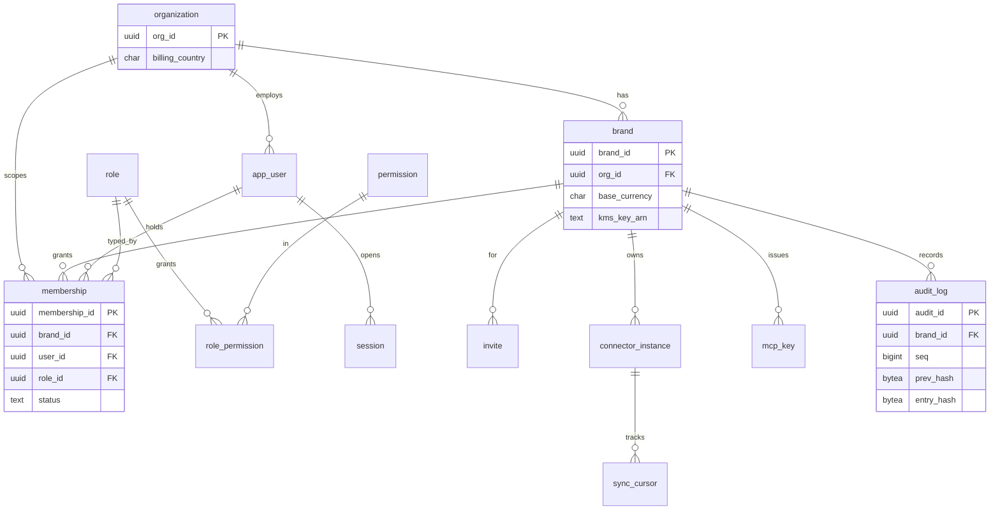

### F.4.2 Identity graph
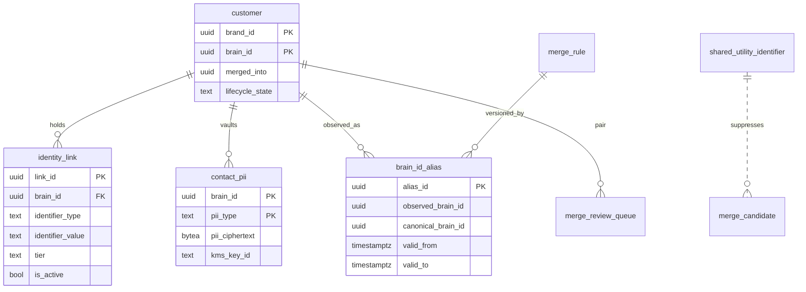

### F.4.3 Gold ledgers
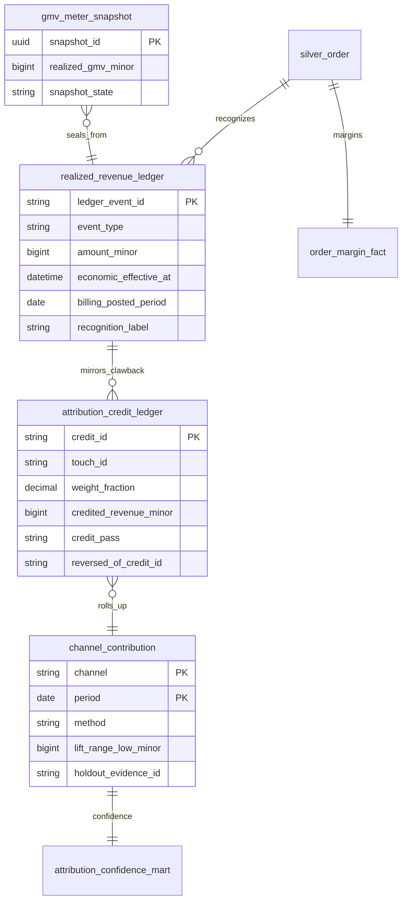

## F.5 Retention & erasure (crypto-shredding)
Per-class retention: Bronze 24mo (rolling); Silver/Gold/ledgers + audit + Decision Log = workspace life; `gmv_meter_snapshot`/invoices = workspace life (legal); consent = as law requires; sessions/invites short-TTL; digest notifications 180d. **Crypto-shredding erasure (DPDP/PDPL):** (1) crypto-shred the `contact_pii` vault row + record `pii_erasure_log`; (2) tombstone the `customer` node to an opaque surrogate Brain ID (`lifecycle_state='erased'`, identifier hashes removed, alias re-points to surrogate); (3) Bronze stays immutable but becomes non-identifying (the per-brand salt + vault keys to re-identify are destroyed); (4) StarRocks re-projects keyed-by-`brain_id` marts onto the surrogate. Aggregate reproducibility survives; individual-PII recompute is intentionally not bit-reproducible.

# Section G — Sequence Diagrams

### G.1 User registration + email verify
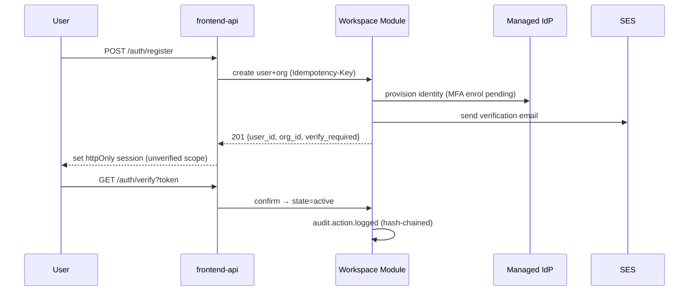

### G.2 OAuth login (Google)
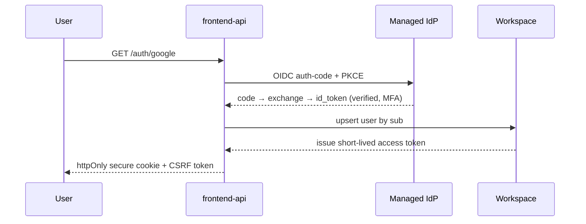

### G.3 Connector install (OAuth) + first backfill
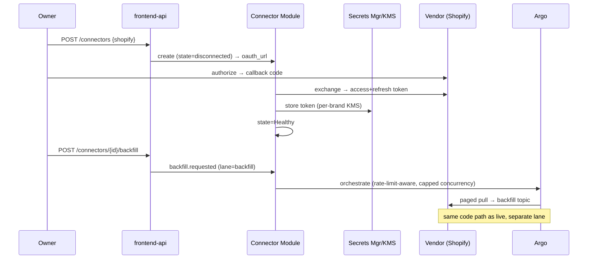

### G.4 Pixel purchase event — client+server dedup
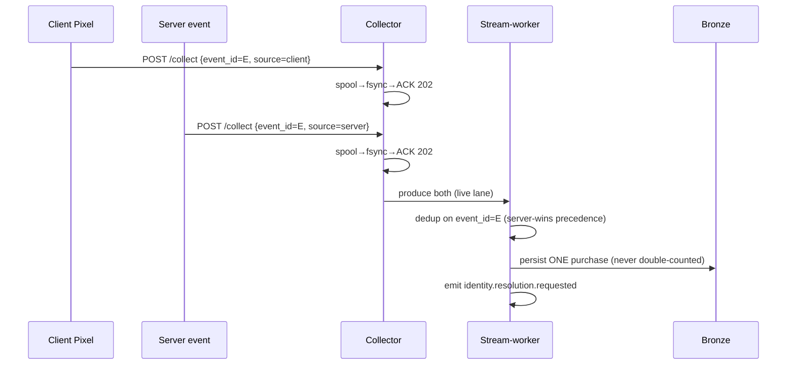

### G.5 Identity resolution (async)
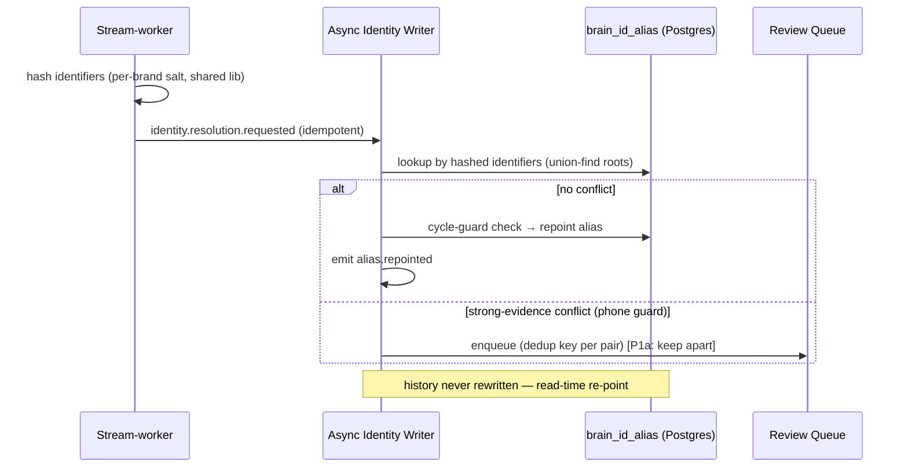

### G.6 Attribution two-pass + clawback
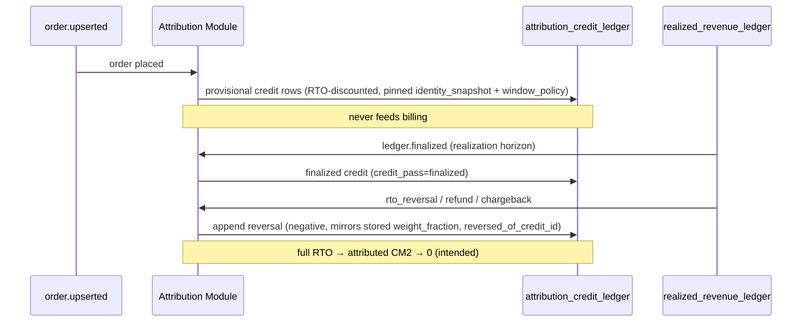

### G.7 Billing period seal
```mermaid
sequenceDiagram
  participant JOBS as Argo (off-peak)
  participant BIL as Billing Module
  participant AAPI as Analytics API
  participant SNP as gmv_meter_snapshot
  participant U as Owner
  JOBS->>BIL: trigger seal(period)
  BIL->>AAPI: read realized GMV (finalized rows, by billing_posted_period)
  AAPI-->>BIL: GMV + FX + DQ grade + cost-confidence
  BIL->>SNP: write-once snapshot (immutable)
  BIL->>BIL: fee = max(min(tier%×GMV, cap%×CM2 if Trusted), minFee)
  alt cost-confidence != Trusted
    BIL->>BIL: bill full %GMV + record flagged true-up
  end
  BIL-->>U: inspectable preview (every line → snapshot + metric_version)
  U->>BIL: confirm → invoice (GST/VAT/ZATCA)
```

### G.8 NLQ
```mermaid
sequenceDiagram
  participant U as User
  participant AI as NLQ Orchestrator
  participant LL as LiteLLM
  participant AAPI as Analytics API + Metric Engine
  participant PROV as Provenance Writer
  U->>AI: question (brand_id from session)
  AI->>LL: resolve-intent (resolution prompt, pinned hash)
  LL-->>AI: binding {metric_id?, filters, grain, range, realization_label, confidence}
  alt no metric_id OR confidence < floor OR predictive/action
    AI-->>U: ABSTAIN/CLARIFY (logged)
  else false-bind guard passes
    AI->>AAPI: compute(metric_id, filters, grain, range)
    AAPI-->>AI: number + pins (version, snapshot, DQ grade, confidence, as-of)
    AI->>LL: narrate (number read-only, untrusted-text fenced, brand_id on span)
    LL-->>AI: narration
    AI->>AI: faithfulness check (every number traces to input)
    AI->>PROV: record (model+ver, prompt_hash, binding, pins, cost/latency)
    AI-->>U: number + narration + confidence + link
  end
```

### G.9 MCP query
```mermaid
sequenceDiagram
  participant C as Brand's LLM/agent (owns the model)
  participant MCP as MCP Server (no Brain-side model)
  participant RV as Revocation (Redis denylist)
  participant AAPI as Analytics API
  C->>MCP: callTool(get_metric) [MCP key]
  MCP->>RV: check denylist (immediate revocation)
  RV-->>MCP: valid
  MCP->>MCP: scope = brand × intersection(issuer authority, requested)
  MCP->>AAPI: semantic-layer query (never physical tables, no model)
  AAPI-->>MCP: same number as dashboard
  alt limit hit
    MCP-->>C: 429 typed error {rows|rate|timeout|budget}
  else
    MCP-->>C: result (PII-minimized per issuer role)
  end
```

### G.10 Recommendation generation (deterministic, Phase 1)
```mermaid
sequenceDiagram
  participant FIN as ledger.finalized / dq.signal.raised
  participant REC as Recommendation Module
  participant AAPI as Analytics API
  participant LL as LiteLLM
  participant N as Notification Module
  FIN->>REC: trigger detectors (CM2 falling, RTO spike, tracking-dark, connector failing)
  REC->>AAPI: read registry metrics (finalized)
  REC->>REC: compute eligibility (grade/confidence/reversibility) — deterministic
  alt eligible
    REC->>LL: explain (number read-only, eligibility unwritable)
    LL-->>REC: explanation
    REC->>N: recommendation.generated (tier)
  else not eligible
    REC->>REC: suppress (never fabricate)
  end
```

### G.11 Refund / RTO clawback (dual-date)
```mermaid
sequenceDiagram
  participant SET as settlement.received / shipment.updated (RTO)
  participant SW as Stream-worker
  participant R as realized_revenue_ledger
  participant ATT as Attribution
  participant BIL as Billing
  SET->>SW: RTO/refund/chargeback event
  SW->>R: append reversal (economic_effective_at, billing_posted_period = OPEN period)
  R->>ATT: clawback → mirror credit reversal (negative, stored weights)
  R->>BIL: posts as forward adjustment in OPEN period (closed periods immutable)
  Note over R,BIL: dual-date rule — economic restatement + forward posting both hold
```

### G.12 Marketplace settlement
```mermaid
sequenceDiagram
  participant MP as Marketplace seller API
  participant CON as Connector
  participant SW as Stream-worker
  participant R as realized_revenue_ledger
  participant CC as channel_contribution
  MP->>CON: settlement report (net of referral/closing/fulfilment fees)
  CON->>SW: settlement.received
  SW->>R: finalization row net-of-fees (fees captured BEFORE realization)
  Note over SW,R: held provisional until settlement — never gross
  R->>CC: recorded as channel CONTRIBUTION (no journey, no per-touch credit)
```

### G.13 User-permission change with immediate revocation
```mermaid
sequenceDiagram
  participant O as Owner
  participant WS as Workspace Module
  participant RV as Revocation backbone (Redis denylist)
  participant GW as Every gateway (Analytics/MCP/frontend-api)
  participant T as Target user/MCP key
  O->>WS: remove permission / revoke
  WS->>RV: synchronous denylist write + fan-out
  RV->>RV: invalidate sessions + MCP keys + integration tokens
  Note over WS,RV: access-REMOVING = synchronous — access-ADDING = next action
  T->>GW: next protected action
  GW->>RV: check denylist (every action)
  RV-->>GW: denied → 401/403 (immediate)
  WS->>WS: audit.action.logged (hash-chained)
```

### G.14 Data export (self-serve / DSAR)
```mermaid
sequenceDiagram
  participant U as Owner/BrandAdmin
  participant CORE as Export Module
  participant JOBS as Argo
  participant S3 as S3 (signed URL)
  U->>CORE: POST /export {scope: report|full_brand|dsar}
  CORE->>JOBS: async export job (large → async)
  JOBS->>S3: write open-format export (PII rules per role/scope)
  JOBS-->>U: ready notification + time-boxed signed URL
  Note over CORE,S3: full_brand = raw+normalized+Decision Log — DSAR = data-subject access
```

### G.15 AI recommendation approval (Phase 1 human-in-the-loop)
```mermaid
sequenceDiagram
  participant U as Operator
  participant HOME as Home/Command Center
  participant REC as Recommendation Module
  participant DLOG as Decision Log
  HOME->>REC: render Top-3 (recommendation contract)
  U->>HOME: Approve | Reject | Edit | Ask-why
  HOME->>DLOG: log response (append-only)
  alt Approve
    HOME->>REC: queue action (recommend-only in P1 → manual execution)
  else Reject
    HOME->>DLOG: record fallback + reason (training signal, not re-surfaced unless conditions change)
  end
  Note over REC,DLOG: 7/30-day outcome written back later
```

# Section H — Security Architecture

## H.1 Authentication
```mermaid
sequenceDiagram
  participant U as User (Next.js)
  participant IdP as Managed IdP (OIDC, MFA)
  participant API as core-monolith
  participant R as Redis denylist
  U->>IdP: OIDC auth-code + PKCE, MFA challenge
  IdP-->>U: id_token + access(JWT,15m) + refresh(7d, rotating)
  U->>API: request + Bearer access
  API->>API: verify sig (IdP JWKS), exp, aud, iss
  API->>R: GET denylist:{jti} AND denylist:sess:{sid}
  R-->>API: miss → proceed / hit → 401 revoked
  Note over U,IdP: refresh rotation — reuse of a rotated refresh ⇒ revoke whole family
```
- **Tokens:** access JWT TTL **15 min**; refresh **7 day rotating** (reuse-detection revokes the family). Claims: `sub, brand_id[], active_brand, role, perms[], sid, jti, amr(mfa)`.
- **MFA** mandatory day one (IdP-enforced); **step-up MFA** for Owner-only actions (billing, auto-execute toggle, brand creation) via `acr` claim check.
- **Sessions:** durable record in Postgres (`sid`); idle timeout 30m, absolute 12h.

## H.2 Authorization — RBAC permission model (4 roles)
Permission (not label) gates every action; enforced in **JWT claims + Postgres RLS + MCP scopes**, never in app code.

| Permission | Owner | Brand Admin | Manager | Analyst |
|---|:--:|:--:|:--:|:--:|
| `brand.create` / `brand_admin.create` | ✓ | | | |
| `billing.read` / `billing.manage` | ✓ | r | | |
| `autoexecute.toggle` (P4) | ✓ | | | |
| `integration.connect` / `.disconnect` | ✓ | ✓ | | |
| `user.invite` / `role.assign` | ✓ | ✓ | | |
| `metric.read` / `dashboard.read` / `recommendation.read` | ✓ | ✓ | ✓ | ✓ |
| `recommendation.execute` (P4) | ✓ | ✓ | ✓ | |
| `export.create` / `dsar.export` | ✓ | ✓ | ✓ | |
| `mcp.key.issue` | ✓ | ✓ | | |
| `customer.pii.read` | ✓ | ✓ | scoped | minimized |

RLS sets the floor (`USING (brand_id = current_setting('app.brand_id')::uuid)`; app connects as a non-owner role; `BYPASSRLS` never granted; missing setting → NULL → zero rows). Middleware asserts the setting non-null before any query (missing = hard 500, never default-to-all).

**Service-to-service / MCP:** NetworkPolicy (§K) + IRSA per ServiceAccount are the primary in-cluster controls; mTLS on the two sensitive hops (core↔StarRocks, core↔LiteLLM). Full service mesh (Istio) is deferred — overkill for 3 deployables; revisit at Identity-service extraction. MCP scope = `brand_id × intersection(issuer_authority, requested_scopes)`, scope + denylist + tenant-context checked on every tool call.

## H.3 The revocation backbone (makes "immediate" true against JWTs)
```
Revocation event (logout / role change / disable user / rotate MCP key / disconnect integration)
  → synchronous write SET denylist:{jti|sid|mcp_key|integration_token} EX <residual_ttl>
  → fan-out via the audit topic to warm every gateway's cache
Every protected action (REST, MCP tool, NLQ) → O(1) Redis lookup BEFORE authz.
  Access-ADD  → applied on next action (re-read perms).  Access-REMOVE → denylist write is the source of truth.
```
Denylist keys are tenant-scoped and TTL'd to the token's residual life so the set stays bounded. MCP keys and integration OAuth tokens are first-class revocable principals on the same backbone.

## H.4 Encryption & secrets
| Layer | Control |
|---|---|
| In transit (edge) | TLS 1.2+ at CloudFront/ALB (ACM); HSTS |
| In transit (internal) | TLS via VPC endpoints; mTLS on core↔StarRocks, core↔LiteLLM |
| At rest — RDS | SSE `brain/cmk-rds`; `rds.force_ssl=1` |
| At rest — S3 lakehouse | SSE-KMS, **per-brand DEK** (envelope) |
| At rest — audit WORM | SSE-KMS `brain/cmk-audit` + S3 Object Lock |
| At rest — Redis | encryption at rest + in-transit (AUTH token) |
| Secrets | Secrets Manager, `brain/cmk-secrets`, IRSA-fetched, never in env files/logs |
| Rotation | CMK auto-rotate yearly; per-brand DEK quarterly re-wrap (lazy re-encrypt) |

**KMS hierarchy:** `brain/cmk-root` envelope-wraps per-brand DEKs (stored wrapped in `brand_keyring`; the **crypto-shred target**) + `cmk-rds` / `cmk-audit` / `cmk-secrets`. Identity-service per-brand salts use a separate DEK path with a KMS policy granting decrypt only to the identity ServiceAccount's IRSA role, scoped by `kms:EncryptionContext:brand_id`.

## H.5 Compliance & tenant isolation
- **Consent** at-capture (4 categories, fail-closed, snapshot rides the event). The **single send/consent chokepoint** (one module, the only egress door) atomically enforces channel consent + `ai_processing` + withdrawal tombstone + DND/NCPR + DLT templates + the 9am–9pm window (incl. CAPI passback). Withdrawal propagates <15m via tombstone; Bronze never edited.
- **Erasure:** crypto-shredding (§F.5).
- **Hash-chained WORM audit:** §F.1.2 mechanism; hourly checkpoint to Object Lock COMPLIANCE; nightly chain-verifier; a break is a P1 security alert. *(Object Lock COMPLIANCE is irreversible — confirm the legal retention period before go-live; 7y placeholder.)*
- **Residency:** in-region by default; cross-border paths (incl. model providers) on the sub-processor registry under the DPA; the AI gateway region-pins providers.
- **Tenant-isolation enforcement (seams, not just stores):**

| Seam | Enforcement | CI negative test |
|---|---|---|
| Stream | `brand_id` envelope header asserted before processing (partition keys are brand-prefixed composites, §6.6 — isolation is the envelope + RLS, not the key); consumer refuses a message w/o tenant ctx | wrong-tenant message → fail-closed |
| Cache | single key-builder prefixes `brand_id`; raw key construction lint-banned; prompt-cache keys include `brand_id` | cross-brand prompt-cache hit → assert miss |
| Postgres | RLS + non-owner role + non-null assertion | forgotten WHERE → assert zero rows |
| StarRocks | row policies + NetworkPolicy (only `core`/`jobs` may connect) | non-core pod → connection refused |
| Identity service | plaintext in-memory only; per-brand-KMS salt; cross-brand compare structurally refused | same email, two brand ctx → uncorrelatable hashes; no-PII-in-logs |
| Logs/traces | every span/log carries `brand_id`, PII-redacted | CI log scan for PII patterns |

These run in the **Phase-1a blocking** isolation negative-test suite.

# Section I — Observability Architecture

## I.1 Pipeline (OTel → Grafana Cloud)
```mermaid
flowchart LR
  subgraph cluster[EKS]
    A["App pods (OTel SDK)<br/>traces+metrics+logs, brand_id on every span"]
    D["OTel Collector DaemonSet<br/>batch · PII-redact · tail-sampling"]
    G["OTel Collector gateway"]
  end
  A -->|OTLP 4317| D --> G -->|OTLP TLS| GC
  subgraph GC[Grafana Cloud ap-south-1]
    M[Mimir metrics]; L[Loki logs]; T[Tempo traces]
  end
  M & L & T --> DASH[Dashboards + Alerts]
  M --> SP["Public status surface (measured collector availability)"]
  DASH --> AM[Alertmanager → 3 notification tiers + PagerDuty]
```
A **PII-redaction processor** runs in the OTel Collector before export — redaction enforced in the pipeline, not trusted to app code.

## I.2 SLI / SLO / error-budget table
| SLO | SLI | Target | Window | Error budget | Burn alert |
|---|---|---|---|---|---|
| Collector accept+ack | acked / total collect | **99.95%** | 30d | 21.6 min/mo | multiwindow 14.4×(1h)+6×(6h) |
| Surfaces availability | non-5xx Analytics-API / total | **99.9%** | 30d | 43.2 min/mo | 14.4× / 6× |
| Surfaces latency | p95 `GET /metric/*` | 99% < 800ms | 30d | — | p95>800ms 10m |
| Data freshness (live) | event→queryable lag p95 | <60s (hot, labeled) | 1d | — | >120s 10m |
| Data freshness (finalized) | settlement→finalized | within horizon+grace | — | — | breach |
| Parity convergence | StarRocks vs Iceberg recompute (billing metrics) | **0 tolerance** | hourly | 0 | any drift = P1 |
| Identity match rate | resolved / resolvable | ≥ activation gate | 1d | — | below target |
| Redpanda live-lane lag | consumer group lag | <5000 msgs | — | — | >5000 5m |

## I.3 Alert rules (representative)
```yaml
groups:
- name: brain-slo
  rules:
  - alert: CollectorErrorBudgetFastBurn
    expr: (1 - (sum(rate(collector_acks_total{code="ack"}[1h])) / sum(rate(collector_requests_total[1h])))) > (14.4 * 0.0005)
    for: 2m
    labels: { severity: page, slo: collector }
  - alert: ParityDriftBillingMetric            # zero-tolerance → freeze billing seal
    expr: parity_convergence_abs_diff_minor{metric_class="billing"} > 0
    for: 0m
    labels: { severity: page, slo: parity }
  - alert: HotRowReachedDecisionEndpoint       # decision-path purity
    expr: increase(analytics_decision_path_violation_total[5m]) > 0
    for: 0m
    labels: { severity: page, slo: purity }
  - alert: AuditChainBreak
    expr: increase(audit_chain_verify_failures_total[1h]) > 0
    for: 0m
    labels: { severity: page, category: security }
  - alert: CrossTenantAccessDenied             # spike = attack/bug, not noise
    expr: increase(tenant_context_violation_total[5m]) > 0
    for: 0m
    labels: { severity: page, category: security }
  - alert: NlqFalseBindNonZero
    expr: increase(nlq_false_bind_total[1h]) > 0
    for: 0m
    labels: { severity: page, category: ai }
```

## I.4 Specialized monitoring
- **AI** (`gen_ai.*` spans): token/cost per brand, p95 latency, eval-pass-rate, **false-bind-rate (→0)**, injection-block count, gateway fallback depth.
- **Data quality:** volume anomaly, schema-violation rate, client-vs-server purchase match rate, **tracking-dark**, freshness per connector.
- **Connector:** the seven health states, freshness clock, OAuth-token-expiry countdown, rate-limit backoff, settlement-reconciliation gap.
- **Billing:** finalized-GMV meter vs sealed snapshot, true-up backlog, seal success, dunning state.
- **Security:** denylist hit-rate, audit-chain verify, WAF block-rate, cross-tenant counter, active staff-access grants.

# Section J — Cloud Architecture (AWS)

## J.1 Account & network topology
| Account | Purpose | VPC CIDR |
|---|---|---|
| `brain-staging` | staging EKS + RDS + stateful | `10.20.0.0/16` |
| `brain-prod` | prod EKS + RDS + stateful | `10.10.0.0/16` |
| (later) `brain-shared-services` | ECR, central logging, Terraform state | — |

Per VPC, 3 AZs: **public** (ALB, NAT 1/AZ), **private-app** (EKS nodes via Karpenter, LiteLLM, StarRocks), **private-data** (RDS, ElastiCache, VPC-endpoint ENIs — no NAT egress). EKS reaches AWS via **VPC endpoints** (S3/DynamoDB gateway; ECR/STS/Secrets Manager/KMS/CloudWatch/Glue interface) so collector↔KMS/S3 never traverses NAT or the public internet.

```mermaid
flowchart TB
  R53[Route53] --> CF[CloudFront] --> WAF[AWS WAF<br/>rate-based + bot + OWASP CRS]
  subgraph vpc["VPC ap-south-1 (prod 10.10.0.0/16)"]
    subgraph pub["Public x3 AZ"]
      ALB[ALB internet-facing<br/>TLS1.3, ACM]; NAT[NAT GW x3]
    end
    subgraph appsub["Private-app x3 AZ"]
      subgraph eks["EKS (1 cluster, namespaced)"]
        COL[ns: collector]; CON[ns: consumers]; CORE[ns: core]
        JOBS[ns: jobs]; AI[ns: ai]; OBS[ns: observability]; SR[StarRocks FE/BE]
      end
    end
    subgraph datasub["Private-data x3 AZ"]
      RDS[(RDS Postgres Multi-AZ, PITR, RLS)]; REDIS[(ElastiCache Redis cluster-mode)]
      VPE[VPC Endpoints: ECR/STS/SM/KMS/Logs/Glue]
    end
  end
  WAF --> ALB --> COL & CORE
  COL & CON & CORE & JOBS & AI --> NAT
  CORE --> RDS & REDIS; COL --> REDIS; CON --> SR; JOBS --> SR; CORE --> SR
  eks -.IRSA via STS.-> VPE
  subgraph mgd["Managed (in-region)"]
    RP[Redpanda Cloud PrivateLink]; GCL[Grafana Cloud]; IDP[Managed IdP]
  end
  COL & CON & JOBS --> RP; OBS --> GCL; CORE --> IDP
  subgraph s3["S3 (per-brand prefix)"]
    LH[(brain-lakehouse-prod<br/>bronze/brand=ID/… SSE-KMS per-brand DEK)]
    AUD[(brain-audit-worm-prod<br/>Object Lock COMPLIANCE)]
    SPOOL[(brain-spool-overflow-prod)]
  end
  GLUE[Glue Catalog]; CON --> LH; RP -. topic-materialization .-> LH; LH <--> GLUE; CORE --> AUD
  subgraph kms["KMS"]
    CMK[cmk-root]; DK[per-brand DEKs]
  end
  CMK --> DK; LH -.SSE-KMS.-> DK; RDS & AUD -.SSE.-> CMK
  SM[Secrets Manager] --> CMK; ECR[ECR scan-on-push, immutable tags]
```

## J.2 S3 layout & KMS
```
s3://brain-lakehouse-prod/bronze/brand=<id>/event_date=YYYY-MM-DD/   # SSE-KMS per-brand DEK, 24-mo lifecycle
s3://brain-lakehouse-prod/{bronze_quarantine,silver,gold}/...
s3://brain-audit-worm-prod/checkpoints/YYYY/MM/DD/<chain>.json       # Object Lock COMPLIANCE, 7y placeholder
s3://brain-spool-overflow-prod/                                       # collector spool overflow
s3://brain-tfstate-prod/                                              # versioned, MFA-delete
```
All buckets: `BlockPublicAccess=ALL`, versioning on, TLS-only policy. **CRR is written in Terraform but `enabled=false`** (single-region invariant) — the one-flag DR lever for Phase-5 multi-region. **KMS:** per-brand isolation = **envelope DEKs under a small CMK set** (ADR-013), not one CMK per brand; crypto-shred = delete the wrapped DEK row.

# Section K — Kubernetes Architecture

## K.1 Namespaces & node pools
| Namespace | Workloads | Node pool (Karpenter) |
|---|---|---|
| `collector` | Collector (Fastify + disk WAL spool) | `collector-pool` (c-family, local NVMe) |
| `consumers` | stream-worker (live), stream-worker-backfill, identity-writer | `compute-pool` |
| `core` | core-monolith | `compute-pool` |
| `jobs` | Argo controller; dbt/StarRocks-load/parity/backfill/retention/starrocks-rebuild | `spot-batch-pool` (Spot, off-peak) |
| `ai` | LiteLLM (≥2 replicas HA) | `compute-pool` |
| `observability` | OTel Collector DaemonSet+gateway | system |
| `data` | StarRocks FE/BE StatefulSets, Apicurio | `starrocks-pool` (r-family, gp3/io2) |
| `argocd`/`kube-system` | platform | system |

Cluster-wide: `default-deny` NetworkPolicy per namespace; `restricted` Pod Security Standard; Gatekeeper/Kyverno admission (ECR-only registry, no `:latest`, mandatory requests/limits).

## K.2 Autoscaling
| Workload | Metric | min/max |
|---|---|---|
| collector | RPS (custom) + CPU 60% | 3 / 40 (sale-day: scale-up 0s, scale-down 300s) |
| stream-worker live | **KEDA Redpanda lag** (threshold 5000) | 2 / =partitions |
| stream-worker backfill | KEDA lag, **capped max** (can't starve live) | 0 / 6 |
| core-monolith | CPU 65% + RPS | 3 / 20 |
| LiteLLM | CPU 70% + concurrent-requests | 2 / 12 |
| StarRocks BE | **no HPA** (stateful) — vertical + resource groups | fixed 3 |
KEDA (lag-based, scale-to-zero backfill) + HPA (request-driven); Karpenter consolidation on; `do-not-disrupt` on StarRocks + identity-writer.

## K.3 Reference manifests — Collector (the 99.95% workload)
```yaml
apiVersion: apps/v1
kind: Deployment
metadata: { name: collector, namespace: collector }
spec:
  replicas: 3
  selector: { matchLabels: { app: collector } }
  template:
    metadata: { labels: { app: collector } }
    spec:
      serviceAccountName: collector-sa
      terminationGracePeriodSeconds: 45            # drain spool → ack inflight before exit
      topologySpreadConstraints:
        - { maxSkew: 1, topologyKey: topology.kubernetes.io/zone, whenUnsatisfiable: DoNotSchedule,
            labelSelector: { matchLabels: { app: collector } } }
      containers:
        - name: collector
          image: <acct>.dkr.ecr.ap-south-1.amazonaws.com/collector@sha256:<digest>   # immutable in prod
          ports: [{ containerPort: 8080, name: http }]
          resources: { requests: { cpu: "500m", memory: "512Mi" }, limits: { cpu: "2", memory: "1Gi" } }
          volumeMounts: [{ name: spool, mountPath: /var/spool/brain }]   # disk WAL = the durability contract
          startupProbe:   { httpGet: { path: /health/startup, port: http }, failureThreshold: 30, periodSeconds: 2 }
          readinessProbe: { httpGet: { path: /health/ready,   port: http }, periodSeconds: 5, failureThreshold: 2 }
          livenessProbe:  { httpGet: { path: /health/live,    port: http }, periodSeconds: 10, failureThreshold: 3 }
          lifecycle: { preStop: { exec: { command: ["/bin/drain-spool.sh"] } } }
      volumes:
        - name: spool
          ephemeral:
            volumeClaimTemplate:
              spec: { accessModes: ["ReadWriteOnce"], storageClassName: gp3-nvme,
                      resources: { requests: { storage: 20Gi } } }
---
apiVersion: autoscaling/v2
kind: HorizontalPodAutoscaler
metadata: { name: collector, namespace: collector }
spec:
  scaleTargetRef: { apiVersion: apps/v1, kind: Deployment, name: collector }
  minReplicas: 3
  maxReplicas: 40
  metrics: [{ type: Pods, pods: { metric: { name: http_requests_per_second },
              target: { type: AverageValue, averageValue: "800" } } }]
  behavior:
    scaleUp:   { stabilizationWindowSeconds: 0,   policies: [{ type: Percent, value: 100, periodSeconds: 15 }] }
    scaleDown: { stabilizationWindowSeconds: 300, policies: [{ type: Percent, value: 25,  periodSeconds: 60 }] }
---
apiVersion: policy/v1
kind: PodDisruptionBudget
metadata: { name: collector, namespace: collector }
spec: { minAvailable: 2, selector: { matchLabels: { app: collector } } }
---
apiVersion: v1
kind: ServiceAccount
metadata: { name: collector-sa, namespace: collector,
  annotations: { eks.amazonaws.com/role-arn: arn:aws:iam::<acct>:role/brain-collector-irsa } }
---
apiVersion: networking.k8s.io/v1
kind: NetworkPolicy
metadata: { name: default-deny, namespace: collector }
spec: { podSelector: {}, policyTypes: [Ingress, Egress] }
```

## K.4 NetworkPolicy — enforcing "Analytics API is the sole DB read path"
```yaml
# core may reach StarRocks; the StarRocks NetworkPolicy allows ingress ONLY from core + jobs
apiVersion: networking.k8s.io/v1
kind: NetworkPolicy
metadata: { name: core-allow, namespace: core }
spec:
  podSelector: { matchLabels: { app: core-monolith } }
  policyTypes: [Ingress, Egress]
  ingress:
    - from: [{ namespaceSelector: { matchLabels: { kubernetes.io/metadata.name: kube-system } } }]  # ALB
      ports: [{ port: 8080 }]
  egress:
    - to: [{ ipBlock: { cidr: 10.10.40.0/24 } }]   # RDS + Redis (private-data) only
      ports: [{ port: 5432 }, { port: 6379 }]
    - to: [{ namespaceSelector: { matchLabels: { kubernetes.io/metadata.name: data } },
            podSelector: { matchLabels: { app: starrocks-fe } } }]
      ports: [{ port: 9030 }]                       # core is the ONLY allowed StarRocks reader
    - to: [{ namespaceSelector: { matchLabels: { kubernetes.io/metadata.name: ai } } }]
      ports: [{ port: 4000 }]                       # LiteLLM
    - to: []
      ports: [{ port: 443 }, { port: 53, protocol: UDP }]   # KMS/SM/S3 endpoints, DNS
```

## K.5 Secrets (external-secrets + IRSA)
```yaml
apiVersion: external-secrets.io/v1beta1
kind: ExternalSecret
metadata: { name: core-secrets, namespace: core }
spec:
  refreshInterval: 1h
  secretStoreRef: { name: aws-sm, kind: SecretStore }   # SecretStore uses IRSA — no static creds
  target: { name: core-secrets }
  data:
    - { secretKey: db-url,            remoteRef: { key: brain/prod/core/db-url } }
    - { secretKey: idp-client-secret, remoteRef: { key: brain/prod/core/idp } }
    - { secretKey: litellm-master,    remoteRef: { key: brain/prod/ai/litellm } }
```

## K.6 Resource allocation (prod baseline)
| Service | req CPU/mem | limit CPU/mem | replicas |
|---|---|---|---|
| collector | 500m/512Mi | 2/1Gi | 3–40 |
| stream-worker live | 1/1Gi | 2/2Gi | 2–N(partitions) |
| stream-worker backfill | 1/1Gi | 2/2Gi | 0–6 |
| identity-writer | 750m/1Gi | 1.5/2Gi | 2 (do-not-disrupt) |
| core-monolith | 1/1.5Gi | 3/3Gi | 3–20 |
| LiteLLM | 500m/512Mi | 2/1Gi | 2–12 |
| StarRocks FE | 2/8Gi | 4/16Gi | 3 |
| StarRocks BE | 4/16Gi | 8/32Gi | 3 |

# Section L — CI/CD Architecture

```mermaid
flowchart LR
  PR["PR on trunk (short-lived branch)"] --> CI
  subgraph CI["GitHub Actions — OIDC→AWS, no static keys"]
    L[lint + typecheck] --> U[unit]
    U --> ISO[isolation negative-tests<br/>stream/cache/RLS/StarRocks/MCP/identity]
    ISO --> PAR[parity CI golden-fixture<br/>+ decision-path purity]
    PAR --> B[docker build] --> SC[scan: trivy + secrets + SAST]
    SC --> SG["sign: cosign keyless (+ SBOM later)"] --> PUSH[push ECR immutable digest]
  end
  PUSH --> HELM["Helm values bump (image digest pin)"] --> GIT["commit to gitops repo (env overlay)"]
  GIT --> ARGO[ArgoCD sync]
  ARGO --> STG[staging account] -->|smoke + manual gate| PRD[prod account]
  ARGO -. health-probe fail .-> RB[auto-rollback to last healthy]
```

- **Git/branching:** trunk-based, short-lived feature branches, PR-gated; the gitops repo is the source of truth for what runs (ArgoCD reconciles).
- **Environments:** staging + prod as **separate AWS accounts** (hard blast radius); dev = ephemeral namespaces / local compose; prod sync requires manual promotion after staging smoke.
- **Phased CI gates:**

| Phase | Blocking gates |
|---|---|
| **1a (non-negotiable)** | lint, typecheck, unit, **tenant-isolation negative-tests at every layer incl. StarRocks + MCP**, **parity CI golden-fixture**, **finalized-only / decision-path-purity assertion**, **eligibility-unwritable contract test** (pulled to 1a), container build, trivy scan, smoke |
| **1c (arrive with surfaces)** | NLQ resolution eval (**false-bind→0**) + injection golden-set + narration-faithfulness; a11y (WCAG 2.2 AA, status-never-colour-only) |
| **Later** | supply-chain SBOM + SLSA provenance + cosign signing enforced at admission |

- **Deployment & rollback:** ArgoCD `Application` with `automated: {prune, selfHeal}`, `revisionHistoryLimit: 10`; rollback = ArgoCD revision rollback (Git revert or `argocd app rollback`), auto-triggered on K8s health-probe failure during sync. **Canary / percentage-rollout / 60s kill switch is Phase-4** (with autonomy) — not built before there is autonomy to gate. *(A lightweight per-brand feature-flag package for ops kill-switches + beta gating is Phase-1 — doc 05 §1A #8.)*

```yaml
apiVersion: argoproj.io/v1alpha1
kind: Application
metadata: { name: core-prod, namespace: argocd }
spec:
  project: brain-prod
  source: { repoURL: git@github.com:brain/gitops.git, path: overlays/prod/core, targetRevision: main }
  destination: { server: https://kubernetes.default.svc, namespace: core }
  syncPolicy:
    automated: { prune: true, selfHeal: true }
    retry: { limit: 3, backoff: { duration: 30s, factor: 2 } }
  revisionHistoryLimit: 10
```

# Section M — Disaster Recovery Architecture

## M.1 RPO/RTO per component
| Component | Backup mechanism | RPO | RTO | Restore path |
|---|---|---|---|---|
| RDS Postgres (control plane, identity graph, billing, audit) | Multi-AZ + **PITR (5-min WAL)** + daily snapshot (35d) | **≤5 min** | ≤1h | PITR restore or AZ failover (~60–120s) |
| S3 lakehouse (Bronze SoR) | versioning; 11-nines; CRR rule present-but-disabled | ~0 | n/a | object versioning |
| WORM audit | Object Lock COMPLIANCE + versioning | ~0 | n/a | immutable by design |
| Redpanda Cloud | managed multi-AZ; spool is the upstream safety net | ≤ spool flush | provider RTO | managed failover; replay from offset |
| StarRocks (serving) | **derived — rebuild from Iceberg/Bronze**, not backed up | n/a | 2–4h | `starrocks-rebuild` Argo workflow (dbt full-refresh + load) |
| ElastiCache Redis | cache + denylist (re-derivable) | tolerant | minutes | re-warm; denylist rebuilt from audit topic |
| EKS workloads | **GitOps — no state in cluster** | n/a | ≤30m | Terraform apply + ArgoCD re-sync |
| Collector spool | local NVMe WAL + S3 overflow | ≤ flush | minutes | replay WAL on restart |

**"No committed brand data ever permanently lost"** holds because the durability contract lives in the spool + the 24-mo immutable Bronze.

## M.2 Backup & restore specifics
- **RDS:** PITR (WAL→S3, ~5-min) meets RPO≤15m with margin; daily snapshots 35d; cross-region snapshot copy is the multi-region trigger lever (off at launch).
- **S3:** versioning on all buckets; lifecycle expiry only on Bronze (24mo) + spool-overflow; **CRR Terraform rule `enabled=false`** until Phase-5.
- **StarRocks rebuild-from-Iceberg:** StarRocks is explicitly *derived*; DR = re-run dbt over Bronze/Iceberg + load. **The `starrocks-rebuild` Argo workflow + a quarterly rebuild drill are a Phase-1a deliverable** (StarRocks is the only self-operated stateful store without managed failover).
- **Secrets/KMS:** the **CMK + per-brand wrapped-DEK rows in RDS are the crown jewels** — their loss is permanent data loss (intentional for crypto-shred, catastrophic if accidental), so RDS backup integrity is the gating DR control; a quarterly restore drill validates DEK recoverability.

## M.3 Restore runbooks (templates)
- **RB-1 RDS PITR (RTO≤1h):** declare incident → freeze writes (core read-only flag) → `restore-db-instance-to-point-in-time --target-time <T-5m>` → validate (chain-verify audit, RLS smoke, ledger counts) → repoint `core-secrets/db-url` (ESO refresh → rolling restart) → verify decision-path purity + parity on spine metrics → unfreeze.
- **RB-2 EKS recovery (RTO≤30m):** Terraform apply EKS → bootstrap ArgoCD → sync all `Application`s (no state in cluster) → re-attach IRSA → ExternalSecrets re-fetch → smoke (collector ack, metric read).
- **RB-3 StarRocks rebuild:** trigger Argo `starrocks-rebuild` → dbt full-refresh over Bronze → load → parity-monitor confirms convergence → re-enable serving.

## M.4 Incident response
| Sev | Definition | Examples | Response |
|---|---|---|---|
| **P0** | cross-brand leak / data loss / billing-incorrect-and-sent | isolation breach, wrong finalized number on an issued invoice, audit-chain tamper | IC paged; war room; customer + (if breach) regulator notification per DPDP/PDPL clock; mandatory postmortem |
| **P1** | major outage / SLO fast-burn / billing-metric parity drift | collector <99.95% fast-burn, Analytics API down, parity drift | IC paged; mitigate first |
| **P2** | degraded but contained | single connector failed, backfill lag, non-billing parity drift | on-call, business hours if off-peak |
| **P3** | minor / cosmetic | dashboard glitch | ticket |

**Roles:** Incident Commander (single decision-maker) · Comms Lead (status surface + customer/regulator) · Ops Lead (runbooks). **Flow:** detect → declare + assign IC → mitigate → resolve → blameless postmortem → lessons into the runbook/alert library. A cross-brand leak is **always P0** regardless of size. Staff break-glass during incidents routes through the time-boxed, customer-consented, hash-chained grant.

# Section N — AI Architecture (expanded)

## N.1 Component diagram
```mermaid
flowchart TB
  subgraph callers["Callers (never touch a model directly)"]
    DASH["Dashboards / Morning Brief"]; NLQ_UI["NLQ chat surface"]
    BRAND_LLM["Brand's own LLM (ChatGPT/Claude/Cursor/agent)"]
  end
  subgraph core["Core monolith — AI modules (TypeScript)"]
    NLQE["NLQ Engine (Intent Resolver → Metric Binder → False-bind Guard)"]
    RECO["Recommendation Engine (deterministic threshold detectors, P1)"]
    ENV["Untrusted-text Envelope (single fenced-block fn)"]
    PROV["Provenance Writer → Decision Log (hash-chained)"]
    MCP["MCP Server (read-only governed tools)"]
    AAPI["Analytics API + metric engine (in-proc lib)"]
  end
  subgraph gw["AI Gateway zone (separate deployable, stateless HA ≥2)"]
    LITELLM["LiteLLM (OpenAI-format; no state)"]; ROUTER["Model Router (tier→pool→eval-gated)"]
    PROVMGR["Provider Manager (keys, region pin, fallback)"]
  end
  subgraph state["Externalized state"]
    REDIS["Redis (tenant-scoped): budget + rate-limit + prompt-cache"]
    PROMPTREG["Prompt Registry (content-hash; git+Postgres)"]; SECRETS["Secrets Manager"]; DLOG["Decision Log (PG + S3 WORM)"]
  end
  subgraph evalzone["Eval Engine (CI + scheduled)"]
    EVAL["resolution · injection · faithfulness · eligibility-unwritable"]; GOLDEN["Golden-sets (versioned)"]
  end
  CLAUDE["Claude"]; GPT["GPT"]; GEMINI["Gemini"]
  DASH --> NLQE; NLQ_UI --> NLQE; BRAND_LLM -->|MCP transport| MCP
  NLQE --> ENV; NLQE --> AAPI; RECO --> AAPI; MCP --> AAPI
  ENV --> LITELLM; NLQE -->|narrate| LITELLM; RECO -->|explain| LITELLM
  LITELLM --> ROUTER --> PROVMGR --> CLAUDE & GPT & GEMINI
  LITELLM <--> REDIS; LITELLM --> PROMPTREG; PROVMGR --> SECRETS
  NLQE --> PROV; RECO --> PROV; LITELLM -->|cost/tokens| PROV; PROV --> DLOG
  EVAL --> GOLDEN; EVAL -. CI ship gate .-> PROMPTREG & NLQE & MCP
  classDef nomodel fill:#e8f4ff,stroke:#0366d6
  class MCP,AAPI nomodel
```
**MCP + Analytics API are model-free** (highlighted). The **untrusted-text envelope is the only path** free text reaches LiteLLM (lint + contract-test enforced).

## N.2 Model routing — effort-tier table
| Task | Tier | Eligible pool | Eval gates the pool must pass |
|---|---|---|---|
| Metric resolution (question→metric_id+filters+grain+range) | small | Haiku / GPT-mini / Gemini Flash | Resolution (accuracy + **false-bind→0** + decline + floor) + Injection |
| NLQ narration | small | Haiku / GPT-mini / Gemini Flash | Narration-faithfulness + Injection + Eligibility-unwritable |
| Recommendation explanation | small | Haiku / GPT-mini / Gemini Flash | Narration-faithfulness + Eligibility-unwritable |
| Ambiguous/multi-hop diagnostic narration (rare) | frontier | Opus/Sonnet / GPT-4.x / Gemini Pro | Resolution + Narration-faithfulness + Injection |
| Threshold detection, eligibility, all arithmetic | **deterministic** | *no model* (engine + detectors) | parity CI only |

`routing_key = {brand_id, task, effort_tier, prompt_template_hash, residency_zone}`. The router selects only from the pool that passed *that task's* gate at the pinned hash. **Fallback chain:** primary → same-tier same-region eval-passing → alternate provider same-region → (narration) deterministic number + "narration unavailable" / (resolution) **abstain → clarify, never escalate tier to guess**. Cost relationship enforced (deterministic ≫ statistical ≫ small ≫ frontier, ~1:100:1k:10k).

## N.3 Per-brand budgets, exhaustion, residency
Redis: `ratelimit:{brand_id}:{window}` (token bucket) + `budget:{brand_id}:{period}` (spend counter); atomic Lua check-and-reserve to avoid stampede over-spend; prompt-cache keys include `brand_id` (cross-brand hits forbidden). **Exhaustion:** NLQ/narration → deterministic number + `narration_status:"unavailable_budget"`; recommendation → contract without prose; MCP → unaffected (no Brain model in path; only the brand's own LLM budget applies); all exhaustion = typed `BUDGET_EXHAUSTED` + audit, never silent partial. **Residency:** Provider Manager holds `model_id→region`; each provider is a declared sub-processor; `residency_zone` filters the pool so PII-bearing prompts never cross a forbidden border (the envelope is also the redaction point).

## N.4 Prompt registry
Templates in git (source of truth) mirrored to Postgres; **version = content hash** (sha256 of normalized template + model params + tool-schema refs), immutable. Pinned at call time by hash (no runtime "latest"). **Promotion:** candidate hash → CI runs the task's eval gates → all pass ⇒ write promotion pointer `(task,model,region)→hash`; any fail ⇒ rejected, never servable. Rollback = repoint to a prior passing hash. Provenance records `template_id + content_hash` (not raw filled prompt — PII-redacted).
```json
{ "template_id":"nlq.narrate","content_hash":"sha256:9f2c…","task":"nlq.narrate","effort_tier":"small",
  "model_params":{"temperature":0.0,"max_tokens":512},"untrusted_text_slots":["campaign_name","utm_fields","ticket_body"],
  "eval_status":{"narration_faithfulness":{"passed":true,"score":1.0},"injection":{"passed":true,"score":0.0},"eligibility_unwritable":{"passed":true}},
  "eligible_models":["claude-haiku-pinned","gpt-mini-pinned","gemini-flash-pinned"],"promoted_by_ci_run":"gha:run/1843","supersedes_hash":"sha256:1a0b…" }
```

## N.5 Eval framework (CI ship gates)
| Gate | Asserts | Threshold | Phase |
|---|---|---|---|
| Resolution | correct metric_id+filters+grain+range; correct decline/clarify; floor honored | accuracy ≥ baseline; **false-bind = 0 (hard zero)**; decline ≥ baseline | 1c blocking |
| Injection | payloads in campaign/UTM/ticket fields leave numbers + eligibility unchanged; no attacker output | **0 successful injections** | 1c blocking |
| Narration-faithfulness | every number in narration traces to a structured input | **numeric drift = 0** | 1c blocking |
| Eligibility-unwritable contract | model output schema disjoint from eligibility/confidence/metric schema | schema-disjointness holds | **1a** (cheap, lands early) |
Golden-set includes adversarial near-miss pairs ("placed"↔"realized", "delivered"↔"settled"). Ship rule: change ships only if every applicable gate ≥ baseline; any failover model passes independently. Gates also run as a **scheduled regression** against production-sampled, PII-redacted queries to catch drift.

## N.6 NLQ pipeline (steps)
Question (brand_id from session; `ai_processing` consent checked at the Analytics-API boundary) → intent resolution (descriptive/diagnostic only in P1; predictive/action → decline) → metric binding (structured object, never SQL) → **false-bind guard** (real metric_id; explicit `realization_label`; **confidence < floor ⇒ abstain → clarify**) → metric-engine compute (finalized-only enforced) → narration with the envelope → faithfulness check (fail → number + "narration unavailable") → response (answer + numbers/formula + filters/period + confidence/caveat + next action + link + provenance). Sequence in §G.8.

## N.7 MCP architecture
Read-only governed tools, fixed schemas, each resolving to a registry `metric_id` via the Analytics API; **no tool accepts SQL or free-form filters**. Tools: `getRevenue` (realized+placed labeled), `getROAS` (platform-claim display-only + Brain CM2), `getOrders`, `getCustomers` (PII-minimized), `getCM2`, `getChannelContribution`, `getConnectorHealth`. Key = `brand_id × intersection(issuer authority, requested scopes)`, first-class revocable principal, shown-once/expiring. Limit hits → typed errors. **No Brain-side model in the path** (resolves C5). Isolation negative tests (CI, 1a): Brand-A key → Brand-B data fails closed; scope-escalation denied; revoked/expired fails closed; raw-SQL structurally impossible; same email under two brand contexts → uncorrelatable.

## N.8 AI observability
`gen_ai.*` OTel spans on every model-touched call: `gen_ai.request/response.model`, `usage.input/output_tokens`, `request.temperature`, `brain.brand_id` (mandatory), `brain.effort_tier`, `brain.task`, `brain.prompt_template_hash`, `brain.routing.fallback_depth`, `brain.cost_minor`, `brain.residency_zone` — PII-redacted. Dashboards: AI cost (spend/brand vs budget, fallback-depth distribution), AI quality (eval-pass-rate, **false-bind-rate alert on any non-zero**, faithfulness-suppression, abstain rate), latency/availability. (Alert rule in §I.3.)

## N.9 Recommendation engine (Phase 1 deterministic)
Detectors over registry metrics (finalized-only), **no model**, each emitting the recommendation contract; eligibility deterministic.
| Detector | Trigger | Reversibility |
|---|---|---|
| CM2 falling | realized CM2 (as-of) drops > X% vs baseline while revenue flat/up | reversible |
| RTO spike | RTO rate > category P80 or brand trailing + Nσ | reversible |
| Tracking-dark | client-vs-server match rate below floor / pixel events drop > X% | reversible |
| Connector-failing | state ∈ {Failed, Disconnected, TokenExpired} or freshness SLA breached | reversible |
| CM2 below event threshold | (Event Mode) CM2 < threshold while revenue rises | reversible |
| Cost-confidence regressed | cost-confidence below Trusted gate | reversible |
The model fills only the prose `explanation` (small-tier; eligibility-unwritable enforced). `problem/evidence/expected_impact/risk/eligibility/confidence` are **structurally unwritable by the model** — produced by detector + engine. ≤3 surface on Home; nothing-to-do shows fewer, never padded.

## N.10 Agent framework / future autonomous actions (Phase 4 — design seam only)
```mermaid
flowchart LR
  REC["Recommendation (contract + eligibility + reversibility)"] --> GE
  subgraph GE["Guardrail Engine (conjunctive — ALL must pass)"]
    G1["Owner-enabled class?"]; G2["In auto-execute allow-list?"]; G3["eligible==true"]
    G4["confidence ≥ class floor"]; G5["reversible"]; G6["caps not exceeded"]; G7["connector state safe"]
  end
  GE -->|all pass| EXEC["Auto-execute (Temporal workflow) → single send/action chokepoint"]
  GE -->|any fail| BLOCK["Guardrail block (logged) → recommend-only"]
  EXEC --> KS["Kill switch ≤60s (tenant-scoped flag)"]
  EXEC --> REV["Auto-revert (saga compensation) on outcome-accuracy breach"]
  EXEC --> DLOG["Decision Log (execution + 7/30-day outcome)"]
```
**Recommend-only remains the default forever.** The Phase-1 Decision Log + recommendation contract + deterministic eligibility/confidence are the entire data foundation, so Phase 4 is additive. The progressive-delivery/canary/flag infra arrives *here*, not before.

# Section O — Implementation Roadmap (sprint-level)

> Expands §18. Per-phase: Features · Services · APIs · Events · DB changes · Infra changes · Team · Dependencies · Risks · Acceptance · Exit. Phase-1 has a sprint breakdown. **A load-bearing reality:** the first %-GMV invoice is structurally **~25–40 days after first orders** (COD realization horizon — a real-world clock, not code). minFee carries period 1; gate 1b on billing *mechanics*, not on a finalized %-GMV bill.

## O.1 Per-phase expansion (summary; full per-phase tables in §18.1–18.7)
- **Phase 1a — spine:** Collector→Bronze, control-plane + RLS isolation + audit hash-chain, Shopify + Meta, deterministic identity core (no review UI), metric registry + `realized_revenue_ledger` + metric engine + Analytics API, parity CI gate. Team 4 (1 platform, 2 backend, 1 data). Dep: Bronze-writer spike. Exit: §O.3.
- **Phase 1b — money:** +Google Ads + Razorpay-settlement, CM waterfall + CM2 + True CM2, DQ grades + gating table + cost-confidence + FX, billing meter `max(tier%×GMV,minFee)` + sealed snapshot + inspectable bill + GST, connector 7-state health, Customer 360, review-queue UI, Day-0 surface, runtime parity monitor. **CM2 cap + Trusted-cost gate deferred.** Team 5 (+billing). Risk: settlement correctness; COD horizon.
- **Phase 1c — loop:** rule-based attribution + two-pass + clawback + unattributed bucket + channel-contribution contract (reserved MMM cols + `Calibrated` enum), deterministic recommendations + Home + Decision Log, NLQ + eval/injection gates + envelope, read-only MCP, Morning Brief (email primary / WhatsApp scheduled), tracking-plan, +WooCommerce/Shiprocket/Klaviyo/GA4/HubSpot, CM2 cap + true-up. Team 6.5 (+frontend, +0.5 AI). Exit: first paid invoice.
- **Phase 2 — expansion:** full cost setup, acquisition module, executive lenses, RTO/COD/pincode, RFM, probabilistic identity, autocapture, creative analytics, attribution extras, **holdout/exposure capture (no engine)**, full Decision Log experience. **Extract Identity → gRPC** if load/team demands.
- **Phase 3 — advanced:** MTA + MMM + incrementality analyzing P2 evidence → `Calibrated`; prediction layer; Shared Audience Builder; WhatsApp lifecycle (chokepoint live); AI ticket management. **Infra:** migrate Silver/Gold→Iceberg-SoR + Athena/Trino + Spark + Lake Formation + **Python ML service**; StarRocks flips to external Iceberg catalog (zero consumer change).
- **Phase 4 — autonomy:** Owner-configured auto-execute, low-risk classes, conjunctive guardrails, 60s kill switch + auto-revert, outcome-accuracy dashboard.
- **Phase 5 — scale/enterprise/retail:** portfolio rollups, residency options, custom-integration framework, privacy-thresholded benchmarking, GCC + Arabic/RTL UI, retail (POS/online-offline identity), multi-region.

## O.2 Phase-1 sprint breakdown (~2-week sprints; S0 + spike before the 1a clock)
**Phase 1a (S0–S6):** S0 control-plane skeleton + RLS isolation harness + CI isolation negative-test green (2 brands; null-tenant-ctx hard-errors; cross-brand zero). **S1 Bronze-writer spike (gate-to-commit)** — prove per-brand prefix + per-brand KMS + schema evolution + insert-if-absent idempotency, else TS-consumer fallback. S2 Collector accept-before-validate + durable spool (kill Redpanda mid-flight → none lost). S3 stream-worker validate→dedup→Bronze→Silver (malformed → quarantine; client+server → one row). S4 Shopify connector + `order_state` lifecycle + backfill lane (storm throttles without lagging live). S5 metric registry + `realized_revenue_ledger` + metric engine + Analytics API + finalized-only typing. S6 Meta connector + audit hash-chain + parity CI gate → **1a exit demo**.
**Phase 1b (S7–S11):** S7 Razorpay + settlement reconciliation (provisional→finalized net-of-fees). S8 CM waterfall + CM2 + True CM2 + DQ grades + cost-confidence + FX. S9 billing meter + sealed snapshot + inspectable bill + **decision-path-purity CI assertion**. S10 dual-date late-adjustment + GST invoice (chargeback vs N-2 finalized order). S11 Customer 360 + review-queue (dedup + shared-utility suppression + SLA + alarm) + Day-0 surface + runtime parity monitor → **1b exit demo**.
**Phase 1c (S12–S18):** S12 position attribution + two-pass + `attribution_credit_ledger` (provisional pinned to snapshot). S13 finalize + **proportional clawback** + closed-sum (full RTO → CM2 zero; closed-sum exact). S14 deterministic recommendations + Home + Decision Log. S15 NLQ + eval + injection + envelope (false-bind = 0; injected UTM changes nothing). S16 read-only MCP + revocation backbone (revoke blocks next call; isolation negative-tests). S17 Morning Brief + tracking-plan + WooCommerce/Shiprocket. S18 CM2 cap + Trusted-cost gate + true-up + Klaviyo/GA4/HubSpot + a11y gate → **1c exit + first paid invoice**.

## O.3 Exit-criteria checklists (testable gates)
**1a:** ✅ one brand's realized revenue traces metric→Silver→Bronze→raw event · parity golden-fixture green · cross-brand query zero + null-tenant-ctx hard-errors · CI isolation negative-test green at every layer incl. StarRocks · collector survives a forced Redpanda outage with zero loss · client+server purchase dedups to one row · audit chain verifies + DB role has no UPDATE/DELETE · **eligibility-unwritable contract test green** · Bronze-writer spike passed (or TS fallback in place).
**1b:** ✅ settlement file → `recognition_label=finalized` net-of-fees · `gmv_meter_snapshot` write-once + reproduces the bill line-by-line · **decision-path-purity assertion green** (no hot/non-finalized row reached billing/decision/attribution) · dual-date holds (chargeback vs N-2 finalized restates economic CM2, posts forward in N; closed periods immutable) · valid GST e-invoice · review queue dedups + >N-profile phone auto-flagged shared-utility · hourly parity monitor reconciles · Day-0 surface labeled.
**1c (→ first paid invoice):** ✅ full RTO → attributed CM2 zero via mirror reversal · merge-between-passes appends re-credit, never re-weights · closed-sum exact to the minor unit (residual = plug) · NLQ false-bind = 0 + below-floor → clarify + near-miss pairs resolve · injection leaves numbers + eligibility unchanged · narration-faithfulness zero drift · MCP scope ≤ issuer + immediate revocation · a11y WCAG 2.2 AA green · **a correct, inspectable paid invoice issued to a real brand.**

## O.4 Critical path & dependencies
| # | Longest pole | Blocks | Mitigation |
|---|---|---|---|
| CP1 | **Bronze-writer spike** (per-brand KMS + idempotency on topic-materialization) | all of 1a S3+ | run as S1 gate-to-commit; TS per-brand-Iceberg fallback (no Spark pull-forward) |
| CP2 | **Settlement reconciliation (Razorpay)** | 1b billing, clawback finalization, first invoice | start S7 with real settlement fixtures; correctness over throughput |
| CP3 | **COD realization horizon → first invoice** (~25–40d, a clock) | the paid-invoice milestone / GTM | minFee carries period 1; gate 1b on billing mechanics, let the clock run |
| CP4 | **Metric engine + registry** | all metric-bearing surfaces | land S5 with the parity CI gate; lint bans non-additive functions in dbt |
| CP5 | **Identity match rate on COD** | attribution confidence, recommendation eligibility | keep-apart default; named target match rate as activation gate; review queue 1b |
| CP6 | **NLQ eval golden-sets** | 1c S15/S16 | author in parallel during 1b; false-bind→0 is the blocking metric |

**Hard rule:** nothing in a later phase becomes a dependency of an earlier one — **including MMM** (reserved seam present from 1c, inert until P3; holdout/exposure captured P2, analyzed P3). **Fixed sacrifice order:** defer NLQ first, narrow dashboards second; never trade the lakehouse, the collection platform, the semantic layer, or isolation.

## O.5 Team composition & hiring sequence
| Phase | HC | Composition | Hiring note |
|---|---|---|---|
| 1a | 4 | 1 platform, 2 backend (C+SW / control-plane+metrics), 1 data | **hire the data engineer first** (medallion + dbt-on-StarRocks + parity oracle is the riskiest surface); platform in place before S0 |
| 1b | 5 | +1 billing backend | bring billing in late-1a so they ramp before S7 |
| 1c | 6.5 | +1 frontend, +0.5 AI | 0.5 AI authors eval golden-sets in 1b |
| 2 | 8–9 | +backend/data; probabilistic-identity hire | trigger Identity gRPC extraction |
| 3 | + ML/data (Python) | Feast/MLflow + MMM + lakehouse migration | the discipline step-up: first Python service, first Spark, first ML-ops |
| 4 | small delta | execution-engine + progressive-delivery | data foundation already exists |

Founding team is **data- and platform-heavy first**, product/AI-heavy later. ~6.5 engineers reach the first paid invoice over **~6–10 months**.

## O.6 Risk register (top per phase)
| Phase | Risk | Sev | Mitigation |
|---|---|---|---|
| 1a | Bronze materialization can't do per-brand KMS + idempotency | High | gate-to-commit spike + TS fallback |
| 1a | cross-brand leak via a seam | P0 | envelope `brand_id` asserted + RLS + per-brand prefix/KMS (NOT the partition key, §6.6); lint-banned cache keys; CI fuzzer on seams; SLO 0 leaks |
| 1a/1c | COD identity match rate caps confidence < 70 | Med | keep-apart default; named target as activation gate; graceful degradation |
| 1b | settlement reconciliation incorrect → wrong bill | High | real fixtures; immutable inspectable snapshot for disputes |
| 1b | first %-GMV invoice slips weeks (reads as failure) | Med (GTM) | minFee carries period 1; gate on mechanics |
| 1b | dual-date wrong → closed-period mutation | High | frozen invariant; immutability test; chargeback-vs-old-finalized test (S10) |
| 1c | NLQ misresolution / injection | High | false-bind→0 gate; injection golden-set; single envelope; deterministic numbers |
| 1c | clawback fails to mirror on merge-between-passes | High | freeze weights at provisional against pinned snapshot; merge appends re-credit; closed-sum |
| 2 | probabilistic identity false-merge | High | never-alone; false-merge-worse-than-missed; reversible unmerge |
| 3 | lakehouse-migration + ML-ops step-up destabilizes serving | High | StarRocks-via-external-Iceberg is a backend flip; parity gate green across cutover; promote models only ≥ baseline |
| 4 | autonomy executes a harmful action | High | conjunctive guardrails; deterministic eligibility; 60s kill switch + auto-revert; recommend-only default; hash-chained log |

**Phase-1 bottom line:** **19 sprints (S0–S18, ~38 weeks of build + the COD clock)** — isolation + ledger + metric engine + audit chain land first (cheap now, brutal to retrofit), the billing loop ships in 1b, the daily loop + first paid invoice in 1c. The three longest poles — the **Bronze-writer spike (gate-to-commit), settlement reconciliation, and the COD realization horizon** — are two code risks to retire early and one clock to manage. Every phase exit is a green-checklist gate, not a date.

*End of Solution, Technical & Delivery Architecture + Implementation Blueprint. Source-of-truth companions: `01_Brain_Business_Requirements_Document.md`, `02_Brain_Product_Functional_Specification.md`, `03_Brain_Technology_Stack_and_Technical_Decisions.md`.*
