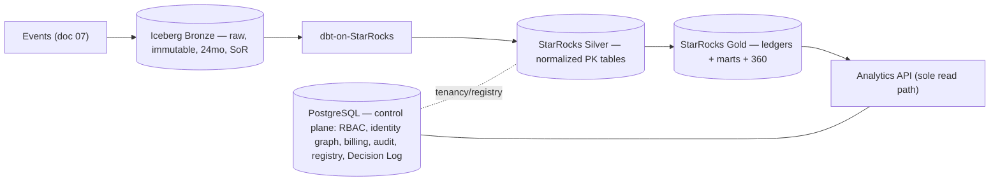
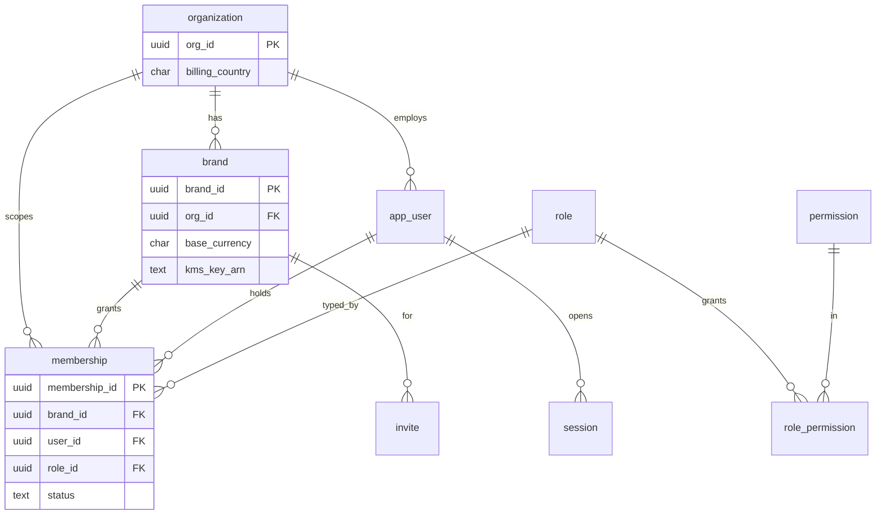
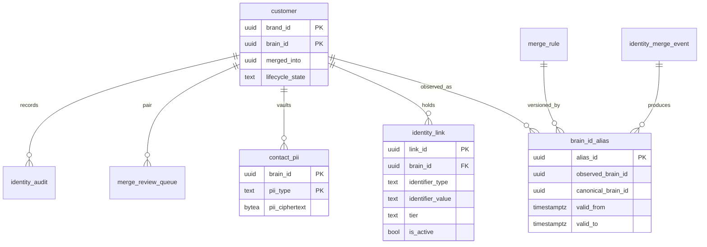
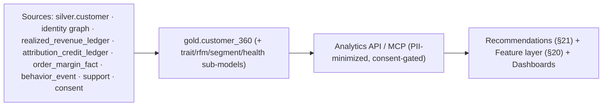
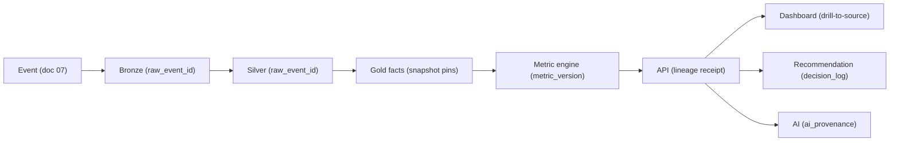
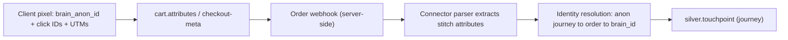

# Brain — Data Model & Database Schema (Authoritative Data Architecture)

**Product:** Brain — the AI-native commerce operating system for DTC brands in India, UAE & GCC.
**Document type:** the authoritative Data Model, Data Contracts, Logical & Physical Schema, Lakehouse Design, Storage Ownership, and Data Governance specification.
**Status:** Final v1.3 (attribution-engine alignment). **Date:** 2026-06-15.
**v1.3 addition (appended, §0–§34 unchanged):** §35 Attribution engine alignment — cart-attribute stitch, `silver.touchpoint` journey mart, `survey_responses`, multi-model comparison + triangulation marts, WhatsApp/influencer channels; reconciles the Attribution Engine Spec (Iceberg+StarRocks kept over the spec's stale BigQuery ref; single credit ledger stays the economic SoR).
**v1.1 additions (appended, §0–§18 unchanged):** §19 Customer 360 architecture · §20 Feature registry / AI feature layer (reservation, no Feast) · §21 Recommendation learning & feedback · §22 Data-contract ownership matrix (6-role) · §23 Semantic-layer governance · §24 Identity risk review · §25 Data-quality framework (6 dimensions) · §26 End-to-end lineage framework.
**v1.2 additions (appended, §0–§26 unchanged):** §27 Data product governance · §28 Dataset SLA framework · §29 Data observability governance · §30 Dataset catalog governance · §31 Metric governance hardening · §32 Feature governance hardening · §33 Experimentation readiness (reservation) · §34 Relationship intelligence readiness (reservation).
**Source of truth — must not contradict:** `01_…BRD`, `02_…Functional_Specification`, `03_…Technology_Stack`, `04_…Architecture_and_Delivery_Plan` (esp. §F DDL, §6.6, §7), `05_…Implementation_Build_Plan` (§9 migrations, `packages/db`), `06_…API_Architecture_and_Contracts`, `07_…Event_Contracts` (esp. §28 sink completeness, §6 topics, §15 ledger).
**Frozen constraints honored:** Postgres (RLS) control plane · Iceberg/S3 Bronze · StarRocks Silver/Gold · the one metric engine · single append-only ledgers · brand-scoped Brain ID · multi-tenant isolation at every layer · no new services/deployables. **Phase-1 scope** (Phase-2/3 entities flagged, not built).

**How to read:** §0 documents the two audit passes + the corrections applied. §1–§3 set ownership and isolation (the foundation). §4 sets conventions. §5–§12 are the schemas (Postgres → Identity → Ledger → Metric Registry → Billing → Bronze → Silver → Gold). §13–§18 are governance, lifecycle, scale, DR, validation, freeze. **DDL is column-list grade** (the runnable migrations are generated from these + `packages/db`, doc 05 §9). **Start from entities & ownership, not tables** (per the brief).

---

## 0. Review board & deep audit findings

### 0.1 Review board (15 personas) — what was challenged & confirmed
A 15-persona board (Data/Lakehouse/Iceberg/StarRocks/Postgres/Identity/Attribution/Billing/Martech/Analytics/Security/Governance/Platform/Staff/Data-Modeling) challenged the data design before any table was drawn. **Confirmed-correct (from frozen docs):** the medallion split (Postgres control plane + Iceberg Bronze SoR + StarRocks serving); the single append-only `realized_revenue_ledger` + `attribution_credit_ledger`; the `brain_id_alias` read-time re-pointing (history never rewritten); the dual-date rule; per-brand isolation at every layer; the one-metric-engine rule. The board's job was to find the gaps below.

### 0.2 Deep Audit Pass 1 — gaps found in docs 01–07 (and closed here)
| Category | Gap found | Resolution in this doc |
|---|---|---|
| **Missing entities** | no explicit `metric_dependency` / `metric_test` / `metric_audit`; no `identity_conflict` distinct from the review queue; no `entitlement` table (entitlement was referenced but unmodeled); no `pii_vault_reference` linking marts→vault | added (§5, §6, §8) |
| **Missing relationships** | order→ledger join path (which ledger rows belong to an order) was implied; touch→order→credit lineage; alias→snapshot pin for historical reproduction | modeled via `order_id` FK on ledger, `identity_snapshot_id` on credit, `merge_event_id` on alias (§6, §7) |
| **Missing ownership rules** | per-dataset System-of-Record was scattered | §2 ownership matrix makes SoR explicit per dataset |
| **Missing historical-data reqs** | "history never rewritten" stated but the *mechanism* (bitemporal alias, append-only ledger, snapshot pins, as-of reads) needed one home | §6/§7 + §14 lifecycle |
| **Missing audit reqs** | audit hash-chain shape + the no-UPDATE/DELETE grant; identity-specific audit | `audit_log` (§5) + `identity_audit` (§6) |
| **Missing retention reqs** | per-class retention was partial | §13 retention matrix (every dataset) |
| **Missing governance reqs** | data classification + lineage not centralized | §13 (classification + lineage) |
| **Missing replay reqs** | which stores rebuild from Bronze vs are SoR | §2 + §11 (replay) matrix + §14 |

### 0.3 Deep Audit Pass 2 — break-it review (DBRE · Analytics-Eng · Governance · Fraud/Compliance · FinOps)
| Risk | Finding | Mitigation (in this doc) |
|---|---|---|
| **Scaling** | a single mega-brand could hot-spot a Silver PK table / Bronze partition | brand-first bucketed partitioning + StarRocks distribution by `(brand_id, high-card key)`; per-entity composite keys (§3, §10, §11) |
| **Performance** | append-only ledgers grow unbounded → slow as-of scans | partition ledgers by `economic_effective_at` month; materialize a per-order *current-state* `order_margin_fact` for serving; bounded restatement window (§7, §12) |
| **Storage / cost** | Bronze small-files + 24-mo growth; per-brand KMS cost | compaction + snapshot-expiry (Argo); KMS **envelope DEKs under a small CMK set** (not per-brand CMK) — §3, §13, §15 |
| **Compliance** | immutable Bronze vs erasure | crypto-shred (destroy per-brand/per-subject key material) + tombstone graph node; Bronze stays immutable but non-identifying (§13) |
| **Fraud/Compliance** | shared-COD-phone false merges; reversal-after-finalization | India phone guard + `shared_utility_identifier` suppression (§6); dual-date ledger keeps closed periods immutable while economic truth restates (§7) |
| **Future migration** | StarRocks-native Silver/Gold now → Iceberg-SoR at P3 | tables modeled engine-agnostically; StarRocks reads Iceberg via external catalog at P3 with **zero consumer change** (§1, §15-equiv in doc 04 §18) |

### 0.4 Corrections applied (where the brief or a prior doc would have introduced a flaw)
1. **One append-only ledger, not per-type tables.** The brief listed `revenue_recognition`/`revenue_reversal`/`refund`/`chargeback`/`settlement_adjustment`/`attribution_clawback` as separate tables. **Implemented as one `gold.realized_revenue_ledger`** (event_type discriminator) + one `gold.attribution_credit_ledger` (clawback = mirrored negative rows). *Why:* a single ledger = a single as-of truth; N tables force fragile cross-table reconciliation and re-introduce the double-count bug the single ledger was built to kill. Every named concept maps to an `event_type` (§7.3).
2. **No generic `usage_record` table.** Realized-GMV "usage" is *derived from the ledger*; the immutable per-period **`gmv_meter_snapshot`** is the usage record. Adding a parallel usage table would diverge from the ledger (§9).
3. **IDs:** internal PK = **`uuid` (UUID v7, app-generated** in TS — Postgres 16 has no built-in `uuidv7()`; revisit if `pg_uuidv7`/PG18 is adopted). API `brd_…/con_…` prefixes are a **presentation encoding** over the uuid, not a column. (Corrects the illustrative `DEFAULT uuidv7()` in doc 04 §F.)
4. **`identity_edge` = `identity_link`** (the frozen name, doc 04 §F / specs). One concept, one table.
5. **No raw PII in any analytical store.** `identity_link` holds salted hashes; raw contact PII lives only in `contact_pii` (KMS vault); marts reference the vault by `brain_id`, never by value.
These corrections are consistent with all frozen decisions; they *prevent* contradictions rather than introduce them.

---

## 1. Data architecture overview

Three stores, one-way flow (doc 03 §2, doc 04 §2): **`events → Iceberg(Bronze, SoR) → dbt → StarRocks(Silver→Gold) → Analytics API`**, with **Postgres** as the transactional control plane beside it.


- **PostgreSQL (control plane):** the **transactional system of record** for everything that must be read-modify-write with strong consistency + RLS — orgs/brands/users/roles/sessions/invites, the **identity graph**, **billing** (incl. the sealed meter snapshots), the **audit hash-chain**, the **Decision Log**, **AI provenance**, the **metric registry**, connector config, feature flags, consent, the per-brand keyring. Multi-AZ + PITR (RPO ≤5min).
- **Iceberg Bronze (S3 + Glue):** the **immutable raw-event log** and the **replay source of truth** (24-mo). Append-only; per-brand prefix + per-brand KMS; the durable substrate everything analytical is rebuildable from.
- **StarRocks (Silver + Gold):** the **derived, rebuildable serving layer** — Silver (normalized PK domains, the mutable order lifecycle) and Gold (the append-only ledgers + metric-ready marts + Customer 360). **Not** a system of record (rebuildable from Bronze + the Postgres ledger-of-record).

**Ownership boundary:** Postgres owns *control + the financial/identity systems-of-record*; Bronze owns *raw history*; StarRocks owns *derived serving*. A dataset has exactly one SoR (§2).

---

## 2. Data ownership model

For every dataset: **Owner module · Source · Consumers · System of Record · Retention · Replayable.** (SoR = the authoritative copy; everything else is derived.)

| Dataset | Owner | Source | SoR | Consumers | Retention | Replayable |
|---|---|---|---|---|---|---|
| Org/Brand/User/Role/Session/Invite | workspace-access | API writes | **Postgres** | all modules | workspace life | n/a (PITR) |
| Connector config + cursors | connector | API/OAuth | **Postgres** | stream-worker, jobs | workspace life | n/a |
| Identity graph (`brain_id`, `brain_id_alias`, `identity_link`) | identity | events (async writer) | **Postgres** | attribution, C360, analytics | workspace life | rebuildable from Bronze + audit |
| PII vault (`contact_pii`) | identity | API/events | **Postgres (KMS)** | send service only | workspace life (erasure overrides) | no (crypto-shred) |
| Realized-revenue ledger | measurement/attribution (ledger writer) | events (order/settlement/shipment) | **Postgres ledger-of-record → mirrored to Gold** | billing, attribution, analytics | workspace life | rebuildable from Bronze |
| Attribution credit ledger | attribution | events + ledger | **Gold (append-only)** | analytics | workspace life | rebuildable |
| Metric registry | measurement | API/PR | **Postgres** | metric engine everywhere | workspace life (versioned) | n/a |
| Billing (snapshots/invoices/payments) | billing | jobs/API | **Postgres** | finance, API | workspace life (legal) | snapshots immutable |
| Audit ledger | all (via packages/audit) | every sensitive action | **Postgres hash-chain + S3 WORM** | auditors, SIEM | workspace life | append-only |
| Decision Log / AI provenance | recommendation/ai | events/API | **Postgres** | analytics, audit | workspace life | n/a |
| Bronze (raw events) | collector/stream | events | **Iceberg (SoR for raw)** | dbt, replay | 24 months | is the replay source |
| Silver / Gold marts / Customer 360 | data/analytics | dbt over Bronze | **derived (not SoR)** | Analytics API | workspace life (rebuildable) | ✓ from Bronze |

---

## 3. Multi-tenant data isolation

**`brand_id` is the tenant key on every brand-scoped row/partition/key/log** (doc 04 §12, §6.6). Isolation is enforced at every layer — never by one mechanism alone:
- **Postgres — RLS in the kernel:** every brand-scoped table `ENABLE ROW LEVEL SECURITY` with `USING (brand_id = current_setting('app.current_brand_id')::uuid)`; the app connects as a **non-owner role** (no `BYPASSRLS`); middleware sets the GUC per request and **asserts non-null before any query** (missing → hard error, never default-to-all). Owner rollup = N isolated reads stitched at presentation, never a cross-brand query.
- **Iceberg Bronze:** per-brand S3 prefix (`bronze/brand=<id>/…`) + **per-brand KMS data key** (envelope-wrapped under a small CMK set — §13); partition spec `bucket(N, brand_id) + days(occurred_at)` (brand-first → tenant pruning + per-brand retention/erasure).
- **StarRocks:** per-brand **row policies** + `DISTRIBUTED BY HASH(brand_id, …)`; the **Analytics API is the sole reader** (one isolation surface to fuzz).
- **Cache (Redis):** keys built via the single `tenant-context.brandKey()` helper (raw keys lint-banned); cross-brand prompt-cache hits forbidden.
- **Audit:** `audit_log` is brand-scoped (`brand_id` nullable only for org/platform actions); per-brand hash-chain `seq`.
- **CI:** isolation negative-tests at every layer incl. StarRocks + MCP (a forgotten WHERE returns nothing). A cross-brand leak is a **P0** (SLO = 0).

---

## 4. Global conventions (apply to every schema)
- **IDs:** `uuid` PK, **UUID v7 generated in the app** (time-ordered → index locality). Tenant-scoped PKs lead with `brand_id`. API surfaces a prefixed display form (`brd_`, `con_`, `bid_`, `inv_`, `led_`, `cr_`, `mev_`…) over the uuid.
- **Money:** `*_minor BIGINT` (integer minor units) **+** `currency_code CHAR(3)`, always paired. **No floats for money, ever** (lint-enforced).
- **Time:** `timestamptz` UTC. Event-time = `occurred_at`; ledgers carry `economic_effective_at` + `billing_posted_period` (the dual-date rule).
- **Naming:** snake_case tables/columns. Append-only tables end transitions in new rows, never UPDATE.
- **Append-only tables** (audit_log, ledgers, identity_link, consent_record): app role has **INSERT + SELECT only** (no UPDATE/DELETE at the GRANT level).
- **No raw PII** outside `contact_pii` (KMS vault); identifiers stored as `sha256(per-brand-salt ‖ normalized value)`.

---

## 5. PostgreSQL — control plane (logical → physical)

> RLS predicate `tenant_isolation` on every brand-scoped table (§3). FKs omit `ON DELETE CASCADE` for audit-bearing rows (we never hard-delete; we tombstone/crypto-shred).

### 5.1 Workspace & access
```
organization(org_id uuid PK, legal_name text, billing_country char(2), region text CHECK in('IN','GCC'),
             status text CHECK in('active','suspended','closed'), created_at, updated_at)   -- tenant root; no RLS
brand(brand_id uuid PK, org_id uuid FK→organization, display_name text, slug text, base_currency char(3),
      timezone text, region text, kms_key_arn text, identity_salt_ciphertext bytea,
      revenue_definition text DEFAULT 'realized', status text CHECK in('onboarding','active','read_only','suspended','closed'),
      created_at, updated_at, UNIQUE(org_id,slug))
      -- RLS: brand_id = app.current_brand_id OR org_id = app.current_org_id (owner rollup)
app_user(user_id uuid PK, org_id uuid FK, email citext, idp_subject text, display_name text,
         status text CHECK in('invited','active','disabled'), mfa_enrolled bool, created_at,
         UNIQUE(org_id,email), UNIQUE(idp_subject))
role(role_id uuid PK, role_code text UNIQUE CHECK in('owner','brand_admin','manager','analyst'), level smallint, display_name text)
permission(permission_id text PK, description text)
role_permission(role_id FK, permission_id FK, PK(role_id,permission_id))
membership(membership_id uuid PK, org_id FK, brand_id uuid FK NULL, user_id FK, role_id FK,
           status text CHECK in('active','revoked'), granted_by FK, created_at, revoked_at,
           UNIQUE(user_id,brand_id) WHERE status='active')
           -- partial unique: one active 'owner' per org
invite(invite_id uuid PK, org_id FK, brand_id FK NULL, email citext, role_id FK, token_hash text UNIQUE,
       status text CHECK in('pending','accepted','revoked','expired'), invited_by FK, expires_at, created_at)
session(session_id uuid PK, user_id FK, refresh_token_hash text UNIQUE, device_label text, ip inet,
        user_agent text, issued_at, expires_at, revoked_at)   -- access JWTs not stored; revocation = Redis denylist
```
**ER (control plane):**


### 5.2 Audit ledger (hash-chained, WORM-anchored)
```
audit_log(brand_id uuid NULL, seq bigint, actor_user_id uuid NULL, actor_principal text,
          action text, resource_type text, resource_id text, payload jsonb,   -- PII-redacted; references by id/hash
          prev_hash bytea, entry_hash bytea,   -- entry_hash = sha256(prev_hash ‖ canonical(row))
          occurred_at timestamptz, PK(brand_id, seq))
-- app role: INSERT+SELECT only (NO UPDATE/DELETE). Hourly checkpoint hash → S3 Object Lock (WORM). SoR for audit.
```

### 5.3 Connector, feature flags, jobs, DQ registry
```
connector_instance(connector_id uuid PK, brand_id FK, connector_type text, display_name text,
   oauth_token_ciphertext bytea, secret_ref text, health_state text CHECK in('healthy','delayed','failed',
   'disconnected','rate_limited','token_expired','disabled'), rec_eligibility text CHECK in('blocked','degraded','safe'),
   last_success_at, freshness_lag_seconds bigint, settlement_capable bool, created_at, updated_at,
   UNIQUE(brand_id,connector_type,display_name))
sync_cursor(connector_id FK, brand_id, stream text, cursor_value text, lane text CHECK in('live','backfill'),
   late_repull_until timestamptz, updated_at, PK(connector_id,stream,lane))
feature_flag(flag_key text PK, description text, default_state text, owner text, kind text)   -- global registry
feature_flag_override(brand_id, flag_key FK, state text, set_by uuid, updated_at, PK(brand_id,flag_key))  -- per-brand
job_run(job_run_id uuid PK, type text, brand_id NULL, status text CHECK in('queued','running','succeeded','failed','paused'),
   progress jsonb, triggered_by jsonb, started_at, finished_at, error jsonb)
job_lock(job_key text, brand_id NULL, locked_at, locked_by text, PK(job_key,brand_id))   -- overlap-lock
dq_grade(brand_id, scope text, scope_ref text, grade text CHECK in('A+','A','B','C','D'),
   subscores jsonb, cost_confidence text, computed_at, PK(brand_id,scope,scope_ref))
dq_signal(signal_id uuid PK, brand_id, kind text, severity text, window text, raised_at)  -- transient; grade is durable
```

### 5.4 Metric registry, cost, goals, FX
```
metric_definition(metric_id text, version int, display_name text, unit text CHECK in('minor_currency','ratio','pct','count'),
   formula_spec jsonb,   -- declarative AST; the TS engine interprets — SQL never does the math
   inputs text[], maturity_required bool, attribution_confidence_required bool, cost_confidence_floor text,
   is_active bool, effective_from, created_by, created_at, PK(metric_id,version))   -- global; no RLS
metric_dependency(metric_id, version, depends_on_metric_id, depends_on_version, PK(metric_id,version,depends_on_metric_id))
metric_test(test_id uuid PK, metric_id, version, golden_input jsonb, expected_output jsonb)   -- parity-oracle fixtures
metric_audit(metric_id, version, changed_by, change_reason, changed_at, PK(metric_id,version,changed_at))
cost_input(brand_id, cost_input_id uuid, scope text CHECK in('global','sku','category','channel','order_type'),
   scope_ref text, cost_type text, amount_minor bigint NULL, pct_bps int NULL, currency_code char(3),
   cost_confidence text CHECK in('Trusted','Estimated','Insufficient'), effective_from, effective_to, PK(brand_id,cost_input_id))
goal(brand_id, goal_id uuid, metric_id, target_value numeric, target_currency char(3), period_start, period_end,
   rag_green_threshold numeric, rag_amber_threshold numeric, created_by, created_at, PK(brand_id,goal_id))
fx_rate(fx_rate_id uuid PK, currency_from char(3), currency_to char(3), rate_date date, rate numeric(18,8),
   source text, fetched_at, UNIQUE(currency_from,currency_to,rate_date,source))   -- realization-date FX
```
**Metric governance:** versioned (`metric_id,version`); deprecation = `is_active=false` + a successor version; **lineage** via `metric_dependency`; every change audited (`metric_audit`); the CI parity oracle runs `metric_test` fixtures (doc 04 §10/§14). One definition platform-wide — the TS engine is the only thing that emits a number.

### 5.5 Decision Log, AI provenance, MCP keys, notifications, consent, keyring, erasure
```
decision_log(decision_log_id uuid PK, brand_id, kind text, recommendation_id uuid NULL, actor text,
   action text, reason text, payload jsonb, created_at)   -- append-only; references customers by brain_id (no PII)
recommendation(recommendation_id uuid PK, brand_id, detector text, eligibility jsonb, confidence text,
   tier text, status text, created_at)
recommendation_outcome(recommendation_id FK, window text, measured jsonb, measured_at, PK(recommendation_id,window))
ai_provenance(query_id uuid PK, brand_id, question_redacted text, metric_binding jsonb, value_minor bigint NULL,
   confidence text, model text, model_version text, prompt_hash text, snapshot_id text, metric_version text,
   cost_minor bigint, latency_ms int, decision_log_ref uuid NULL, created_at)   -- PII-redacted
mcp_key(mcp_key_id uuid PK, brand_id, issued_by FK, key_hash text UNIQUE, scopes text[],
   pii_minimization_level text, status text CHECK in('active','revoked'), rate_limit_rpm int,
   last_used_at, expires_at, revoked_at, created_at)
notification(notification_id uuid PK, brand_id, recipient_user_id NULL, tier text CHECK in('critical','important','digest'),
   kind text, payload jsonb, channel text CHECK in('in_app','email','push','whatsapp'),
   state text CHECK in('pending','sent','read','suppressed'), created_at, sent_at)
notification_pref(brand_id, user_id, prefs jsonb, quiet_hours jsonb, PK(brand_id,user_id))
consent_record(brand_id, brain_id, category text CHECK in('analytics','marketing','personalization','ai_processing'),
   state text CHECK in('granted','withdrawn','never'), source text, consent_snapshot_id uuid,
   consent_text_version text, effective_at, recorded_at, PK(brand_id,brain_id,category,effective_at))  -- append-only history
consent_tombstone(brand_id, brain_id, category, tombstoned_at, PK(brand_id,brain_id,category))  -- <15min suppression overlay
brand_keyring(brand_id PK, wrapped_dek bytea, key_version int, created_at, rotated_at, erased_at)  -- crypto-shred target
pii_erasure_log(erasure_id uuid PK, brand_id, brain_id, surrogate_brain_id uuid, request_source text,
   requested_at, erased_at, vault_shredded bool)
```

---

## 6. Identity graph (the highest-correctness section)

**Owner: identity.** Brand-scoped, never global (per-brand salt → cross-brand hashes uncorrelatable). History is **never rewritten** — merges re-point via a bitemporal alias; unmerge is first-class.

```
customer(brand_id, brain_id uuid, anonymous_id text, merged_into uuid NULL,
   lifecycle_state text CHECK in('anonymous','active','merged','split','erased'),
   ai_processing_consent bool, resolution_consent bool, created_at, PK(brand_id,brain_id))
identity_link(brand_id, link_id uuid, brain_id uuid FK, identifier_type text CHECK in('email','phone',
   'storefront_customer_id','auth_user_id','fp_cookie','device_id','ip','ua','name','pincode','location'),
   identifier_value text,   -- sha256(per-brand-salt ‖ normalized); HASH ONLY, never raw
   tier text CHECK in('strong','strong_on_link','medium','weak'), is_active bool, created_at, PK(brand_id,link_id))
   -- UNIQUE PARTIAL (brand_id,identifier_type,identifier_value) WHERE is_active AND tier IN('strong','strong_on_link')
   --   → blocks two profiles holding the same strong id. Append-only; unmerge deactivates (never deletes).
merge_rule(rule_id, version, brand_id NULL, identifier_combo text[], action text CHECK in('merge','review','never'),
   guard text, precedence int, effective_from, effective_to, PK(rule_id,version))   -- brand_id NULL = global default
brain_id_alias(brand_id, alias_id uuid, observed_brain_id uuid, canonical_brain_id uuid,
   valid_from, valid_to NULL, rule_version text, merge_id uuid, CHECK(observed_brain_id<>canonical_brain_id),
   PK(brand_id,alias_id))
   -- UNIQUE PARTIAL (brand_id,observed_brain_id) WHERE valid_to IS NULL  → union-find one-live-pointer invariant
identity_merge_event(merge_id uuid PK, brand_id, canonical_brain_id, merged_brain_id, rule_version,
   identifier_combo text[], confidence text, identity_snapshot_id uuid, committed_by, committed_at)
identity_conflict / merge_review_queue(brand_id, review_id uuid, brain_id_a uuid, brain_id_b uuid,
   trigger_reason text, evidence jsonb,   -- HASHED evidence
   status text CHECK in('pending','merged','rejected','expired'), created_at, PK(brand_id,review_id))
merge_candidate(brand_id, conflicting_id_hash text, profile_pair_key text, status text, created_at,
   PK(brand_id,profile_pair_key))   -- dedup grain: a pair is never enqueued twice
shared_utility_identifier(brand_id, identifier_type, identifier_value, profile_count int, flagged_at, reason,
   PK(brand_id,identifier_type,identifier_value))   -- courier/kiosk phones → never a merge candidate
contact_pii(brand_id, brain_id, pii_type text, pii_ciphertext bytea, kms_key_id text, identifier_hash text,
   PK(brand_id,brain_id,pii_type))   -- VAULT: RLS additionally requires app.role='send_service'
pii_vault_reference(brand_id, brain_id, pii_type, vault_ref text, PK(brand_id,brain_id,pii_type))  -- marts→vault pointer (no value)
identity_audit(brand_id, audit_id uuid, brain_id, action text CHECK in('mint','link','merge','unmerge','rebind','erase'),
   merge_id NULL, detail jsonb, occurred_at, PK(brand_id,audit_id))
```
**ER (identity):**

**Rules.** *Merge* = INSERT alias (observed→canonical, `valid_to=NULL`) + `identity_merge_event` + cycle-guard (walk the chain; loop → review). *Unmerge* = set `valid_to=now()` + reversal event + deactivate the relevant `identity_link` rows (append, never delete) → constituents restored with full history. *Replay* = re-resolve from Bronze; alias re-points; a historical number pins `identity_snapshot_id` (reproducible). *History preservation* = nothing is overwritten; reads resolve `observed→canonical` at query time. *Phone guard* = `tier='strong'` conflict → `merge_review_queue` (never auto-merge); shared-utility identifiers auto-suppressed.

---

## 7. Financial ledger (critical — single append-only design)

**Owner: the ledger writer (measurement/attribution job).** **One append-only ledger** is the SoR for realized revenue; **the sale row is never mutated**; every economic effect is a new row keyed by a **deterministic** `ledger_event_id`.

### 7.1 `realized_revenue_ledger` (append-only event log)
```
realized_revenue_ledger(
  brand_id, ledger_event_id text,   -- deterministic = hash(order_id ‖ event_type ‖ source_pk ‖ version) → idempotent
  order_id text, brain_id uuid NULL,
  event_type text CHECK in('provisional_recognition','finalization','rto_reversal','refund','chargeback',
                           'cancellation','settlement_fee_reversal','marketplace_adjustment','payment_adjustment','concession'),
  amount_minor bigint,   -- signed; reversals negative; sale row never edited
  currency_code char(3), fx_rate_id uuid,
  economic_effective_at timestamptz,   -- drives attribution + CM2 as-of math + clawback
  billing_posted_period date,          -- the OPEN period a late adjustment posts to (closed periods immutable)
  recognition_label text CHECK in('provisional','settling','finalized'),
  supersedes_ledger_event_id text NULL, settlement_source text, maturity_state text,
  ledger_snapshot_id text, raw_event_id text, created_at,
  PK(brand_id, ledger_event_id))   -- append-only; INSERT+SELECT only
```
The brief's `revenue_recognition`/`revenue_reversal`/`refund`/`chargeback`/`settlement_adjustment` are **`event_type` values here**, not separate tables (0.4 #1). `settlement` raw arrives as the `connector.settlement.received` event → Silver `settlement` (§11) → drives `finalization`/`settlement_fee_reversal` ledger rows.

### 7.2 `attribution_credit_ledger` (append-only; clawback = mirrored rows)
```
attribution_credit_ledger(
  brand_id, credit_id text,   -- deterministic
  order_id text, brain_id_at_credit_time uuid, touch_id text, channel text, campaign_id text,
  model_version text, identity_snapshot_id uuid, window_policy_id text,
  weight_fraction decimal(9,8),   -- persisted; reused EXACTLY on clawback
  credited_revenue_minor bigint,  -- signed; clawback negative
  credit_pass text CHECK in('provisional','finalized'),
  economic_effective_at timestamptz, reversed_of_credit_id text NULL,
  attribution_confidence_pct decimal(5,2), fx_rate_id uuid, created_at,
  PK(brand_id, credit_id))   -- append-only
```
`attribution_clawback` (brief) = rows with `reversed_of_credit_id` set + negative amount (0.4 #1). **Invariant:** full RTO → Σ(credit + clawback) for the order = 0.

### 7.3 Concept → implementation map (nothing lost)
| Brief concept | Implemented as |
|---|---|
| `ledger_event` / `ledger_entry` | the `realized_revenue_ledger` row (event + entry unified — one append-only row) |
| `revenue_recognition` | `event_type='provisional_recognition'` / `'finalization'` |
| `revenue_reversal` | `event_type` ∈ rto_reversal/refund/chargeback/cancellation (signed negative) |
| `refund` / `chargeback` | `event_type='refund'` / `'chargeback'` |
| `settlement` | Silver `settlement` table (§11) from `connector.settlement.received` |
| `settlement_adjustment` | `event_type='settlement_fee_reversal'` / `'marketplace_adjustment'` / `'payment_adjustment'` |
| `attribution_credit` | `attribution_credit_ledger` (credit_pass provisional/finalized) |
| `attribution_clawback` | `attribution_credit_ledger` row with `reversed_of_credit_id` (negative) |

**Rules (append-only/correction/replay/reconciliation):** *Append-only* — never UPDATE a sale row; a correction is a new signed row. *Correction* — late reversals post to the **open** `billing_posted_period` (closed periods immutable) while `economic_effective_at` restates the economic curve (dual-date). *Replay* — the ledger is rebuildable from Bronze (deterministic `ledger_event_id` makes re-runs idempotent). *Reconciliation* — as-of(D) = Σ rows where `economic_effective_at ≤ D`; the parity oracle + closed-sum (Σ channel_contribution + unattributed = Σ finalized realized revenue) assert correctness; billing reads **finalized rows only**, by `billing_posted_period`. **Why a single ledger:** one as-of truth, one reconciliation, no cross-table double-count.

---

## 8. Metric registry — see §5.4
(`metric_definition`, `metric_dependency`, `metric_test`, `metric_audit`, + `cost_input`/`goal`/`fx_rate`.) Versioning, deprecation, lineage, governance defined there. The metric engine binds to `(metric_id, version)`; every served number carries `metric_version`.

---

## 9. Billing & metering

**Owner: billing.** Realized-GMV "usage" is **derived from the ledger** (no generic `usage_record` — 0.4 #2); the **sealed `gmv_meter_snapshot` is the immutable usage record**.
```
plan(plan_id uuid PK, tier text CHECK in('launch','growth','scale','enterprise'), pct_bps int, cap_pct_bps int, min_fee_minor bigint, currency_code char(3))
subscription(brand_id PK, plan_id FK, state text CHECK in('activation','active','read_only','paused','cancelled'),
   activation_started_at, activated_at, cancelled_at)
gmv_meter_snapshot(snapshot_id uuid PK, brand_id, period_start date, period_end date,
   realized_gmv_minor bigint, currency_code char(3), metric_definition_version text,   -- pinned
   fx_basis jsonb, cm2_minor bigint, cm2_confidence text CHECK in('Trusted','Estimated','Insufficient'),
   dq_grade text,   -- pinned at seal so the bill is reproducible
   ledger_high_watermark timestamptz, snapshot_state text CHECK in('open','late_open','sealed','superseded'),
   superseded_by uuid NULL, sealed_at)
   -- EXCLUDE: one live snapshot per (brand_id, period_start); trigger forbids UPDATE/DELETE when sealed
invoice(invoice_id uuid PK, brand_id, snapshot_id FK, invoice_number text,   -- gapless per legal-entity/FY
   status text CHECK in('draft','preview','issued','paid','partially_paid','overdue','void','written_off'),
   currency_code char(3), fee_minor bigint, tax jsonb, total_minor bigint, issued_at)
invoice_line(invoice_id FK, line_no int, line_type text, basis_gmv_minor bigint, rate_bps int,
   metric_definition_version text, source_snapshot_id uuid, sac_hsn_code text, tax_rate_bps int, PK(invoice_id,line_no))
billing_adjustment(adjustment_id uuid PK, brand_id, adjustment_type text CHECK in('refund_clawback','chargeback_clawback',
   'rto_clawback','late_realization','true_up','cap_credit','dq_correction','manual_credit'),
   posting_period_start date, related_period_start date, gmv_delta_minor bigint, created_at)  -- append-only; clawbacks/credits post forward
payment_method(brand_id PK, gateway_token text, provider text)   -- token only; never PAN/UPI secrets
payment(payment_id uuid PK, brand_id, invoice_id FK, idempotency_key text UNIQUE, amount_minor bigint,
   currency_code char(3), status text, captured_at)
entitlement(brand_id, feature_key text, state text CHECK in('enabled','disabled'), source text CHECK in('plan','override'),
   PK(brand_id,feature_key))   -- plan→feature access; read-only-on-nonpayment degradation
dunning_state(brand_id PK, state text, retries int, next_retry_at, degraded_at)
```
**Rules:** *Auditability* — every invoice line ties to a sealed snapshot + `metric_definition_version`; disputes resolve against the snapshot. *Replayability* — the meter recomputes from the ledger (finalized rows); a sealed snapshot is immutable, corrections post forward as `billing_adjustment`. *Reconciliation* — `gmv_meter_snapshot` ↔ ledger high-watermark ↔ invoice ↔ payment.

---

## 10. Iceberg Bronze

**The immutable raw-event log + replay SoR.** One table per materialized event family (doc 07 §6 / §28). Append-only (insert-if-absent MERGE on `(brand_id, event_id)`); raw envelope + payload exactly as received; **no raw PII** (hashed only).
- **Storage model:** `bronze.{schema_name}` (e.g. `bronze.collection_purchase`, `bronze.connector_order_upserted`, `bronze.identity_merge_committed`, `bronze.finance_ledger_finalized`, `bronze.privacy_consent_withdrawn`) — columns = the universal envelope (doc 07 §4) + `payload` + `ingested_at`. Plus `bronze_quarantine(raw_envelope, brand_id, received_at, failure_reason, schema_version)`.
- **Partitioning:** `PARTITIONED BY (bucket(N, brand_id), days(occurred_at))` — brand-first (tenant pruning + per-brand retention/erasure), date for replay windows + TTL. **Not** `brand_id` alone (small-file/skew).
- **Retention:** 24-month rolling via partition expiry.
- **Snapshot:** Iceberg snapshots enable time-travel + reproducibility; **snapshot-expiry** job bounds metadata growth.
- **Compaction:** scheduled Argo compaction (small-file mitigation) + **erasure-aware compaction** (rewrites partitions so crypto-shredded data isn't resurrected from old snapshots).
- **Replay:** the replay SoR (§9 doc 07) — re-run the same dbt/stream code over Bronze partitions; idempotent on `(brand_id, event_id)`.
- **Control/command/audit topics are NOT materialized** (state lives in Postgres; audit SoR = hash-chain).
- **Per-brand prefix + per-brand KMS DEK** (crypto-shred target = `brand_keyring`).

---

## 11. StarRocks Silver (normalized PK tables)

**Owner: data/analytics (dbt-on-StarRocks over Bronze).** PRIMARY KEY (upsert) for mutable entities; dedup on **`(brand_id, event_id)`**, server-wins precedence; `DISTRIBUTED BY HASH(brand_id, <high-card key>)`; brand-first partition/sort. Rebuildable from Bronze (not SoR).
```
silver.behavior_event   PK(brand_id,event_id)  -- occurred_at, event_type, observed_brain_id, session_id, channel,
                                                --   campaign_id, click_ids JSON, consent_flags JSON, dedup_state, identity_state, raw_event_id
silver.order_state      PK(brand_id,order_id)  -- the mutable lifecycle: order_status, payment_method, marketplace, currency_code,
                                                --   gross/discount/tax/net_total_minor, placed/confirmed/shipped/delivered/finalized/closed_at,
                                                --   forward_shipping/cod_fee/packaging/marketplace_fee/return_cost/concession/payment_fee_minor,
                                                --   cost_confidence, is_new_customer, observed_brain_id, raw_event_id, updated_at
silver.order_cost_component  PK(brand_id,order_id,cost_type)  -- amount_minor, currency_code, source, raw_event_id, updated_at
silver.payment          PK(brand_id,payment_id) -- order_id, provider, method, amount_minor, fee_minor, status, captured_at, settled_at, settlement_id
silver.settlement       PK(brand_id,settlement_id) -- provider, settlement_date, gross/fees/net_settled_minor, currency_code, payment_ids JSON
silver.marketing_spend  PK(brand_id,platform,account_id,campaign_id,adset_id,ad_id,spend_date)
                                                -- spend_minor, currency_code, impressions, clicks, conversions, is_final, fx_rate
silver.shipment         PK(brand_id,shipment_id) -- order_id, courier, awb, status, pincode, city, state, ndr_count, ndr_reason,
                                                --   is_rto, rto_initiated_at, rto_received_at, rto_cost_minor
silver.product          PK(brand_id,product_id) -- sku, title, category, unit_cogs_minor, cost_confidence
silver.inventory        PK(brand_id,sku,location_id) -- on_hand, reserved, reorder_point
silver.support          PK(brand_id,ticket_id)  -- brain_id, type, first_response_time_s, resolution_time_s, refund_saved_minor, status
silver.customer         PK(brand_id,brain_id)   -- canonical-keyed rollup, RFM inputs, identity_confidence, completeness
silver.identity_projection PK(brand_id,observed_brain_id) -- observed→canonical alias projection (read-time re-point for joins)
```
**Update strategy:** PK upsert applies the latest by event-time (server-wins); late/out-of-order events converge (idempotent). **Ownership:** the connector/finance/identity domains own their Silver tables' contents via the stream-worker; dbt builds them.

---

## 12. StarRocks Gold (ledgers + marts + serving)

**The metric-ready serving layer + the append-only ledgers (mirrored from the Postgres ledger-of-record for serving).**
```
gold.realized_revenue_ledger      DUPLICATE KEY(brand_id,ledger_event_id)   -- append-only (mirror of §7.1 for serving)
gold.attribution_credit_ledger    DUPLICATE KEY(brand_id,credit_id)         -- append-only (§7.2)
gold.order_margin_fact            PK(brand_id,order_id)  -- cost COMPONENTS only (CM1/CM2/CM3/TrueCM2 computed by the ENGINE, never SQL):
                                  --   net_revenue/cogs/forward_shipping/cod_fee/packaging/marketplace_fee/return_cost/concession/
                                  --   payment_fee/marketing/fixed_alloc_minor, cost_confidence, currency_code, channel, campaign_id,
                                  --   region, pincode, payment_method, marketplace, is_new_customer
gold.channel_contribution         PK(brand_id,channel,period,currency_code) -- incremental_realized_revenue/cm2_minor,
                                  --   contribution_band_low/high_minor, method('rule_based'|'direct'|'mmm'|'holdout'|'hybrid'),
                                  --   confidence_level, spend_minor, mmm_model_version,
                                  --   RESERVED-NULLABLE (P3): lift_range_low/high_minor, holdout_evidence_id   -- + always-rendered 'unattributed' residual row
gold.attribution_confidence_mart  PK(brand_id,channel,period)  -- 9 signal sub-scores; band incl. reserved-inactive 'Calibrated';
                                  --   effective_confidence = min(cost_confidence, attribution_confidence)
gold.customer_360                 PK(brand_id,canonical_brain_id) -- derived read model; PII-minimized; rebuildable
```
**Serving views (Gold, read via the Analytics API only):** Dashboard widget models, **Customer 360**, Attribution views (journey + channel-contribution), Recommendation feed (deterministic detectors over Gold), Billing views (preview/value-proof off the snapshot), Executive lenses (CEO/CMO/CFO — same definitions, lenses not roles). **Serving strategy:** sub-second via StarRocks + Redis cache (keyed incl. `metric_version`+`as_of`); **finalized-only** enforced on guarded endpoints; the metric engine computes all non-additive math; dbt does additive marts only. **All CM math lives in the engine, not these tables** (parity guarantee).

---

## 13. Data governance
- **Retention** (per data class): Bronze raw 24mo; Silver/Gold rebuildable (workspace life); ledgers/audit/Decision-Log/billing = workspace life (legal); `gmv_meter_snapshot`/invoices = workspace life; consent/erasure records = as law requires; sessions/invites short-TTL; digest notifications 180d.
- **Archival:** Bronze partition expiry → (optional) cold archive before delete; Iceberg snapshot-expiry bounds metadata.
- **Deletion / crypto-shredding:** DPDP/PDPL/GDPR erasure = (1) crypto-shred the `contact_pii` vault row (destroy key material via `brand_keyring`), (2) tombstone the `customer` node → opaque surrogate (remove identifier hashes), (3) re-project marts onto the surrogate, (4) Bronze stays immutable but **non-identifying** (re-id keys gone) + erasure-aware compaction. Ledger/Decision-Log survive on the surrogate (math reconciles; person forgotten).
- **Lineage:** every Gold number traces metric→Silver→Bronze→raw event (drill-to-source); `metric_dependency` gives metric lineage; `raw_event_id` on Silver rows gives row lineage.
- **Classification:** every column tagged `none | hashed-only | vault-only | financial | operational`; the no-PII-in-events/marts lint enforces `hashed-only` outside the vault; `financial` columns are append-only + audited.

---

## 14. Data lifecycle (per family)
| Family | Creation | Storage | Materialization | Consumption | Replay | Archival | Deletion |
|---|---|---|---|---|---|---|---|
| Behavioral/connector | event (doc 07) | Bronze | dbt→Silver/Gold | Analytics API | from Bronze | partition expiry | 24mo TTL / crypto-shred |
| Identity graph | async writer | Postgres | C360 projection | attribution, C360 | rebuild from Bronze+audit | — | unmerge/erase |
| Ledger | ledger writer | Postgres (SoR) + Gold mirror | as-of math | billing, attribution | rebuild from Bronze | — | never (append-only); erasure via surrogate |
| Billing | jobs | Postgres | snapshot/invoice | finance, API | recompute from ledger | — | never (legal) |
| Audit | every module | Postgres + WORM | — | auditors | append-only | WORM retention | never |
| Control (orgs/connectors/flags) | API | Postgres | — | all | PITR | — | tombstone |

---

## 15. Performance & scale (500+ brands · billions of events · multi-year)
| Bottleneck | At scale | Mitigation |
|---|---|---|
| Bronze small files | billions of events × 24mo | Argo compaction + snapshot-expiry; partition `bucket(brand_id)+days` |
| Append-only ledger as-of scans | unbounded growth | partition by `economic_effective_at` month; serve current state via `order_margin_fact` (PK); bounded restatement window |
| StarRocks hot brand | a whale brand | `DISTRIBUTED BY HASH(brand_id,high-card)`; row policies; resource groups isolate transform vs serving (doc 04 §10.3) |
| Postgres identity-graph writes | high resolution rate | async idempotent writer off Bronze; alias upserts; extract Identity to a service at P2 trigger |
| dbt-on-StarRocks contention | heavy rebuilds | off-peak scheduling + resource groups; Iceberg-SoR migration at P3 (StarRocks reads via external catalog, zero consumer change) |
| KMS decrypt volume | per-brand DEKs at scale | envelope DEKs under a **small CMK set** (not per-brand CMK); cache decrypted DEKs in-process |

---

## 16. Data disaster recovery (aligns doc 04 §M)
| Store | Backup | RPO | RTO | Recovery |
|---|---|---|---|---|
| PostgreSQL (control plane, ledger-of-record, identity, billing, audit) | Multi-AZ + **PITR (5-min WAL)** + 35d snapshots | **≤5 min** | ≤1h | PITR / AZ failover |
| Iceberg Bronze (raw SoR) | S3 versioning + 11-nines; snapshot time-travel | ~0 | n/a | object versioning / snapshot rollback |
| StarRocks (Silver/Gold — derived) | **rebuild from Bronze** (+ ledger from Postgres) | n/a | 2–4h | dbt full-refresh + load (`starrocks-rebuild` Argo job) |
| KMS keyring (`brand_keyring`) | RDS-resident (PITR) | ≤5 min | ≤1h | **crown jewel** — loss = permanent (crypto-shred-equivalent); quarterly restore drill |

---

## 17. Final consistency validation (vs docs 01–07)
| Concern | This doc | Source | Status |
|---|---|---|---|
| API contracts (entities served) | every doc-06 read endpoint maps to a table/view here | doc 06 | ✓ |
| Event contracts (every event → a sink) | §10 Bronze + §5/§7 Postgres + §11/§12 derived = doc 07 §28 matrix | doc 07 §28 | ✓ |
| Attribution model | single `attribution_credit_ledger` + clawback mirror + `identity_snapshot_id` pin | doc 04 §9, doc 07 §14 | ✓ |
| Identity model | `brain_id_alias` bitemporal + phone guard + per-brand salt | doc 04 §F, doc 07 §13 | ✓ |
| Billing model | meter from ledger + sealed snapshot + dual-date adjustments | doc 04 §9, doc 06 §3.9 | ✓ |
| Revenue recognition | provisional@delivery → finalized@horizon; single ledger; dual-date | doc 01 §10.3, doc 07 §15 | ✓ |
| Replay model | Bronze = SoR; StarRocks rebuildable; deterministic ids | doc 07 §9 | ✓ |
| Partitioning / isolation | brand-first + RLS + per-brand prefix/KMS; not the partition key | doc 04 §6.6 C1 | ✓ |
| No-PII invariant | hashed-only outside the vault; classification + lint | doc 04 §6.6 C2 | ✓ |
| Dedup | `(brand_id, event_id)` everywhere | doc 04 §6.6 M2 | ✓ |

**Contradictions found:** none, after the §0.4 corrections (single-ledger, no usage_record, app-generated uuid, identity_link naming, no-PII). These corrections **prevent** contradictions with the frozen single-ledger / no-PII / one-metric-engine decisions. **Assumptions:** UUID-v7 generation is app-side (revisit if `pg_uuidv7`/PG18 adopted); exact StarRocks partition/bucket counts confirmed by load test (doc 07 §22). **Non-blocking decisions:** cold-archive tier for >24mo Bronze (Phase-5); whether the Gold ledger mirrors are physical copies or external-catalog reads post-P3 (doc 04 §18).

---

## 18. Freeze recommendation
**FREEZE READY.** The data architecture is: correct (single append-only ledgers + as-of math), auditable (hash-chain SoR + every number traces to a raw event), replayable (Bronze SoR + deterministic ids), attribution-accurate (credit ledger + clawback mirror + identity-snapshot pin), billing-accurate (meter-from-ledger + immutable sealed snapshots + dual-date), and maintainable at 500-brand scale (engine-agnostic tables, brand-first isolation, P2/P3 extraction seams). It is consistent with docs 01–07 (§17) with the §0.4 corrections applied. **Crown-jewel risk:** the `brand_keyring` (its loss is unrecoverable) — covered by RDS PITR + a quarterly restore drill (§16). The runnable migrations are generated from these schemas + `packages/db` (doc 05 §9). **Proceed** to physical migration authoring / Sprint-0 (doc 05 §14).

---

## 19. Customer 360 architecture (treated as a product, not a table)

**Customer 360 is a derived, rebuildable read model** keyed by `canonical_brain_id` — **not a system of record** (it never competes with the identity graph or the ledger; it is re-projected from them). PII-minimized; consumed by dashboards, the recommendation engine, and AI (bands/hashes only, consent-gated). Every attribute carries `metric_version` + `confidence`; nothing here is the source of a number — it is a *serving* of numbers computed by the metric engine.



**Profile model & sub-models (Gold, derived):**
```
gold.customer_360 PK(brand_id,canonical_brain_id)
   identity: identity_confidence, profile_completeness_pct, consent_state jsonb, lifecycle_stage
   value: ltv_realized_minor, aov_minor, order_count, cm2_contributed_minor, value_band, ltv_predicted_band(RESERVED P2)
   rfm: recency_days, frequency, monetary_minor, r_score, f_score, m_score
   behavior: last_seen_at, sessions_30d, engagement_summary jsonb, channel_affinity jsonb, preferences jsonb
   risk: rto_propensity_band, refund_propensity_band, chargeback_flag   -- BANDS not raw scores
   currency_code, metric_version, dq_grade, computed_at   -- all rebuildable
gold.customer_trait      PK(brand_id,canonical_brain_id,trait_key)  -- governed derived traits: trait_value, trait_type, source_metric_version, computed_at
gold.customer_segment_membership PK(brand_id,canonical_brain_id,segment_id) -- reason, valid_from, valid_to (append-only history)
gold.customer_cohort     PK(brand_id,canonical_brain_id,cohort_key)  -- e.g. acquisition_month / acquisition_channel
gold.customer_health     PK(brand_id,canonical_brain_id)  -- health_score 0-100, subscores{recency,engagement,support,refund_rate}, band
```
- **Customer lifecycle stages** (deterministic Phase 1; predictive bands reserved P2): `anonymous → new → active → repeat → loyal/VIP → at_risk → dormant → churned → reactivated` (+ `erased`). Rules use recency/frequency/value thresholds (configurable per brand), aligned to BRD/functional-spec lifecycle.
- **Health score / RFM / value bands / channel affinity / risk indicators** are derived sub-models above; **risk indicators are bands** (no raw propensity exposed Phase 1) to avoid acting on uncalibrated scores.
- **Source datasets / ownership:** sources listed in the diagram. **Identity** owns the key (`canonical_brain_id`); **measurement** owns value/RFM/CM2 inputs; **analytics** owns the projection itself. **Materialization:** dbt over Gold — incremental on changed customers + scheduled full-refresh; merges/unmerges trigger re-projection (alias re-point, §6). **Replay/rebuild:** fully rebuildable from Bronze + the ledger; no SoR status. **AI consumption:** read-only via Analytics API / MCP with PII-minimization + consent gating; feeds the feature layer (§20) and recommendations (§21); every served trait carries confidence + `metric_version` so AI never asserts beyond data trust.

## 20. Feature registry / AI feature layer (RESERVATION — Phase-2+, inside the existing stack)

**Pushback honored:** **no Feast, no separate feature store.** The registry is **Postgres tables** (same discipline as the metric registry); offline features are **StarRocks/Gold dbt materializations**; online features reuse the **existing Redis** cache; `packages/contracts` + the metric engine stay the source of truth. **Phase-1 status: schema reserved, not populated** — the §19 Customer 360 derived attributes are the de-facto Phase-1 features. This section exists so AI feature engineering later slots into the architecture **without a new deployable**.
```
feature_definition(feature_id, version, name, entity_type CHECK in('customer','order','channel','brand'), dtype,
   formula_spec jsonb,   -- declarative AST, interpreted by the engine (mirrors metric_definition; SQL never computes)
   inputs text[], pii_classification, owner, maturity_required bool, is_active bool, effective_from, PK(feature_id,version))
feature_dependency(feature_id,version,depends_on,PK(...))   feature_test(test_id PK, feature_id, version, golden_input, expected)  -- parity fixtures
feature_materialization(feature_id, version, store CHECK in('offline_gold','online_redis'), target text,
   refresh_cadence text, ttl interval, last_materialized_at, PK(feature_id,version,store))
feature_lineage(feature_id, version, source_metric_id, source_table, PK(...))   -- joins the §26 lineage graph
```
**Ownership:** ML/AI-platform owns the registry; data owns materialization. **Versioning/deprecation/replay/lineage** reuse the metric-registry rules (§5.4, §8). **Governance:** features are hashed/banded (no-PII); **point-in-time correctness** — offline training features must be computed *as-of* the label time (no future leakage); the engine enforces the as-of read. Rebuildable from Bronze like every mart.

## 21. Recommendation learning & feedback data model

Extends §5.5 (`recommendation`, `recommendation_outcome`, `decision_log`, `ai_provenance`) so Brain learns **which recommendations actually realize CM2** — without a new subsystem.
```
recommendation_feedback(feedback_id uuid PK, brand_id, recommendation_id FK, actor_user_id NULL,
   state text CHECK in('surfaced','viewed','accepted','rejected','ignored','executed','expired'),
   reason text, occurred_at)   -- append-only state log; one recommendation → many feedback rows
recommendation_outcome(recommendation_id FK, window text, measured jsonb,  -- realized lift vs baseline/control
   effectiveness_score numeric, confidence text, measured_at, PK(recommendation_id,window))  -- (expanded from §5.5)
recommendation_effectiveness(brand_id NULL, detector text, period date,    -- brand_id NULL = global learning
   surfaced_count, accepted_count, executed_count, mean_realized_impact_minor bigint,
   win_rate numeric, confidence text, PK(detector,period,brand_id))
```
**Relationships:** `recommendation → recommendation_feedback (1:N) → recommendation_outcome (measured) → recommendation_effectiveness (aggregate)`; the **Decision Log is the SoR for "what was actually done."** **Retention:** feedback + outcome = workspace life (learning signal); effectiveness rollups kept indefinitely (small). **Ownership:** recommendation module owns; ai/ML-platform consumes for tuning. **Privacy:** references customers by `brain_id` only. **Objective:** closes the learn-loop — deterministic detector tuning Phase 1; model-driven ranking reserved P2 (feeds §20).

## 22. Data contract ownership matrix (6-role governance)

Schema source of truth = `packages/contracts`; a **breaking change** = a PR approved by the named **Breaking-Change Approver** + a FULL_TRANSITIVE compat check (doc 07 §8) + parity oracle where a metric is touched. The matrix is **enforced via `CODEOWNERS`** in the repo (the approver's review is required to merge).

| Dataset | Dataset Owner | Schema Owner | Quality Owner | Retention Owner | Security Owner | Breaking-Change Approver |
|---|---|---|---|---|---|---|
| Control plane (org/brand/RBAC) | workspace-access | workspace-access | workspace-access | platform | security | workspace-access lead |
| Identity graph | identity | identity | identity (§25) | platform | security | identity lead |
| PII vault (`contact_pii`) | identity | identity | identity | compliance | **security (must approve)** | security + compliance |
| Realized-revenue ledger | measurement | measurement | measurement | finance | security | measurement lead + finance |
| Attribution credit ledger | attribution | attribution | attribution | finance | security | attribution lead |
| Metric registry | measurement | measurement | measurement | measurement | security | measurement lead |
| Billing / snapshots / invoices | billing | billing | billing | finance | security | billing lead + finance |
| Audit ledger | platform | platform | platform | compliance | security | security |
| Bronze | data | data (contracts) | data (§25) | platform | security | data lead |
| Silver / Gold marts | data/analytics | data | data (§25) | platform | security | data lead |
| Customer 360 (§19) | analytics | analytics | analytics | platform | security | analytics lead |
| Feature registry (§20) | ml-platform | ml-platform | ml-platform | platform | security | ml-platform lead |

## 23. Semantic layer governance

**Single source of truth = the metric registry (§5.4 / §8) + `packages/contracts`. No new system** (pushback — this is a governance *process*, not a parallel metrics store). Only **certified** objects serve via API/AI; drafts are sandbox-only.
- **Certified metrics:** `metric_definition` rows that are `is_active` + pass all `metric_test` fixtures + have an owner + satisfy maturity/cost-confidence floors. CI **blocks serving an uncertified metric**.
- **Certified dimensions:** the governed, reused dimension set — `brand, channel, campaign, region, pincode, payment_method, marketplace, customer_segment, cohort, product/category, order_type, time-grains`. No ad-hoc dimensions in served queries.
- **Certified facts:** the only facts a metric may bind to — `realized_revenue_ledger, attribution_credit_ledger, order_margin_fact, channel_contribution, behavior_event`.
- **Metric lifecycle:** `draft → certified → deprecated → retired` (mirrors doc 07 §30 lifecycle + §32 migration). **Versioning/deprecation** already in §5.4. **Promotion process:** PR adding/changing a `metric_definition` → owner approval (§22) → parity-oracle pass → flip to certified; deprecation sets a successor + sunset. **Ownership** per §22 (measurement). **Prevents metric chaos:** one definition, one engine, certified-only serving — no spreadsheet redefining "ROAS."

## 24. Identity risk review (false-merge minimization)

The single biggest correctness risk in DTC India/GCC is **identifier collision on phone numbers.** Brain **never auto-merges on a collision-prone identifier**; it tiers, suppresses, and routes to review. Confidence-prone signals **cap `identity_confidence`**, which propagates to attribution confidence and Customer 360 health (§25).

| Risk | How it manifests | Protection | Confidence impact | Governance rule |
|---|---|---|---|---|
| Shared family phone | one phone, many people (COD) | phone is **medium-tier** (not strong-auto-merge); conflicting strong id → `merge_review_queue` | caps identity_confidence | never auto-merge two profiles on phone alone |
| COD / courier-kiosk phone reuse | one phone across many orders | `shared_utility_identifier` auto-flag on high fan-out → **suppressed from merge** | excluded from scoring | fan-out threshold per brand |
| Reseller / B2B phones | high order count + many addresses | flagged shared-utility / B2B → suppressed from consumer merge | excluded | B2B heuristic guard |
| WhatsApp number reuse | WA id == phone | treated as **phone-tier** (not a separate strong id) | same as phone | WA id maps to phone rules |
| Marketplace masked/proxy numbers | Amazon/Flipkart relay numbers | recognized pattern → **tier=weak/ignored** | not used for merge | proxy-number pattern list |
| Recycled phone numbers | number reassigned after dormancy | **recency/dormancy guard**: dormant strong id + conflicting strong id → review | caps confidence | `merge_rule` dormancy guard |
| Merged-account mistakes | wrong auto-merge | **unmerge is first-class** (§6): alias `valid_to` reversal restores history + `identity_audit` | restored on unmerge | every merge auditable + reversible |

**Protections summary:** identifier tiering (`strong / strong_on_link / medium / weak`), shared-utility suppression, fan-out + dormancy guards, **review-queue-not-auto-merge** on strong-id conflicts, per-brand salt (no cross-brand correlation), and reversible unmerge with audit. **Governance:** the **identity DQ score (§25)** tracks merge precision/unmerge rate; `merge_rule` is versioned so policy changes are auditable and replay-stable.

## 25. Data quality framework (six measurable dimensions)

Generalizes `dq_grade`/`dq_signal` (§5.3): each scope grades **A+…D** (or 0–100), with thresholds that **gate downstream behavior** so data trust is enforced, not advisory. Every served number carries `effective_confidence = min(cost_confidence, attribution_confidence)` **+** the pinned DQ grade.

| Dimension | Key signals | Threshold gate | Owner | Escalation | Visibility |
|---|---|---|---|---|---|
| **Connector quality** | freshness lag, completeness, schema-drift, settlement coverage | D → `rec_eligibility=blocked`; degraded → AI shows "data delayed" | connector | signal → owner → on-call on SLO breach | connector-health API + banner |
| **Identity quality** | merge precision (review-confirmed/auto), unmerge rate, shared-utility hit rate, confidence distribution | low precision → tighten merge rules + cap confidence | identity | review-queue backlog alert | identity DQ panel |
| **Attribution quality** | % credited revenue, unattributed residual, confidence-band mix, closed-sum check | closed-sum fail → block serving period | attribution | parity-oracle fail → page | attribution confidence mart (§12) |
| **Metric quality** | parity-oracle pass, maturity coverage, cost-confidence floor | parity fail → metric not certified (§23) | measurement | CI gate blocks deploy | metric registry status |
| **Dataset quality** (Bronze/Silver/Gold) | row-count drift, null-rate, dedup-rate, freshness, contract pass | contract fail → quarantine + alert | data | dbt test fail → block publish | DQ dashboard |
| **Customer-profile quality** | completeness %, identity_confidence, consent coverage, staleness | low completeness → suppress AI claims, show "insufficient" | analytics | staleness alert | Customer 360 badge |

**Scoring/visibility:** a per-number **confidence badge** (Trusted / Estimated / Insufficient) + DQ grade is rendered everywhere a number appears, in the API response, and in `ai_provenance`. **Make trust measurable:** a number with grade D never drives an unqualified AI assertion (doc 04 AI-honesty rule).

## 26. End-to-end lineage framework

Any number must be traceable back to its originating event: **Event → Bronze → Silver → Gold → Metric → API → Dashboard → Recommendation → AI.** The Gold-fact hop spans the **Journey (`silver.touchpoint`, §35) → Attribution (credit ledger, §7) → Revenue ledger** chain; the forward tail continues **Recommendation → Outcome (finalized ledger) → Learning** (doc 09 Part 9/10). So the full business chain — **Touchpoint → Journey → Attribution → Revenue → Metric → Decision → Recommendation → Outcome → Learning** — is traceable end-to-end, with per-hop ownership in the doc 04 §2.5 value chain and the doc 09 maps.


- **Lineage storage (three layers):** (1) **row-level** — `raw_event_id` on Silver/Gold rows + `ledger_snapshot_id`/`identity_snapshot_id` pins; (2) **definition-level** — `metric_dependency` + `feature_lineage` + the **dbt manifest** (model DAG); (3) **served-level** — every API/AI/dashboard response carries a **lineage receipt** `{metric_version, snapshot_id|as_of, dq_grade, confidence}`.
- **Ownership:** data owns pipeline lineage (dbt manifest); measurement owns metric lineage; each served surface emits its receipt. **Storage:** dbt manifest as a build artifact in-repo + receipt fields in `ai_provenance`/`decision_log` + `raw_event_id` columns (no new store). **Visibility:** drill-to-source in the UI (number → metric → facts → raw events) + a lineage view/API. **Auditability:** `ai_provenance` + `audit_log` + the snapshot pins make any historical number **reproducible** — re-run the pinned `metric_version` over the pinned snapshot and get the same value. A future engineer traces: **served receipt → metric_version + snapshot → Gold fact rows → `raw_event_id` → Bronze event.**


---

## 27. Data product governance

A **data product** = a curated, owned, SLA-bound dataset with named consumers (vs an internal table). This is a **governance label + a registry row, not a platform.** Each product has a one-page contract (owner, purpose, schema ref, SLA §28, consumers, criticality) stored **in-repo** (`docs/data-products/` + contract annotations) and rolled into the generated catalog (§30). **Lifecycle:** `proposed → active → deprecated → retired` (mirrors §23 + doc 07 §30). The **product owner is accountable for the SLA (§28) and breaking changes (§22).**

| Data product | Owner (squad) | System | Key consumers | Criticality | Lifecycle |
|---|---|---|---|---|---|
| Realized Revenue Ledger | measurement | Postgres SoR + Gold | billing, attribution, analytics, AI | **P0** | active |
| Attribution Credit Ledger | attribution | Gold | analytics, recommendation, AI | **P0** | active |
| Identity Graph | identity | Postgres | attribution, C360, analytics | **P0** | active |
| GMV Meter Snapshot / Billing | billing | Postgres | finance, API, invoicing | **P0** | active |
| Metric Registry | measurement | Postgres | every served number | **P0** | active |
| Bronze (raw events) | data | Iceberg | dbt, replay, all marts | **P0** | active |
| Customer 360 | analytics | Gold | dashboards, recommendation, AI | P1 | active |
| Channel Contribution | attribution | Gold | dashboards, AI | P1 | active |
| Order Margin Fact | measurement | Gold | dashboards, recommendation | P1 | active |
| Recommendation Effectiveness | recommendation | Postgres | recommendation tuning, AI | P2 | active |

## 28. Dataset SLA framework

Every P0/P1 data product carries four SLAs; **breach raises a DQ signal (§25) → owner → escalation.** SLAs are measured on the **existing Grafana/Prometheus stack** (no new tool). SLA ownership = the §27 product owner.

| Data product | Freshness | Availability | Completeness | Query latency |
|---|---|---|---|---|
| Realized Revenue Ledger | provisional ≤5 min from event; finalized at horizon | 99.9% | closed-sum check passes | n/a (PG) |
| Attribution Credit Ledger | provisional ≤15 min; finalized at horizon | 99.9% | Σ(credit+clawback) reconciles | n/a |
| Identity Graph | resolution ≤ minutes (async) | 99.9% | merge-review backlog within bound | n/a |
| Billing / GMV snapshot | sealed at period close | 99.9% | ledger high-watermark reconciled | n/a |
| Bronze | ingest p99 ≤ 1 min (hot path, doc 07) | 99.9% | dedup-checked on (brand_id,event_id) | n/a |
| Customer 360 | incremental ≤1 h; full-refresh daily | 99.5% | profile completeness ≥ target | p95 < 1 s (served) |
| Channel Contribution | daily | 99.5% | unattributed residual rendered | p95 < 1 s |
| Recommendation data | daily | 99.0% | feedback/outcome joined | p95 < 1 s |

## 29. Data observability governance (delta on §25)

§25 defines the six DQ *dimensions*; this hardens the **drift detection** layer on top of them. **No new platform** — detection = `dbt tests` + scheduled StarRocks/SQL checks + the existing Grafana/Prometheus + `dq_signal`/`dq_grade` (§5.3) as the state store.

| Drift type | Signal | Detection (existing stack) | Owner | Action |
|---|---|---|---|---|
| Freshness drift | watermark lag > SLA (§28) | freshness monitor (job watermark vs now) | data | DQ signal + alert; gate dependent serving |
| Volume drift | row-count Δ vs trailing baseline | scheduled dbt test | data | alert; quarantine if contract-linked |
| Schema drift | contract mismatch | `packages/contracts` CI + Bronze quarantine (doc 07 §26) | data | block publish |
| Null drift | null-rate Δ on key columns | dbt test | data | alert; suppress affected metric |
| Distribution drift | key-metric distribution Δ (AOV, RTO%, refund%) | scheduled SQL anomaly check (z-score/threshold) | analytics | alert; cap confidence (§25) |
| Pipeline anomaly | dbt failure / consumer lag / DLQ growth | Grafana alerts + DLQ monitor (doc 07 §10) | platform on-call | incident runbook |

**Visibility:** the DQ dashboard + the per-number confidence badge (§25). **Storage:** `dq_signal`/`dq_grade` — no separate observability product (no Monte-Carlo/Bigeye/etc.).

## 30. Dataset catalog governance

Discoverability metadata per dataset, **generated from `packages/contracts` + the dbt manifest + the §27 product registry** — same approach as the doc 07 §33 event catalog. **No catalog product** (no DataHub/Amundsen/OpenMetadata). Required per-dataset metadata: `business_definition · owner · consumers · criticality · sensitivity(none|hashed|vault|financial) · sla_ref · lifecycle_state · schema_ref · lineage_ref`. **Generation:** a CI step emits `docs/DATA_CATALOG.md` (human) + `data-catalog.json` (machine); CI **fails on missing metadata or a stale catalog** (drift, like doc 07 §33). The catalog is the machine-generated union of §2 + §22 + §27 + §28 metadata, living next to code — one index, no tool.

## 31. Metric governance hardening (delta on §23)

§23 already defines certified metrics/dimensions/facts + lifecycle + the promotion process. Hardening closes the **sprawl + blast-radius** gaps for 50 engineers / multiple squads:
- **Duplicate prevention:** a new-metric PR must declare it is *not* a synonym of an existing certified metric; CI flags overlapping `formula_spec` + output unit + name similarity → reviewer resolves. **One canonical metric per business concept** (no two "ROAS"es).
- **Metric review workflow:** PR → owner review (§22) → parity-oracle (`metric_test`) pass → certification flip → catalog regen (§30). Deprecation requires a successor + sunset date.
- **Consumer impact analysis:** `metric_dependency` (§5.4) **+ a generated usage index** (which dashboards / API endpoints / AI bindings / features reference each metric, derived from code) → a change PR **renders its blast radius**; breaking a certified metric requires approver sign-off (§22) + a consumer-migration window (mirrors doc 07 §32). Prevents silent breakage at scale.

## 32. Feature governance hardening (delta on §20)

§20 reserved the feature registry (no Feast). Hardening adds the **lifecycle states + consumption safety** so future feature engineering can't go feral — still a **Phase-2+ reservation**:
- Add `feature_definition.lifecycle_state CHECK in('draft','production','deprecated','retired')`.
- **Consumption rule:** only `production` features may be consumed by served recommendations/models; `draft` = sandbox/offline-eval only; `deprecated` = read-only + sunset. **CI blocks a production consumer binding to a draft/deprecated feature.**
- **Promotion** `draft → production` requires owner approval (§22) + parity-test pass + the **point-in-time-correctness check** (no label leakage, §20). Reuses the metric-governance machinery — no new system.

## 33. Experimentation readiness (RESERVATION ONLY — Phase-2+)

Logical entities **reserved, not built**; no service, no experimentation platform. Ties to the already-reserved `channel_contribution` holdout/lift fields (§12) and `recommendation_effectiveness` (§21). When built: owned by measurement/analytics, config/assignment in Postgres, results computed in Gold **via the existing metric engine + attribution ledger** (incrementality).
```
experiment(brand_id NULL, experiment_id, name, hypothesis, type CHECK in('ab','holdout','incrementality','geo'),
   primary_metric_id, status, start_at, end_at)                 -- RESERVED P2+
experiment_variant(brand_id, experiment_id, variant_id, name, allocation_pct, is_control)
experiment_assignment(brand_id, experiment_id, variant_id, subject_type CHECK in('customer','order','geo','channel'),
   subject_ref, assigned_at)                                    -- deterministic hash assignment (stable, replayable)
experiment_result(brand_id, experiment_id, variant_id, metric_id, period, value_minor bigint,
   confidence_interval jsonb, p_value numeric, lift_vs_control_minor bigint)
```
Reservation only — no redesign, no deployable, no platform.

## 34. Relationship intelligence readiness (RESERVATION ONLY — Phase-2+)

Reserves a **relationship layer above `brain_id`** (household / business / reseller / shared-account) **without altering the frozen, brand-scoped identity graph** (§6). Resellers/shared accounts are already *flagged* today via `shared_utility_identifier` + the §24 B2B heuristic; this is the future *grouping* model. Same per-brand isolation, no-PII (hashed evidence), audit, and bitemporal/unmerge discipline as §6.
```
entity(brand_id, entity_id, entity_type CHECK in('household','business','reseller','shared_account'),
   confidence, status, created_at)                              -- RESERVED P2+; grouping above brain_id
entity_member(brand_id, entity_id, brain_id, role, valid_from, valid_to)   -- bitemporal, append-only (like brain_id_alias)
relationship(brand_id, brain_id_a, brain_id_b, relationship_type, confidence, evidence jsonb, created_at)  -- hashed evidence
```
Built only on a future trigger; the current identity model is unchanged. Ownership: identity. Reservation only.


---

## 35. Attribution engine alignment (first-party tracking spine)

Aligns the data model to the **Brain Attribution Engine Spec** (the founder's source-of-truth for first-party tracking). **No new deployable/store** — everything rides Bronze/Silver/Gold + identity (§6) + the ledger (§7). **Two reconciliations:** (a) **warehouse stays Iceberg + StarRocks** — the spec's BigQuery reference is superseded; the required pattern (append-only immutable raw, dbt layering, full replay, per-tenant isolation) is satisfied identically here. (b) The **single `attribution_credit_ledger` (§7.2, position-based default) remains the economic source of truth** for CM2/billing; the additional models are **read-only comparison marts** for triangulation — one economic truth, many analytical lenses.



**Cart-attribute stitch — the spec's #1 durability mechanism (carry the anon journey across the client→server boundary):**
- `silver.order_state` gains: `stitched_anon_id` (the `brain_anon_id` read from `cart.attributes`), `stitched_click_ids JSON`, `stitched_first_touch_utms JSON`, `stitch_source CHECK in('cart_attribute','identifier_match','none')`. The connector order-webhook parser extracts `cart.attributes` (Shopify) / order-meta (Woo) → these fields → identity resolution links the anonymous journey to the order **even before the customer identifies**.
- `brain_anon_id` (the spec's anonymous spine) maps to `customer.anonymous_id` + an `identity_link(identifier_type='brain_anon_id', tier='strong_on_link')` row written on stitch (extends the §6 enum). Complements identifier-based backward merge; together they close the anon→known→order loop.

**`silver.touchpoint` (NEW)** `PK(brand_id, touchpoint_id)` — the resolved, channel-tagged marketing touchpoint per person, ordered into journeys (Brain previously kept only `touch_id` on the credit ledger; this materializes the journey explicitly):
```
silver.touchpoint  -- canonical_brain_id, occurred_at, channel, source, campaign_id, adset_id, ad_id,
                   --   click_id_type, click_id, utm_source/medium/campaign/content/term, session_id,
                   --   touch_type CHECK in('click','visit','whatsapp','influencer','survey_self_report','impression'/*reserved P3*/),
                   --   raw_event_id  -- ordered per brain_id = the journey; feeds attribution compute
```

**`survey_responses` (NEW, Postgres-resident)** `PK(brand_id, response_id)` — zero-party self-reported attribution ("how did you hear about us"), **carved in** as attribution data (distinct from the excluded product/UX surveys — doc 01):
```
survey_responses  -- brain_id, order_id, question_version, response_channel_raw, mapped_channel,
                  --   free_text_hash (no raw PII), captured_at  -- a first-class touchpoint (touch_type='survey_self_report') + triangulation input
```

**Multi-model attribution comparison marts (Gold, read-only — NOT the economic SoR):**
```
gold.attribution_model_credit  PK(brand_id, order_id, model, channel)  -- credit per conversion per model for triangulation
   -- model in (first_touch|last_touch|last_non_direct|linear|time_decay|position_based|w_shaped|markov|shapley)
   -- deterministic models Phase 1; data-driven (markov|shapley) reserved P2; modeled view-through + MMM P3 (per the spec's phasing)
gold.attribution_triangulation PK(brand_id, channel, period)  -- platform_reported_minor, brain_attributed_minor (credit ledger),
   -- self_reported_share, model_spread{min,max}, agreement_score  -- powers platform vs Brain vs self-reported (extends the 2-way "why Brain's number is lower than Meta's")
```

**WhatsApp + influencer as acquisition channels** — `silver.marketing_spend.platform` enum extends to include `whatsapp` and `influencer`; WhatsApp sends + influencer spend are ingested as touchpoints (`touch_type` above), not delivery-only.

**Ownership / replay / governance:** `touchpoint` + comparison marts are **derived** (rebuildable from Bronze, not SoR); `survey_responses` is **captured** (Postgres, replay n/a); all brand-scoped (RLS) + no-PII (hashed/mapped only — §3, §6.6 C2). **CAPI passback** (output-only, consent-gated, Meta/Google/TikTok, event-ID dedup, **never an attribution input**) is already specified in doc 01 §7.4.10 / doc 06 §11.1 — unchanged. The spec's `brain_person_id` = Brain's `brain_id`; `raw_events`/`identity_edges`/`persons` = Bronze / `identity_link` / `customer` (§6).


---

*End of Data Model & Database Schema. Companions: `01`–`09`. Runnable migrations: `db/migrations` + `packages/db` (doc 05 §9). Schema-as-contract: `packages/contracts` (Zod → types/Avro).*
