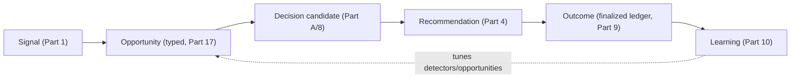

# Brain — Decision Engine Architecture (the Intelligence Layer)

**Product:** Brain — the AI-native commerce operating system for DTC brands in India, UAE & GCC.
**Document type:** the authoritative architecture for how Brain **reasons, prioritizes, recommends, learns, and improves** — the product moat. Docs 01–08 define how Brain *collects, stores, governs, and serves* data; this defines how Brain *decides*.
**Status:** Final v1.1 (targeted enhancement pass). **Date:** 2026-06-15.
**v1.1 additions (appended, Parts A–16 unchanged):** Part 17 Opportunity registry (Opportunity as first-class) · Part 18 Recommendation dependency framework (blocker/prerequisite/cascading, distinct from conflict) · Part 19 Decision Object (RESERVED) · Part 20 Goal-aware prioritization (deterministic GoalWeight modifier over the existing `goal` entity).
**Frozen-alignment (must not contradict):** modular monolith + 3 deployables (no new service — the engine lives in the **`recommendation`** + **`ai`** modules of the core monolith, with detectors run by Argo jobs); single realized-revenue ledger + attribution credit ledger (doc 08 §7); one metric engine (doc 08 §5.4/§23); Customer 360 derived model (doc 08 §19); identity graph (doc 08 §6); event contracts (doc 07); brand-scoped isolation + no-PII + RLS (doc 08 §3); the recommendation/feedback/effectiveness data model (doc 08 §5.5, §21); cost-routing law (deterministic ≫ statistical ≫ model).
**Phase-1 posture (decided):** **recommend-only + limited one-click assisted-execute for reversible, low-blast-radius actions**; full auto-execution **reserved** (Part 16). Spend/scale decisions grounded in **rule-based incremental contribution + the attribution confidence band** (holdouts/MMM upgrade the *same* decision later — Part 16). Attribution is presented as a **triangulation** — platform-reported vs Brain-attributed vs self-reported (doc 08 §35); the engine consumes the **Brain-attributed economic ledger**, and model divergence is itself a confidence signal.

---

## 0. Review board & two review passes

### 0.1 Board (15) — what they demanded
Commerce/product (ex-Triple-Whale, ex-Northbeam, ex-Black-Crow, ex-Shopify-Intelligence, ex-Amazon-Personalization), AI/decision-science (recommendation-systems, decision-science, ML-platform, applied-AI, experimentation), and operators (DTC founder, growth director, CFO, COO, head of retention). Their distilled verdict shaped every principle below.

### 0.2 Review Pass 1 — "analytics platform vs decision engine"
| Question | Finding (what Brain must do) |
|---|---|
| What makes Brain *merely* another analytics platform? | Surfacing metrics/charts and "insights" that restate data; last-click ROAS; dashboards the founder must interpret. **The trap.** |
| What makes it a *true* decision engine? | It outputs **ranked actions with expected ₹ impact, confidence, and evidence** — and *measures whether they worked.* The unit of output is a **decision**, not a chart. |
| What creates measurable business value? | Every recommendation tied to **expected realized CM2** (not GMV, not platform-claimed ROAS) and verified against the finalized ledger. |
| What will customers pay for? | "Tell me what to do today, how sure you are, and prove last week's advice made money." A trustworthy **Morning Brief** + a closed learning loop. |
| Founder every morning? | Top 3–5 prioritized actions across spend/retention/margin/ops, with cost-of-inaction. |
| Marketer trusts? | Incremental (not last-click) spend guidance with confidence + the evidence; never "spend more" off a vanity metric. |
| CFO trusts? | CM2/cash-grounded, realized-revenue, no double-counting, every number traceable. |
| COO trusts? | RTO/refund/logistics risks with severity + a concrete mitigation, brand-profile-aware. |

**Conclusion:** the differentiation is **honesty + incrementality + a measured learning loop**, not model sophistication. Phase 1 is deterministic.

### 0.3 Review Pass 2 — break the engine (every risk has a mitigation)
| Failure mode | Mitigation (where) |
|---|---|
| Low recommendation **quality** | deterministic detectors over certified metrics only; no rec without a registered detector (Part 5) |
| Over-stated **confidence** | `effective_confidence = min(all input confidences)`; never overstate (Part 7) |
| Wrong **prioritization** | money-weighted priority formula gated by confidence (Part 6) |
| **Conflicting** recs (scale spend vs protect CM2) | conflict engine: guardrails are hard constraints, then net-CM2 arbitration (Part 8) |
| **Inaccurate** recs from delayed/missing data | confidence collapses → rec downgraded to *watch* or suppressed; data-health rec raised (Part 14) |
| **Attribution / identity uncertainty** | confidence inputs; spend recs suppressed below attribution-confidence floor (Part 7, 14) |
| **False positives / negatives** | thresholds + maturity gates + the learning loop auto-mutes low-precision detectors (Part 10) |
| **Overload / fatigue** | daily cap, priority cutoff, dedup, decline-memory, quiet hours (Part 12, 14) |
| **Stale / duplicate / contradictory** recs | TTL expiry, dedup key `(brand,detector,subject)`, conflict resolution (Part 9, 8, 14) |

---

## A. Decision Engine philosophy — definitions
- **Signal** — a computed, confidence-bearing fact about the brand's state (e.g. `mer_7d`, `cm2_trend_14d`, `rto_rate_by_pincode`). Derived from certified metrics/marts (doc 08); never raw, never model-invented.
- **Opportunity** — a state where a *reversible action is expected to increase realized CM2* (or LTV) above a threshold, with sufficient confidence.
- **Risk** — a state where *inaction is expected to destroy realized CM2 / cash / trust* (RTO spike, margin compression, churn, stock-out, data-quality collapse).
- **Decision** — the engine's internal unit: `{subject, proposed action, expected ΔCM2, confidence, guardrail check, evidence}` produced by a detector. Not all decisions are surfaced.
- **Recommendation** — a *surfaced* decision, ranked and packaged for a human (Part 4 structure). A decision becomes a recommendation only if it passes confidence + guardrail + dedup + fatigue gates.
- **Confidence score** — `effective_confidence ∈ [0,1]` = the **minimum** of all contributing confidences (data, attribution, identity, signal quality, detector history). One weak link caps the whole.
- **Outcome** — the *measured, finalized* effect of an acted recommendation on realized CM2 (from the ledger at horizon, never provisional).
- **Learning** — deterministic adjustment of detector confidence priors / thresholds / muting from accumulated outcomes (Part 10). No black-box ML in Phase 1.

## B. Non-negotiable principles
1. **Honest before optimistic** — under-promise; a number with grade D never drives an unqualified action.
2. **Confidence before recommendation** — no surfaced action below its confidence floor; below floor it's a *watch*.
3. **Explainable before automated** — every rec carries why + evidence + provenance; no black boxes.
4. **Realized revenue over platform claims** — CM2 from the ledger, never platform-reported ROAS.
5. **Incremental over correlational** — spend guidance uses incremental contribution, not last-click.
6. **Actionable over informational** — Brain outputs *do-this*, not *here's-a-chart*.
7. **No recommendation without measurable impact** — every rec states expected ΔCM2 (with a range).
8. **No recommendation without traceable evidence** — Signal → Metric → Event → Source (Part 15).
9. **Deterministic core, LLM at the edges** — the decision math never runs in a model (Part 11).
10. **Reversible by default** — Phase-1 assisted-execute only for reversible, low-blast-radius actions.
11. **Brand-profile aware** — thresholds adapt to COD%, RTO%, marketplace-mix, seasonality, size (Part 14).
12. **Measured or it didn't happen** — every acted rec is verified against the finalized ledger and feeds learning.

---

# Part 1 — Signal layer

Signals are a **derived read model** (`gold`-resident `signal_snapshot`, rebuilt by the metric engine over certified marts — doc 08 §12/§23). Each carries a value + confidence + `metric_version` + `computed_at`. **Owner = the domain that owns the underlying metric.** No signal is model-generated.

| Category | Representative signals | Source (doc 08) | Owner | Update freq | Confidence driver | Depends on |
|---|---|---|---|---|---|---|
| **Marketing** | ROAS, MER, CAC, spend/impression velocity, CPM/CTR trend, **creative fatigue** | marketing_spend, channel_contribution | attribution | hourly–daily | attribution conf + connector freshness | ad connectors |
| **Retention** | repeat rate, cohort decay, winback-eligible count | customer_360, cohort, ledger | analytics | daily | identity conf + data maturity | identity, ledger |
| **Customer** | LTV bands, churn indicators, engagement | customer_360, health | analytics | daily | profile completeness + identity conf | identity, behavior |
| **Inventory** | stock-out risk, overstock risk, days-of-cover | inventory, order_state | data | daily | connector freshness | inventory connector |
| **Finance** | CM2 trend, **margin compression**, contribution-by-channel, cash pressure | realized_revenue_ledger, order_margin_fact | measurement | hourly–daily | cost_confidence (True CM2) | ledger, cost_input |
| **Operations** | RTO rate (by pincode/courier), refund rate, NDR, delivery SLA | shipment, order_state, ledger | data | daily | connector freshness | logistics/storefront |
| **Identity** | identity_confidence, match degradation, merge-review backlog | identity graph | identity | continuous | self (it *is* the confidence) | identity |
| **Attribution** | attribution_confidence, **unattributed growth** residual | attribution_credit_ledger, channel_contribution | attribution | daily | self + identity conf | attribution |
| **Journey** | path completeness, touchpoint density, stitched-vs-orphan, time-to-convert | `silver.touchpoint` journey (doc 08 §35) | attribution | daily | identity + coverage | identity, attribution |
| **Coverage** | anon→known **match-rate**, click-ID presence, consent coverage (the attribution spec §15 health metric) | collector + identity | data-quality | continuous | self | collector, identity |
| **Data quality** | connector health, freshness lag, metric reliability grade | dq_grade, connector_instance | per-module | continuous | self | all connectors |

**Rule:** a signal with confidence below its category floor is *unusable for action* — detectors that depend on it suppress (Part 14), and the dependency is recorded so the engine can explain *why* it's silent.

---

# Part 2 — Opportunity detection engine

A detector fires an **opportunity decision** when its trigger holds, required signals are above their confidence floors, and the expected ΔCM2 clears a threshold. Each detector is a **registered, versioned, deterministic rule** (`detector_definition`, governed like metrics — doc 08 §23/§31).

| Opportunity type | Trigger (illustrative) | Required signals | Confidence floor | Suppression |
|---|---|---|---|---|
| **Revenue / scale** | channel incremental CM2 > 0 **and** spend below saturation **and** CM2 headroom vs floor | channel_contribution, MER, cost_confidence | attribution ≥ Medium | connector delayed; CM2 near floor → Part 8 |
| **Efficiency / reduce waste** | channel incremental CM2 ≤ 0 **and** spend > threshold | channel_contribution, spend velocity | attribution ≥ Medium | low spend (immaterial) |
| **Retention / winback** | dormant high-LTV cohort size > N **and** repeat-rate decay | cohort decay, LTV band, consent | identity ≥ Medium + marketing consent | no marketing consent; recent campaign |
| **Margin** | SKU/category True CM2 > 0 and rising **and** stock available | order_margin_fact, inventory | cost_confidence = Trusted | overstock conflict |
| **Inventory / restock** | days-of-cover < lead time **and** SKU CM2-positive | inventory, order_margin_fact | connector fresh | discontinued SKU |

Trigger logic, thresholds, and confidence floors live in the detector's `trigger_spec`/`threshold_spec` (per-brand overridable within bounds). **No opportunity without a positive, confident expected ΔCM2.**

---

# Part 3 — Risk detection engine

Risks surface even at **lower confidence** than opportunities (cost of inaction is asymmetric) but are always **labeled** with confidence and severity. Severity ∈ {info, warning, **critical**}.

| Risk | Trigger logic | Severity | Escalation | Owner |
|---|---|---|---|---|
| **RTO spike** | RTO rate by pincode/courier > baseline + kσ | warning→critical | Morning Brief → critical notification (doc 08 notification tiers) | data/ops detector |
| **Refund spike** | refund rate > baseline + kσ | warning | Morning Brief | measurement |
| **Margin risk** | CM2 trend negative **and** approaching CM2 floor | critical | critical notification + blocks conflicting scale recs | measurement |
| **Spend-waste** | spend rising while incremental CM2 ≤ 0 | warning | Morning Brief | attribution |
| **Churn** | high-LTV cohort decay accelerating | warning | Morning Brief | analytics |
| **Stock-out** | days-of-cover < lead time on CM2-positive SKU | critical | critical notification | data |
| **Data-quality** | connector failed / freshness breach / DQ grade ≤ D | warning→critical | suppresses dependent recs + raises a data-health rec | per-module |

Every risk states **cost-of-inaction** (expected ₹ CM2/cash loss) so it ranks against opportunities on one scale (Part 6).

---

# Part 4 — Recommendation structure

A surfaced decision. Persisted in `recommendation` (doc 08 §5.5) + evidence; immutable once surfaced (lifecycle in `recommendation_feedback`, Part 9).
```
recommendation {
  recommendation_id   uuid          // doc 08
  brand_id            uuid
  detector_id+version text          // provenance: which rule
  category            enum          // marketing|retention|customer|finance|operations|inventory|attribution|data_quality
  kind                enum          // opportunity | risk
  title               text          // "Scale Meta Advantage+ — ₹2.1L CM2 headroom this week"
  summary             text          // one-paragraph human framing (LLM-narrated, Part 11)
  subject_ref         text          // channel/campaign/sku/segment/pincode the action targets
  proposed_action     jsonb         // structured action (+ reversible? + assisted-execute capable?)
  evidence            jsonb         // signals + metric values + metric_version + snapshot_id (Part 13/15)
  confidence_band     enum          // Very Low..Very High (Part 7)
  effective_confidence numeric      // [0,1]
  expected_impact_minor bigint      // expected ΔCM2 (realized), signed
  expected_impact_range jsonb       // {low, high} — honesty
  cost_of_inaction_minor bigint     // for risks
  urgency             enum          // decay/compounding window
  priority_score      numeric       // Part 6
  owner_role          enum          // who should act (founder/growth/cfo/coo/retention)
  guardrail_status    enum          // pass | constrained | vetoed (Part 8)
  generated_at        timestamptz
  expires_at          timestamptz   // staleness TTL (Part 14)
  lineage_receipt     jsonb         // {metric_version, snapshot_id, as_of, dq_grade} (doc 08 §26)
}
```

---

# Part 5 — Phase-1 recommendation catalog

Each row = a registered deterministic detector. **(T)** trigger · **(I)** inputs · **(C)** confidence drivers · **(O)** expected outcome · **(Ow)** owner-role · **(S)** suppression. All expected outcomes are in **realized CM2**.

### Marketing
| Recommendation | T / I / C / O / Ow / S |
|---|---|
| **Scale campaign / increase spend** | T: incremental CM2>0, below saturation, CM2 headroom · I: channel_contribution, MER, cost_conf · C: attribution+connector · O: +ΔCM2 · Ow: growth · S: CM2 near floor (Part 8), connector delayed |
| **Reduce / pause spend** | T: incremental CM2≤0, spend material · I: channel_contribution, spend velocity · C: attribution · O: recovered CM2 (cut waste) · Ow: growth · S: immaterial spend |
| **Creative refresh** | T: CTR decay + frequency rising (fatigue) · I: marketing signals · C: connector fresh · O: arrest efficiency decay · Ow: growth · S: creative <N days old |
| **Reallocate budget** | T: channel A incremental CM2 ≫ channel B · I: channel_contribution · C: attribution≥Medium · O: +ΔCM2 same spend · Ow: growth · S: low confidence on either channel |

### Retention / Customer
| **Launch winback** | T: dormant high-LTV cohort > N · I: cohort, LTV, consent · C: identity+consent · O: recovered LTV/CM2 · Ow: retention · S: no marketing consent, recent campaign |
| **Recover dormant** | T: repeat-rate decay on a segment · I: cohort decay · C: identity · O: +repeat CM2 · Ow: retention · S: low profile completeness |
| **High-value segment opportunity** | T: emerging high-CM2 segment · I: customer_360, order_margin · C: profile completeness · O: targeted growth · Ow: growth/retention · S: small sample |

### Finance / Operations / Inventory
| **Margin alert** | T: CM2 trend negative / margin compression · I: order_margin_fact, cost_conf · C: cost_confidence=Trusted · O: protect CM2 · Ow: cfo · S: cost_confidence=Insufficient → data rec instead |
| **Cashflow alert** | T: cash pressure signal · I: settlement timing, ledger · C: settlement coverage · O: protect cash · Ow: cfo · S: marketplace settlement gaps |
| **RTO mitigation** | T: RTO spike by pincode/courier · I: shipment, ledger · C: connector fresh · O: avoided RTO CM2 loss · Ow: coo · S: low volume |
| **COD restriction** | T: high-RTO COD pincode cluster · I: RTO by pincode, payment_method · C: connector fresh · O: avoided loss · Ow: coo · S: prepaid-dominant brand |
| **Restock SKU** | T: days-of-cover < lead time, CM2-positive · I: inventory, order_margin · C: connector fresh · O: avoided stock-out CM2 loss · Ow: coo · S: discontinued |
| **Liquidate overstock** | T: overstock + slow velocity · I: inventory · C: connector fresh · O: free cash, cut holding cost · Ow: coo · S: seasonal hold |

### Attribution / Data quality
| **Attribution confidence warning** | T: attribution confidence < floor / unattributed growth ↑ · I: attribution signals · C: self · O: prevents acting on bad attribution · Ow: growth · S: — |
| **Tracking / connector issue** | T: connector failed / freshness breach / DQ ≤ D · I: dq_grade · C: self · O: restore data trust · Ow: brand-admin · S: — (always surfaced; gates other recs) |

---

# Part 6 — Prioritization engine

When N detectors fire, rank on **one money-grounded, confidence-gated scale.** Opportunities and risks compete directly (a risk's `cost_of_inaction` is its impact).

**Normalized impact** (brand-relative, so a ₹2L action means more to a small brand):
`I_norm = clamp( |expected_ΔCM2| / monthly_CM2_baseline , 0, 1)`

**Urgency** `U ∈ (0,1]` — how fast the value decays or the risk compounds (detector-supplied: e.g. stock-out U high, evergreen efficiency U low).

**Effort factor** `E ∈ {low:1.0, med:1.3, high:1.7}` — human effort/operational risk to act.

**Priority score**
```
PriorityScore = (I_norm × U × effective_confidence) / E
```
- **Confidence is multiplicative**, not additive — a Very-Low-confidence rec cannot outrank a confident one by sheer size (the honesty law, Part 7).
- **Guardrail veto is applied first** (Part 8): a rec that breaches a hard guardrail is `vetoed` (score → 0) or `constrained` (action narrowed).
- **Risks** use `cost_of_inaction` as `expected_ΔCM2` and typically carry higher `U` → they bubble up appropriately without a separate scale.
- **Tie-breakers** (Part 8): higher confidence → reversible-before-irreversible → CFO/CM2-protecting before growth.

Per-brand weight tuning (e.g. a cash-strapped brand up-weights finance) is bounded config, audited (doc 08 §31).

---

# Part 7 — Confidence engine

**`effective_confidence = min(C_attribution, C_identity, C_signal_quality, C_data_freshness, C_detector_history)`** — the weakest link governs. Brain **never overstates**.

| Input | Source |
|---|---|
| C_attribution | attribution confidence band (doc 08 §12) |
| C_identity | identity_confidence (doc 08 §6/§24) |
| C_signal_quality | the signal's own confidence (Part 1) |
| C_data_freshness | DQ freshness grade (doc 08 §25/§28) |
| C_detector_history | the detector's historical win-rate (Part 10) — a detector that's been wrong gets discounted |

**Bands** (illustrative cutoffs, calibrated over time): Very Low < 0.2 · Low 0.2–0.4 · Medium 0.4–0.6 · High 0.6–0.8 · Very High ≥ 0.8.

**Gating rules:**
- **Opportunities / action recs**: surfaced as *do* only at **Medium+**; below → demoted to a **watch** (visible, but framed "monitoring — not enough confidence to act").
- **Risks**: surfaced at **Low+** but explicitly labeled; critical-severity safety risks (stock-out, data collapse) surface even at Low with a confidence caveat.
- **Assisted-execute** offered only at **High+** *and* reversible *and* low blast-radius.
The band + its drivers are shown on every rec (Part 13).

---

# Part 8 — Conflict resolution engine

**Detect:** group candidate decisions by shared *lever* — budget pool, channel, SKU, customer segment, or a guardrail metric (CM2, cash). A conflict = two+ decisions acting on the same lever in opposing directions, or competing for the same constrained budget, or one breaching another's guardrail.

**Resolve (in order):**
1. **Hard guardrails are constraints, not competitors.** `guardrail` rows (e.g. `cm2_floor`, `cash_floor`) are inviolable. Worked example — *A: increase Meta spend* vs *B: protect CM2* vs *C: reduce acquisition*: the CM2 floor is a hard constraint. If scaling Meta keeps projected CM2 **above floor** → A surfaces, **constrained** to the spend level that preserves the floor ("scale within ₹X CM2 headroom"). If it would breach the floor → A is **vetoed**, the margin risk (B) surfaces, and C surfaces if acquisition is the CM2 drain. The engine never recommends growth that knowingly breaks a guardrail.
2. **Net-CM2 arbitration.** Among non-vetoed conflicting actions, pick the combination maximizing expected realized ΔCM2 subject to guardrails (a small deterministic optimization, not ML).
3. **Priority score** (Part 6) breaks remaining ties.
4. **Tie-breakers:** higher confidence → reversible → CM2/cash-protecting → lower effort.
5. **Dedup:** collapse decisions with the same `(brand, detector, subject_ref)` into one (latest, highest-confidence).

Output: a **non-contradictory, deduplicated** rec set. Conflicts and their resolution are written to the Decision Log (auditable).

---

# Part 9 — Recommendation lifecycle

States (event-sourced via `recommendation_feedback`, doc 08 §21; events emitted per doc 07):
`generated → ranked → surfaced → (accepted | rejected | ignored) → executed → measured → learned → archived`

| Stage | Owner | Event (doc 07) | Audit / store | Retention |
|---|---|---|---|---|
| generated | recommendation module (detector) | `recommendation.generated` | Decision Log + `recommendation` | workspace life |
| ranked | prioritization engine | — (internal) | priority_score on row | — |
| surfaced | Morning Brief / API | `recommendation.surfaced` | `recommendation_feedback(state=surfaced)` | workspace life |
| accepted/rejected/ignored | user | `recommendation.feedback` | `recommendation_feedback` | workspace life |
| executed | user (assisted-execute) or external | `recommendation.executed` | Decision Log (**SoR of what was done**) + audit_log | workspace life |
| measured | learning job (at ledger horizon) | `recommendation.outcome.measured` | `recommendation_outcome` (finalized ledger) | workspace life |
| learned | learning engine | — | `recommendation_effectiveness` | indefinite (small) |
| archived | system | — | TTL/expiry | per retention (doc 08 §13) |

Every transition is auditable; outcomes measured on **finalized** ledger rows only (realized-time correctness).

---

# Part 10 — Learning engine (deterministic in Phase 1)

Brain learns **which recommendations realize CM2** — the moat — without any ML in Phase 1.

- **Effectiveness score** per `(detector, brand)` and global: from `recommendation_outcome` (measured ΔCM2 vs predicted, on finalized rows) + feedback rates → `win_rate`, `mean_realized_impact`, `acceptance_rate` (doc 08 §21 `recommendation_effectiveness`).
- **Learning loops (deterministic, transparent, auditable):**
  1. **Confidence prior adjustment** — `C_detector_history = f(win_rate)` feeds Part 7; a detector that's been wrong is discounted (the min() then naturally suppresses it).
  2. **Threshold tuning within bounds** — repeated false positives nudge the detector's threshold toward stricter, within admin-set bounds.
  3. **Auto-mute** — a detector below a precision floor for K periods is auto-muted (surfaces a governance notice), preventing fatigue from a bad rule.
  4. **Per-brand vs global blend** — start from global priors, shift to per-brand as that brand accumulates outcomes (simple count-based weighting; **Bayesian shrinkage reserved** for P2).
- **No ML, no opaque scoring** in Phase 1. All adjustments are inspectable rules over recorded outcomes. **Reserved (Part 16):** learned ranking, propensity models, confidence calibration.

---

# Part 11 — AI / LLM integration

The LLM (Claude via the LiteLLM gateway, doc 03/04) sits **at the edges, never in the decision math.**

**LLMs MUST NOT:** create business truth · calculate any metric · rank or score recommendations · decide actions · override the metric engine or attribution · invent numbers or confidence.

**LLMs DO:** narrate a decided recommendation into the `title`/`summary` · write the Morning Brief prose · answer NL questions by *binding to certified metrics* and reading engine output · summarize/group · explain evidence in plain language.

**Guardrails:** every LLM output is constrained to the recommendation's `confidence_band` language (it cannot upgrade "watch" to "do"); every generated narrative carries the **lineage receipt** (`metric_version`, `snapshot_id`) and is logged to `ai_provenance` (doc 08 §5.5); the model is given the decision + evidence and instructed to *describe, not derive*. A response that would assert a number not present in the engine output is a P0 honesty violation (doc 04 AI-honesty rule).

---

# Part 12 — Morning Brief architecture

A per-brand Argo **CronWorkflow** (doc 04) that runs the pipeline and delivers the day's decisions.

```mermaid
flowchart LR
  SIG["Signal snapshot (Gold)"] --> DET["Detectors (opportunity + risk)"]
  DET --> CAND["Decision candidates + expected ΔCM2"]
  CAND --> CONF["Confidence engine (min of inputs)"]
  CONF --> CONFLICT["Conflict resolution + guardrails + dedup"]
  CONFLICT --> RANK["Prioritization (PriorityScore)"]
  RANK --> FATIGUE["Fatigue control: cap N + decline-memory + TTL"]
  FATIGUE --> NARR["LLM narration (Part 11)"]
  NARR --> BRIEF["Morning Brief + Decision Log + notifications"]
  BRIEF --> FB["Feedback -> outcome -> learning (Part 9/10)"]
```


- **Selection:** top-N by `PriorityScore` after conflict resolution + dedup, grouped by category, each gated by confidence (watch vs do).
- **Confidence + evidence shown** per rec (Part 7/13); **fatigue control:** daily cap (e.g. 5–7), priority cutoff, suppress recently-declined/duplicate recs, respect `notification_pref` + quiet hours (doc 08).
- **Grouping:** by owner-role (founder gets the cross-cutting top set; growth/cfo/coo/retention get their lanes) — same definitions, role lenses (doc 06/08).
- Delivered in-app + (critical only) push/WhatsApp/email per tiering (doc 08 notification).

---

# Part 13 — Explainability framework

No black-box recommendations. Every rec answers, on the card:
- **Why?** — the trigger in plain language ("Meta incremental CM2 is positive with ₹2.1L headroom under your CM2 floor").
- **Based on what?** — the `evidence[]` signals + their metric values + `metric_version`.
- **How confident?** — the band + its drivers (which input capped it).
- **Expected impact?** — `expected_impact_minor` + `{low,high}` range, in realized CM2.
- **What if ignored?** — `cost_of_inaction` (risks) / opportunity decay.
- **What evidence?** — drill-to-source via the lineage receipt → Gold facts → `raw_event_id` → Bronze (doc 08 §26).

---

# Part 14 — Edge cases & failure handling

**Governing rule: degrade to *watch* or *insufficient*; never hallucinate a decision.**

| Edge case | Handling |
|---|---|
| **Missing data** | detectors depending on the missing signal suppress; raise a data-health rec; brief notes the gap |
| **Delayed data** | confidence (freshness) drops → recs downgraded to watch; "data is N hours behind" shown |
| **Connector failure** | DQ rec raised (always surfaced); dependent recs suppressed; rec_eligibility=blocked (doc 08 §25) |
| **Attribution confidence collapse** | spend/scale recs suppressed (need attribution ≥ Medium); attribution-warning rec raised |
| **Identity confidence collapse** | retention/segment recs suppressed; confidence capped engine-wide |
| **Partial customer profiles** | profile-completeness gates customer/retention recs; "insufficient" rather than wrong targeting |
| **Conflicting signals** | conflict engine (Part 8) resolves or surfaces a watch with the tension noted |
| **Data-quality degradation** | grade ≤ D → suppress AI claims on that domain (doc 08 §25); data rec raised |
| **Replay / reprocessing / backfill** | detectors are pure functions of the snapshot; re-run is idempotent; recommendations regenerate deterministically; no duplicate surfacing (dedup key) |
| **New brand** | **maturity gate** — no action recs until data threshold met (cold start); only data-setup/onboarding recs; "building your baseline" |
| **Small brand** | brand-relative `I_norm` keeps small absolute ₹ relevant; higher noise → higher thresholds |
| **Large brand** | per-segment/per-channel detectors; priority cap prevents flooding |
| **Marketplace-only** | spend/attribution detectors muted where no ad data; margin/RTO/settlement detectors lead |
| **Offline revenue** | excluded from attribution claims; flagged as unattributed; no spend recs off offline sales |
| **High-COD** | COD/RTO detectors prominent; prepaid-conversion + COD-restriction recs enabled |
| **High-RTO** | RTO mitigation + COD restriction prioritized; CM2 computed True-CM2 (RTO cost in) |
| **Seasonal / festival peaks** | **seasonality guard** — compare vs seasonal baseline (not trailing avg); widen thresholds; suppress false spend-velocity/volume alarms during Diwali/BFCM |
| **Duplicate recs** | dedup on `(brand, detector, subject_ref)` → one |
| **Stale recs** | `expires_at` TTL; expired → archived, not shown |
| **Recommendation flooding** | daily cap + priority cutoff + fatigue/decline-memory (Part 12) |

---

# Part 15 — Governance & lineage

- **Ownership:** the `recommendation` module owns the engine; detectors are owned by their domain (per the catalog owner-role / doc 08 §22); the `ai` module owns narration.
- **Detector governance:** `detector_definition` is versioned + certified like metrics (draft→certified→deprecated, doc 08 §23/§31); a detector binds **only to certified metrics**; changes go through review + the parity/effectiveness check.
- **Auditing:** every generated/surfaced/acted recommendation + every conflict resolution is in the **Decision Log** (SoR) + `audit_log` (doc 08 §5.2).
- **Reproducibility:** a recommendation pins `metric_version` + `snapshot_id`; re-running the detector over the pinned snapshot reproduces it exactly.
- **Recommendation & decision lineage:** every rec traces **Signal → Metric → Event → Source**: `recommendation.evidence` → signal → `metric_version` → Gold fact → `raw_event_id` → Bronze event (doc 08 §26). A future engineer can answer "why did Brain say this on June 10?" deterministically.

---

# Part 16 — Future evolution (reserved — not built)

| Phase | Reserved capability | Seam already in place |
|---|---|---|
| **P2** | recommendation optimization (learned ranking), **experimentation/holdouts** for true incrementality, confidence **calibration** | `experiment*` entities (doc 08 §33); `channel_contribution` holdout/lift fields (doc 08 §12); `recommendation_effectiveness` (doc 08 §21) |
| **P3** | predictive intelligence (LTV/churn/RTO **propensity models**), anomaly detection | feature registry (doc 08 §20); reserved propensity bands in customer_360 (doc 08 §19) |
| **P4** | **autonomous execution** + AI agents (multi-step, reversible) | autonomy ladder + reversibility (Part B/8); Temporal/saga reservation (doc 04); assisted-execute already proves the write path |

All reserved — the deterministic Phase-1 engine is the foundation; each phase is **additive**, never a redesign.

---

# Part 17 — Opportunity registry (Opportunity as a first-class abstraction)

Phase 1 already *detects* opportunities (Part 2); this elevates **Opportunity** to a first-class, registered abstraction so every recommendation is born from a named opportunity type with an explicit business objective. **`opportunity_type` is a governed enum** that each detector declares (lives on `detector_definition`, doc 08 §31 — **no new table, no new service**); it groups recommendations and frames the Morning Brief by objective rather than by raw detector.

**The canonical chain (one model for the whole engine):**


| Opportunity type | Purpose / business objective | Required signals | Required confidence | Expected outcome | Recommendation families (Part 5) |
|---|---|---|---|---|---|
| **Revenue** | grow realized revenue where it's incrementally profitable | channel_contribution, MER, spend velocity | attribution ≥ Medium | +ΔCM2 from scaling | scale campaign, reallocate budget |
| **Margin** | protect/expand True CM2 per order | order_margin_fact, cost_confidence | cost_confidence = Trusted | +ΔCM2 / arrested compression | margin alert, SKU mix, cut waste |
| **Retention** | recover/extend customer value | cohort decay, LTV band, consent | identity ≥ Medium + consent | +repeat CM2 / LTV | winback, dormant recovery |
| **Customer** | act on emerging high-value segments | customer_360, order_margin | profile completeness | targeted CM2 growth | high-value segment play |
| **Inventory** | keep CM2-positive stock available, free trapped cash | inventory, order_margin, velocity | connector fresh | avoided stock-out loss / freed cash | restock, liquidate overstock |
| **Cashflow** | improve cash timing/position | settlement timing, ledger | settlement coverage | improved cash position | cashflow alert, COD→prepaid, liquidation |
| **Attribution** *(enabling)* | restore decision-grade attribution so revenue opportunities unlock | attribution_confidence, unattributed residual | self | unblocks spend decisions | attribution-confidence recovery |
| **Data quality** *(enabling)* | restore data trust so detection is valid | dq_grade, connector health, freshness | self | unblocks downstream detection | connector/tracking fix |
| **Operations** | cut operational CM2 leakage (RTO/refund/logistics) | RTO/refund/NDR, shipment | connector fresh | avoided CM2 loss | RTO mitigation, COD restriction, courier routing |

**Enabling opportunities** (Attribution, Data quality) are the natural *prerequisites* in Part 18 — resolving them unlocks Revenue/Margin opportunities. An opportunity only becomes a surfaced recommendation after the confidence + guardrail + dependency + fatigue gates.

# Part 18 — Recommendation dependency framework

Distinct from conflict resolution (Part 8 = two actions competing for the **same lever**); a dependency = one action is **invalid or low-confidence until another is resolved first** (an ordering/prerequisite relationship, not a competition). Deterministic; each detector declares a `depends_on_spec` (registry field — **no new infra**), evaluated at surfacing time into edges stored on the recommendation (`blocked_by[]`, `unlocks[]`).

**Dependency types:**
- **Blocker** — the dependent action is *unsafe/invalid* until the blocker resolves (e.g. **Scale Spend is blocked by an unresolved Tracking Fix** — scaling on broken data destroys money).
- **Prerequisite (confidence)** — the dependent is *allowed but low-confidence* until the prerequisite lifts (e.g. **Budget Reallocation** depends on **Attribution Confidence Recovery**; without it, reallocation runs at *watch* confidence).
- **Cascading** — resolving one opportunity *enables/spawns* others (Data Quality Recovery → opportunity detection becomes valid → Spend Optimization appears).

**Canonical chains:**
`Tracking Fix → Attribution Confidence Recovery → Budget Reallocation`
`Data Quality Recovery → Opportunity Detection → Spend Optimization`

**Evaluation & behavior:**
- **Detection:** a rec whose `depends_on_spec` predicate is unmet (e.g. attribution_confidence < Medium) **and** for which an active resolving rec exists → marked `blocked_by` that rec; the resolver is marked `unlocks`.
- **Ranking impact:** a blocker **inherits unblocking value** — its urgency/priority is boosted by the aggregate priority of what it unblocks (so "fix tracking" rightly outranks the spend rec it gates). A blocked dependent is **downranked to *pending*** (not *do*).
- **Surfacing rule (non-negotiable, per the brief):** Brain **never surfaces a dependent action as actionable while its blocker is unresolved** — it shows the dependency explicitly ("Resolve *Fix Meta tracking* first — this unlocks ₹X of budget-reallocation upside").
- **Morning Brief:** dependency chains render as **ordered sequences** ("① Fix tracking → ② attribution recovers → ③ then reallocate ₹Y"), not as scattered independent cards. The blocker leads; dependents appear as locked/queued with their unlock value shown.

This guarantees Brain is never self-contradictory across time (recommending an action whose foundation it simultaneously flags as broken).

# Part 19 — Decision Object (RESERVED — not Phase 1)

**Reservation only — no table, no schema change, no service, no Phase-1 behavior change.** Terminology reconciliation: the Phase-1 internal unit produced per detector is the **decision candidate** (Parts A, 6, 8). The reserved capital-D **Decision Object** is a *higher-level grouping* — a single strategic objective that coordinates **one or many recommendations**:
```
Decision: "Improve acquisition efficiency"  → recommendations: {reduce Campaign A spend, increase Campaign B spend, refresh creative set C}
Decision: "Reduce RTO"                       → recommendations: {restrict COD in cluster X, adjust courier routing, increase address verification}
```
**Purpose (future):** group related recommendations under one objective for coordinated surfacing, goal alignment (Part 20), shared outcome measurement, and — at P4 — **autonomous multi-step execution as one reversible unit**. **Seam:** a future Decision Object would simply *reference* existing `recommendation` rows (a grouping parent); nothing in the Phase-1 model changes. Reserved to protect evolution — explicitly **not built now**.

# Part 20 — Goal-aware prioritization

Two brands with identical data can need different ordering. Brain reuses the **existing `goal` entity (doc 08 §5.4)** — **no new table** — to apply a **deterministic weighting modifier** on top of the Part 6 score. Supported Phase-1 strategic goals: **Growth · Profitability · Cash Preservation · Inventory Optimization · Retention** (a brand picks one primary; a sensible default by lifecycle stage).

**Extended formula (Part 6 unchanged; this is a multiplier, applied last):**
```
PriorityScore_final = PriorityScore × GoalWeight(recommendation.category, brand.goal)
```
applied **after** the guardrail veto and confidence gate — so goals **reorder survivors only**; they can **never** resurrect a vetoed rec, lift a sub-floor-confidence rec to *do*, or alter CM2 truth (the brief's hard rule). `GoalWeight` is a bounded multiplier (**0.5–1.5**) from a fixed matrix:

| Rec category → | Scale spend | Efficiency / cut waste | Margin | Retention / winback | Cashflow | Restock | Liquidate | Enabling (attr/DQ) |
|---|---|---|---|---|---|---|---|---|
| **Growth** | 1.5 | 1.0 | 0.8 | 1.2 | 0.8 | 1.1 | 0.7 | 1.2 |
| **Profitability** | 0.8 | 1.4 | 1.5 | 1.1 | 1.0 | 1.0 | 1.0 | 1.2 |
| **Cash Preservation** | 0.6 | 1.3 | 1.2 | 1.0 | 1.5 | 0.6 | 1.5 | 1.1 |
| **Inventory Optimization** | 0.9 | 1.0 | 1.0 | 1.0 | 1.1 | 1.4 | 1.5 | 1.1 |
| **Retention** | 1.0 | 1.0 | 1.0 | 1.5 | 1.0 | 1.0 | 0.9 | 1.1 |

**Enabling recs stay ≥ 1.0 under every goal** (a prerequisite, Part 18, is never down-weighted). **Worked example** — identical candidate set {A: scale Meta · B: cut waste / protect margin · C: launch winback · D: liquidate overstock · E: restock hero SKU}, all past guardrails + confidence:

| Brand goal | Resulting top-3 order |
|---|---|
| **Growth** | A (scale) → C (winback) → E (restock) |
| **Profitability** | B (margin/cut-waste) → C → A |
| **Cash Preservation** | D (liquidate) → B → (cashflow) |
| **Inventory Optimization** | D (liquidate) → E (restock) → B |
| **Retention** | C (winback) → B → A |

Same data, same recommendations, **different ranking** — deterministic, transparent, no optimizer/ML. The applied `GoalWeight` is shown in the explanation (Part 13) so the founder sees *why* ordering reflects their stated goal.


---

# Deliverables summary

1–3. **Review board / Pass 1 / Pass 2** — §0 (differentiation = honesty + incrementality + measured learning; every break-it risk mitigated).
4–14. **Architecture** — Philosophy/Principles (A,B), Signal layer (1), Opportunity/Risk detection (2,3), Recommendation structure + catalog (4,5), Prioritization (6), Confidence (7), Conflict resolution (8), Lifecycle (9), Learning (10), AI integration (11), Morning Brief (12), Explainability (13), Edge cases (14), Governance/lineage (15), Future evolution (16). **Enhancement pass:** Opportunity registry (17), Recommendation dependency framework (18), reserved Decision Object (19), Goal-aware prioritization (20).
15. **Contradictions found:** none — the engine consumes the frozen ledger/identity/metric/360 primitives and adds deterministic detectors + a learning loop; no new deployable (lives in `recommendation` + `ai` modules); no metric is computed by a model.
16. **Assumptions:** confidence-band cutoffs + detector thresholds are initial and calibrated by the learning loop; "incremental contribution" Phase 1 = rule-based + confidence-banded (holdouts upgrade it P2); assisted-execute covers a small reversible action set, exact list set per connector capability.
17. **Risks remaining:** (a) detector precision is bounded until enough outcomes accrue — mitigated by maturity gates + auto-mute + confidence discounting, but real and measured; (b) rule-based incrementality is directionally right, not causal — explicitly confidence-labeled until holdouts (P2). Neither blocks Phase 1.
18. **Readiness:** Decision philosophy ✓ · Signal/detector framework ✓ · Prioritization/confidence/conflict ✓ · Learning loop (deterministic) ✓ · AI honesty ✓ · Explainability/lineage ✓ · Edge cases ✓ · Future seams reserved ✓.
19. **Freeze recommendation: FREEZE READY.** This is a complete, deterministic, honest, measurable intelligence layer consistent with docs 01–08, with no new services and a clean reserved path to learned/predictive/autonomous phases.

---

*End of Decision Engine Architecture. Companions: `01`–`08`. Lives in the `recommendation` + `ai` modules (no new deployable). Detectors + metrics: certified registries (doc 08 §23/§31). Decision SoR: the Decision Log. Lineage: doc 08 §26.*
