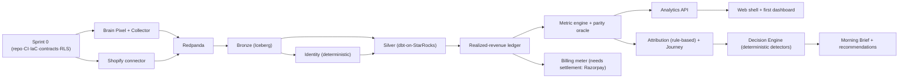

# Brain — Engineering Execution Plan (Architecture → Production)

**Product:** Brain — the AI-native commerce operating system for DTC brands (India launch; UAE/GCC later).
**Document type:** the authoritative **engineering execution plan** — what gets built, in what order, by whom, with what dependencies, milestones, risks, and success criteria. **Not** architecture/requirements/review — the architecture (docs 01–09 + the Attribution Engine Spec) is **frozen and immutable input.**
**Status:** Final v1. **Date:** 2026-06-15.
**Hard rule honored:** no new services, deployables, databases, ledgers, platforms, or patterns. **3 deployables + web** (collector · stream-worker · core monolith · Next.js web) + Argo jobs; Iceberg/StarRocks/dbt; single ledgers; one metric engine. Execution preserves the value chain: **Pixel + Integrations + Identity → Lakehouse → Customer 360 · Journey · Attribution · Measurement → Decision Engine → Recommendations → Outcomes → Learning** (doc 04 §2.5).
**Planning basis:** doc 04 §F (build order), §O.3 (phase-1a/1b/1c exits), §18 (team), doc 05 §14 (Sprint-0), doc 09 (detector catalog).

---

## 1. Executive summary
**Fastest architecture→production→first-paying-customer→first-recommendation path, without violating the architecture:**
Build the **thin vertical data spine first** (collector → Bronze → identity → ledger → metric engine → Analytics API → web shell) with **RLS from day one**, on **two connectors (Shopify + Meta)** and the **Brain Pixel**. That spine + a settlement connector (Razorpay) + the realized-GMV billing meter is **enough to charge a customer on honest measurement** — *before* the decision engine exists. The **first recommendation** then needs only a small deterministic detector set + confidence + Morning Brief on top of the same spine.

- **First customer (design partner, Sugandh Lok Aromas — the POC, spec §14):** ~end of **Month 3** (internal alpha → design-partner onboarding on a clean, reconciling attributed order ledger).
- **First paying customer:** ~**Month 4–5** — when the realized-GMV meter + sealed snapshot + inspectable bill + a value-proving dashboard/Morning Brief are live (billing is on *realized GMV*, not attribution — so it does **not** wait for the full attribution/decision stack).
- **First recommendation (real brand data, with expected impact + confidence + evidence):** ~**Month 5** — a deterministic detector subset over the metric engine.
- **Beta → GA:** **Month 5 → 6.**
**The discipline:** charge on *trustworthy measurement* early; let the *moat* (recommendations, learning) compound after. Recommend-only forever as default (doc 09).

## 2. Build strategy — **Hybrid (recommended)**
| Option | Verdict |
|---|---|
| A. Layer-by-layer | Right **for the data foundation** — it is a genuine hard-dependency chain (you cannot attribute before identity, cannot identity before Bronze) |
| B. Vertical slices | Right **for surfaces** — one metric end-to-end (event → Bronze → Silver → metric → API → web) proves the whole pipe and de-risks integration early |
| **C. Hybrid (chosen)** | **Layer the foundation, slice the surfaces.** Build the foundation bottom-up but validate it with **one thin vertical slice** (a single metric: realized revenue) running end-to-end in Phase 1a, then widen. |
**Why:** a pure layer-by-layer build risks 3 months with nothing demoable and a big-bang integration; pure vertical slices risk building attribution before the identity/ledger foundation is trustworthy (the exact error the spec §6 forbids). Hybrid gets a **reconciling number on screen in ~6 weeks** while keeping the foundation sound. Challenged and upheld by the board.

## 3. Critical path & dependency graph

- **Hard dependencies (cannot parallelize):** Bronze → Identity → ledger → metric engine → Analytics API; settlement connector → billing meter; metric engine → attribution → decision engine.
- **Soft dependencies:** web shell can start against mocked contracts; Meta/Google connectors parallel to Shopify once the connector SDK exists; Customer 360 can lag identity by a sprint.
- **Parallel work streams:** (a) data spine, (b) pixel+collector+connectors, (c) control plane (auth/RBAC/RLS/billing scaffold), (d) web shell. **The single biggest blocker is the data engineer** — hire first (doc 04 §18).
- **The true critical path:** `Sprint 0 → Collector/Bronze → Identity → Ledger → Metric engine → Analytics API → (billing meter | attribution → decision engine)`.

## 4. Engineering organization plan
| Scenario | Structure | Ownership | Delivery expectation |
|---|---|---|---|
| **A — Founder + 2** | 1 full-stack/backend, **1 data engineer** | founder=product+frontend; eng1=collector+core+API; data=lakehouse+identity+metrics | Spine + 1 connector + 1 dashboard in ~3–4 mo; **too thin for GA in 6 mo** |
| **B — Founder + 5 (recommended)** | 2 backend (collector+stream / core+control-plane), **2 data** (lakehouse+dbt / identity+attribution), 1 platform/SRE; founder=product+frontend (or +1 FE) | clean module ownership; data is the constraint, so double it | **Phase-1 GA in ~6 mo**; first paying customer Month 4–5 |
| **C — Founder + 10** | + dedicated FE(1), + backend(1 connectors), + AI/ML(1 decision/NLQ), + QA(1) | parallel connector + decision-engine + web tracks | faster surfaces, **but coordination overhead**; data foundation still gates — extra hands can't compress the hard chain |
**Recommendation: Scenario B.** The critical path is data, not headcount; 5 well-placed engineers (data-heavy) ship Phase 1. **Hire order: data engineer → platform/SRE → backend → frontend.** Beyond ~7, the hard dependency chain (not staffing) is the limit — Brooks's law applies.

## 5. Sprint 0 plan (before any production coding)
From doc 05 §14. **Exit = a hello-world event flows pixel→collector→Redpanda→Bronze in CI, behind RLS, with contracts generated.**
- **Repo/monorepo:** Turborepo + pnpm; `apps/{collector,stream-worker,core,web}` + `packages/*` (contracts, metric-engine, tenant-context, identity-core, db, events, observability, ai-gateway-client, config, ui, money, audit, feature-flags, **pixel-sdk**); import-boundary lint (`apps/`↛`apps/`).
- **CI/CD:** GitHub Actions; `turbo --affected` deploy matrix; per-deployable build/scan/sync; ArgoCD on EKS.
- **IaC/AWS:** Terraform; **ap-south-1 single region**; one EKS cluster (namespaced collector/consumers/core/jobs); RDS Postgres (Multi-AZ + PITR), ElastiCache Redis, S3+Glue (Iceberg), managed **Redpanda Cloud**, **StarRocks**, **LiteLLM** gateway, managed IdP/Authentik.
- **Local dev:** Docker Compose profiles (collector-path / serving-path / control-plane); default `up` = control-plane + serving; LocalStack + Testcontainers for CI.
- **Contracts:** `packages/contracts` (Zod → types/OpenAPI/Avro/MCP) — the single source of truth; codegen wired into CI.
- **DB migrations:** `node-pg-migrate` + `packages/db`; RLS policies + the non-owner app role from migration #1.
- **Standards:** code (eslint/prettier, snake_case DB, minor-units money lint), testing (Vitest + Testcontainers + the parity-oracle harness), security (KMS secrets, no-PII-in-logs lint, isolation-fuzz test skeleton), observability (Grafana Cloud, OTel, correlation IDs), **feature flags** (`packages/feature-flags`), env strategy (dev/staging/prod), the **isolation negative-test** and **parity-oracle** CI gates stubbed.

## 6. Phase 1 build plan (milestones)
| # | Milestone | Objective | Scope | Depends on | Risk | Acceptance |
|---|---|---|---|---|---|---|
| M0 | Sprint 0 | buildable repo + infra | §5 | — | infra yak-shaving | event flows to Bronze in CI behind RLS |
| M1 | **Spine (1a)** | one reconciling number | collector+pixel, Shopify, Redpanda, Bronze, deterministic identity core, `realized_revenue_ledger`, metric engine, Analytics API, web shell, **RLS** | M0 | medallion+parity is the riskiest surface | realized-revenue number on screen, parity oracle green, isolation test passes |
| M2 | **Measurement (1b)** | CM2 truth + billing | +Google Ads, +Razorpay settlement, CM waterfall + **True CM2**, DQ grades + gating + cost-confidence + FX, **billing meter + sealed snapshot + inspectable bill + GST invoice**, Customer 360, identity review-queue UI | M1 | cost-confidence + settlement timing | bill reproducible from ledger; CM2 shown with confidence |
| M3 | **Attribution + surfaces (1b/1c)** | honest attribution + dashboards | rule-based attribution (position-based) + clawback, journey (`silver.touchpoint`), channel-contribution (rule-based), dashboards + **Morning Brief**, tracking-plan surface, read-only MCP, NLQ (descriptive/diagnostic) | M2 | attribution honesty/unattributed bucket | attributed revenue reconciles to order ledger net RTO/refund within tolerance (spec §15) |
| M4 | **Decision Engine (1c)** | first recommendations | deterministic detectors (subset), confidence engine, recommendation contract + evidence, Decision Log, feedback loop | M3 | false positives / fatigue | a real-data recommendation with expected ΔCM2 + confidence + evidence |
| M5 | **Hardening → GA** | reliability + scale | SLOs, DR drill, load test, security review, isolation fuzz at scale, docs/runbooks | M1–M4 | scale unknowns | GA readiness checklist (§14) |

## 7. Data foundation execution plan (the most important section)
**Brain Pixel (`packages/pixel-sdk` → `brain.js`):** SDK first (anon-id + 30-min session, click-ID/UTM capture, `_fbc`/`_fbp`, **event queue + offline retry**, consent-at-capture, **cart-attribute stitch writer**), versioned, size-budgeted, non-blocking. Browser SDK → Shopify Web Pixel extension + theme injection → Woo plugin (later). Deploy as a static first-party asset over the per-tenant **CNAME** with the **server-side cookie setter** in the collector (defeats ITP). *Build in M1.*
**Collector:** accept-before-validate → **durable spool** (the 99.95% guarantee lives here) → Redpanda; webhook receiver (HMAC + idempotency); retries; server-side cookie setter. *M1.*
**Connector platform:** the connector SDK (OAuth → idempotent UPSERT → canonical events → Bronze archive → cursors → late-repull) + the **"new source = a folder under `sources/`"** rule (doc 05 §3.1/§3.3). *M1.*
**Initial connector order (validated):**
1. **Shopify** (M1) — the order ground truth; nothing reconciles without it.
2. **Meta** (M1) — the dominant DTC spend; proves spend↔attribution join.
3. **Google Ads** (M2) — second spend channel; completes MER.
4. **Razorpay + settlement** (M2) — **gates billing** (realized GMV needs settlement) and finalization.
5. **Logistics/Shiprocket** (M3) — RTO/NDR for True CM2 and RTO detectors.
*Rationale:* orders → spend → settlement → logistics mirrors the value chain and unblocks billing (Razorpay) before the moat. WhatsApp/influencer follow as channels in Phase 2.
**Identity — when & how much:** build the **deterministic core in M1** (alias graph, hashed email/phone/customer-id/cookie, async resolution, phone-guard keep-apart) *before* attribution — attribution is meaningless without it (spec §3). **Enough-for-V1:** deterministic-only + the cart-stitch + the review-queue UI (M2). Probabilistic stitching is **Phase 2** (reserved). Do **not** build probabilistic identity before the deterministic base reconciles (spec §6.4).

## 8. Lakehouse execution plan
**Build order:** Bronze (Iceberg/S3+Glue, append-only, `bucket(brand_id)+days` partitioning, per-brand KMS) → Silver (dbt-on-StarRocks PK tables, dedup on `(brand_id,event_id)`, server-wins) → ledger + Gold marts → StarRocks serving + Analytics API.
**Migration order:** RLS + app-role first; control-plane tables; identity; ledger; then dbt models staging→Silver→Gold (additive, idempotent).
**Testing:** dbt tests (freshness, null, row-count, contract) + the **parity oracle** (TS metric engine vs independent reference on golden fixtures, CI-blocking) + the **runtime convergence monitor** (StarRocks vs Bronze recompute, **hourly** in Phase 1 — continuous is premature <100 brands, doc 04 §347) + isolation negative-tests.
**Acceptance:** every Gold number traces to `raw_event_id` (lineage §26); a full rebuild from Bronze reproduces Silver/Gold; parity green.

## 9. Customer 360 / Journey / Attribution plan
- **Required-before order:** identity (M1) → ledger (M1) → Customer 360 (M2, derived) → journey (M3, derived `silver.touchpoint`) → attribution (M3).
- **Avoid premature complexity:** Customer 360 = a derived read model (not a SoR); journey = derived/replayable (not a service); attribution V1 = **rule-based position-based only** + clawback + the **always-shown unattributed bucket** + confidence band. **No Markov/Shapley/MMM/view-through in Phase 1** (reserved, spec phasing).
- **How much attribution is enough for V1:** position-based credit on the realized-revenue ledger, RTO/refund clawback, channel-contribution (rule-based), the unattributed bucket, and a confidence band — enough to be *honest and reconciling*. That is the bar (spec §15), not model sophistication.

## 10. Decision Engine execution plan (smallest viable)
**Minimum for production (M4):** ~6 deterministic detectors from the doc 09 catalog — **scale spend, cut wasted spend, RTO mitigation, margin alert, restock, attribution/data-quality warning** — + the **confidence engine** (`effective_confidence = min(...)`, watch-vs-do gate) + the **recommendation contract** (title/evidence/expected ΔCM2/confidence/urgency) + the **Decision Log** + the **Morning Brief** selection/dedup/fatigue logic + the feedback capture.
**Deferred (Phase 2+):** the learning loop *tuning* (effectiveness→threshold auto-mute can ship thin), conflict-arbitration depth, goal-aware weighting, assisted-execute, all ML. **Required for the Morning Brief:** detectors + confidence + evidence + prioritization + LLM narration (LiteLLM, narrate-only). **Recommend-only**, no execution.

## 11. API & event implementation plan
- **Contract-first workflow:** author Zod in `packages/contracts` → generate types/OpenAPI/Avro/MCP → implement → contract tests (Pact-style + buf-breaking for events). Nothing is built before its contract.
- **API sequence:** auth/RBAC → connector ops → Analytics API (the sole read path, registry-bound) → billing → recommendation/Decision-Log → MCP read-only → NLQ.
- **Event sequence:** `collection.*` (M1) → `connector.order/settlement/shipment/ad_spend` (M1–M3) → `identity.*` (M1) → `finance.ledger.*` + reversals (M2) → `attribution.credit.*` (M3) → `dq.*`/`billing.*` (M2) → `recommendation.*`/`decision.recorded` (M4).
- **Versioning:** FULL_TRANSITIVE; breaking → `.v{n+1}` + dual-write/dual-read (doc 07 §32). Replay-compat gate in CI.

## 12. Quality engineering strategy
| Test type | Phase-1 requirement |
|---|---|
| Unit | every module; metric engine 100% on golden fixtures |
| Integration | Testcontainers (real Postgres/Redpanda/StarRocks/MinIO) |
| **Contract** | every API + event (CI-blocking) |
| **Isolation** | brand-A↛brand-B at API/DB/StarRocks/MCP — **P0, must pass before any launch** |
| **Parity (attribution accuracy)** | reconciliation to order ledger net RTO/refund within tolerance (spec §15) — **launch gate** |
| Data quality | dbt tests + freshness SLOs |
| E2E | pixel→Bronze→metric→API→web, one golden brand |
| Load | festival-peak EPS (doc 07 §22) — before GA |
| Security | KMS, no-PII lint, dependency/container scan, isolation — before beta |
| Recommendation quality | detector precision on the design-partner's data — before recommendations ship |
**Must exist before launch:** isolation, parity/reconciliation, contract tests, no-PII. Load/recommendation-quality before GA/recommendations respectively.

## 13. DevOps & platform plan
- **Infra rollout:** Terraform state + ap-south-1 networking → EKS + ArgoCD + Karpenter → RDS/Redis/S3+Glue → Redpanda Cloud + StarRocks + LiteLLM → Grafana Cloud/observability → secrets (KMS+Secrets Manager).
- **Environments:** dev → staging → prod (one region); ephemeral preview optional.
- **Deploy:** ArgoCD GitOps; `turbo --affected` matrix; progressive-delivery/canary is **Phase 4** (not now).
- **Observability:** OTel traces, structured logs (PII-redacted), metrics, correlation IDs, SLO dashboards; collector accept+ack 99.95%, product 99.9%.
- **Backup/DR:** RDS PITR (RPO ≤5min) + 35-day snapshots; S3 versioning + Iceberg snapshots; StarRocks **rebuilds from Bronze** (RTO 2–4h); **quarterly `brand_keyring` restore drill** (the crown jewel, doc 08 §16).
- **Cost mgmt:** managed services + single region + hourly (not continuous) parity + small CMK set + tiered storage + 24-mo Bronze TTL; per-brand cost attribution (doc 08 §31).

## 14. Launch readiness plan
| Stage | Functionality | Reliability | Scale | Support |
|---|---|---|---|---|
| **Internal Alpha (M2)** | spine + 1–2 connectors + 1 dashboard | best-effort | 1 brand (Sugandh Lok) | founder-led |
| **Design Partner (M3)** | measurement + CM2 + attribution + Morning Brief | parity green, isolation passes | 1–3 brands | white-glove |
| **Beta (M5)** | + decision engine + billing + MCP/NLQ | SLOs met, DR drill done, security reviewed | ~10 brands, festival load tested | shared on-call |
| **GA (M6)** | full Phase-1 | 99.9% product / 99.95% collector | 50+ brands | on-call + status page |

## 15. First customer path (design partner — Sugandh Lok)
- **Day 0:** connect Shopify + Meta (OAuth), install the Brain Pixel via the Shopify Web Pixel extension on the CNAME; consent configured.
- **Day 1:** events flowing to Bronze; deterministic identity resolving; the **honest-but-immediate** surface (Day-0 posture) shows collected data with explicit "building your baseline."
- **Day 7:** realized-revenue + CM2 (Estimated) + rule-based attribution + the unattributed bucket; match-rate/coverage health shown.
- **Day 30:** finalized recognition cycle, True CM2, Customer 360, the first **Morning Brief** with watch-level signals; reconciliation to the order ledger demonstrated.

## 16. First paying customer path (minimum to charge)
**Brain charges %-of-realized-GMV — so the minimum is the *measurement* stack, not the moat:** collector + Shopify + **Razorpay settlement** + `realized_revenue_ledger` (finalized) + the **billing meter + sealed `gmv_meter_snapshot` + inspectable bill + GST invoice** + a **value-proving surface** (dashboard/Morning Brief showing honest CM2 + attribution). **Does NOT require:** the full decision engine, recommendations, ML, MMM, or multi-model attribution. **Challenge upheld:** do not build recommendations to get first revenue — bill on trustworthy measurement; the value proof is honesty (CM2/realized revenue the platforms can't show). Target **Month 4–5**.

## 17. First recommendation path (minimum end-to-end)
Real-data recommendation = **expected impact + confidence + evidence**. Minimum flow: events → Bronze → identity → ledger → metric engine → **one detector** (e.g. *cut wasted spend*: channel incremental CM2 ≤ 0 & spend material) → confidence (`min(...)`) → recommendation contract (title/evidence/expected ΔCM2/confidence) → Morning Brief → Decision Log. **One detector end-to-end proves the moat.** Target **Month 5** (M4). Expand the catalog after.

## 18. Risk register
| Risk | Type | Sev | Likelihood | Mitigation |
|---|---|---|---|---|
| Medallion/parity is the hardest surface | Technical | High | High | hire data engineer first; parity oracle CI gate from M1 |
| Attribution looks "wrong" vs Meta | Product | High | High | the "why Brain is lower (and honest)" reconciliation view; unattributed bucket always shown |
| Cross-brand data leak | Data | **Critical** | Low | RLS day-one + isolation fuzz at every layer; P0, SLO=0 |
| Identity false-merge (shared COD phone) | Identity | High | Med | phone-guard keep-apart, shared-utility suppression, review queue (doc 08 §24) |
| COD/RTO inflates early numbers | Attribution | High | High | settled-label discipline (spec §6.4) = Brain's core; provisional→finalized |
| Settlement/connector delays block billing | Operational | High | Med | Razorpay settlement is a named M2 dependency; honest "data delayed" states |
| Festival load (Diwali/BFCM) | Operational | Med | High | tiered storage + throttled backfill + load test before GA (doc 07 §31) |
| Data engineer is a single point | Team | High | Med | hire 2 data (Scenario B); document the pipeline |
| Scope creep into ML/recommendations early | Execution | High | High | this plan's deferrals; recommend-only; reject premature ML |
| Connector sprawl | Execution | Med | Med | folder-not-branch rule; 5-connector V1 cap |

## 19. Cost & resource planning
- **Engineering effort (Scenario B, ~6 mo):** Sprint 0 ~3–4 eng-wks; M1 spine ~12–16; M2 measurement+billing ~12; M3 attribution+surfaces ~10; M4 decision engine ~6; M5 hardening ~8. Data-heavy.
- **Infra cost drivers:** Redpanda Cloud, StarRocks (largest serving cost), RDS Multi-AZ, S3/Iceberg storage growth, EKS, LiteLLM **model spend** (cost-routed; deterministic ≫ model), Grafana Cloud.
- **Cost-saving / avoid-overengineering:** managed services over self-host; **single region** until GCC trigger; **hourly** parity (not continuous) <100 brands; small CMK set (not per-brand CMK); 24-mo Bronze TTL + compaction; **defer** MMM/ML/holdouts/probabilistic-identity/multi-region/progressive-delivery; cache (Redis) to cut StarRocks + model calls. **Do not build:** a feature store, an experimentation platform, autonomous execution, or any Phase-2/3 reservation in Phase 1.

## 20. Master delivery roadmap
| Month | Milestone | Critical-path deliverable | Success criteria |
|---|---|---|---|
| **1** | Sprint 0 + spine start | repo/CI/IaC/contracts/RLS; collector+pixel; Shopify; Bronze | event→Bronze in CI behind RLS |
| **2** | **M1 spine + Internal Alpha** | identity core, ledger, metric engine, Analytics API, web shell, Meta | reconciling realized-revenue number; parity green; isolation passes |
| **3** | **M2/M3 measurement+attribution + Design Partner** | Google+Razorpay-settlement, CM2/True CM2, billing meter, Customer 360, rule-based attribution, journey, Morning Brief | attribution reconciles to order ledger (spec §15); design partner live |
| **4** | **Billing live → First paying customer** | sealed snapshot + inspectable bill + GST invoice; logistics connector | a brand billed on realized GMV |
| **5** | **M4 Decision Engine + Beta → First recommendation** | deterministic detectors, confidence, evidence, Decision Log, MCP/NLQ | real-data recommendation w/ impact+confidence+evidence; beta ~10 brands |
| **6** | **M5 Hardening → GA** | SLOs, DR drill, load test, security review | GA readiness checklist met |

## 21. Negative review (try to break the plan)
- **Overbuilt risk:** the identity *review-queue UI* and full Customer 360 before first revenue — **defer review-queue polish to M3**, keep deterministic identity in M1. The 9-sub-score confidence mart can ship with fewer sub-scores initially.
- **Underbuilt risk:** **observability + isolation testing** if rushed — these are non-negotiable from Sprint 0 (a leak is existential). **Settlement/finalization** is subtle and on the billing critical path — don't underestimate M2.
- **Can be delayed/cut:** MMM, holdouts, probabilistic identity, multi-model attribution, view-through, NLQ-diagnostic depth, MCP write, WhatsApp/influencer connectors, progressive-delivery, multi-region — all Phase 2+.
- **Delivery risk:** the **data engineer is the bottleneck** — Scenario A (founder+2) likely slips GA past 6 mo; Scenario B is the floor for the 6-mo plan.
- **What prevents first revenue:** missing **settlement** (Razorpay) or the billing meter — both are explicit M2/M4 dependencies, sequenced early.
- **What prevents first recommendation:** trying to ship the *full* catalog/learning loop — **one detector end-to-end is enough**; resist scope creep.
- **Biggest self-inflicted risk:** building the moat (recommendations/ML) before the foundation reconciles — the plan structurally forbids it (parity gate before attribution; attribution before decision engine).

## 22. Final recommendation
**Execute the Hybrid plan with Scenario B (founder + 5, data-heavy), hiring the data engineer first.** Build the thin vertical spine (M1) to get a reconciling number in ~6 weeks, complete measurement + billing (M2) to **charge on honest realized-GMV by Month 4–5**, add rule-based attribution + Morning Brief (M3), then the **smallest viable deterministic decision engine (M4)** for the first real-data recommendation by Month 5, and harden to GA by Month 6. **Charge on trustworthy measurement early; let the recommendation/learning moat compound after.** Defer every Phase-2/3 reservation. This is the fastest route to production → first paying customer → first recommendation **without touching the frozen architecture.**

---

*End of Engineering Execution Plan. Immutable inputs: docs `01`–`09` + `Brain_Attribution_Engine_Spec`. No architecture changed; 3 deployables + web preserved. Build order/Sprint-0 basis: doc 04 §F/§O.3, doc 05 §14.*
