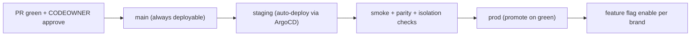

# Brain — Final Delivery Artifacts (Pre-Implementation)

**Product:** Brain — AI-native commerce OS for DTC brands (India launch).
**Document type:** the three operational artifacts required **before Sprint 0** — (1) the **Engineering Operating Model**, (2) the **Sprint 0 Detailed Execution Plan**, (3) the **Sugandh Lok Design-Partner Validation Plan**. Goal: a newly-hired VP Eng can run engineering, execute Sprint 0, onboard the design partner, and reach first paying customer + first recommendation **without further planning docs.**
**Status:** Final v1. **Date:** 2026-06-15.
**Frozen (immutable inputs):** docs 01–11 + the Attribution Engine Spec. **Operational only — no architecture/requirements/services/deployables/databases/ledgers/platforms change.** 3 deployables + web.
**Tuning:** startup-lean. Every practice below earns its place by *materially improving quality or reducing risk* — ceremony that only slows delivery was rejected (see the inline **[rejected]** notes).

---

# ARTIFACT 1 — Brain Engineering Operating Model

## 1. Engineering principles (and their daily impact)
| Principle | Daily decision impact |
|---|---|
| **Contract-first** | No code before its Zod contract in `packages/contracts`; PRs that change behavior change the contract first → codegen → impl. "Where's the contract?" is the first review question. |
| **Data-first** | The lakehouse is the product; a feature isn't done until its data reconciles and is replayable. Schema/lineage decisions outrank UI polish. |
| **Replayability-first** | Never mutate history; everything derives from append-only Bronze + ledgers. "Can we rebuild this from raw?" must always be yes. No destructive migrations on event/ledger data. |
| **Deterministic-first** | Compute in code, not in a model; the LLM narrates, never decides/calculates (doc 09). Reach for an LLM only after deterministic + statistical options fail (cost-routing). |
| **Measurement-first** | Every number traces to a `metric_version` + snapshot; the parity oracle is sacred. No number ships that the oracle can't reproduce. |
| **Simplicity-first** | A new source/capability is a **folder, not a new service** (doc 05 §3.1). Reject new deployables/databases/ledgers reflexively; the burden of proof is on adding, not omitting. |

## 2. Repository governance
- **One monorepo** (Turborepo + pnpm). Ownership via **`CODEOWNERS`** (the only "process" — review is required from the owner, enforced by GitHub).
- **App ownership:** `collector`/`stream-worker` → Backend-1; `core` → Backend-2 (+ module owners); `web` → Founder/FE.
- **Package ownership:** `contracts` → whoever changes the contract + the consuming-domain owner; `metric-engine`/`identity-core`/`money`/`db` → Data; `pixel-sdk` → Backend-1; `observability`/`config`/`feature-flags` → Platform; `audit` → Platform/Security.
- **Module ownership (`core/modules/*`):** one named owner per module (the §4 of doc 05 list).
- **Approval rule:** 1 reviewer for normal PRs; **2 for** contract changes, migrations, RLS/isolation, ledger, or anything touching `packages/metric-engine` (one must be the CODEOWNER). **[rejected: mandatory architecture-board review on every PR — replaced by CODEOWNERS + the §11 change process for frozen decisions.]**

## 3. Git strategy
- **Trunk-based with short-lived branches** (`feat/…`, `fix/…`); branch life ≤ 2–3 days. **[rejected: GitFlow — too heavy for 5–6 engineers.]**
- **PRs:** small, single-purpose; linked to a task; green CI required; squash-merge to `main`.
- **Merge requirements:** CI green (lint, type, unit, contract, isolation, parity on affected) + required CODEOWNER approval + no unresolved threads.
- **Release branching:** none in Phase 1 — `main` is always deployable; releases are tags off `main` (cut a `release/x.y` branch only if a hotfix must skip in-flight work). Feature flags decouple deploy from release.

## 4. Code review checklists
**All:** contract-first? tenant-scoped (brand_id/RLS)? no raw PII in logs/events? tests + acceptance? reversible/replayable?
- **Backend:** idempotent? error handling + retries? auth/RBAC enforced? no cross-module reach-around (only `index.ts`)?
- **Data:** dedup on `(brand_id,event_id)`? rebuildable from Bronze? dbt tests + freshness? lineage (`raw_event_id`)? parity oracle unaffected/updated?
- **Frontend:** reads only via Analytics API (no business logic)? confidence/freshness shown? locale/currency (minor units)? loading/empty/error states?
- **Platform:** IaC change reviewed? least-privilege IAM? cost impact noted? rollback path?
- **Security:** secrets via KMS/Secrets-Manager (never in code)? isolation negative-test covers it? consent/no-PII respected?
- **Performance:** query bounded (no full scans)? cache where hot? StarRocks distribution sane?
- **Observability:** structured logs + correlation ID? metric/trace emitted? alert if it can fail silently?

## 5. Testing strategy
| Type | What | Coverage / gate | Launch requirement |
|---|---|---|---|
| Unit | pure logic; **metric-engine 100% on golden fixtures** | block on fail | yes |
| Integration | Testcontainers (real PG/Redpanda/StarRocks/MinIO) | critical paths | yes |
| **Contract** | every API + event (Pact-style + buf-breaking) | block on breaking | yes |
| **Replay** | rebuild Silver/Gold from Bronze → identical | nightly + pre-release | yes (before attribution) |
| **Data quality** | dbt tests + freshness SLOs | block publish | yes |
| **Attribution** | reconciliation to order ledger net RTO/refund within tolerance | pre-M3 gate | **launch gate** |
| **Decision engine** | detector precision on golden cases; eligibility-unwritable | pre-M4 | before recs ship |
| **E2E** | pixel→Bronze→metric→API→web, 1 golden brand | pre-release | yes |
| **Isolation** | brand-A↛brand-B at API/DB/StarRocks/MCP | **block — P0** | **mandatory before any launch** |
| Load | festival EPS (doc 07 §22) | pre-GA | before GA |
| Security | SAST/deps/containers + no-PII lint | block on high | before beta |
**Non-negotiable before launch:** isolation, parity/reconciliation, contract, no-PII. Others gated to their phase.

## 6. Definition of Done
- **Feature:** contract + impl + tests (unit/integration/contract) + observability + docs + reconciles + behind a flag + CODEOWNER-approved.
- **Connector:** OAuth + idempotent UPSERT + canonical events + Bronze archive + cursor/late-repull + health states + contract tests + a folder under `sources/` (no engine edit).
- **API:** Zod contract → generated OpenAPI/types → impl → contract test → RLS-scoped → rate-limited → registry-bound (Analytics) → versioned.
- **Event:** Zod → Avro/Apicurio (FULL_TRANSITIVE) → single producer → ≥1 named consumer or "reserved" → no-PII → catalog entry → replay-compat.
- **Data-model change:** migration (RLS-aware, non-destructive) + dbt updated + lineage intact + replay test + parity unaffected + 2 approvals.
- **Decision-engine rule:** registered `detector_definition` (versioned) + binds only to certified metrics + confidence inputs + suppression + golden test + Decision Log wiring.

## 7. Release management

- **Promotion:** merge→staging auto; prod promote on green smoke (manual approve in Phase 1; VP Eng owns release). **Rollback:** ArgoCD revert to last-good + **feature-flag-off per brand** (60s) — no redeploy needed for behavioral kill. Progressive-delivery/canary is Phase-4 (not now). **Flags:** `packages/feature-flags` — `connector.<type>.enabled`, `recommendation.<detector>.enabled`, `ai.<capability>.enabled`, `beta.<feature>`; audited; **not** a targeting engine.

## 8. Observability standards
- **Logging:** structured JSON, correlation ID on every request/event, **PII-redacted** (lint-enforced).
- **Metrics:** RED (rate/error/duration) per service + business metrics (events/s, accept+ack, resolution rate).
- **Tracing:** OTel across collector→stream→core→API; model/tool spans for AI (gen_ai.* conventions).
- **Alerts:** SLO-burn (collector 99.95% accept+ack, product 99.9%), DLQ growth, freshness breach, parity drift, isolation-test failure (page).
- **Dashboards:** per-deployable health; **data-quality** (DQ grades, freshness); **parity** (StarRocks vs Bronze recompute, hourly); **attribution** (reconciliation tolerance, match-rate, unattributed bucket). Grafana Cloud.

## 9. Security standards
- **Identity/IAM:** managed IdP; least-privilege IRSA per workload; app connects to PG as a **non-owner role** (no BYPASSRLS).
- **PII:** SHA-256 hashed identifiers only outside the `contact_pii` KMS vault; **crypto-shred** erasure (per-brand key destroy); no raw PII in events/logs/Bronze.
- **Tenant isolation:** RLS day-1; `brand_id` on every row/key/log; **isolation fuzz at every layer**; a leak is **P0, SLO=0**.
- **Secrets:** KMS + Secrets Manager; never in code/env files; rotation policy.
- **Audit:** `audit_log` hash-chain (append-only, WORM-anchored) for every sensitive action.
- **Incident response:** see §10; the consent/send chokepoint + no-PII are compliance invariants.

## 10. Incident management
| Sev | Definition | Response | Resolution target |
|---|---|---|---|
| **Sev-1** | data leak / data loss / billing wrong / full outage | page now; Incident Commander | mitigate < 1h |
| **Sev-2** | degraded (parity drift, connector down, partial outage) | page on-call | < 4h |
| **Sev-3** | minor/no customer impact | next business day | next sprint |
**Escalation:** on-call → EM → VP Eng → CTO. **Postmortems:** blameless, within 48h for Sev-1/2, → lessons-learned tasks. **Ownership:** Platform/SRE runs the process; the owning stream fixes. **Kill switches:** feature-flag-off per brand/capability (60s).

## 11. Architecture change process
- **Frozen decisions** (3 deployables, single ledgers, Iceberg/StarRocks, identity graph, metric engine, RLS, no-PII) change **only** via an **ADR** proposed by anyone, reviewed by the **Principal Architect**, approved by the **CTO**, and **only on a proven critical flaw or a fired scale-trigger** (doc 05 §1A.4). **[rejected: open-ended "architecture review meetings" — ADR-or-nothing.]**
- **Non-frozen** (a new module folder, a new connector, a new metric, a dbt model) follows normal CODEOWNERS review.
- Every ADR records context/decision/consequences/revisit-trigger; lives in `docs/adr/`.

---

# ARTIFACT 2 — Sprint 0 Detailed Execution Plan

**Goal:** a production-grade engineering *foundation* — **no business features, no attribution, no decision engine.** Duration **2 weeks** (doc 11 W1–2). Effort in eng-days (ed). Owners: Platform(P), Backend-1(B1), Backend-2(B2), Data-1(D1), Data-2(D2), Founder/FE(F).

## Workstream A — Repository setup
| Task | Owner | Dep | Acceptance | Effort |
|---|---|---|---|---|
| Turborepo+pnpm monorepo; `apps/*` + `packages/*` skeleton | B2 | — | `pnpm i && turbo build` green | 1.5ed |
| Import-boundary lint (`apps/`↛`apps/`; `metric-engine` import rule) | B2 | skeleton | lint fails on violation | 0.5ed |
| `CODEOWNERS` + PR template + branch protection | P | skeleton | owner approval enforced | 0.5ed |
| `tsconfig.base`, eslint/prettier, money-minor-units lint | B1 | skeleton | lint catches float-money | 0.5ed |

## Workstream B — Developer experience
| Task | Owner | Dep | Acceptance | Effort |
|---|---|---|---|---|
| Docker Compose profiles (collector-path/serving-path/control-plane) | P | A | `docker compose up` brings control+serving | 2ed |
| Testcontainers + Vitest harness; parity-oracle test scaffold | D1 | A | sample integration test passes in CI | 1.5ed |
| Makefile/justfile dev commands; README quickstart | F | A | new dev runs locally < 30 min | 0.5ed |

## Workstream C — Contracts foundation
| Task | Owner | Dep | Acceptance | Effort |
|---|---|---|---|---|
| `packages/contracts` Zod → types/OpenAPI/Avro/MCP codegen | B2 | A | one sample event+API generates all artifacts | 2ed |
| Contract CI gate (buf-breaking + Pact stub + replay-compat stub) | B2 | codegen | breaking change fails CI | 1ed |
| Apicurio registry wiring (FULL_TRANSITIVE) | D2 | infra E | schema registers/validates | 1ed |

## Workstream D — Infrastructure foundation
| Task | Owner | Dep | Acceptance | Effort |
|---|---|---|---|---|
| Terraform state + ap-south-1 VPC/networking | P | — | `terraform apply` clean | 2ed |
| EKS + Karpenter + ArgoCD | P | VPC | cluster up; ArgoCD syncs a hello app | 2ed |
| RDS Postgres (Multi-AZ, PITR), ElastiCache Redis, S3+Glue | P | VPC | reachable from cluster | 1.5ed |
| IAM/IRSA least-privilege roles per workload | P | EKS | workloads assume scoped roles | 1ed |
| dev/staging/prod env split | P | above | 3 envs provisioned | 1ed |

## Workstream E — Platform foundation
| Task | Owner | Dep | Acceptance | Effort |
|---|---|---|---|---|
| Redpanda Cloud cluster + topic IaC | P | D | produce/consume a test topic | 1ed |
| Iceberg (S3+Glue) catalog + Bronze table format + partition spec | D1 | D | write/read a Bronze test table | 1.5ed |
| StarRocks cluster + external Iceberg catalog | D1 | D | query Bronze from StarRocks | 1.5ed |
| LiteLLM gateway deploy (no app use yet) | P | EKS | gateway health green | 0.5ed |

## Workstream F — Security foundation
| Task | Owner | Dep | Acceptance | Effort |
|---|---|---|---|---|
| KMS + Secrets Manager; secret-injection pattern | P | D | app reads a secret via IRSA | 1ed |
| RLS + non-owner app role in migration #1 (`packages/db`+node-pg-migrate) | D2 | RDS | RLS blocks cross-brand by default | 1.5ed |
| Isolation negative-test harness (CI) | D2 | RLS | brand-A→brand-B returns 0 rows/403 | 1ed |
| no-PII-in-logs lint + PII-hash helper (`identity-core`) | B1 | A | lint catches a raw-email log | 0.5ed |

## Workstream G — Observability foundation
| Task | Owner | Dep | Acceptance | Effort |
|---|---|---|---|---|
| Grafana Cloud + OTel collector; structured logging lib (`packages/observability`) | P | D | a trace + log appear with correlation ID | 1.5ed |
| SLO dashboards + burn alerts (collector/product) | P | above | alert fires on synthetic breach | 1ed |
| Parity + DQ dashboard skeletons | D1 | StarRocks | panels render (empty ok) | 0.5ed |

## Workstream H — CI/CD foundation
| Task | Owner | Dep | Acceptance | Effort |
|---|---|---|---|---|
| GitHub Actions + `turbo --affected` deploy matrix | P | A | only changed deployables build | 1.5ed |
| Quality gates wired (lint/type/unit/contract/isolation/parity) | B2 | C,F | a failing gate blocks merge | 1ed |
| ArgoCD app-of-apps; staging auto-deploy; prod promote | P | D | merge→staging auto; prod manual | 1.5ed |
| Rollback (ArgoCD revert) + feature-flag-off drill | P | flags | revert + flag-off verified | 0.5ed |

## Sprint 0 exit criteria (binary — all must be ✅)
1. ☐ `pnpm i && turbo build` green; import-boundary lint enforced.
2. ☐ A hello-world event flows **pixel→collector→Redpanda→Bronze** in CI.
3. ☐ StarRocks queries a Bronze test table via the Iceberg catalog.
4. ☐ Contracts codegen produces types/OpenAPI/Avro/MCP; breaking-change fails CI.
5. ☐ **RLS on; isolation negative-test passes** (brand-A→brand-B = 0 rows/403).
6. ☐ Secrets via KMS/IRSA; no-PII-log lint active.
7. ☐ Trace + structured log with correlation ID visible in Grafana; SLO alert fires on synthetic breach.
8. ☐ CI deploy matrix builds only affected deployables; staging auto-deploys; prod promote + rollback + flag-off verified.
9. ☐ Parity-oracle test scaffold runs in CI (green on a trivial fixture).
10. ☐ 3 environments (dev/staging/prod) provisioned via Terraform.
**No business logic, no attribution, no decision engine** — foundation only. **[rejected: a 4-week Sprint 0 — 2 weeks is the cap; anything not above is deferred to M1.]**

---

# ARTIFACT 3 — Sugandh Lok Design-Partner Validation Plan

## 1. Goals — prove / don't-prove
**Must prove:** (a) Brain reconstructs a **brand-owned, reconciling** attributed order ledger that ties to Shopify net RTO/refund; (b) Brain's realized-revenue + **True CM2** is **more honest** than the partner's incumbent (Meta/dashboards); (c) Brain surfaces **≥1 acted-on recommendation** with impact+confidence+evidence; (d) the partner will **pay** on realized GMV.
**Need NOT prove (Phase 1):** MMM, holdouts/incrementality, modeled view-through, probabilistic identity, multi-model triangulation depth, autonomous execution, multi-brand scale. These are reserved — **don't let the partner pull them forward.**

## 2. Week-by-week plan
| Week | Outcome | Required demonstration | Required feedback |
|---|---|---|---|
| **W0** | Agreement | scope, success metrics, data + consent signed | success criteria agreed |
| **W1** | Connect | Shopify+Meta OAuth; pixel on CNAME; consent | "events are flowing" confirmed |
| **W2** | Baseline | identity resolving; honest Day-0 surface; match-rate visible | is the data recognizable? |
| **W4** | Measurement | realized revenue + CM2 (Estimated) + rule-based attribution + unattributed bucket | do the numbers feel right vs Shopify? |
| **W8** | Truth | finalized recognition, **True CM2**, Customer 360, first Morning Brief (watch) | is this more trustworthy than your tool? |
| **W12** | Decisions + bill | recommendations w/ impact+confidence+evidence; inspectable bill | will you act? will you pay? |

## 3. Validation framework
- **Technical:** events→Bronze 99.95% accept+ack; isolation passes; replay reproduces.
- **Measurement:** parity oracle green; CM2/True CM2 computed with cost-confidence.
- **Attribution:** Brain-attributed revenue reconciles to Shopify net RTO/refund within tolerance; platform-vs-Brain-vs-self-reported shown; unattributed bucket honest.
- **Decision:** ≥1 recommendation surfaced and **acted on**; outcome measured on the finalized ledger.
- **Commercial:** partner agrees the value justifies `max(tier%×realized GMV, min-fee)` and consents to be billed.

## 4. Success metrics (quantitative)
| Metric | Target |
|---|---|
| Trust (partner-reported, "more honest than incumbent?") | **Yes** by W8 |
| Data quality (DQ grade) | ≥ **B** by W4, ≥ **A** by W8 |
| Reconciliation (Brain vs Shopify net RTO/refund) | within **±2–3%** by W4 (tolerance fixed in Sprint 0) |
| Anon→known match rate | tracked from W2; **≥ 50–60%** by W8 (brand-dependent, reported honestly) |
| Attribution coverage (attributed / total realized) | tracked; unattributed bucket explained |
| Recommendation usage | **≥1 acted-on** by W12 |
| Commercial readiness | **agrees to pay** by W12 |

## 5. Failure criteria (thresholds → action)
- Reconciliation **> ±5%** at W8 and not converging → **stop adding features, fix the pipeline** (foundation is the product).
- Match rate **< 30%** at W8 with no path up → investigate pixel/stitch/consent before any attribution claim.
- Partner does **not** find Brain more trustworthy than incumbent by W8 → product/positioning problem; escalate to founder + VP Product.
- **Zero** acted-on recommendations by W12 → recommendation relevance problem; re-scope detectors, don't ship more.
- Partner **won't pay** at W12 despite reconciliation + trust → pricing/packaging problem, not a build problem.

## 6. Commercialization plan
- **When to charge:** at **billing-live (~W16 program / W12 partner-truth)** — realized-GMV meter + sealed snapshot + inspectable bill + value-proving surface exist. Partner is free/discounted through validation, converts after the W8/W12 success checks.
- **Evidence required:** reconciliation within tolerance + partner-confirmed trust + ≥1 acted-on rec.
- **Pricing validation:** confirm acceptance of `max(tier%×realized GMV, min-fee)`; sanity-check per-brand cost-to-serve vs min-fee (doc 01 §23.1).
- **Conversion:** Alpha(free) → Design Partner(free/discounted, white-glove) → **Paid** post-W8 trust + W12 act-and-agree.

## 7. Feedback framework
- **Collect:** weekly partner review (founder-led) + in-product feedback + the **Decision Log** (accept/reject/ignore on every rec).
- **Prioritize:** triage weekly into {foundation-blocking (do now) · trust-blocking (do now) · nice-to-have (backlog) · out-of-scope/Phase-2 (park)}; TPM owns triage; VP Product arbitrates scope.
- **Influence roadmap:** only foundation-blocking + trust-blocking feedback can change the W1–24 plan; everything else is logged, not actioned (anti-scope-creep).

## 8. Executive dashboard (weekly leadership review)
| Lens | Metric |
|---|---|
| Program | critical-path slip (days), next-gate ETA, milestone vs plan |
| Data | parity status, reconciliation %, match rate, DQ grade, freshness |
| Partner | activation funnel (connect→baseline→truth→decision), trust signal, recs surfaced/accepted |
| Commercial | billable GMV under measurement, first-bill readiness, conversion status |
| Risk | top-3 open risks + owners; any Sev-1/2 |
**The four that predict success:** reconciliation %, partner trust, gate readiness, critical-path slip.

---

## Final review board — what was kept lean (and rejected)
A 7-role board (CTO/VP-Eng/VP-Product/Principal-Architect/Principal-Data/TPM/Founder) pruned for startup speed:
- **Kept (earns quality/risk):** CODEOWNERS, trunk-based + small PRs, the contract/isolation/parity CI gates, the binary Sprint-0 exit, the 2-approval rule *only* for contracts/migrations/RLS/ledger, ADR-gated frozen-decision changes, the reconciliation-first design-partner validation.
- **Rejected (ceremony without payoff):** GitFlow; per-PR architecture-board review; a 4-week Sprint 0; mandatory story-point estimation rituals; sign-off chains beyond CODEOWNERS; separate QA-gate handoffs (testing is in-PR). **Rule:** if a practice doesn't materially raise quality or cut risk, it's not in this model.

---

*End of Final Delivery Artifacts. Immutable inputs: docs `01`–`11` + `Brain_Attribution_Engine_Spec`. Operational only — no architecture changed. Sprint-0 basis: doc 05 §14 / doc 10 §5; design-partner basis: doc 11 §6.*
