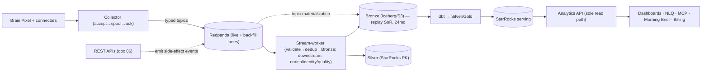
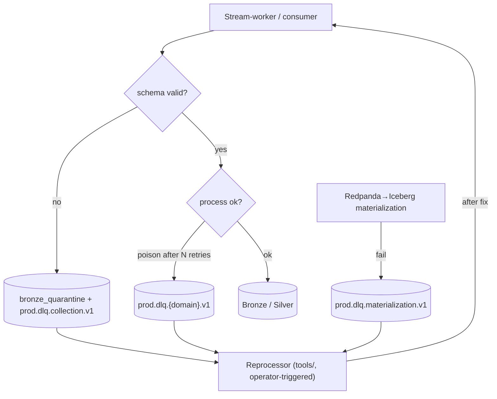
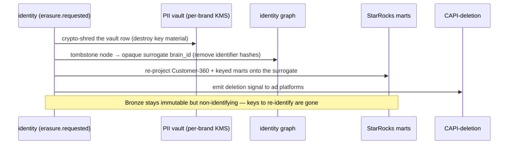
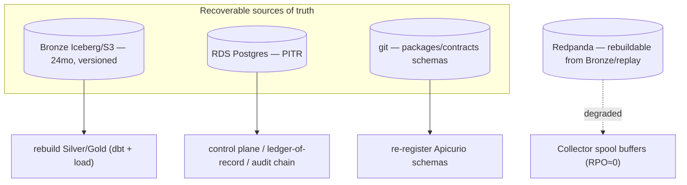
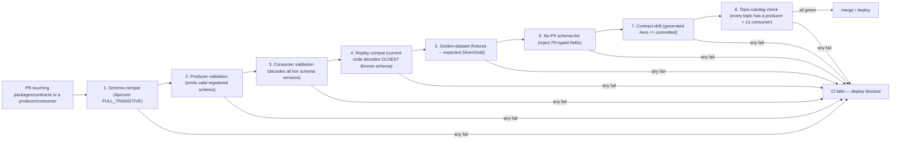
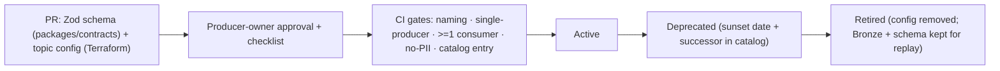
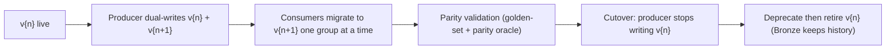

# Brain — Event Contracts & Event Platform Specification (Phase 1)

**Product:** Brain — the AI-native commerce operating system for DTC brands in India, UAE & GCC.
**Document type:** the authoritative Event Architecture, Governance, Taxonomy, Ownership, Topic Design, Schema Evolution, Replay, DLQ, Materialization, and per-event Contract specification.
**Status:** Final v1. **Date:** 2026-06-14.
**Source of truth — must not contradict:** `01_…BRD`, `02_…Functional_Specification`, `03_…Technology_Stack`, `04_Brain_Architecture_and_Delivery_Plan.md` (esp. **§6.6 Event governance**, §6, §7 data, §E), `05_Brain_Implementation_Build_Plan.md` (`packages/events`, stream-worker), `06_Brain_API_Architecture_and_Contracts.md` (§0.1 API→event handoff).
**Frozen constraints honored:** 3 deployables (Collector + stream-worker + core monolith) + Argo jobs; no new services/deployables; Redpanda Cloud + Apicurio + Avro; Iceberg/S3 Bronze; events-first; **doc 04 §6.6 is the binding event-governance foundation — this document implements it.**

**Scope:** Phase-1 events only. Phase-2/3/4 events (lifecycle sends, AI ticketing, MMM, autonomy) are listed in §21 (Deferred), shaped but not built.

---

## Table of Contents
0. Review Board findings
1. Event platform overview
2. Event taxonomy
3. Event ownership model
4. Universal event envelope
5. Event naming standards
6. Topic architecture (catalogue)
7. Partitioning strategy
8. Schema governance (FULL_TRANSITIVE)
9. Event replay architecture
10. DLQ & quarantine architecture
11. Event observability
12. Bronze materialization rules
13. Identity event contracts
14. Attribution event contracts
15. Financial & ledger event contracts
16. Consent & privacy events
17. AI & recommendation events
18. Audit events
19. Event lifecycle
20. Event architecture validation (consistency vs docs 04/05/06)
21. Deferred events (Phase 2/3/4)

**Part B — Production Hardening (ARB v1.1):**
22. Event capacity planning
23. Consumer group registry
24. Event disaster recovery
25. Event security architecture
26. Contract testing lifecycle & CI gates
27. F1 re-audit (normalized finance facts)
28. Event sink completeness
29. Final consistency validation (vs docs 04/05/06)
30. Topic lifecycle governance
31. Event cost governance (FinOps)
32. Event version migration playbook
33. Event catalog & metadata governance
34. Long-term maintainability — scale stress test

---

## 0. Review Board findings

The deep Event ARB (10 personas) ran in the prior phase and its corrections are already applied to docs 04/05/06 (the §6.6 block). This pass is a **contract-level confirmation** by the same board (Event-Driven, Data-Platform, Streaming, Analytics, Identity-Graph, Attribution, Platform, Security, AI-Platform, Staff/maintainability). It **confirmed** the §6.6 foundation (composite partition keys, no-PII invariant, event-time correctness, FULL_TRANSITIVE, single-producer ownership, hot/downstream split) and surfaced **six contract-level findings**, all resolved in this document:

1. **F1 — `refund.recorded` / `rto.recorded` are normalized finance facts, not new connector wire events.** *Challenge:* doc 04 amendment A2.4 said "reversal signals map to ledger event_types, no new wire events." Re-examined: attribution-clawback and billing consumers benefit from a **single normalized financial fact** to subscribe to, rather than each re-deriving reversal from raw `connector.order.upserted(status=rto)`. *Resolution:* the **ledger/finance processor** (the single realized-revenue-ledger writer, H4) consumes raw connector state and emits normalized `finance.rto.recorded` / `finance.refund.recorded` / `finance.chargeback.recorded` facts. This is **not** double-counting — the append-only ledger dedups by deterministic `ledger_event_id`, and these facts are the *normalized* layer (one producer). It's a small, justified refinement of A2.4, consistent with single-producer ownership.
2. **F2 — `identity.resolution.requested` is an internal trigger fact, not a command.** *Resolution:* classified as an **internal fact** ("an identity-bearing event was observed") consumed by the async identity writer — it stays on the bus (the async hand-off off Bronze), namespaced under identity, not `cmd.*`.
3. **F3 — accept-before-validate preserved with typed topics.** *Challenge:* if the Collector routes to typed topics, where does "accept before validate" live? *Resolution:* the Collector routes by the **declared** `schema_name` (the pixel SDK sets it) to the typed topic and produces **without validating**; the **stream-worker validates** against Apicurio and **quarantines** failures. Typed topics + downstream validation both hold.
4. **F4 — Phase-1 commands stay thin.** `cmd.connector.backfill.requested` exists (drives the backfill lane), but is emitted by the **job-orchestration internal trigger (REST, doc 06 §5)** — not a tenant-facing producer. `send.requested` is **Phase 3** (lifecycle). No general command bus.
5. **F5 — Notification events are P1-partial.** `notification.sent` / `notification.suppressed` ship in P1 for **operator alerts** (in-product/email/push); the WhatsApp/lifecycle *send* path that heavily uses them is P3.
6. **F6 — Don't over-granularize behavioral topics.** *Anti-overengineering push-back:* one topic per *commerce event type* (purchase, cart, checkout, pageview, search, identify) — **not** per sub-action; cart add/remove is a field on `cart_updated`, not two topics. Keeps the topic count sane for a small team.

**Verdict: APPROVE.** The event platform is implementation-ready on the §6.6 foundation; nothing here introduces a service, a deployable, or a contradiction.

> **v1.1 hardening (this pass):** Part B (§22–§29) adds capacity planning, the consumer-group registry, disaster recovery, event security/ACLs, and the contract-testing CI gates; re-audits F1 (KEEP); and proves event→sink completeness (§28). No §0–§21 content changed.
> **v1.2 freeze review (this pass):** §30–§34 add topic-lifecycle governance, event cost (FinOps) governance, the version-migration playbook, the generated event catalog, and a 500-brand/50-engineer scale stress-test. Right-sized for a startup (no standing review board). **Doc 07 = FREEZE READY.**

---

## 1. Event platform overview

### 1.1 Why Brain is event-driven
Brain's truth is *realized commerce reality*, which arrives **multiple times and changes** (an order goes placed→delivered→RTO over weeks; ad spend restates; COD cash realizes 7–30 days later). An event log is the only honest substrate for a fact that mutates over time: append every observation, never overwrite, reconstruct truth by event-time. Events also decouple the strict-SLA ingest path (99.95%) from the heavy downstream processing, and give replay/backfill/audit for free.

### 1.2 Event-first architecture & the relationships

- **APIs ↔ Events (doc 06 §0.1):** REST endpoints are the synchronous human/operator contracts; their **side-effects are events** (this document owns those payloads). Pure events with no API: identity resolution, attribution credit/clawback, recommendation generation, notification fan-out, DQ signals, connector-health changes.
- **Events ↔ Lakehouse:** every event is materialized to **Bronze** (immutable, 24mo) — the replay source of truth — then transformed Bronze→Silver→Gold.
- **Events ↔ Analytics API:** the Analytics API never reads Redpanda; it reads StarRocks/Iceberg (derived from events). Events feed the lakehouse; the Analytics API serves from the lakehouse. One-way: `events → Iceberg → dbt → StarRocks → Analytics API`.

---

## 2. Event taxonomy

Every event is exactly one **class** (governs naming, ordering, replay) and one **domain**.

| Class | Definition | Naming | On the bus? | Examples |
|---|---|---|---|---|
| **Fact** | an immutable thing that happened (default) | past-tense | yes | `order.upserted`, `ledger.finalized`, `merge.committed`, `purchase` |
| **Command** | an intent/request to do something | imperative, `cmd.*` | rare (internal/REST preferred) | `cmd.connector.backfill.requested` (P1), `cmd.notification.send.requested` (P3) |
| **Internal** | a fact only Brain modules consume (not externalizable) | past-tense | yes | `identity.resolution.requested`, `dq.signal.raised` |
| **External** | a fact safe to expose (future outbound webhooks, doc 06 §11.1) | past-tense | yes | `connector.failed`, `export.completed`, `billing.period.sealed` |

**Domain categories** (each maps to one owning module, §3): **Financial/Ledger**, **Identity**, **Attribution**, **Behavioral/Collection**, **Connector**, **Data-Quality**, **Consent/Privacy**, **AI/Recommendation**, **Audit**, **Lifecycle (P3)**, **Notification (P1-partial)**.

**Category rules:** Facts are immutable and append-only (a correction is a *new* fact, never an edit). Commands carry no historical truth (not materialized to Bronze as facts; they trigger work). Financial/Identity facts are the highest-stakes — FULL_TRANSITIVE schema, 24-mo replay, strictest ownership. Audit events are **fan-out only** (the Postgres hash-chain is the SoR, §18).

---

## 3. Event ownership model

**Rule (H4): every event type has exactly ONE authoritative producer.** Consumers are many. A new event names its producer here before it ships.

| Event | Producer (single) | Primary consumers |
|---|---|---|
| `collection.purchase.v2` (+ pageview/cart/checkout/search/identify) | **Collector** (routes by `schema_name`) | stream-worker → Bronze/Silver, identity, attribution |
| `collection.survey_response.v1` (post-purchase self-reported attribution) | **Collector** | stream-worker → Bronze/Silver (`survey_responses`), attribution (triangulation) |
| `connector.order.upserted.v1` | **connector** | finance/ledger processor, identity, attribution, data-quality |
| `connector.settlement.received.v1` | **connector** | finance/ledger processor, billing |
| `connector.shipment.updated.v1` | **connector** | finance/ledger processor (RTO/NDR), data-quality |
| `connector.ad_spend.synced.v1` | **connector** | measurement (spend), attribution (contribution) |
| `connector.connected.v1` / `connector.health.changed.v1` | **connector** | recommendation, notification, data-quality |
| `identity.resolution.requested.v1` | **stream-worker** | identity async writer |
| `identity.brain_id.minted.v1` / `alias.repointed.v1` | **identity** | Customer-360 projection, attribution |
| `identity.merge.proposed.v1` | **identity** | review-queue UI, notification |
| `identity.merge.committed.v1` / `unmerge.committed.v1` | **identity** | **attribution (re-credit)**, Customer-360 reprojection, audit |
| `finance.ledger.recognized.v1` (provisional) / `finance.ledger.finalized.v1` | **finance/ledger writer** (measurement/attribution job) | billing, attribution, analytics |
| `finance.refund.recorded.v1` / `finance.rto.recorded.v1` / `finance.chargeback.recorded.v1` | **finance/ledger writer** | attribution (clawback), billing |
| `attribution.credit.provisional_assigned.v1` / `credit.finalized.v1` / `credit.clawed_back.v1` | **attribution** | Gold credit ledger, analytics |
| `billing.period.sealed.v1` / `trueup.posted.v1` / `degraded.readonly.v1` | **billing** | workspace (entitlement), notification |
| `dq.signal.raised.v1` | **stream-worker / data-quality** | recommendation, notification, data-quality grade |
| `dq.grade.updated.v1` | **data-quality** | billing (cap gate), analytics rendering |
| `privacy.consent.granted.v1` / `consent.withdrawn.v1` | **collection** (CMP via Collector) / workspace | send/consent chokepoint, CAPI-deletion, audit |
| `privacy.erasure.requested.v1` | **identity** (from the privacy API) | crypto-shred job, mart re-projection, CAPI-deletion |
| `ai.nlq.query_resolved.v1` / `ai.provenance.recorded.v1` | **ai** | Decision Log, observability |
| `recommendation.generated.v1` | **recommendation** | notification, Home, Decision Log |
| `decision.recorded.v1` | **recommendation / workspace** (Decision Log writer) | analytics, audit |
| `notification.sent.v1` / `notification.suppressed.v1` | **notification** | observability, audit |
| `audit.action.logged.v1` | **any module via `packages/audit`** (fan-out copy; SoR = Postgres) | SIEM/observability, denylist-warm |
| `cmd.connector.backfill.requested.v1` (command) | **job-orchestration** (internal trigger, REST-fronted) | connector backfill lane |

**Ownership rules:** (1) one producer per event; (2) consumers never reach into the producer's tables — they use the event payload (event-carried-state-transfer) or the Analytics API; (3) a producer change that alters an event's meaning requires a new `.v{n+1}` (§8); (4) cross-future-service-boundary interactions are already events here (e.g. `merge.committed`→attribution), so Phase-2/3 extraction is plumbing-free.

---

## 4. Universal event envelope

Every event on every topic carries this envelope (Avro record in Apicurio); the domain payload is the `payload` field. **snake_case wire format. No raw PII in any field — hashed identifiers + vault references only (§6.6 C2).**

| Field | Type | Required | Meaning |
|---|---|---|---|
| `event_id` | string (uuid v7) | ✓ | globally unique id; **dedup key is `(brand_id, event_id)`** |
| `brand_id` | string (uuid) | ✓ | tenant key — **envelope isolation, asserted by every consumer before processing; NOT the partition key** |
| `producer` | string | ✓ | the single authoritative producer (module/service id), e.g. `connector`, `identity` |
| `schema_name` | string | ✓ | the event type, e.g. `connector.order.upserted` |
| `schema_version` | int | ✓ | the major version `n` of `.v{n}` |
| `schema_id` | long | ✓ | Apicurio global schema id (exact registered schema) |
| `partition_key` | string | ✓ | the brand-prefixed composite actually used (§7), e.g. `brd_…:ord_…` |
| `correlation_id` | string (uuid) | ✓ | ties a chain of related events/requests (propagated from the originating API call/span) |
| `causation_id` | string (uuid) | nullable | the `event_id` that directly caused this one (causal lineage) |
| `occurred_at` | timestamp (UTC, micros) | ✓ | **event-time** — the source of correctness (§6.6 H1) |
| `ingested_at` | timestamp (UTC, micros) | ✓ | when the Collector accepted it (freshness = ingested − occurred) |
| `source` | string | ✓ | origin, e.g. `pixel`, `webhook:shopify`, `poll:meta`, `job:ledger` |
| `sequence` | long | nullable | per-source monotonic counter for event-time tie-breaks (LWW) |
| `consent_flags` | map<string,string> | nullable | **customer-domain extension only** (analytics/marketing/ai_processing/personalization); absent on non-customer events |
| `payload` | union<domain records> | ✓ | the domain event body (§13–§18) — **no raw PII** |

**Example (envelope + a purchase payload):**
```json
{
  "event_id": "0190f7c2-...-7a1b",
  "brand_id": "brd_9f2c",
  "producer": "collector",
  "schema_name": "collection.purchase",
  "schema_version": 2,
  "schema_id": 10481,
  "partition_key": "brd_9f2c:vis_4471",
  "correlation_id": "0190f7c2-...-c001",
  "causation_id": null,
  "occurred_at": "2026-06-14T08:31:55.412000Z",
  "ingested_at": "2026-06-14T08:31:55.690000Z",
  "source": "server",
  "sequence": 88123,
  "consent_flags": { "analytics": "granted", "marketing": "withdrawn", "ai_processing": "granted" },
  "payload": {
    "order_id": "ord_55120", "value_minor": 249900, "currency_code": "INR",
    "email_hash": "sha256:…", "phone_hash": "sha256:…", "visitor_id": "vis_4471",
    "click_ids": { "fbclid": "…", "gclid": "…" }, "line_items": [ { "sku": "…", "qty": 1, "price_minor": 249900 } ]
  }
}
```
Note: `email_hash`/`phone_hash` (hashed), never raw email/phone; `click_ids` lives in the **payload**, not the envelope. The order payload also carries the **cart-stitch attributes** (`brain_anon_id` + first-touch click IDs + UTMs written to `cart.attributes`/order-meta), recovered server-side to tie the anonymous journey to the order (doc 08 §35).

---

## 5. Event naming standards

- **Topic:** `{env}.{lane?}.{domain}.{event}.v{n}` → `prod.identity.merge.committed.v1`, `prod.collection.purchase.v2`, `prod.backfill.connector.order.upserted.v1` (backfill lane prefix), `prod.dlq.identity.v1`, `prod.cmd.connector.backfill.requested.v1`.
- **Event (`schema_name`):** `{domain}.{noun}.{past_tense_verb}` for facts (`order.upserted`, `merge.committed`, `credit.clawed_back`); `cmd.{domain}.{noun}.{verb}.requested` for commands. snake_case throughout.
- **Versioning:** `.v{n}` is the **major**; additive-optional changes stay within a major (no rename), a breaking change → new `.v{n+1}` topic + dual-read window (§8). `schema_version` in the envelope mirrors `n`; `schema_id` pins the exact registered schema.
- **Lanes:** live = default; backfill = `…backfill.…` prefix (separate topic + consumer group). DLQ = `…dlq.{domain}…`.

---

## 6. Topic architecture (catalogue)

One topic per event type (clean per-topic schema, independent retention/scaling). **Live** topics have a parallel **backfill** topic where backfill applies. Partition keys per §7. Retention: Redpanda 7d + tiered storage (live/short-rewind); **Bronze 24mo = replay SoR**.

| Topic (live) | Producer | Consumers | Partitions(init) | Materialize→Bronze | Backfill lane |
|---|---|---|---|---|---|
| `prod.collection.purchase.v2` | collector | sw, identity, attribution | 32 | yes | yes |
| `prod.collection.cart_updated.v1` / `.checkout_started.v1` / `.pageview.v1` / `.search.v1` / `.identify.v1` | collector | sw | 16–32 | yes | yes |
| `prod.connector.order.upserted.v1` | connector | finance, identity, attribution, dq | 24 | yes | yes |
| `prod.connector.settlement.received.v1` | connector | finance, billing | 8 | yes | yes |
| `prod.connector.shipment.updated.v1` | connector | finance, dq | 16 | yes | yes |
| `prod.connector.ad_spend.synced.v1` | connector | measurement, attribution | 8 | yes | yes |
| `prod.connector.connected.v1` / `.health.changed.v1` | connector | recommendation, notification, dq | 4 | no (control) | no |
| `prod.identity.resolution.requested.v1` | stream-worker | identity writer | 24 | no | no |
| `prod.identity.brain_id.minted.v1` / `.alias.repointed.v1` | identity | C360, attribution | 16 | yes | no |
| `prod.identity.merge.proposed.v1` | identity | review-queue, notification | 4 | yes | no |
| `prod.identity.merge.committed.v1` / `.unmerge.committed.v1` | identity | attribution, C360, audit | 8 | yes | no |
| `prod.finance.ledger.recognized.v1` / `.ledger.finalized.v1` | finance writer | billing, attribution, analytics | 16 | yes | no |
| `prod.finance.refund.recorded.v1` / `.rto.recorded.v1` / `.chargeback.recorded.v1` | finance writer | attribution (clawback), billing | 8 | yes | no |
| `prod.attribution.credit.provisional_assigned.v1` / `.finalized.v1` / `.clawed_back.v1` | attribution | Gold credit ledger, analytics | 16 | yes | no |
| `prod.billing.period.sealed.v1` / `.trueup.posted.v1` / `.degraded.readonly.v1` | billing | workspace, notification | 4 | no (control) | no |
| `prod.dq.signal.raised.v1` / `.grade.updated.v1` | sw / data-quality | recommendation, notification, billing | 8 | no | no |
| `prod.privacy.consent.granted.v1` / `.consent.withdrawn.v1` | collection/workspace | send-chokepoint, CAPI-deletion, audit | 8 | yes | no |
| `prod.privacy.erasure.requested.v1` | identity | crypto-shred job, mart-reproj, CAPI-deletion | 4 | no (control) | no |
| `prod.ai.nlq.query_resolved.v1` / `.provenance.recorded.v1` | ai | Decision Log, observability | 4 | no | no |
| `prod.recommendation.generated.v1` / `prod.decision.recorded.v1` | recommendation | notification, Home, analytics, audit | 4 | no | no |
| `prod.notification.sent.v1` / `.suppressed.v1` | notification | observability, audit | 4 | no | no |
| `prod.audit.action.logged.v1` | any (via packages/audit) | SIEM/observability | 8 | no (SoR=Postgres) | no |
| `prod.cmd.connector.backfill.requested.v1` (command) | job-orchestration | connector backfill lane | 4 | no | n/a |
| `prod.dlq.{domain}.v1` (per domain) | stream-worker / consumers | DLQ reprocessor | 4 | no | n/a |

*(Partition counts are starting points sized by volume — §7; not contractual.)*

---

## 7. Partitioning strategy

**Aligns with doc 04 §6.6 (binding).** Partition key = **brand-prefixed composite per the topic's ordering unit**; `brand_id` is always the prefix. **Isolation is the envelope + RLS + per-brand prefix/KMS — never the partition key.**

| Event family | Partition key | Ordering unit |
|---|---|---|
| Order / ledger / finance | `hash(brand_id, order_id)` | per-order |
| Identity / customer | `hash(brand_id, brain_id)` | per-customer |
| Behavioral / pixel | `hash(brand_id, visitor_id)` (or `session_id`) | per-visitor/session |
| Control / audit / billing / low-volume | `brand_id` | per-brand |

**Rationale:** a whale brand or a Diwali/BFCM spike spreads across partitions instead of hot-spotting one (protecting the 99.95% ingest path), while per-entity ordering holds for the unit that needs it (an order's placed→delivered→RTO land on the same partition in order). **Scaling:** add partitions per-topic by volume; a brand parallelizes across its own entities. **Hot-partition avoidance:** the composite key (not `brand_id` alone) is the mechanism; `brand_id` prefix keeps per-brand consumption + co-location cheap. **Correctness does not depend on partition order** (§6.6 H1) — it comes from `occurred_at` + `sequence` + idempotent LWW + the append-only ledger as-of math.

---

## 8. Schema governance (FULL_TRANSITIVE)

**Registry:** Apicurio; **compatibility = FULL_TRANSITIVE** for **all Bronze-materialized streams** (additive-optional changes only; old events stay replayable forever across all intermediate versions). Format: Avro.

**Schema lifecycle:** `Draft → Registered (v{n}) → Active → Deprecated → Sunset → Removed-topic`. A schema is the contract; the Zod definition in `packages/contracts` generates the Avro schema (doc 05 §5) — **one source of truth**.

| Change type | Allowed within `.v{n}`? | Process |
|---|---|---|
| Add an **optional** field (with default) | ✓ (FULL_TRANSITIVE-safe) | PR → CI compat-check (Apicurio) → register |
| Add a new enum value | ✓ (consumers must tolerate unknown) | same |
| Remove / rename a field, change a type, make optional→required | ✗ **breaking** | **new `.v{n+1}` topic** + producers dual-write + consumers dual-read → migrate → retire `v{n}` after the dual-read window |
| Tighten validation | ✗ breaking | new version |

**Approval workflow:** schema change PR → **CI gate** runs Apicurio FULL_TRANSITIVE compatibility + the `packages/contracts` drift check (generated Avro must match) + the no-PII schema-lint (§6.6 C2) → producer-owner approves (single-owner rule, §3) → register. **Deprecation policy:** a deprecated schema/topic carries a sunset date; consumers migrate within the window; removal is audited. **Ownership:** the event's single producer owns its schema.

---

## 9. Event replay architecture

**Replay source of truth = Bronze (Iceberg, 24-mo, immutable).** Redpanda (7d + tiered storage) serves live consumption + short rewinds only. Replay flows the **same processing code** as live (parity), on the **backfill lane** where applicable, and converges via event-time + idempotency + the bounded restatement window (doc 04 §7.6).

| Event family | Replayable? | Replay horizon | Replay source | Process |
|---|---|---|---|---|
| Behavioral / collection | ✓ | 24 months | Bronze | re-run stream-worker over Bronze partitions → Silver/Gold (idempotent on `(brand_id,event_id)`) |
| Connector (order/settlement/shipment/spend) | ✓ | 24 months | Bronze | backfill lane → same code; ledger restates within the window |
| Finance / ledger | ✓ (derive) | 24 months | Bronze (recompute from connector facts) | append-only ledger rebuilt; as-of math reproduces history |
| Identity (alias/merge) | ✓ | 24 months | Bronze + `brain_id_alias` (bitemporal) | re-resolve; alias re-points; history preserved (never rewritten) |
| Attribution credit | ✓ (derive) | 24 months | recompute from ledger + journeys | credit ledger rebuilt; pinned to `identity_snapshot_id` |
| Control (connector.health, billing.*, erasure, cmd.*) | ✗ (transient) | n/a (state in Postgres) | — | not replayed; the state store is authoritative |
| Audit | ✗ via event | n/a | Postgres hash-chain (SoR) | the event is fan-out; the ledger is the record |
| AI provenance / decision | ✓ (read) | 24 months | Decision Log (Postgres + WORM) | read-only history |

**Replay rules by horizon:** **1d/7d** → Redpanda rewind (offset reset) for a recently-broken consumer; **30d/90d/24mo** → Bronze replay (the topic no longer holds it). A replay never edits a sealed billing period (forward adjustments only); a replay older than the restatement window routes effects to the unattributed bucket / forward adjustments.

**Replay runbook (RB-EVT-1):** identify the brand/window/topic → if ≤7d, reset the consumer-group offset; if >7d, run the Argo `bronze-replay` job scoped to `(brand_id, event_date range, schema_name)` on the backfill lane → verify via the parity-convergence monitor → confirm closed-sum + ledger as-of unchanged for sealed periods.

---

## 10. DLQ & quarantine architecture


- **Quarantine** (`bronze_quarantine` sibling table + `prod.dlq.{domain}.v1`): schema-invalid events — **never dropped** (accept-before-validate guarantees they were accepted; they're quarantined for replay after a schema/producer fix).
- **DLQ (per domain):** poison-pill events (valid schema, repeated processing failure) after N retries with backoff → `prod.dlq.{domain}.v1`, with the original envelope + failure reason + retry count.
- **Materialization DLQ:** `prod.dlq.materialization.v1` for Redpanda→Iceberg failures.
- **Reprocessing workflow (RB-EVT-2):** alert on DLQ depth → operator inspects the failure reason → fix (schema/producer/consumer) → run the `tools/`-based DLQ reprocessor (idempotent on `(brand_id,event_id)`) → confirm DLQ drains. **The edge never drops; failures are always recoverable.**

---

## 11. Event observability

OTel everywhere; every span/log carries `brand_id` + `correlation_id` (PII-redacted). Backed by Grafana Cloud (doc 04 §I).

| Signal | Metric | Alert |
|---|---|---|
| Consumer lag | per consumer-group lag (live lane hardest) | live-lane lag > 5000 for 5m → page |
| DLQ depth | messages per `prod.dlq.*` | any sustained growth → page domain owner |
| Quarantine rate | quarantined / total per topic | spike → schema/producer alert |
| Replay failures | failed `bronze-replay` job runs | any → page |
| Schema rejections | Apicurio compat rejections (CI) + runtime decode failures | any runtime decode failure → page |
| Materialization lag | `occurred_at → queryable in Bronze` p95 | > target → page |
| Event throughput | events/s per topic | baseline + anomaly band |
| Partition skew | per-partition rate (detect a hot key) | a partition > N× the topic mean → investigate |
| Volume anomaly | per-(brand, event_type) volume vs baseline | drop → **tracking-dark** alert; spike → abuse alert |

**Dashboards:** Event-flow overview (throughput, lag, materialization lag) · DLQ/quarantine · Schema registry health · Per-brand event volume (tracking-dark). The public status surface reads measured collector ingest availability (the 99.95% SLO).

---

## 12. Bronze materialization rules

> **Status note (ADR-0002, audit C1):** Bronze-on-Iceberg is **Phase-3, not yet shipped**. M1 writes Bronze to the disclosed interim sink **Postgres `bronze_events`** (`db/migrations/0016`) via the stream-worker. The rules below describe the **target** Iceberg behaviour. Per ADR-0002 the writer is **Spark Structured Streaming** (a new independent consumer of the same topic), **not** the Redpanda-native topic-materialization originally specified here; the `MERGE`-on-`(brand_id, event_id)` idempotency, partition spec, and 24-mo TTL/compaction rules carry over unchanged.

- **Event → Iceberg mapping:** each materialized topic → one Bronze Iceberg table (`bronze.{schema_name}`), the raw envelope + payload exactly as received. Written by **Spark Structured Streaming → Iceberg** (idempotent `MERGE`; per-brand prefix + KMS + idempotency; ADR-0002 — supersedes the Redpanda topic-materialization originally planned here).
- **Materialization ownership:** the **Collector/stream path** owns the write to Bronze; one writer per topic.
- **Deduplication:** Bronze is **append-only (insert-if-absent MERGE on `(brand_id, event_id)`)** — raw truth, duplicates collapse on the dedup key; all normalization/server-wins precedence is Silver-ward.
- **Partitioning:** `PARTITIONED BY (bucket(N, brand_id), days(occurred_at))` — brand-first (tenant pruning + per-brand retention/erasure), date for replay windows + 24-mo TTL.
- **Retention:** 24-month rolling via partition expiry; **Argo compaction + snapshot-expiry job** from Phase 1 (small-file mitigation + erasure-aware compaction, §6.6 M8).
- **No-PII invariant:** Bronze contains hashed identifiers + vault refs only; erasure = crypto-shred (Bronze stays immutable, becomes non-identifying).
- **Control/command/audit topics are NOT materialized** to Bronze (state lives in Postgres; audit SoR is the hash-chain).

---

## 13. Identity event contracts

**Producer = identity** (except `resolution.requested` = stream-worker). Consumers: attribution (re-credit), Customer-360, audit. All identifiers **hashed**; raw PII in the vault only.

`identity.resolution.requested.v1` (internal trigger fact; stream-worker):
```json
{ "observed_brain_id": "bid_anon_77", "identifier_hashes": [
    { "type": "email", "value": "sha256:…" }, { "type": "phone", "value": "sha256:…" } ],
  "occurred_at": "…Z" }
```
`identity.brain_id.minted.v1`: `{ "brain_id": "bid_5521", "minted_from": "email", "confidence": "High" }`
`identity.alias.repointed.v1`: `{ "observed_brain_id": "bid_anon_77", "canonical_brain_id": "bid_5521", "valid_from": "…Z", "merge_event_id": "mev_…", "rule_version": "v3" }`
`identity.merge.proposed.v1` (phone-guard conflict → review): `{ "review_id": "rev_…", "brain_id_a": "bid_…", "brain_id_b": "bid_…", "trigger": "shared_phone_conflicting_email", "evidence": { /* hashed */ } }`
`identity.merge.committed.v1`:
```json
{ "merge_event_id": "mev_3310", "canonical_brain_id": "bid_5521", "merged_brain_id": "bid_5522",
  "rule_version": "v3", "identifier_combo": ["email","storefront_customer_id"], "confidence": "High",
  "identity_snapshot_id": "isnap_88" }
```
`identity.unmerge.committed.v1`: `{ "merge_event_id": "mev_3310", "restored_brain_ids": ["bid_5521","bid_5522"], "reason": "false_merge", "identity_snapshot_id": "isnap_91" }`
**Consumer behavior:** attribution consumes `merge.committed`/`unmerge.committed` → **re-credit** against the new `identity_snapshot_id` (merge-reactive, doc 04 §9/§14.5); Customer-360 re-projects; never rewrites history (read-time alias).

---

## 14. Attribution event contracts

**Producer = attribution.** Consumers: Gold `attribution_credit_ledger` materialization, analytics. Append-only; clawback mirrors the original split (doc 04 §9/§7.2).

`attribution.credit.provisional_assigned.v1`:
```json
{ "credit_id": "cr_1001", "order_id": "ord_55120", "touch_id": "tch_900", "channel": "meta",
  "campaign_id": "camp_88", "model_version": "position_v1", "window_policy_id": "wp_7d",
  "identity_snapshot_id": "isnap_88", "weight_fraction": 0.34, "credited_revenue_minor": 84966,
  "currency_code": "INR", "credit_pass": "provisional", "economic_effective_at": "…Z", "fx_rate_id": "fx_…" }
```
`attribution.credit.finalized.v1`: same shape, `credit_pass: "finalized"`, restated `credited_revenue_minor`.
`attribution.credit.clawed_back.v1` (mirror reversal):
```json
{ "credit_id": "cr_1001_rv", "reversed_of_credit_id": "cr_1001", "order_id": "ord_55120",
  "touch_id": "tch_900", "channel": "meta", "weight_fraction": 0.34,
  "credited_revenue_minor": -84966, "currency_code": "INR", "credit_pass": "finalized",
  "economic_effective_at": "…Z", "reason": "rto" }
```
**Invariant:** a full RTO → the sum of credit + clawback for that order = 0 (attributed CM2 → 0 weeks later). Closed-sum (Σ channel_contribution + unattributed = Σ finalized realized revenue) asserted by the parity oracle.

---

## 15. Financial & ledger event contracts

The highest-stakes domain. `connector.order.upserted` (producer: connector) is the **input**; the **finance/ledger writer** (single producer) emits the normalized facts below. Append-only; the realized-revenue ledger never mutates a sale row; reversals are negative rows keyed by deterministic `ledger_event_id`.

`connector.order.upserted.v1` (connector — input fact):
```json
{ "order_id": "ord_55120", "order_status": "delivered", "payment_method": "cod",
  "marketplace": null, "currency_code": "INR", "gross_total_minor": 249900, "discount_minor": 0,
  "tax_minor": 38120, "net_total_minor": 211780, "placed_at": "…Z", "delivered_at": "…Z",
  "email_hash": "sha256:…", "raw_event_id": "evt_…" }
```
`connector.settlement.received.v1` (connector): `{ "settlement_id": "set_…", "provider": "razorpay", "order_id": "ord_55120", "gross_minor": 249900, "fees_minor": 7200, "net_settled_minor": 242700, "currency_code": "INR", "settlement_date": "…" }`
`finance.ledger.recognized.v1` (provisional, ledger writer):
```json
{ "ledger_event_id": "led_a1", "order_id": "ord_55120", "brain_id": "bid_5521",
  "event_type": "provisional_recognition", "amount_minor": 211780, "currency_code": "INR",
  "fx_rate_id": "fx_…", "economic_effective_at": "…Z", "billing_posted_period": "2026-06",
  "recognition_label": "provisional" }
```
`finance.ledger.finalized.v1`: same, `event_type:"finalization"`, `recognition_label:"finalized"`, net realized amount.
`finance.rto.recorded.v1` (ledger writer; from `connector.shipment.updated(status=rto)`):
```json
{ "ledger_event_id": "led_a1_rv", "order_id": "ord_55120", "event_type": "rto_reversal",
  "amount_minor": -211780, "currency_code": "INR", "economic_effective_at": "…Z",
  "billing_posted_period": "2026-07", "supersedes_ledger_event_id": "led_a1",
  "return_leg_cost_minor": 6000 }
```
`finance.refund.recorded.v1` / `finance.chargeback.recorded.v1`: analogous reversal rows (`event_type: refund | chargeback`, signed negative, own `economic_effective_at` + `billing_posted_period`).
**Dual-date rule (doc 04 §7.4):** `economic_effective_at` drives attribution/CM2 as-of math; `billing_posted_period` is the open period a late adjustment posts to (closed periods immutable). **As-of:** realized on date D = Σ ledger rows where `economic_effective_at ≤ D`.

---

## 16. Consent & privacy events

`privacy.consent.granted.v1` / `privacy.consent.withdrawn.v1` (producer: collection/workspace):
```json
{ "brain_id": "bid_5521", "category": "marketing", "state": "withdrawn", "source": "cmp",
  "effective_at": "…Z", "consent_text_version": "v4" }
```
**Consumers:** the **send/consent chokepoint** (suppression overlay, <15-min propagation), the **CAPI-deletion** producer (sends a deletion signal for already-passed-back conversions), audit.

`privacy.erasure.requested.v1` (producer: identity, from the privacy API):
```json
{ "request_id": "ers_…", "subject_brain_id": "bid_5521", "reason": "dpdp_erasure", "requested_at": "…Z" }
```
**Crypto-shred flow (consumers):**

Ledger + Decision-Log rows survive on the now-pure-surrogate `brain_id` (the math still reconciles; the person is forgotten). This is what makes immutable 24-mo Bronze compatible with DPDP/PDPL/GDPR erasure (the no-PII-in-events invariant, §6.6 C2, is the precondition).

---

## 17. AI & recommendation events

`ai.nlq.query_resolved.v1` (producer: ai): `{ "query_id": "aiq_…", "metric_binding": { "metric_id":"realized_cm2","filters":{"channel":"meta","period":"2026-05"} }, "confidence": "Medium", "decline": false }`
`ai.provenance.recorded.v1` (producer: ai): `{ "query_id":"aiq_…","model":"claude-haiku","model_version":"…","prompt_hash":"sha256:…","snapshot_id":"…","metric_version":"2026.06","cost_minor":12,"latency_ms":840 }` (PII-redacted; the Decision Log is the durable home).
`recommendation.generated.v1` (producer: recommendation): `{ "recommendation_id":"rec_…","detector":"cm2_falling","eligibility":{"eligible":true},"confidence":"High","tier":"important" }` (eligibility/confidence are deterministic — the model only fills prose elsewhere).
`decision.recorded.v1` (producer: recommendation/workspace — Decision Log writer): `{ "decision_log_id":"dec_…","recommendation_id":"rec_…","action":"reject","actor":"usr_…","reason":"seasonal" }`
**Lifecycle:** generated → surfaced (Home/brief) → responded (`decision.recorded`) → 7/30-day outcome written back (scheduled job, not an event). Consumers: notification, analytics, audit.

---

## 18. Audit events

`audit.action.logged.v1` (producer: any module via `packages/audit`): `{ "audit_id":"…","actor_principal":"usr_…|mcp_key:…|system","action":"identity.merge.commit","resource_type":"brain_id","resource_id":"bid_…","occurred_at":"…Z" }`
**Clarification (binding, §6.6 M6):** the **Postgres hash-chained, WORM-anchored audit ledger is the system of record** (doc 04 §F.1.2); `audit.action.logged` is a **fan-out copy only** (for SIEM/observability/denylist-warming) and is **never** the integrity source. The event carries no `prev_hash`/chain fields — the chain lives only in the authoritative ledger. No PII in the event (references by id/hash).

---

## 19. Event lifecycle

| Stage | Fact (behavioral/connector/finance/identity/attribution) | Command | Control/Audit |
|---|---|---|---|
| **Created** | producer builds the envelope (event-time stamped) | issuer (job/REST) | producer |
| **Published** | Collector spool→ack→Redpanda (live or backfill lane) | `cmd.*` topic / internal trigger | Redpanda |
| **Consumed** | stream-worker (hot: validate→dedup→Bronze) + downstream consumer groups | the target orchestrator | the relevant consumer |
| **Materialized** | → Bronze (insert-if-absent on `(brand_id,event_id)`) → Silver/Gold | not materialized | not materialized (audit SoR=Postgres) |
| **Replayed** | from Bronze (24mo), same code, backfill lane | not replayed | not replayed |
| **Archived** | Bronze partition (compacted) | n/a | Postgres / WORM |
| **Expired** | Bronze 24-mo TTL (partition expiry); Redpanda 7d (+tiered) | short Redpanda TTL | per data-class retention; erasure via crypto-shred |

---

## 20. Event architecture validation (consistency vs docs 04/05/06)

Verified — no contradictions:

| Concern | This doc | Aligned with |
|---|---|---|
| Partition strategy | brand-prefixed composite per ordering unit; isolation ≠ partition key (§7) | doc 04 §6.6 C1 ✓ |
| Event ownership | single authoritative producer per event (§3) | doc 04 §6.6 H4 ✓ |
| Replay strategy | Bronze = replay SoR (24mo); Redpanda 7d+tiered (§9) | doc 04 §6.6, §7 ✓ |
| Schema evolution | FULL_TRANSITIVE; new `.v{n+1}` on breaking (§8) | doc 04 §6.6 H2; doc 06 §9 ✓ |
| Tenant isolation | envelope `brand_id` asserted + RLS + per-brand prefix/KMS (§4) | doc 04 §12, §6.6 ✓ |
| No-PII invariant | hashed ids + vault refs only; CI schema-lint (§4, §8, §12, §16) | doc 04 §6.6 C2 ✓ |
| Deduplication | `(brand_id, event_id)`; effectively-once via idempotency (§4, §12) | doc 04 §6.6 M2 ✓ |
| Hot/downstream split | hot path = accept→validate→dedup→Bronze; rest downstream (§1, §12) | doc 04 §6.6 H3; doc 05 ✓ |
| API↔event handoff | the doc-06 §0.1 mapping realized as the topics in §6 | doc 06 §0.1 ✓ |
| No new services/deployables | 3 deployables + Argo jobs; consumer groups, not services | doc 04, doc 05 ✓ |

**Contradictions found:** none — the §6.6 corrections (applied last phase to docs 04/05/06) removed the prior partition-key/compat ambiguities before this document was written. **One refinement introduced (F1):** normalized `finance.refund.recorded`/`rto.recorded`/`chargeback.recorded` facts (single producer = ledger writer) — a clarification of doc 04 amendment A2.4, not a contradiction (no double-count; deterministic `ledger_event_id`).

---

## 21. Deferred events (Phase 2/3/4 — shaped, NOT built)
- **Phase 2:** `holdout.assigned` / `exposure.logged` (incrementality capture — schema reserved); probabilistic `identity.merge.proposed` variants; autocapture behavioral events.
- **Phase 3:** **lifecycle** — `cmd.notification.send.requested`, `notification.delivered`, segment/campaign events (all through the consent chokepoint); AI ticket events; MMM/incrementality result events (the `channel_contribution` contract already exists — method swaps with zero event change).
- **Phase 4:** **autonomy** — `action.auto_executed`, `action.reverted`, kill-switch events.
- **Phase 5:** outbound-webhook delivery events (doc 06 §11.1), cross-brand benchmarking aggregates (privacy-thresholded).

**Anti-scope-creep:** an event appears in Phase 1 only if a Phase-1a/1b/1c capability produces or consumes it. The taxonomy/envelope/governance above are forward-compatible so deferred events slot in with no redesign.

---

---
---

# PART B — Production Hardening (ARB v1.1, 2026-06-14)

> Appended hardening pass — §0–§21 above are unchanged (no renumbering, no broken cross-refs). A 10-persona board (Event-Driven, Streaming, Data-Platform, SRE, Security, Platform, Data-Governance, Analytics, Staff, FinOps) tried to *break* the design; the genuine gaps it found — capacity planning, consumer-group ownership, disaster recovery, event-level security/ACLs, and contract-testing CI — are closed here. No new service, no new deployable, no frozen-decision change.

## 22. Event capacity planning

**Why this section:** §6 gives partition counts; this explains *why* and when to grow them. **Reference scale:** Phase-1 = ~100–300 brands above the ₹50L/mo GMV floor. **The driver is behavioral (pixel) volume**; orders/finance are low-EPS but high-value.

**Methodology.** (1) Estimate festival-peak EPS per family (Diwali/BFCM ≈ 10–20× a normal day, evening ≈ 3–5× the daily average). (2) Size partitions so **sustained per-partition load ≤ ~2,000 EPS** at festival peak (Redpanda handles more, but leave headroom for consumer processing + key skew). (3) **Size for the 12-month peak up front** — increasing partitions is effectively one-way and **re-hashes key→partition routing, breaking per-entity ordering for keys added after the change** (existing entities' historical order is preserved in Bronze, but live ordering reshuffles). So over-provision modestly rather than re-partition under load. (4) Validate with a load test before GA (the "max tested throughput" column).

| Topic family | Avg EPS | Daily peak | Festival peak | 12-mo growth | Init partitions | Expansion trigger | Max tested (target) |
|---|---|---|---|---|---|---|---|
| `collection.*` (pixel/behavioral) | ~1,200 | ~5,000 | ~30,000 | 3–4× | 32 | sustained > ~1,200 EPS/partition **or** p95 lag breach 10m | 50,000 EPS |
| `connector.order.upserted` | ~2 | ~15 | ~150 | 3× | 24 | per-partition > 1,000 EPS (far off) — sized for ordering parallelism, not volume | 10,000 EPS |
| `connector.settlement / shipment / ad_spend` | <1 | ~10 | ~80 | 3× | 8–16 | lag-based | 5,000 EPS |
| `identity.resolution.requested` | ~250 | ~1,200 | ~7,000 | 3–4× | 24 | per-partition lag breach | 20,000 EPS |
| `identity.*` (minted/alias/merge) | ~50 | ~300 | ~2,000 | 3× | 8–16 | lag-based | 10,000 EPS |
| `finance.ledger.* / refund / rto / chargeback` | ~3 | ~20 | ~200 | 3× | 16 | sized for per-order ordering, not volume | 10,000 EPS |
| `attribution.credit.*` | ~5 | ~30 | ~300 | 3× | 16 | lag-based | 10,000 EPS |
| `dq.* / billing.* / connector.health / audit / privacy / ai / recommendation` (control/low-vol) | <5 each | tens | hundreds | 2× | 4–8 | rarely; lag-based | 2,000 EPS |

**Notes:** behavioral and `identity.resolution.requested` are the only volume-driven families — partition them for festival peak. Order/finance/attribution partition counts are for **per-entity ordering parallelism**, not throughput. Re-confirm all numbers with a pre-GA load test; they are planning estimates, not measured limits.

## 23. Consumer group registry

**Why this section:** §3 names producers; this names **consumers** (ownership, retry, blast radius) — eliminating the "who owns this consumer / what breaks if it's down" ambiguity. Convention: at-least-once, manual-commit, **N=5 exponential-backoff retries → per-domain DLQ** (§10); all consumers idempotent on `(brand_id, event_id)`.

| Consumer group | Consumes | Owning module / team | Retry policy | Failure impact (if down) | Replayable |
|---|---|---|---|---|---|
| `stream-worker-live` | `collection.*`, `connector.*` (live lane) | stream-worker / Platform-Data | 5×backoff → DLQ; **hot path = validate→dedup→Bronze** | **ingestion lag on the 99.95% path** (spool buffers; events not lost) | ✓ (Bronze) |
| `stream-worker-backfill` | `*.backfill.*` | stream-worker / Platform-Data | capped concurrency; 5×backoff → DLQ | backfill stalls; live unaffected (separate lane) | ✓ |
| `identity-writer` | `identity.resolution.requested` | identity / Identity | idempotent; 5×backoff → DLQ | identity resolution lags (money reads finalized → no incorrectness) | ✓ |
| `attribution-creditor` | `finance.ledger.finalized`, `finance.{refund,rto,chargeback}.recorded`, `identity.merge.committed/unmerge.committed` | attribution / Measurement | idempotent (deterministic `credit_id`); 5×backoff → DLQ | CM2/attribution lags; ledger remains correct | ✓ (recompute) |
| `customer-projection` | `identity.*`, `connector.order.upserted`, `collection.purchase` | identity/analytics / Identity | idempotent; 5×backoff → DLQ | Customer-360 stale; rebuildable | ✓ |
| `billing-metering` | `finance.ledger.finalized` | billing / Billing | idempotent; **finalized-only**; 5×backoff → DLQ | billing meter lags (bills delayed, never wrong) | ✓ |
| `dq-evaluator` | `dq.signal.raised`, `connector.health.changed` | data-quality / Platform-Data | idempotent; 5×backoff → DLQ | DQ grade stale → gating uses last grade | ✓ |
| `recommendation-generator` | `finance.ledger.finalized`, `dq.signal.raised`, `connector.health.changed` | recommendation / Product-Eng | idempotent; 5×backoff → DLQ | Home/brief recs stale | ✓ |
| `notification-router` | `recommendation.generated`, `connector.health.changed`, `dq.signal.raised`, `consent.withdrawn`, `billing.*` | notification / Product-Eng | 5×backoff → DLQ | alerts delayed | partial |
| `consent-suppressor` | `privacy.consent.withdrawn` | notification (chokepoint) / Security | **fast-path, low-retry, fail-closed** | **compliance risk if delayed** → page; suppression must hit <15min | ✓ |
| `capi-deletion` | `privacy.consent.withdrawn`, `privacy.erasure.requested` | connector (CAPI) / Security | 5×backoff → DLQ | ad-platform deletion delayed → page | ✓ |
| `crypto-shred` | `privacy.erasure.requested` | identity + job-orchestration / Security | idempotent; alert-on-fail | **erasure SLA risk** → page | ✓ |
| `bronze-materializer` | all materialized topics (§6) | Collector/stream path / Platform-Data | Redpanda→Iceberg topic-materialization; failure → `dlq.materialization` | Bronze lag → all derived data stale | n/a (is the SoR writer) |
| `decision-log-writer` | `recommendation.generated`, decision responses | recommendation/workspace / Product-Eng | idempotent; 5×backoff → DLQ | Decision Log gaps (must not happen — audited) | ✓ |
| `audit-fanout` | `audit.action.logged` | observability / Platform | best-effort (SoR is Postgres) | SIEM lag only (audit SoR intact) | n/a |
| `backfill-orchestrator` | `cmd.connector.backfill.requested` | connector/job-orchestration / Platform-Data | overlap-locked; retry | backfill not started | n/a |

**Rule:** every topic has ≥1 registered consumer group here; an unconsumed topic is a governance defect (caught in the §26 CI catalog check).

## 24. Event disaster recovery

**Targets (align doc 04 §M):** event **RPO ≤ spool-flush** (the Collector durable spool buys near-zero ingest loss during a Redpanda outage); platform **RPO ≤15 min, RTO ≤4h → ≤1h**. **Bronze (Iceberg, 24-mo) + RDS are the recoverable sources of truth; Redpanda + StarRocks are rebuildable.**



| Failure | Detection | Recovery | RPO / RTO |
|---|---|---|---|
| **Redpanda region/broker outage** | producer/consumer errors, lag | Redpanda Cloud multi-AZ failover; **Collector spool buffers + retries** during the gap; consumers resume from committed offsets | RPO ≈ spool-flush; RTO = provider failover |
| **Redpanda topic corruption** | decode failures, checksum | recreate the topic; **replay from Bronze** (the SoR) on the same code path; consumers re-derive Silver/Gold | RPO 0 (Bronze has it); RTO 1–4h |
| **Apicurio registry corruption / accidental schema deletion** | schema-id lookup failures | **re-register from git** (`packages/contracts` generates the Avro — schemas are reproducible); Apicurio's Postgres via RDS PITR | RPO 0; RTO <1h |
| **Apicurio compatibility rollback needed** | a bad schema promoted | re-promote the prior content-hash schema; producers pin `schema_id` | minutes |
| **Iceberg metadata corruption** | query/commit failures | **Iceberg snapshot rollback** (time-travel to last-good snapshot); Glue catalog restore; S3 object versioning | RPO ≤ snapshot interval; RTO 1–2h |
| **Iceberg table loss** | table missing | recreate table + re-materialize from Redpanda (≤7d) or re-ingest connectors / replay | RTO 2–4h |
| **Consumer offset corruption** | wrong-position consumption | reset the consumer-group offset to a known-good commit; idempotency makes reprocessing safe | minutes |
| **Consumer state rebuild** | a derived store lost | replay from Bronze → rebuild Silver/Gold/Customer-360 (idempotent) | RTO 2–4h |
| **Full platform recovery** | region/account incident | Terraform re-apply (EKS) + RDS PITR + Redpanda Cloud + re-register schemas + Bronze replay → rebuild StarRocks; ArgoCD GitOps re-sync | RPO ≤15m; RTO ≤4h (→1h matured) |

**Runbooks:** RB-EVT-DR-1 (Redpanda outage → verify spool draining, monitor lag, no action unless prolonged → then topic-rebuild-from-Bronze) · RB-EVT-DR-2 (Apicurio restore from git + RDS PITR) · RB-EVT-DR-3 (Iceberg snapshot rollback) · RB-EVT-DR-4 (consumer offset reset + idempotent reprocess) · RB-EVT-DR-5 (full-platform, chains doc 04 §M.3). **Crown jewels:** Bronze (S3, 11-nines + versioning), RDS (PITR — holds the ledger-of-record, audit hash-chain, identity graph), and the per-brand KMS keyring (its loss = permanent crypto-shred-style loss). Quarterly DR drill validates RB-EVT-DR-1/4 + the StarRocks rebuild (doc 04 §M).

## 25. Event security architecture

**Principle: least privilege per topic + per service identity.** Redpanda Cloud SASL/mTLS; one service identity per deployable (via IRSA → SASL creds in Secrets Manager).

**Producer authentication / ACLs (who may PRODUCE):**
| Service identity | May PRODUCE to | May CONSUME from |
|---|---|---|
| `collector` | `collection.*` only | — |
| `core` (connector module) | `connector.*`, `finance.*`, `identity.*`, `attribution.*`, `billing.*`, `privacy.*`, `ai.*`, `recommendation.*`, `audit.*`, `dq.grade.updated` | `identity.resolution.requested` results, control topics it owns |
| `stream-worker` | `identity.resolution.requested`, `dq.signal.raised`, Bronze (materialization), `*.dlq.*` | `collection.*`, `connector.*` (live + backfill) |
| `argo jobs` | `cmd.connector.backfill.requested`, finance/ledger topics (the ledger writer runs as a job) | as the specific job requires |
**Each producer is restricted to the topics it owns (§3 single-producer rule, ACL-enforced).** A service may not produce to a topic it doesn't own — a cross-topic publish attempt is denied + alerted.

**Consumer authorization:** each consumer group's identity is ACL-granted CONSUME on exactly the topics in its §23 row — nothing more. **Topic ACL strategy:** default-deny; ACLs declared as code (Terraform) alongside the topic; reviewed in PR. **Schema-registry ACL:** only the **CI service identity** may register/evolve schemas (humans go through PR + the §26 gates); runtime services have read-only schema access.

**Environment isolation:** **separate Redpanda clusters + Apicurio registries per environment** — `prod` and `staging` in separate AWS accounts (doc 04 §14.3); `dev`/`local` use the local Docker Redpanda + Apicurio (doc 05 §10). No cross-environment topic access; prod credentials never leave the prod account.

**Secret rotation & key management:** SASL credentials + connector secrets in **AWS Secrets Manager**, fetched via **IRSA** (no static creds), rotated on a schedule + on suspected compromise (External-Secrets refresh → rolling restart); at-rest encryption via KMS; per-brand KMS for the vault. **Tenant isolation reminder:** ACLs are coarse (service-level); **brand-level isolation is the envelope `brand_id` + consumer assertion + RLS + per-brand Bronze prefix/KMS** (§6.6 C1) — never the topic/ACL.

**Incident response (event-layer):** a leaked SASL credential → rotate + revoke ACL + audit the topic's recent produces; an anomalous cross-topic publish → block + page Security; a PII-in-event detection (§26) → quarantine the topic partition, page, and run the erasure/crypto-shred path for any leaked rows. Chains doc 04 §M.4 severity ladder (a confirmed PII-in-Bronze leak is **P0**).

## 26. Contract testing lifecycle & CI gates

**Why:** FULL_TRANSITIVE registry compat is necessary but not sufficient — it doesn't catch producer/consumer drift, replay-decode breakage, the no-PII invariant, or unconsumed topics. `packages/contracts` (Zod → Avro) is the single source; these gates run in CI on every change.



| Gate | Asserts | Fails the build when |
|---|---|---|
| Schema compatibility | Apicurio FULL_TRANSITIVE for Bronze-materialized streams | a change is not additive-optional within `.v{n}` |
| Producer validation | the producer's output validates against the registered schema | producer emits an invalid/PII-bearing event |
| Consumer validation | each consumer decodes **every live schema version** of its topics (consumer-driven contract) | a consumer can't read a version still in flight |
| **Replay compatibility** | current consumer code decodes the **oldest schema version present in Bronze** (golden Bronze fixtures per version) | a change breaks replay of historical events |
| Golden dataset | fixed event fixtures → expected Silver/Gold (parity-oracle-adjacent) | a transform regresses |
| **No-PII invariant** | schema-lint rejects PII-typed field names/shapes in any event schema | a raw-PII field is introduced |
| Contract drift | the generated Avro matches the committed Avro | Zod and Avro diverge |
| Topic catalog | every topic in §6 has a single producer (§3) + ≥1 consumer group (§23) | an orphan/unconsumed or dual-producer topic |

**A deployment MUST fail if** schema compatibility breaks, replay compatibility breaks, the no-PII invariant breaks, or contract drift is detected — these are blocking gates (Phase-1c per doc 06 §10 / doc 04 §16), wired in `.github/workflows`.

## 27. F1 re-audit — normalized finance facts (KEEP, confirmed)

The board re-challenged `finance.refund.recorded` / `finance.rto.recorded` / `finance.chargeback.recorded`.
- **Does it violate doc 04 amendment A2.4 ("no new wire events" for reversals)?** **No.** A2.4 forbids new **connector wire events** for reversals (connectors emit `order.upserted(status=rto)` / `shipment.updated` — unchanged). These are **derived, normalized facts emitted by the single ledger/finance writer** (§3, H4) — a Gold-side normalization layer, not a second ingestion path.
- **Double-count risk?** None — the append-only `realized_revenue_ledger` dedups by deterministic `ledger_event_id`; a reversal is one mirrored negative row regardless of how many consumers read the normalized fact.
- **Why it improves consumer simplicity:** `attribution-creditor` and `billing-metering` subscribe to **one normalized financial fact** with the reversal amount + economic/billing dates already resolved, instead of each re-deriving "is this order an RTO/refund and what's the realized impact" from raw `order.upserted`/`shipment.updated` state. One producer owns the interpretation; consumers stay thin.
- **Verdict: KEEP** (documented in §0 F1, §3, §15, §20). No correction needed.

## 28. Event sink completeness — "does every event materialize somewhere?"

**Yes.** Every event terminates in at least one durable sink — **Bronze** (Iceberg fact log), **Postgres** (control-plane / ledger-of-record / identity graph / Decision Log), the **Audit Ledger** (Postgres hash-chain), or a **derived projection** (Silver/Gold/Customer-360). A small set of **transient trigger/command/signal** events are intentionally *not* materialized as facts — their **effects** persist via their consumer. **Governance rule: no orphan events — every event declares its sink here (enforced by the §26 topic-catalog gate).**

| Event (family) | Materialized to Bronze? | Durable sink(s) |
|---|---|---|
| `collection.*` (behavioral) | ✓ | Bronze → Silver `behavior_event` (projection) |
| `connector.order/settlement/shipment/ad_spend` | ✓ | Bronze → Silver `order_state`/`payment`/`shipment`/`marketing_spend` |
| `connector.connected / health.changed` | ✗ (control) | Postgres `connector_instance` |
| `identity.resolution.requested` | ✗ (transient trigger) | *effect* → Postgres `brain_id_alias` (via `identity-writer`) |
| `identity.brain_id.minted / alias.repointed / merge.committed / unmerge.committed` | ✓ | Bronze + Postgres `brain_id_alias` + Customer-360 projection |
| `identity.merge.proposed` | ✓ | Bronze + Postgres `merge_review_queue` |
| `finance.ledger.recognized / finalized` | ✓ | Bronze + Gold `realized_revenue_ledger` |
| `finance.refund / rto / chargeback.recorded` | ✓ | Bronze + Gold `realized_revenue_ledger` (reversal rows) |
| `attribution.credit.provisional/finalized/clawed_back` | ✓ | Bronze + Gold `attribution_credit_ledger` |
| `billing.period.sealed / trueup.posted / degraded.readonly` | ✗ (control) | Postgres `gmv_meter_snapshot` / billing tables |
| `dq.signal.raised` | ✗ (transient signal) | *effect* → Postgres `dq_grade` (via `dq-evaluator`) |
| `dq.grade.updated` | ✗ (control) | Postgres `dq_grade` + gating table |
| `privacy.consent.granted / withdrawn` | ✓ | Bronze + Postgres `consent_record` / `consent_tombstone` |
| `privacy.erasure.requested` | ✗ (control) | Postgres `pii_erasure_log` (+ triggers crypto-shred) |
| `ai.nlq.query_resolved / provenance.recorded` | ✗ | Postgres Decision Log / `ai_provenance` |
| `recommendation.generated` / `decision.recorded` | ✗ | Postgres `recommendation` / Decision Log |
| `notification.sent / suppressed` | ✗ | Postgres `send_log` / `notification` |
| `audit.action.logged` | ✗ (fan-out only) | **Audit Ledger** (Postgres hash-chain = SoR) |
| `cmd.connector.backfill.requested` (command) | ✗ (command) | *effect* → Postgres `job_run` (via `backfill-orchestrator`) |

**Transient-by-design (not materialized as facts; effects persisted):** `identity.resolution.requested`, `dq.signal.raised`, `cmd.connector.backfill.requested`. Everything else lands in Bronze, Postgres, the Audit Ledger, or a derived projection.

## 29. Final consistency validation (vs docs 04/05/06)

| Concern | Doc 07 (incl. Part B) | Source | Status |
|---|---|---|---|
| Partitioning | brand-prefixed composite per ordering unit; capacity-sized for festival peak (§7, §22) | doc 04 §6.6 C1 | ✓ |
| Event ownership | single producer (§3) + consumer registry (§23) | doc 04 §6.6 H4 | ✓ |
| Replay | Bronze = SoR (§9); DR rebuild paths (§24) | doc 04 §6.6, §M | ✓ |
| Schema evolution | FULL_TRANSITIVE + replay-compat CI gate (§8, §26) | doc 04 §6.6 H2; doc 06 §9 | ✓ |
| Tenant isolation | envelope `brand_id` + RLS + per-brand prefix/KMS; ACLs are service-level, not tenant (§25) | doc 04 §12, §6.6 | ✓ |
| No-PII invariant | hashed-only + schema-lint CI gate + PII-leak P0 IR (§4, §25, §26) | doc 04 §6.6 C2 | ✓ |
| Deduplication | `(brand_id, event_id)`; idempotent consumers (§4, §23) | doc 04 §6.6 M2 | ✓ |
| Bronze materialization | §12 + sink completeness (§28) | doc 04 §7, §F | ✓ |
| API↔event mapping | §6 topics realize doc 06 §0.1 handoff | doc 06 §0.1 | ✓ |
| DR / RPO-RTO | §24 chains the platform DR | doc 04 §M | ✓ |
| CI gates | §26 wired into the existing pipeline | doc 04 §16; doc 05 §11 | ✓ |
| No new services/deployables | consumer groups within the 3 deployables (§23) | doc 04, doc 05 | ✓ |

**Contradictions found:** none. **Resolved:** n/a (the §6.6 corrections were applied before this doc). **Assumptions made:** the §22 capacity numbers are planning estimates pending a pre-GA load test; consumer-group names (§23) are canonical but final team assignments may shift. **Remaining non-blocking decisions:** exact per-topic partition counts (confirm via load test) and the SASL-vs-mTLS choice for Redpanda Cloud service identities (both supported; pick at infra-setup). **None block** the Data-Model / Database-Schema phase.


---

## 30. Topic lifecycle governance

**Right-sized for a startup (push-back applied):** a 5–8-engineer team does **not** need a standing "Topic Review Board" — that's enterprise ceremony. Governance is a **PR + CI process** that scales to hundreds of events without meetings.



- **Topic request:** a PR adding the Zod event schema (`packages/contracts`) + the topic config (gitops/Terraform). No ticket queue, no board.
- **Approval:** the **producing module's owner** approves (single-producer rule, §3) + one peer runs the checklist (async, in the PR).
- **Topic review checklist (PR template):** naming follows §5 · single producer named (§3) · ≥1 consumer named (§23) or explicitly "fan-out/reserved" · **not a duplicate / semantic overlap** of an existing topic (searched against the generated catalog, §33) · volume class + retention set (§31) · partition key + count set (§7, §22) · schema is PII-clean (§26).
- **CI enforces (no human):** naming regex, single-producer, orphan/≥1-consumer check, FULL_TRANSITIVE compat, no-PII lint, catalog freshness (§26, §33).
- **Deprecation:** mark `deprecated` in the catalog with a **sunset date + successor**; producers stop emitting; consumers migrate via §32.
- **Retirement:** after the sunset window **and** zero traffic for N days → remove the topic config; the **Avro schema stays in Apicurio** and **Bronze data stays** (24-mo TTL) so historical replay still decodes (§26 replay-compat gate). Retirement is audited.
- **Anti-sprawl rules:** prefer a field/enum over a new event; prefer a new event type on an existing domain over a new domain; one topic per genuine event type — never per variation (§6.6 M1/F6).

## 31. Event cost governance (FinOps)

**Cost owner:** Platform-Data owns the event-platform budget; per-family owners are flagged below. Cost = Redpanda throughput/storage + Iceberg/S3 storage + S3 PUT (small-file) + egress + compute (consumers/compaction). **Levers:** Redpanda **tiered storage** (cheap long tail), partition right-sizing (don't over-provision — partitions have overhead, §22), **compaction** (small-file mitigation, §12/M8), 24-mo Bronze TTL via partition expiry, and **not materializing** control/command/audit topics (§12).

| Topic family | Volume class | Redpanda retention | Bronze retention | Replay | Archive / compaction | Cost owner |
|---|---|---|---|---|---|---|
| `collection.*` (behavioral) | **very-high** | 7d hot + tiered | 24mo | from Bronze | daily compaction + snapshot-expiry | Platform-Data |
| `identity.resolution.requested` | high | 7d (not materialized) | n/a | n/a | n/a | Identity |
| `connector.order/settlement/shipment/ad_spend` | medium | 7d + tiered | 24mo | from Bronze | weekly compaction | Platform-Data |
| `identity.* / attribution.credit.* / finance.*` | medium | 7d + tiered | 24mo | from Bronze | weekly compaction | Measurement/Identity |
| `dq.* / billing.* / connector.health / privacy / ai / recommendation / audit` | low | 7d (control — not materialized) | Postgres-resident | n/a | n/a | owning module |

**Festival / large-brand guidance (Diwali · BFCM):** Redpanda **tiered storage absorbs spikes** — do **not** extend hot retention; **throttle the backfill lane** during peak (capped concurrency, §6.4) so it doesn't inflate egress/compute; run **compaction off-peak** (maintenance window, doc 04 §18.6); **replay from Bronze** (cheap S3), never by lengthening Redpanda retention. Per-brand event volume is already a monitored signal (§11) → a whale brand's cost is attributable (doc 04 FinOps); the per-brand cost-to-serve feeds the min-fee economics (doc 01 §23.1). **No new tooling** — these are operating rules on the existing stack.

## 32. Event version migration playbook

§8 sets the policy (FULL_TRANSITIVE; breaking → new `.v{n+1}`); this is the **operational runbook** so a migration is unambiguous. **Most changes need NO migration** — an additive-optional field/enum stays within `.v{n}` (FULL_TRANSITIVE). The playbook below is **only for a genuine breaking change.**



**Default = producer-first dual-write + consumer-first dual-read (safest):**
1. Define `.v{n+1}` in `packages/contracts`; CI compat (new major topic).
2. Create the `.v{n+1}` topic (gitops); register the schema (Apicurio).
3. **Producer dual-writes** `.v{n}` and `.v{n+1}` (both fully populated).
4. **Consumers migrate one group at a time** to `.v{n+1}`; the §23 registry coordinates order.
5. **Validate:** golden-dataset (§26) on both versions + the parity oracle confirms identical Silver/Gold; watch lag on both topics.
6. **Cutover:** once **all** consumer groups read `.v{n+1}` and parity holds across the dual-read window → producer **stops** writing `.v{n}`.
7. **Sunset → retire** `.v{n}` per §30; **Bronze keeps `.v{n}` history** and the replay-compat gate (§26) keeps current code able to decode it.

- **Rollback:** before cutover, revert any consumer to `.v{n}` (still populated) → **zero data loss**; after cutover, rollback = re-enable producer dual-write.
- **Owner:** the event's single producer-owner drives the migration; the consumer-group owners (§23) execute their step. This is the **standard migration process** for every Brain event.

## 33. Event catalog & metadata governance

**Source of truth = `packages/contracts`** (Zod schemas + annotations). **No separate catalog system** (push-back honored — no Backstage/Confluence for a startup). The catalog is a **generated artifact**, never hand-maintained.

- **Required metadata per event** (annotations on the Zod schema): `event_name`, `producer`, `consumers[]`, `schema_owner`, `business_meaning`, `replayable` (Y/N), `retention`, `pii_classification` (`none` | `hashed-only`), `domain`, `version_history`, `sink` (Bronze | Postgres | Audit-Ledger | projection — §28).
- **Generation:** a CI step generates **`docs/EVENT_CATALOG.md`** (human) + **`event-catalog.json`** (machine) **from the contracts**. The catalog is the dedup/overlap source for §30 and the human index.
- **CI gate (extends §26):** fails if any event lacks required metadata, if the generated catalog is **stale** (drift vs contracts), or if two events declare overlapping `business_meaning`+`domain` (sprawl guard). Lives next to code (the `packages/contracts` + `docs/` of doc 05) — not a separate platform.

## 34. Long-term maintainability — scale stress test (500 brands · 5B events/mo · 50 engineers · multi-country)

The board stress-tested the design at 10–20× Phase-1 scale. **No Phase-1 change is required**; the existing seams are exactly what make this tractable. Triggers below are *already-decided* (no new decisions).

| Dimension | At 500 brands / 5B events/mo (~1,900 EPS avg, ~30k festival peak) / 50 eng | Holds because | Scale trigger (already decided) |
|---|---|---|---|
| Volume / partitions | absorbed | composite partition keys (§7) + per-topic expansion (§22); Redpanda Cloud + S3-Bronze scale horizontally | partition expansion (§22) |
| Team ownership | unambiguous | single-producer (§3) + consumer-group registry w/ owning team (§23) + PR topic lifecycle (§30) | — |
| Schema evolution | safe across teams | FULL_TRANSITIVE (§8) + migration playbook (§32) + generated catalog (§33) | — |
| Cost | sustainable | cost governance (§31) + tiered storage + compaction + per-brand attribution | per-brand cost → min-fee (doc 01 §23.1) |
| Multi-country | supported | per-env in-region Redpanda/Apicurio (§25); RegionAdapter residency (doc 04 §J) | GCC = Phase 5 (doc 04) |
| Replay / DR / ops | scales with data | Bronze-as-SoR (§9) + DR (§24) + observability (§11) | Identity-svc extract (P2); Iceberg-SoR + Spark/Athena (P3); multi-region (P5) |

**Conclusion:** the design's seams (composite keys, single-producer ownership, the consumer registry, FULL_TRANSITIVE + the migration playbook, and the generated catalog) are precisely what keep Brain maintainable at 500-brand / 50-engineer scale. No ownership, governance, operational, security, replay, or scaling ambiguity remains for Phase 1. The deliberate deferrals (Identity-service extraction, Iceberg-SoR, multi-region) are the right scale triggers, not gaps.


---

*End of Event Contracts & Event Platform Specification. Companions: `01`–`06`. Binding event-governance foundation: doc 04 §6.6. Machine source for schemas: `packages/contracts` (Zod → Avro/Apicurio).*
